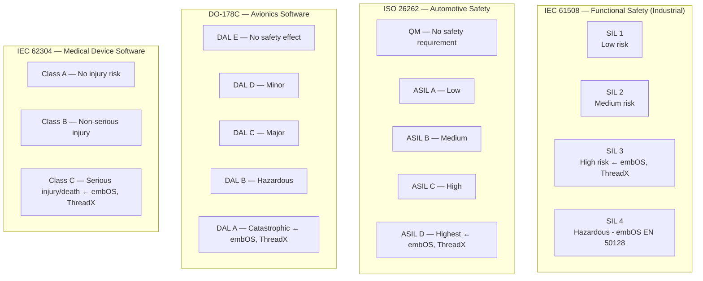
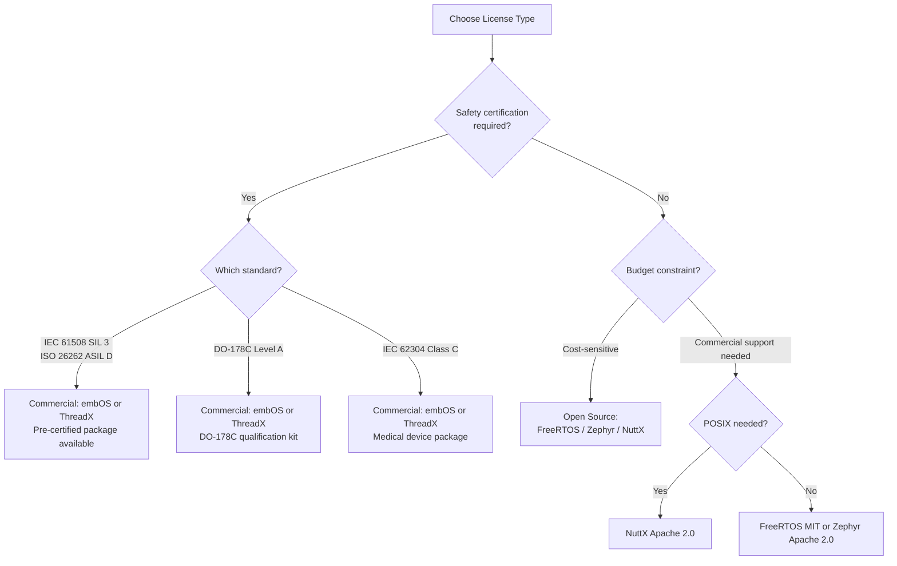
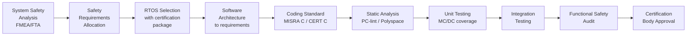

# :material-license: RTOS Licensing & Certifications

> **Know before you ship** — license obligations and safety certifications are non-negotiable in production embedded systems. This page covers the legal and regulatory landscape for all 8 RTOSes.

---

## Quick Reference Cards

-   :material-open-source-initiative: **Permissive Open Source**

    ---
    **FreeRTOS** (MIT), **Zephyr** (Apache 2.0), **ThreadX** (Apache 2.0), **NuttX** (Apache 2.0) — use in commercial products with attribution, no copyleft obligations.

-   :material-gavel: **Copyleft / Modified GPL**

    ---
    **ChibiOS/RT** (GPL v3 for non-commercial; commercial license available), **eCos** (Modified GPL with exception) — linking your code may create GPL obligations.

-   :material-currency-usd: **Commercial / Proprietary**

    ---
    **embOS** (SEGGER commercial), **PX5** (Eventure Embedded commercial) — per-seat or per-product licensing. Source available under NDA.

-   :material-shield-star: **Safety Certified**

    ---
    **embOS** and **ThreadX** hold the broadest set of safety certifications (IEC 61508, ISO 26262, DO-178C, IEC 62304). Others are uncertified or partially certified.

---

## Table 1 — License Reference

| RTOS | License | Commercial Use | Source Available | Copyleft Risk | Vendor |
|------|---------|---------------|-----------------|---------------|--------|
| **FreeRTOS** | MIT | Free, unrestricted | Yes (GitHub) | None | Amazon Web Services |
| **Zephyr** | Apache 2.0 | Free, unrestricted | Yes (GitHub) | None (patent termination clause) | Linux Foundation |
| **ThreadX** | Apache 2.0 | Free, unrestricted | Yes (GitHub) | None (patent termination clause) | Microsoft / Express Logic |
| **ChibiOS/RT** | GPL v3 + Commercial | GPL: must open-source; Commercial: paid | Yes (GitHub) | High (GPL v3) | Giovanni Di Sirio |
| **embOS** | Commercial (Royalty-free per seat) | Paid license required | Yes (under NDA) | None (proprietary) | SEGGER Microcontroller |
| **NuttX** | Apache 2.0 | Free, unrestricted | Yes (GitHub) | None (patent termination clause) | Apache Software Foundation |
| **PX5** | Commercial | Paid license required | Yes (under NDA) | None (proprietary) | Eventure Embedded |
| **eCos** | Modified GPL + exception | Exception allows proprietary apps | Yes (SourceForge) | Medium (Modified GPL) | Red Hat / eCos community |

### License Deep Dive

!!! info "MIT License (FreeRTOS)"
    The MIT license is the most permissive. You can:

    - Use in closed-source commercial products
    - Modify without publishing changes
    - Sublicense
    
    **Only requirement:** Retain the copyright notice and license text in your source distribution.

!!! info "Apache 2.0 License (Zephyr, ThreadX, NuttX)"
    Similar to MIT but adds:

    - Explicit patent grant from contributors
    - Patent retaliation clause (if you sue for patent infringement, your Apache license terminates)
    - Must mark modified files with notices of changes
    
    **Safe for commercial use.** The patent grant is often considered more protective than MIT.

!!! warning "GPL v3 — ChibiOS/RT"
    ChibiOS/RT kernel source is GPL v3. If you distribute a binary that links GPL code, you must:

    - Publish your complete source code (including your proprietary application)
    - Allow recipients to modify and redistribute
    
    **Commercial license available** from the author for ~$500–$2000 depending on application. This eliminates the GPL obligation.

!!! warning "Modified GPL + Exception — eCos"
    eCos uses a modified GPL with a special exception: applications that use eCos via the eCos API are not considered derivative works, so your application code remains proprietary. However, any modifications to eCos itself must be published.

!!! info "Commercial License — embOS, PX5"
    Commercial licenses typically offer:

    - No copyleft obligations
    - Indemnification from vendor
    - Long-term support and maintenance
    - Access to certified versions with safety documentation
    
    **embOS pricing:** Contact SEGGER. Royalty-free per development seat.
    **PX5 pricing:** Contact Eventure Embedded. Royalty-free per product.

---

## Table 2 — Safety Certifications

| RTOS | IEC 61508 | ISO 26262 | DO-178C | IEC 62304 | Other |
|------|:---------:|:---------:|:-------:|:---------:|-------|
| **FreeRTOS** | :material-minus: | :material-minus: | :material-minus: | :material-minus: | MISRA C partial |
| **Zephyr** | :material-minus: | :material-minus: | :material-minus: | :material-minus: | PSA Certified |
| **ThreadX** | SIL 3 | ASIL D | Level A | Class C | IEC 60730 Class C |
| **ChibiOS/RT** | :material-minus: | :material-minus: | :material-minus: | :material-minus: | None |
| **embOS** | SIL 3 | ASIL D | Level A | Class C | EN 50128 SIL 4 |
| **NuttX** | :material-minus: | :material-minus: | :material-minus: | :material-minus: | None |
| **PX5** | In progress | :material-minus: | :material-minus: | :material-minus: | None |
| **eCos** | :material-minus: | :material-minus: | :material-minus: | :material-minus: | None |

### Certification Levels Explained

---

## Commercial vs Open Source Trade-offs

### Decision Framework

### Comparison Table: Open Source vs Commercial

| Aspect | Open Source (FreeRTOS, Zephyr, NuttX) | Commercial (embOS, PX5) |
|--------|---------------------------------------|------------------------|
| **License cost** | Free | $500–$50,000+ depending on terms |
| **Source code** | Public GitHub | Under NDA |
| **Safety certification** | None / self-certify | Pre-certified packages available |
| **Safety documentation** | None provided | Safety manual, FMEA, test reports |
| **MISRA C compliance** | Partial / community-maintained | Full compliance report provided |
| **Support SLA** | Community forums | Commercial SLA (24h, 48h) |
| **Long-term maintenance** | Depends on community | Contractual obligation |
| **Indemnification** | None | Vendor indemnification available |
| **Bug fix commitment** | Best effort | Contractual |
| **IP ownership** | Multiple contributors | Single vendor |

---

## Safety Certification Process Overview

Certifying a software system under functional safety standards is a multi-step process. The RTOS is one component.

### What a Certified RTOS Package Includes

!!! info "embOS / ThreadX Certification Package Contents"
    When you purchase a certified RTOS package (embOS or ThreadX), you receive:

    | Document | Description |
    |----------|-------------|
    | Safety Manual | How to safely integrate the RTOS in your system |
    | Qualification Test Suite | Test cases proving RTOS meets its specification |
    | FMEA | Failure Mode and Effects Analysis for the kernel |
    | Requirements Traceability Matrix | Links requirements → design → tests |
    | MISRA C Compliance Report | Deviations from MISRA C:2012 with justifications |
    | Compiler Qualification Kit | Qualification evidence for supported compilers |
    | Certified Object Code | Pre-compiled, hash-verified kernel object |

!!! warning "Self-Certification with FreeRTOS"
    It is technically possible to certify a system using FreeRTOS. However, you must:

    1. Perform all certification activities yourself (FMEA, requirements trace, test coverage)
    2. Generate MISRA C compliance reports
    3. Defend your qualification approach to the certification body
    4. Maintain all evidence across kernel versions

    This is viable for large organizations with dedicated safety teams. For most companies, a pre-certified RTOS is more cost-effective.

---

## Choosing Between ThreadX and embOS for Safety Projects

Both ThreadX and embOS have equivalent certification coverage. The choice often comes down to:

| Factor | ThreadX (Azure RTOS) | embOS (SEGGER) |
|--------|----------------------|----------------|
| **Cost** | Free (Apache 2.0) + certification package fee | Commercial license + certification package fee |
| **Ecosystem** | Microsoft Azure, STM32, NXP, Renesas | SEGGER J-Link, SystemView, Ozone debugger |
| **Support** | Microsoft support tiers | SEGGER direct support |
| **SMP** | Yes | Yes |
| **Trace tool** | TraceX | SystemView (real-time RTOS trace) |
| **Track record** | Billions of devices (20+ years) | 25+ years, aerospace/defense heavy |
| **Certification body experience** | TÜV SÜD, BSI | TÜV SÜD, TÜV Rheinland |

---

## Flashcards

??? question "What license does FreeRTOS use, and what does it require?"
    **MIT License.** Requires only that the copyright notice and license text be preserved in source distributions. No copyleft obligations — you can use FreeRTOS in closed-source commercial products freely.

??? question "What is the copyleft risk with ChibiOS/RT?"
    ChibiOS/RT kernel is licensed under **GPL v3**. If you distribute a binary that links GPL code without a commercial license, you must release your complete application source code. The author offers a commercial license to avoid this obligation.

??? question "Which RTOSes hold IEC 61508 SIL 3 certification?"
    **embOS** (SEGGER) and **ThreadX** (Microsoft/Express Logic) both hold IEC 61508 SIL 3 certification. embOS additionally holds EN 50128 SIL 4 certification for railway applications.

??? question "What does DO-178C Level A mean?"
    DO-178C Level A (DAL A) is the highest Design Assurance Level for avionics software — it applies to software whose failure would cause a **catastrophic** effect on the aircraft. Level A requires Modified Condition/Decision Coverage (MC/DC), the most stringent code coverage criterion. Both embOS and ThreadX hold this certification.

??? question "Can you use Apache 2.0 software in a safety-critical system?"
    Yes, but the Apache 2.0 license itself provides no safety documentation. You would need to perform all safety analysis, testing, and certification activities yourself. The license permits use in any product — it just doesn't help with the certification process.
