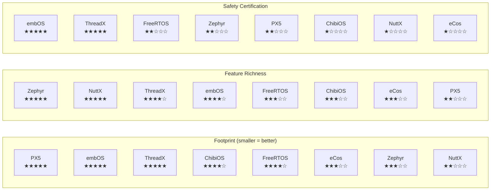
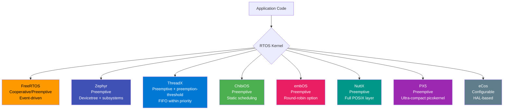
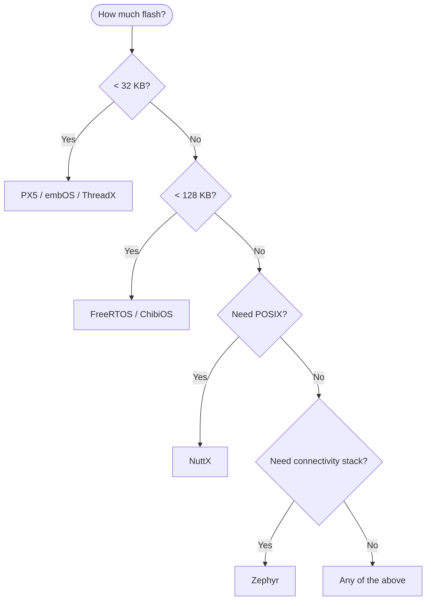

# :material-table: RTOS Comparison Table

> **Quick Reference** — side-by-side comparison of 8 major embedded RTOSes across footprint, licensing, certifications, API style, and feature support.

---

## At a Glance

-   :material-speedometer: **FreeRTOS**

    ---
    AWS-backed, massive community, lowest entry barrier. The default choice for hobbyists and production IoT.

-   :material-layers: **Zephyr**

    ---
    Linux Foundation project. Rich connectivity stack, devicetree-driven, growing fast in industrial IoT.

-   :material-microsoft: **ThreadX (Azure RTOS)**

    ---
    Microsoft/Express Logic. Proven in billions of devices, Apache 2.0, strong certification story.

-   :material-chip: **ChibiOS/RT**

    ---
    Compact, clean API, excellent for STM32. Dual-license (GPL / commercial).

-   :material-shield-check: **embOS**

    ---
    SEGGER commercial RTOS. Gold standard for safety-critical (IEC 61508 SIL 3, ISO 26262 ASIL D).

-   :material-penguin: **NuttX**

    ---
    POSIX-compliant. Apache 2.0. Runs Linux applications with minimal porting — ideal for legacy code.

-   :material-lightning-bolt: **PX5**

    ---
    Ultra-compact picokernel by William Lamie (ThreadX author). Designed for severely resource-constrained devices.

-   :material-cog: **eCos**

    ---
    Highly configurable RTOS from the 1990s. Modified GPL. Still used in legacy embedded systems.

---

## Table 1 — Core Metrics

| RTOS | Latest Version | License | Min RAM | Min Flash | Safety Certs | POSIX Support | Community Size | Primary Use Case |
|------|---------------|---------|---------|-----------|-------------|---------------|---------------|-----------------|
| **FreeRTOS** | 11.x | MIT | ~4 KB | ~6 KB | IEC 62443 (partial) | Optional (FreeRTOS-POSIX) | Very Large (AWS-backed) | IoT, Consumer, Education |
| **Zephyr** | 3.7.x | Apache 2.0 | ~8 KB | ~32 KB | PSA Certified | Partial (POSIX subsystem) | Large (Linux Foundation) | Industrial IoT, Connectivity |
| **ThreadX** | 6.4.x | Apache 2.0 | ~2 KB | ~6 KB | IEC 61508 SIL 3, ISO 26262 ASIL D, DO-178C Level A, IEC 62304 | No | Medium (Microsoft-backed) | Medical, Automotive, Aerospace |
| **ChibiOS/RT** | 21.x | GPL v3 / Commercial | ~2 KB | ~8 KB | None official | No | Medium | STM32 hobbyist, consumer |
| **embOS** | 5.x | Commercial | ~1 KB | ~4 KB | IEC 61508 SIL 3, ISO 26262 ASIL D, DO-178C Level A, IEC 62304 Class C | No | Small (SEGGER customers) | Safety-critical industrial/medical |
| **NuttX** | 12.x | Apache 2.0 | ~32 KB | ~64 KB | None official | Full POSIX | Medium | POSIX migration, Linux-like |
| **PX5** | 2.x | Commercial | ~1 KB | ~3 KB | IEC 61508 (in progress) | No | Small | Ultra-constrained IoT nodes |
| **eCos** | 3.0 | Modified GPL | ~10 KB | ~30 KB | None official | Partial | Legacy/declining | Legacy systems |

!!! note "Footprint Notes"
    Min RAM/Flash figures represent the absolute kernel minimum in ROM-only configuration with a single task. Real applications are always larger. Figures sourced from vendor documentation and are approximate.

---

## Table 2 — API Comparison (Core Operations)

| Operation | FreeRTOS | Zephyr | ThreadX | ChibiOS | embOS | NuttX | PX5 | eCos |
|-----------|----------|--------|---------|---------|-------|-------|-----|------|
| **Create task/thread** | `xTaskCreate()` | `k_thread_create()` | `tx_thread_create()` | `chThdCreateStatic()` | `OS_TASK_CREATE()` | `pthread_create()` | `px_thread_create()` | `cyg_thread_create()` |
| **Delete task** | `vTaskDelete()` | `k_thread_abort()` | `tx_thread_delete()` | `chThdExit()` | `OS_TASK_Terminate()` | `pthread_cancel()` | `px_thread_delete()` | `cyg_thread_kill()` |
| **Task delay** | `vTaskDelay()` | `k_sleep()` | `tx_thread_sleep()` | `chThdSleepMilliseconds()` | `OS_TASK_Delay()` | `usleep()` | `px_thread_sleep()` | `cyg_thread_delay()` |
| **Create semaphore** | `xSemaphoreCreateBinary()` | `k_sem_init()` | `tx_semaphore_create()` | `chSemObjectInit()` | `OS_SEMAPHORE_Create()` | `sem_init()` | `px_semaphore_create()` | `cyg_semaphore_init()` |
| **Wait semaphore** | `xSemaphoreTake()` | `k_sem_take()` | `tx_semaphore_get()` | `chSemWait()` | `OS_SEMAPHORE_Take()` | `sem_wait()` | `px_semaphore_get()` | `cyg_semaphore_wait()` |
| **Post semaphore** | `xSemaphoreGive()` | `k_sem_give()` | `tx_semaphore_put()` | `chSemSignal()` | `OS_SEMAPHORE_Give()` | `sem_post()` | `px_semaphore_put()` | `cyg_semaphore_post()` |
| **Create queue** | `xQueueCreate()` | `k_msgq_init()` | `tx_queue_create()` | `chMBObjectInit()` | `OS_MAILBOX_Create()` | `mq_open()` | `px_queue_create()` | `cyg_mbox_create()` |
| **Send to queue** | `xQueueSend()` | `k_msgq_put()` | `tx_queue_send()` | `chMBPost()` | `OS_MAILBOX_Put()` | `mq_send()` | `px_queue_send()` | `cyg_mbox_put()` |
| **Receive from queue** | `xQueueReceive()` | `k_msgq_get()` | `tx_queue_receive()` | `chMBFetch()` | `OS_MAILBOX_Get()` | `mq_receive()` | `px_queue_receive()` | `cyg_mbox_get()` |
| **Create mutex** | `xSemaphoreCreateMutex()` | `k_mutex_init()` | `tx_mutex_create()` | `chMtxObjectInit()` | `OS_MUTEX_Create()` | `pthread_mutex_init()` | `px_mutex_create()` | `cyg_mutex_init()` |
| **Lock mutex** | `xSemaphoreTake()` | `k_mutex_lock()` | `tx_mutex_get()` | `chMtxLock()` | `OS_MUTEX_Lock()` | `pthread_mutex_lock()` | `px_mutex_get()` | `cyg_mutex_lock()` |
| **Unlock mutex** | `xSemaphoreGive()` | `k_mutex_unlock()` | `tx_mutex_put()` | `chMtxUnlock()` | `OS_MUTEX_Unlock()` | `pthread_mutex_unlock()` | `px_mutex_put()` | `cyg_mutex_unlock()` |

---

## Table 3 — Feature Matrix

| Feature | FreeRTOS | Zephyr | ThreadX | ChibiOS | embOS | NuttX | PX5 | eCos |
|---------|:--------:|:------:|:-------:|:-------:|:-----:|:-----:|:---:|:----:|
| **Static allocation** | :material-check: | :material-check: | :material-check: | :material-check: | :material-check: | :material-check: | :material-check: | :material-check: |
| **Dynamic allocation** | :material-check: | :material-check: | :material-check: | :material-check: | :material-check: | :material-check: | :material-check: | :material-check: |
| **MPU support** | :material-check: | :material-check: | :material-check: | :material-check: | :material-check: | :material-check: | :material-minus: | :material-minus: |
| **SMP support** | :material-minus: | :material-check: | :material-check: | :material-minus: | :material-check: | :material-check: | :material-minus: | :material-minus: |
| **Filesystem** | Via FreeRTOS+FAT | LittleFS, FAT | FileX | Via ChibiFS | Via SEGGER emFile | Via VFS | :material-minus: | :material-minus: |
| **Networking** | Via FreeRTOS+TCP | LwIP, OpenThread | NetX | Via lwIP | Via SEGGER emNet | BSD sockets | :material-minus: | :material-minus: |
| **USB stack** | Via TinyUSB | Built-in | USBX | Via ChibiOS USB | Via SEGGER emUSB | Built-in | :material-minus: | :material-minus: |
| **GUI** | Via TouchGFX | LVGL | GUIX | :material-minus: | Via emWin | Via LVGL | :material-minus: | :material-minus: |
| **Tickless idle** | :material-check: | :material-check: | :material-check: | :material-check: | :material-check: | :material-check: | :material-check: | :material-minus: |
| **Priority inheritance** | :material-check: | :material-check: | :material-check: | :material-check: | :material-check: | :material-check: | :material-check: | :material-check: |
| **Event groups/flags** | :material-check: | Via poll | :material-check: | :material-check: | :material-check: | Via signals | :material-check: | :material-check: |
| **Task notifications** | :material-check: | :material-minus: | :material-minus: | :material-minus: | :material-minus: | :material-minus: | :material-minus: | :material-minus: |
| **Preemption threshold** | :material-minus: | :material-minus: | :material-check: | :material-minus: | :material-minus: | :material-minus: | :material-check: | :material-minus: |
| **Time slicing** | :material-check: | :material-check: | :material-check: | :material-check: | :material-check: | :material-check: | :material-check: | :material-check: |
| **Trace/profiling** | Via Tracealyzer | Built-in | TraceX | Via Tracealyzer | SystemView | Via syslog | :material-minus: | :material-minus: |

---

## Relative Strength Diagram

!!! tip "How to Read This Chart"
    Stars indicate relative strength in each dimension — not absolute quality. A kernel with smaller footprint scores 5 stars on footprint; one with more features scores higher on richness. Choose your RTOS based on which dimension matters most for your project.

---

## Architecture Comparison

---

## Flash Memory Decision Guide

---

## Self-Test

??? question "Which RTOS has the smallest minimum footprint?"
    **PX5** and **embOS** tie at approximately 1 KB RAM / 3-4 KB Flash for the kernel minimum. ThreadX is close behind at ~2 KB RAM.

??? question "Which RTOSes support SMP (multi-core)?"
    **Zephyr**, **ThreadX**, **embOS**, and **NuttX** support SMP. FreeRTOS has an experimental SMP branch. ChibiOS, PX5, and eCos are single-core only.

??? question "Which RTOSes have DO-178C Level A certification?"
    **ThreadX** (Azure RTOS) and **embOS** both hold DO-178C Level A certification for safety-critical avionics applications.

??? question "What is 'preemption threshold' and which RTOSes support it?"
    Preemption threshold allows a task to specify a threshold below which it cannot be preempted, effectively implementing a form of cooperative locking without disabling interrupts. **ThreadX** and **PX5** are the primary RTOSes supporting this feature.

??? question "Which RTOS would you choose for a legacy Linux application port?"
    **NuttX** — it provides the most complete POSIX API compatibility, including VFS, BSD sockets, pthreads, message queues, and signals, making it the closest to Linux in the embedded RTOS space.
