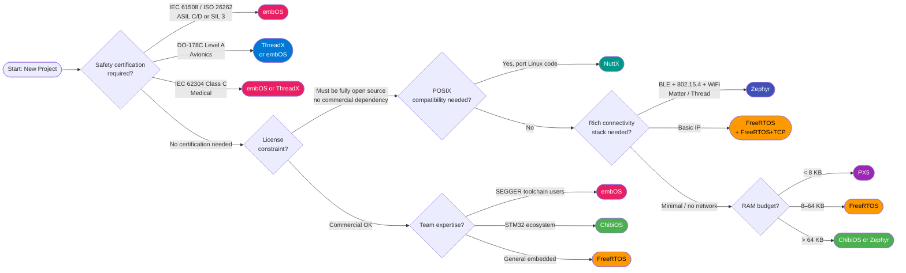

# :material-map-marker-question: RTOS Selection Guide

> **Decision Framework** — use the flowchart and scenario matrix to choose the right RTOS for your next embedded project. No single RTOS is universally best — the optimal choice depends on your constraints.

---

## Selection Quick Cards

-   :material-alert-circle: **Safety-Critical?**

    ---
    If your system needs IEC 61508, ISO 26262, or DO-178C certification, start with **embOS** or **ThreadX**. Both have pre-certified kernel source packages.

-   :material-memory: **Tight on RAM?**

    ---
    Under 8 KB RAM: **PX5** or **embOS**. Under 32 KB: **FreeRTOS** or **ThreadX**. Avoid Zephyr and NuttX for deeply constrained nodes.

-   :material-open-source-initiative: **Open Source Required?**

    ---
    **FreeRTOS** (MIT), **Zephyr** (Apache 2.0), **ThreadX** (Apache 2.0), **NuttX** (Apache 2.0). All are production-ready open-source options.

-   :material-lan: **Connectivity Stack?**

    ---
    **Zephyr** has the richest built-in connectivity (BLE, 802.15.4, WiFi, Matter, Thread). FreeRTOS with AWS IoT SDK is a strong second.

---

## Decision Flowchart

---

## Use Case Scenarios

### Scenario 1: IoT Sensor Node (< 32 KB RAM)

!!! example "IoT Sensor Node"
    **Context:** Battery-powered sensor, coin cell, sends data via BLE or LoRa, sleeps most of the time.

    | Criterion | Value |
    |-----------|-------|
    | RAM budget | 8–24 KB |
    | Flash budget | 16–64 KB |
    | Connectivity | BLE or LoRaWAN |
    | Certification | None |
    | License | Open source preferred |

    **Recommended:** **FreeRTOS** (primary) or **PX5** (if under 8 KB RAM)

    - FreeRTOS tickless idle reduces power consumption
    - AWS IoT integration out-of-the-box
    - Massive community and driver support
    - PX5 if you need absolute minimum footprint with commercial support

---

### Scenario 2: Medical Device (IEC 62304 Class C)

!!! example "Medical Device"
    **Context:** Implantable or life-sustaining device requiring software of the highest safety class.

    | Criterion | Value |
    |-----------|-------|
    | Standard | IEC 62304 Class C |
    | Traceability | Full requirements → test traceability |
    | MISRA C | Required |
    | Certification docs | Vendor-supplied safety manual required |

    **Recommended:** **embOS** (primary) or **ThreadX**

    - SEGGER embOS ships with IEC 62304 Class C certification package
    - ThreadX (Azure RTOS) has DO-178C Level A and IEC 62304 certification
    - Both provide MISRA C compliance reports and safety manuals

---

### Scenario 3: Industrial Automation (IEC 61508 SIL 2)

!!! example "Industrial Automation"
    **Context:** PLC or motion controller in industrial environment, functional safety required.

    | Criterion | Value |
    |-----------|-------|
    | Standard | IEC 61508 SIL 2 |
    | Determinism | Hard real-time, < 1 µs jitter |
    | Lifecycle | 15–20 year product lifetime |

    **Recommended:** **embOS**

    - IEC 61508 SIL 3 certified (exceeds SIL 2 requirement)
    - SEGGER provides full FMEA, FMECA, safety manual
    - Excellent long-term commercial support

---

### Scenario 4: Automotive (ISO 26262 ASIL D)

!!! example "Automotive"
    **Context:** Safety-critical ECU — airbag, ADAS, steering, braking systems.

    | Criterion | Value |
    |-----------|-------|
    | Standard | ISO 26262 ASIL D |
    | AUTOSAR | May be required |
    | Latency | Sub-microsecond ISR response |

    **Recommended:** **embOS** or **ThreadX**

    - embOS: ISO 26262 ASIL D certified with QM/ASIL decomposition support
    - ThreadX: ISO 26262 ASIL D certified, widely used in Tier-1 suppliers
    - Both support AUTOSAR Classic integration via abstraction layers

---

### Scenario 5: Aerospace (DO-178C Level A)

!!! example "Aerospace / Avionics"
    **Context:** Flight-critical software, highest DAL (Design Assurance Level).

    | Criterion | Value |
    |-----------|-------|
    | Standard | DO-178C DAL A |
    | Additional | DO-254 (hardware), ARP-4754A |
    | Qualification | Tool qualification (DO-330) required |

    **Recommended:** **ThreadX** or **embOS** (commercial RTOS with certification)

    !!! warning "VxWorks / RTEMS Note"
        For the most demanding aerospace programs, **VxWorks** (Wind River) and **RTEMS** (open source, NASA/ESA used) are also strong candidates. Both have extensive flight heritage that ThreadX and embOS are still building.

---

### Scenario 6: Consumer IoT with Rich Connectivity

!!! example "Consumer IoT Hub"
    **Context:** Smart home hub, requires BLE, WiFi, Zigbee, Matter protocol support.

    | Criterion | Value |
    |-----------|-------|
    | Connectivity | BLE 5.x + WiFi + Zigbee |
    | Protocol | Matter / Thread |
    | Certification | FCC/CE radio |

    **Recommended:** **Zephyr**

    - Native BLE 5.x, 802.15.4, WiFi stacks
    - Matter and OpenThread built-in
    - nRF Connect SDK (Nordic) and ESP-IDF Zephyr port widely used
    - Active Linux Foundation community

---

### Scenario 7: Legacy POSIX Codebase Migration

!!! example "POSIX Migration"
    **Context:** Existing Linux application needs to run on constrained hardware (< 256 MB RAM).

    | Criterion | Value |
    |-----------|-------|
    | API | Full POSIX compliance |
    | Subsystems | VFS, BSD sockets, signals, pthreads |
    | Drivers | Standard POSIX character/block devices |

    **Recommended:** **NuttX**

    - Most complete POSIX implementation in the embedded RTOS space
    - Same binary application model: `main()`, `open()`, `read()`, `write()`
    - Used in PX4 autopilot, Apache Mynewt predecessor

---

### Scenario 8: Hobbyist / Education

!!! example "Learning and Prototyping"
    **Context:** Learning RTOS concepts, university courses, maker projects.

    | Criterion | Value |
    |-----------|-------|
    | Documentation | Extensive, free |
    | Examples | Many community examples |
    | Board support | Arduino, STM32, ESP32, RPi |
    | Cost | Free |

    **Recommended:** **FreeRTOS**

    - Largest community, most StackOverflow answers
    - Amazon FreeRTOS documentation and labs are free
    - Supported natively in Arduino, ESP-IDF, STM32CubeIDE

---

## Summary Recommendation Matrix

| Use Case | Primary Choice | Fallback | Avoid |
|----------|---------------|----------|-------|
| Safety-critical (IEC 61508 SIL 3) | embOS | ThreadX | FreeRTOS, Zephyr |
| Automotive ASIL D | embOS | ThreadX | Any uncertified RTOS |
| Aerospace DO-178C Level A | ThreadX | embOS | — |
| Medical IEC 62304 Class C | embOS | ThreadX | — |
| Ultra-constrained IoT (< 8 KB RAM) | PX5 | embOS | Zephyr, NuttX |
| General IoT / AWS cloud | FreeRTOS | Zephyr | — |
| Rich connectivity (BLE + Matter) | Zephyr | FreeRTOS + libs | — |
| POSIX porting | NuttX | Zephyr | ChibiOS, eCos |
| STM32 ecosystem | ChibiOS | FreeRTOS | — |
| Education / hobby | FreeRTOS | Zephyr | embOS, PX5 |
| Legacy systems (already deployed) | eCos | — | Migrate away |

---

## Migration Difficulty Matrix

When migrating between RTOSes, the difficulty depends on API similarity and architecture differences.

| From \ To | FreeRTOS | Zephyr | ThreadX | ChibiOS | embOS | NuttX |
|-----------|:--------:|:------:|:-------:|:-------:|:-----:|:-----:|
| **FreeRTOS** | — | Medium | Medium | Medium | Medium | Hard |
| **Zephyr** | Medium | — | Medium | Medium | Medium | Medium |
| **ThreadX** | Medium | Medium | — | Medium | Easy | Hard |
| **ChibiOS** | Medium | Medium | Medium | — | Medium | Hard |
| **embOS** | Medium | Medium | Easy | Medium | — | Hard |
| **NuttX** | Hard | Medium | Hard | Hard | Hard | — |
| **PX5** | Medium | Medium | Easy | Medium | Medium | Hard |
| **eCos** | Medium | Medium | Medium | Medium | Medium | Medium |

!!! tip "Migration Strategy"
    1. Create an abstraction layer (OSAL) on your current RTOS first
    2. Replace the OSAL implementation for the target RTOS
    3. Port drivers last — driver APIs differ more than kernel APIs
    4. Budget 2–6 months for a full migration on a mature codebase

---

## Flashcards

??? question "What is the single most important selection criterion for safety-critical systems?"
    **Availability of a pre-certified kernel with safety manual.** Starting from scratch to certify an uncertified RTOS can add years and millions of dollars to your project. embOS and ThreadX provide pre-built certification packages.

??? question "When should you NOT use FreeRTOS?"
    When you need: (1) ISO 26262 ASIL D or IEC 61508 SIL 3 pre-certified package, (2) built-in BLE/WiFi/Matter stack, (3) < 4 KB RAM budget, or (4) full POSIX compatibility for existing application code.

??? question "What makes Zephyr unsuitable for deeply constrained devices?"
    Zephyr's minimum footprint is approximately 8 KB RAM and 32 KB Flash — significantly more than FreeRTOS, embOS, ThreadX, or PX5. Its rich feature set (devicetree, subsystems, network stacks) comes with overhead that is acceptable for most IoT devices but too large for coin-cell sensors.

??? question "What is the key advantage of NuttX over all other RTOSes?"
    NuttX provides the closest to a complete POSIX environment in the embedded world — including a virtual filesystem (VFS), BSD sockets, pthreads, POSIX message queues, and signals. This makes it possible to port standard Linux application code with minimal changes.
