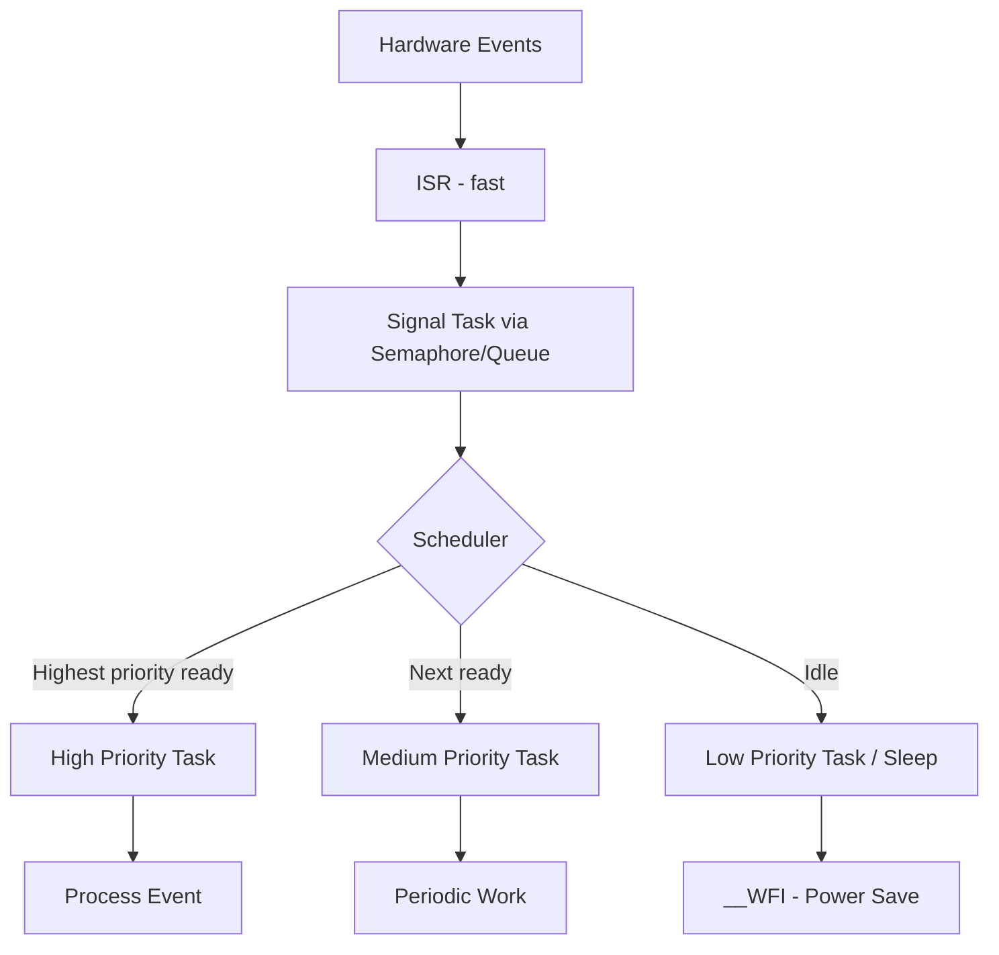

# :material-cpu-64-bit: Day 01 — Introduction to RTOS

!!! abstract "Day at a Glance"
    **Goal:** Understand what an RTOS is, why it exists, and when to use it over bare-metal.
    **Prerequisites:** None — this is Day 1.

<div class="grid cards" markdown>
- :material-lightbulb-on: **Core Concept** — Deterministic, priority-based multitasking for embedded systems
- :material-chip: **RTOS Component** — Scheduler, tasks, preemption
- :material-alert: **Watch Out** — Not every project needs an RTOS — overhead has a cost
- :material-check-circle: **By End of Day** — Justify RTOS adoption and design a basic task architecture
</div>

## :material-lightbulb-on: Intuition

!!! info "Core Idea"
    An RTOS is not just an OS for small devices — it's a **contract**: the highest-priority ready task always runs within a bounded latency. This guarantee is impossible in a bare-metal super-loop.

!!! success "Real-World Context"
    Every ABS brake controller, pacemaker, and aircraft flight control system runs an RTOS. A 10 ms airbag deployment deadline is a hard real-time constraint — missing it is system failure.

## :material-vector-polyline: Concept Map



## :material-book-open-variant: Lesson

### What is an RTOS?

A **Real-Time Operating System (RTOS)** is a specialized OS designed for embedded systems that must respond to events within guaranteed time constraints. Unlike Linux or Windows, an RTOS prioritizes **determinism** over throughput.

**Key Characteristics:**

| Property | RTOS | General-Purpose OS |
|----------|------|--------------------|
| Scheduling | Priority-based, deterministic | Fair-share, throughput-optimized |
| Response time | Bounded (µs–ms) | Variable (ms–seconds) |
| Footprint | 4–20 KB | Hundreds of MB |
| Context switch | 1–10 µs | 10–100 µs |

### Bare-Metal vs. RTOS

**Bare-metal super-loop:**

```c
int main(void) {
    hardware_init();
    while(1) {
        check_uart();       // 1ms
        read_sensors();     // 1ms
        update_display();   // 10ms
        handle_wifi();      // 50-200ms ← problem!
        // Button press waits up to 213ms!
    }
}
```

**RTOS approach:**

```c
void uart_task(void *p) {       // Priority HIGH
    while(1) {
        wait_for_uart_event();  // Blocks, yields CPU
        process_urgent_command();
    }
}

void sensor_task(void *p) {     // Priority MEDIUM
    TickType_t last = xTaskGetTickCount();
    while(1) {
        read_sensors();
        vTaskDelayUntil(&last, pdMS_TO_TICKS(100));
    }
}

void display_task(void *p) {    // Priority LOW
    while(1) {
        update_display();
        vTaskDelay(pdMS_TO_TICKS(500));
    }
}
```

Button press now responds in **~2 ms** regardless of what other tasks are doing.

### Core RTOS Concepts

**Tasks** — independent execution contexts, each with own stack, priority, and state.

**Scheduler** — runs the highest-priority ready task at all times.

**Context Switch** — saves one task's CPU registers, restores another's. Cost: ~0.1–0.5 µs.

**Determinism** — bounded execution time; every operation has a known worst-case duration.

### Real-Time Constraint Types

| Type | Deadline Miss | Example |
|------|--------------|---------|
| **Hard** | System failure | Airbag (10 ms), pacemaker |
| **Firm** | Result useless | Manufacturing process control |
| **Soft** | Degraded performance | Video streaming, UI updates |

### Common RTOS Options

| RTOS | License | Footprint | Key Use Case |
|------|---------|-----------|-------------|
| FreeRTOS | MIT | ~10 KB | Most popular, AWS IoT |
| Zephyr | Apache 2.0 | ~20 KB+ | IoT, BLE, networking |
| ThreadX | Commercial | ~6 KB | Safety-certified (IEC 61508) |
| ChibiOS | GPL/Commercial | ~12 KB | High performance, HAL |
| embOS | Commercial | ~4 KB | Ultra-compact, automotive |

### Minimal FreeRTOS Example

```c
#include "FreeRTOS.h"
#include "task.h"

void vLEDTask(void *pvParameters) {
    TickType_t xLastWakeTime = xTaskGetTickCount();
    while(1) {
        GPIO_ToggleLED();
        vTaskDelayUntil(&xLastWakeTime, pdMS_TO_TICKS(500));
    }
}

void vUARTTask(void *pvParameters) {
    char buffer[128];
    while(1) {
        UART_Receive(buffer, sizeof(buffer), portMAX_DELAY);
        if(strncmp(buffer, "CRITICAL", 8) == 0)
            handle_critical_command();
    }
}

int main(void) {
    xTaskCreate(vLEDTask,  "LED",  128, NULL, 1, NULL);
    xTaskCreate(vUARTTask, "UART", 256, NULL, 2, NULL);
    vTaskStartScheduler();  // Never returns
}
```

## :material-pencil: Exercises

**Exercise 1 — Bare-Metal vs. RTOS:** Smart thermostat with temperature sensor (100 ms), motion detector (irregular), LCD (500 ms), button (immediate), Wi-Fi (50–200 ms). Calculate worst-case button response time in both approaches.

**Exercise 2 — Code Review:** Find 3–5 real-time bugs in this code:
```c
void packet_task(void *p) {
    uint8_t buffer[512];
    while(1) {
        if(receive_packet(buffer, 512, TIMEOUT_FOREVER)) {
            for(int i = 0; i < get_packet_length(buffer); i++)
                process_byte(buffer[i]);  // 10-50ms per byte!
        }
    }
}

void safety_task(void *p) {   // MUST run within 10ms!
    while(1) {
        if(read_pressure() > CRITICAL) emergency_shutdown();
        vTaskDelay(pdMS_TO_TICKS(5));
    }
}

void log_task(void *p) {
    while(1) {
        char* msg = get_next_log_message();
        while(!sd_card_ready()) {}  // Spin-wait!
        sd_card_write(msg);
    }
}
```

**Exercise 3 — Design:** Data logger: 4 ADC channels at 100 Hz, SD card batch writes, USB commands, LED state indicator. Design task decomposition and IPC.

**Exercise 4 — Timing Analysis:** Three tasks: A (priority 3, 2 ms, 10 ms period), B (priority 2, 5 ms, 20 ms period), C (priority 1, 8 ms, 50 ms). Calculate CPU utilization and Task B worst-case response time.

## :material-check: Solutions

??? success "Show Solutions"
    **Exercise 1 — Response Times:**

    - Bare-metal worst case: 200ms (WiFi) + 1ms + 1ms + 10ms + 1ms = **213 ms**
    - RTOS: ISR latency (~5 µs) + context switch (~1 µs) + handler (2 ms) ≈ **2 ms**

    **Exercise 2 — Bugs:**

    1. **Unbounded loop** in packet_task: 512 bytes × 50 ms = 25.6 seconds blocking safety task → Fix: process in chunks with `taskYIELD()`
    2. **Spin-wait** in log_task wastes CPU → Fix: `xSemaphoreTake(sd_ready_sem, portMAX_DELAY)`
    3. **No yield** when no log messages → Fix: use `xQueueReceive()` with `portMAX_DELAY`
    4. **vTaskDelay** instead of **vTaskDelayUntil** in safety_task → jitter accumulates
    5. **Priority assignment**: safety_task needs highest priority (4–5), not sharing priority 2 with packet_task

    **Exercise 4 — Timing:**

    U = 2/10 + 5/20 + 8/50 = 0.20 + 0.25 + 0.16 = **61%** (schedulable)

    Task B WCRT = 5 ms + 2 × (2 ms + 0.01 ms) = **9.02 ms** (meets 20 ms deadline ✓)

## :material-alert: Common Pitfalls

!!! warning "Common Mistakes"
    - **Stack overflow**: Each task needs its own stack; under-sizing causes silent corruption
    - **Blocking in ISR**: Never call `vTaskDelay`, `xSemaphoreTake`, or any non-`FromISR` API in an ISR
    - **Priority assignment by feel**: Base priorities on deadline urgency, not intuition

!!! danger "Safety Risk"
    Using `vTaskDelay` instead of `vTaskDelayUntil` for periodic tasks causes **jitter accumulation** — each delay adds to the previous, causing sampling drift that invalidates timing guarantees in control systems.

## :material-help-circle: Flashcards

???+ question "What is the key difference between an RTOS and a bare-metal super-loop?"
    An RTOS guarantees the **highest-priority ready task always runs** within a bounded latency. A super-loop executes all work sequentially — a 200 ms Wi-Fi operation blocks a time-critical button press. RTOS preemption makes response time independent of other tasks.

???+ question "What are the three types of real-time constraints?"
    **Hard**: Missing the deadline causes system failure (airbag, pacemaker). **Firm**: Late result is useless but doesn't cause catastrophe (manufacturing). **Soft**: Performance degrades gracefully (video streaming, UI).

???+ question "What is priority inversion and which primitive prevents it?"
    Priority inversion: a high-priority task waits for a resource held by a low-priority task while a medium-priority task runs freely. Solution: **mutex with priority inheritance** — the low-priority task temporarily inherits the high priority until it releases the resource.

???+ question "Why use vTaskDelayUntil instead of vTaskDelay for periodic tasks?"
    `vTaskDelay(100ms)` adds 100 ms to whenever the task wakes — drift accumulates over time. `vTaskDelayUntil(&lastWake, 100ms)` keeps absolute period accurate regardless of how long the task body took — essential for control loops and sensors.

## :material-clipboard-check: Self Test

=== "Question 1"
    A smart thermostat's Wi-Fi stack takes up to 200 ms. A button press must respond in < 50 ms. Why can't this be solved with a super-loop, and how does an RTOS fix it?

=== "Answer 1"
    In a super-loop, button checking happens once per loop iteration. If Wi-Fi runs just before the button check, the button waits up to 213 ms — violating the 50 ms requirement.

    RTOS fix: assign the button handler task **higher priority** than the Wi-Fi task. When the button ISR fires, it signals the button task, which immediately preempts the Wi-Fi task and responds in ~2 ms.

=== "Question 2"
    Three tasks have utilization: U_A = 0.20, U_B = 0.25, U_C = 0.16. Is the system schedulable? What is the RMS utilization bound for 3 tasks?

=== "Answer 2"
    Total U = 0.61 = 61%. The system is **schedulable** (U < 100%).

    RMS bound for n=3: U ≤ 3 × (2^(1/3) − 1) ≈ **78%**. The system is also provably schedulable under Rate Monotonic Scheduling since 61% < 78%.

## :material-check-circle: Summary

!!! success "Key Takeaways"
    - RTOS provides **deterministic, priority-based scheduling** for concurrent embedded activities
    - Super-loops fail when concurrent tasks have different urgency — worst-case response = sum of all task times
    - **Preemption** lets urgent tasks interrupt non-urgent ones immediately
    - Always assign priorities based on **deadline urgency**, not code order
    - Use `vTaskDelayUntil` for periodic tasks to prevent timing drift
    - **Tomorrow (Day 02):** Task lifecycle, stack sizing, and multi-RTOS creation APIs
