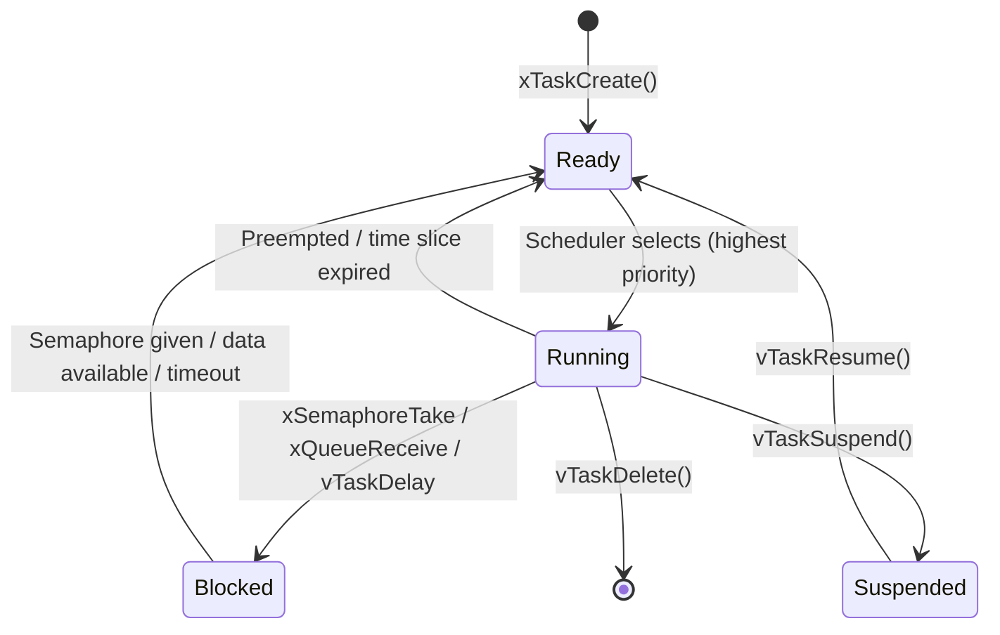

# :material-run: Day 02 — Tasks and Threads

!!! abstract "Day at a Glance"
    **Goal:** Master task creation, lifecycle management, and priority assignment across multiple RTOSes.
    **Prerequisites:** Day 01 — Intro to RTOS

<div class="grid cards" markdown>
- :material-lightbulb-on: **Core Concept** — Tasks are independent execution units with their own stack and priority
- :material-chip: **RTOS Component** — Task creation, states, stack allocation, priority management
- :material-alert: **Watch Out** — Stack overflow is the silent killer — always measure with high-water marks
- :material-check-circle: **By End of Day** — Create and manage tasks in FreeRTOS, Zephyr, and ThreadX
</div>

## :material-lightbulb-on: Intuition

!!! info "Core Idea"
    A task is an independent execution context — its own program counter, stack, and priority. The scheduler uses priority to decide who runs; the task uses its stack to store local state. These two resources must be carefully sized.

!!! success "Real-World Context"
    In automotive ECUs, a braking control task runs at priority 7 while a dashboard update task runs at priority 2. If both are ready, braking always wins — not because of clever code, but because the RTOS scheduler enforces it unconditionally.

## :material-vector-polyline: Task State Machine



## :material-book-open-variant: Lesson

### What is a Task?

A task is an independent execution context with:

- Own **stack** — local variables, function call frames
- Own **priority** — determines scheduling order
- Own **program counter** — current instruction
- A **state** — Running, Ready, Blocked, or Suspended

**Task vs Process:**

| Feature | Task/Thread | Process (GPOS) |
|---------|------------|----------------|
| Address Space | Shared with all tasks | Isolated |
| Context Switch | Fast (~1–2 µs) | Slow (~10–100 µs) |
| Memory Overhead | Stack only | Page tables + heap |
| Communication | Direct shared memory | IPC required |

### Task Creation — FreeRTOS

```c
#include "FreeRTOS.h"
#include "task.h"

void vMyTask(void *pvParameters) {
    uint32_t counter = 0;
    for(;;) {
        do_work(counter++);
        vTaskDelay(pdMS_TO_TICKS(1000));
    }
}

// Dynamic allocation
xTaskCreate(
    vMyTask,                    // Task function
    "MyTask",                   // Name (debug only)
    configMINIMAL_STACK_SIZE,   // Stack in WORDS (not bytes!)
    NULL,                       // Parameter
    tskIDLE_PRIORITY + 1,       // Priority
    &xTaskHandle                // Handle (optional)
);

// Static allocation (preferred for safety-critical)
static StackType_t xStack[512];
static StaticTask_t xTCB;

xTaskCreateStatic(vMyTask, "MyTask", 512, NULL,
                  tskIDLE_PRIORITY + 1, xStack, &xTCB);
```

### Task Creation — Zephyr

```c
#include <zephyr/kernel.h>

#define STACK_SIZE 1024
K_THREAD_STACK_DEFINE(my_stack, STACK_SIZE);
struct k_thread my_thread_data;

void my_entry(void *p1, void *p2, void *p3) {
    while (1) {
        printk("Zephyr thread running\n");
        k_sleep(K_MSEC(1000));
    }
}

k_tid_t tid = k_thread_create(&my_thread_data, my_stack,
    K_THREAD_STACK_SIZEOF(my_stack),
    my_entry, NULL, NULL, NULL,
    5, 0, K_NO_WAIT);          // Priority 5, start immediately
k_thread_name_set(tid, "my_thread");
```

### Task Creation — ThreadX

```c
#include "tx_api.h"

TX_THREAD my_thread;
UCHAR my_stack[1024];

void my_thread_entry(ULONG input) {
    while(1) {
        do_work();
        tx_thread_sleep(100);   // 100 ticks
    }
}

tx_thread_create(
    &my_thread, "MyThread",
    my_thread_entry, 0,         // Entry function + input
    my_stack, 1024,             // Stack
    5, 5,                       // Priority, preemption-threshold
    TX_NO_TIME_SLICE,           // Time slice
    TX_AUTO_START               // Auto-start
);
```

### Priority Assignment

!!! tip "Rate Monotonic Rule"
    Shorter period → higher priority. This is provably optimal for periodic task sets.

```c
// Correct priority assignment by deadline urgency
#define PRIORITY_BRAKE_CONTROL  7   // 1ms deadline
#define PRIORITY_ENGINE_MONITOR 5   // 10ms deadline
#define PRIORITY_DATA_LOGGER    3   // 100ms deadline
#define PRIORITY_DASHBOARD      1   // 500ms deadline
```

### Stack Sizing

Stack must hold:
- All local variables in the deepest call chain
- All function return addresses
- CPU registers saved during context switches (hardware-stacked)

**Practical approach:**

```c
// Step 1: Start with generous size
xTaskCreate(vMyTask, "Task", 1024, NULL, 3, &handle);

// Step 2: After testing, check high-water mark
UBaseType_t watermark = uxTaskGetStackHighWaterMark(handle);
// Returns minimum free words ever seen
// Safe if watermark > 32 words (128 bytes) headroom

// Step 3: Size = actual_usage + 20% safety margin
```

**Common stack sizes:**

| Task Type | Typical Stack |
|-----------|--------------|
| Simple periodic task | 256–512 bytes |
| Task using printf/sprintf | 512–1024 bytes |
| Task with large local buffers | Buffer size + 512 |
| Task using C++ (vtable, exceptions) | 1024–2048 bytes |

### Task Lifecycle Management

```c
// Suspend/resume
vTaskSuspend(xTaskHandle);
vTaskResume(xTaskHandle);
vTaskResumeFromISR(xTaskHandle);  // ISR variant

// Delete task (free stack + TCB)
vTaskDelete(xTaskHandle);         // Another task deletes it
vTaskDelete(NULL);                // Task deletes itself

// Change priority at runtime
vTaskPrioritySet(xTaskHandle, NEW_PRIORITY);
UBaseType_t prio = uxTaskPriorityGet(xTaskHandle);
```

## :material-pencil: Exercises

**Exercise 1:** Create 3 tasks with different priorities. Verify that a high-priority task preempts a lower one by toggling GPIO pins and measuring timing on an oscilloscope (or via printf timestamps).

**Exercise 2:** Deliberately cause a stack overflow by creating a recursive function in a task with a small stack. Implement `vApplicationStackOverflowHook` to detect and report it.

**Exercise 3:** Implement a task that monitors stack high-water marks for all other tasks and prints a warning when any drops below 64 words.

## :material-check: Solutions

??? success "Show Solutions"
    **Exercise 1 — Priority Preemption:**
    ```c
    void vHighTask(void *p) {
        for(;;) {
            GPIO_SetPin(HIGH_PIN);
            do_short_work();
            GPIO_ClearPin(HIGH_PIN);
            vTaskDelay(pdMS_TO_TICKS(100));
        }
    }
    void vLowTask(void *p) {
        for(;;) {
            GPIO_SetPin(LOW_PIN);
            do_long_work();   // High task preempts here
            GPIO_ClearPin(LOW_PIN);
        }
    }
    ```
    On oscilloscope: HIGH_PIN going high causes LOW_PIN to drop — this is preemption.

    **Exercise 2 — Overflow Detection:**
    ```c
    void vApplicationStackOverflowHook(TaskHandle_t xTask, char *pcTaskName) {
        printf("STACK OVERFLOW in task: %s\n", pcTaskName);
        for(;;) {}  // Halt
    }
    ```
    Enable in FreeRTOSConfig.h: `#define configCHECK_FOR_STACK_OVERFLOW 2`

    **Exercise 3 — Stack Monitor:**
    ```c
    void vStackMonitorTask(void *p) {
        TaskStatus_t statuses[10];
        for(;;) {
            UBaseType_t count = uxTaskGetSystemState(statuses, 10, NULL);
            for(int i = 0; i < count; i++) {
                if(statuses[i].usStackHighWaterMark < 64)
                    printf("WARNING: Task %s low stack: %u words\n",
                           statuses[i].pcTaskName,
                           statuses[i].usStackHighWaterMark);
            }
            vTaskDelay(pdMS_TO_TICKS(5000));
        }
    }
    ```

## :material-alert: Common Pitfalls

!!! warning "Common Mistakes"
    - **Stack too small**: The most common embedded bug. Stack overflow corrupts memory silently before crashing
    - **Stack in words vs bytes**: FreeRTOS `xTaskCreate` stack size is in **words** (4 bytes each on ARM32), not bytes
    - **Priority 0 is the idle task**: Never assign priority 0 to application tasks in FreeRTOS

!!! danger "Safety Risk"
    Stack overflow in safety-critical code (e.g., a braking task) can corrupt adjacent task stacks or the heap, causing unpredictable behavior. Always enable `configCHECK_FOR_STACK_OVERFLOW 2` during development and use MPU stack guards in production.

## :material-help-circle: Flashcards

???+ question "What four states can an RTOS task be in?"
    **Running** — executing on CPU. **Ready** — could run, waiting for scheduler. **Blocked** — waiting on semaphore/queue/delay/timeout. **Suspended** — manually paused via `vTaskSuspend()`, not scheduled at all.

???+ question "FreeRTOS: what is the unit of the stack size parameter in xTaskCreate?"
    **Words**, not bytes. On ARM Cortex-M (32-bit), 1 word = 4 bytes. So `configMINIMAL_STACK_SIZE = 128` means 512 bytes of stack. This is a common source of stack overflow bugs when developers assume bytes.

???+ question "How do you measure actual stack usage at runtime?"
    `uxTaskGetStackHighWaterMark(handle)` returns the minimum number of **free** words ever seen on the stack since task creation. If it returns 10, you have only 40 bytes of headroom left — dangerously low. Target ≥ 32 words (128 bytes) of headroom.

???+ question "When should you use static vs dynamic task allocation?"
    **Static** (`xTaskCreateStatic`) is required for safety-critical systems (MISRA, IEC 62443), systems with no heap (`heap_1`), and when you need deterministic memory layout. **Dynamic** is fine for development, prototyping, and non-certified systems.

## :material-clipboard-check: Self Test

=== "Question 1"
    A task calls `sprintf(buffer, ...)` where buffer is a 256-byte local variable. The function also calls two nested functions, each with 64-byte local arrays. Estimate the minimum safe stack size.

=== "Answer 1"
    Stack needed: 256 (sprintf buffer) + 64 + 64 (nested function locals) + ~100 (call frames, saved registers, sprintf internal usage) = ~484 bytes.

    Practical answer: allocate **512–768 bytes** (round up + 20% safety margin). Use `uxTaskGetStackHighWaterMark()` to validate.

=== "Question 2"
    Task A (priority 5) is running. Task B (priority 3) sends to a queue. Task C (priority 7) is blocked waiting for a different semaphore. An ISR gives that semaphore. What happens next?

=== "Answer 2"
    1. ISR gives semaphore → Task C (priority 7) moves from Blocked to Ready
    2. ISR calls `portYIELD_FROM_ISR(xHigherPriorityTaskWoken)` → triggers PendSV
    3. Scheduler selects Task C (priority 7 > 5 > 3)
    4. Task A is preempted, Task C runs
    5. When Task C blocks again, Task A resumes (still highest remaining ready task)

## :material-check-circle: Summary

!!! success "Key Takeaways"
    - Tasks are independent contexts: own stack + PC + priority
    - Always use `uxTaskGetStackHighWaterMark()` to validate stack sizing — never guess
    - FreeRTOS stack size is in **words**, not bytes
    - Assign priorities by **deadline urgency**: shorter deadline = higher priority
    - Prefer **static allocation** for safety-critical or heap-free systems
    - **Tomorrow (Day 03):** Scheduling algorithms — priority, round-robin, RMS, EDF, and schedulability analysis
