# :material-sort-clock-ascending: Day 03 — Scheduling & Determinism

!!! abstract "Day at a Glance"
    **Goal:** Understand scheduling algorithms, prove schedulability, and configure deterministic timing.
    **Prerequisites:** Day 02 — Tasks & Threads

<div class="grid cards" markdown>
- :material-lightbulb-on: **Core Concept** — Highest-priority ready task always runs; determinism = bounded timing
- :material-chip: **RTOS Component** — Scheduler, priority assignment, time-slicing
- :material-alert: **Watch Out** — Leaving CPU utilization at 100% leaves zero margin for bursts
- :material-check-circle: **By End of Day** — Prove a task set is schedulable and configure FreeRTOS scheduling
</div>

## :material-lightbulb-on: Intuition

!!! info "Core Idea"
    A scheduler is a function that runs at every scheduling point (tick interrupt, blocking call, preemption event) and answers one question: "Who runs next?" Priority-based preemptive scheduling answers it in O(1): the highest-priority ready task.

!!! success "Real-World Context"
    In an industrial PLC, motor control runs at priority 5 (1 ms period), sensor polling at priority 3 (10 ms), and HMI update at priority 1 (100 ms). If motor control and HMI are both ready, motor control wins immediately — this is the guarantee that keeps the motor safe.

## :material-vector-polyline: Scheduling Timeline

```mermaid
gantt
    title Priority-Based Preemptive Scheduling
    dateFormat  x
    axisFormat  %L ms

    section Task A (P5)
    Run  :a1, 0, 2
    Run  :a2, 10, 2
    Run  :a3, 20, 2

    section Task B (P3)
    Blocked :b0, 0, 2
    Run     :b1, 2, 5
    Preempted :b2, 10, 2
    Run     :b3, 12, 3

    section Task C (P1)
    Blocked :c0, 0, 15
    Run     :c1, 15, 3
```



## :material-book-open-variant: Lesson

### Priority-Based Preemptive Scheduling

**Rules:**
1. Highest-priority **ready** task always runs
2. Lower-priority task is preempted **immediately** when higher-priority becomes ready
3. Equal-priority tasks share CPU via round-robin (configurable)

```c
// Three tasks with explicit priorities
xTaskCreate(high_task, "High", 512, NULL, 5, NULL);   // Preempts all
xTaskCreate(med_task,  "Med",  512, NULL, 3, NULL);   // Preempts Low
xTaskCreate(low_task,  "Low",  512, NULL, 1, NULL);   // Background

// FreeRTOS config for preemptive + round-robin
#define configUSE_PREEMPTION    1
#define configUSE_TIME_SLICING  1
#define configTICK_RATE_HZ      1000   // 1ms tick
```

### Round-Robin Scheduling

Equal-priority tasks share CPU time in slices (one tick each by default):

```
Tick:  0   1   2   3   4   5   6   7   8
Task:  A   B   C   A   B   C   A   B   C   (all priority 3)
```

### Rate Monotonic Scheduling (RMS)

Optimal priority assignment for periodic tasks: **shorter period → higher priority**.

**Liu & Layland schedulability test** — a set of n periodic tasks is schedulable if:

```
U = Σ(Ci / Ti) ≤ n × (2^(1/n) − 1)
```

For n → ∞, bound → **69.3%**. For n=3: bound ≈ **78%**.

**Example:**

| Task | Priority | Period | WCET | Utilization |
|------|----------|--------|------|------------|
| A | 3 (High) | 10 ms | 2 ms | 20% |
| B | 2 (Med) | 20 ms | 5 ms | 25% |
| C | 1 (Low) | 50 ms | 8 ms | 16% |

**U = 61%** < 78% → **schedulable under RMS** ✓

```c
// RMS priority assignment
void task_a(void *p) {   // Period 10ms → highest priority
    TickType_t last = xTaskGetTickCount();
    for(;;) {
        execute_task_a();                           // WCET 2ms
        vTaskDelayUntil(&last, pdMS_TO_TICKS(10));
    }
}
```

### Earliest Deadline First (EDF)

Dynamic algorithm: task closest to its deadline runs first. Achieves **100% utilization** but higher overhead — rarely used in commercial RTOSes.

### Achieving Determinism

**Bounded execution time:**
```c
// BAD: unbounded
while(uart_data_available()) process_byte();

// GOOD: bounded burst
int count = 0;
while(uart_data_available() && count < MAX_BURST) {
    process_byte();
    count++;
}
```

**Precise periodic timing:**
```c
// BAD: vTaskDelay — jitter accumulates
vTaskDelay(pdMS_TO_TICKS(10));  // "at least 10ms"

// GOOD: vTaskDelayUntil — absolute timing
TickType_t last = xTaskGetTickCount();
for(;;) {
    do_work();
    vTaskDelayUntil(&last, pdMS_TO_TICKS(10));  // Exactly 10ms period
}
```

### Periodic, Aperiodic, and Sporadic Tasks

```c
// Periodic: fixed period
void periodic(void *p) {
    TickType_t last = xTaskGetTickCount();
    for(;;) {
        do_periodic_work();
        vTaskDelayUntil(&last, pdMS_TO_TICKS(100));
    }
}

// Aperiodic: event-triggered, no minimum separation
void aperiodic(void *p) {
    for(;;) {
        xSemaphoreTake(event_sem, portMAX_DELAY);
        handle_event();
    }
}

// Sporadic: event-triggered, minimum inter-arrival time enforced
void sporadic(void *p) {
    const TickType_t MIN_SEP = pdMS_TO_TICKS(50);
    TickType_t last = 0;
    for(;;) {
        xSemaphoreTake(event_sem, portMAX_DELAY);
        TickType_t now = xTaskGetTickCount();
        if((now - last) < MIN_SEP)
            vTaskDelay(MIN_SEP - (now - last));
        handle_sporadic_event();
        last = xTaskGetTickCount();
    }
}
```

## :material-pencil: Exercises

**Exercise 1 — RMS Analysis:** Task set: T1 (2ms, 0.5ms), T2 (5ms, 1ms), T3 (20ms, 3ms). Calculate U, check schedulability. Assign priorities optimally.

**Exercise 2 — Jitter Measurement:** Implement a periodic task that measures its own jitter using `xTaskGetTickCount()` and logs violations > 1ms.

**Exercise 3 — Round-Robin:** Create 3 equal-priority tasks. Enable time-slicing. Verify each gets CPU time by printing tick counts.

## :material-check: Solutions

??? success "Show Solutions"
    **Exercise 1:**
    U = 0.5/2 + 1/5 + 3/20 = 0.25 + 0.20 + 0.15 = **60%**
    RMS bound (n=3): 78%
    60% < 78% → **schedulable** ✓
    Priorities: T1=3 (2ms), T2=2 (5ms), T3=1 (20ms)

    **Exercise 2 — Jitter Monitor:**
    ```c
    void vJitterTask(void *p) {
        TickType_t last = xTaskGetTickCount();
        TickType_t expected = last;
        for(;;) {
            TickType_t actual = xTaskGetTickCount();
            int32_t jitter_ms = (int32_t)(actual - expected);
            if(abs(jitter_ms) > 1)
                printf("Jitter violation: %ld ms\n", jitter_ms);
            do_periodic_work();
            vTaskDelayUntil(&last, pdMS_TO_TICKS(10));
            expected += pdMS_TO_TICKS(10);
        }
    }
    ```

## :material-alert: Common Pitfalls

!!! warning "Common Mistakes"
    - **100% CPU utilization target**: Real systems need headroom (≤ 70–80%) for burst handling and ISRs
    - **vTaskDelay for periodic tasks**: Use `vTaskDelayUntil` — `vTaskDelay` accumulates drift
    - **Equal priority for tasks with different deadlines**: Violates RMS; assign by period/deadline

!!! danger "Safety Risk"
    In safety-critical systems (IEC 61508, ISO 26262), CPU utilization must be bounded by design — not just measured. Exceeding the bound during a safety-critical operation can cause a missed deadline that has catastrophic consequences.

## :material-help-circle: Flashcards

???+ question "What is the Rate Monotonic schedulability bound for n tasks?"
    U ≤ n × (2^(1/n) − 1). For n=1: 100%, n=2: 82.8%, n=3: 78%, n→∞: 69.3%. If total utilization is below this bound, the task set is provably schedulable under RMS.

???+ question "What is the optimal priority assignment rule under RMS?"
    **Shorter period → higher priority**. This is provably optimal: if any other assignment is schedulable, RMS is also schedulable. Named after Liu & Layland (1973).

???+ question "What is the difference between vTaskDelay and vTaskDelayUntil?"
    `vTaskDelay(N)` delays at least N ticks from when it's called — drift accumulates if the task body takes variable time. `vTaskDelayUntil(&lastWake, N)` delays until an absolute tick count — period is maintained exactly regardless of task body duration.

???+ question "When should you use Earliest Deadline First (EDF) over priority-based scheduling?"
    EDF achieves theoretically optimal utilization (up to 100%) and handles dynamic deadlines. Use it for research or when utilization must exceed 69% with guaranteed schedulability. In practice, most embedded RTOSes use fixed-priority scheduling because it's simpler, more predictable, and sufficient for typical utilization levels.

## :material-clipboard-check: Self Test

=== "Question 1"
    Tasks: A (period 4ms, WCET 1ms), B (period 10ms, WCET 3ms). What are the optimal priorities and is the system schedulable under RMS?

=== "Answer 1"
    U = 1/4 + 3/10 = 0.25 + 0.30 = **55%**
    RMS bound (n=2) = 2 × (√2 − 1) ≈ **82.8%**
    55% < 82.8% → **schedulable** ✓
    Priorities: Task A → priority 2 (4ms period), Task B → priority 1 (10ms period)

=== "Question 2"
    A sensor task is supposed to run every 10ms. After 1000 iterations using `vTaskDelay(10)`, what is the accumulated timing error if the task body takes 0.5ms?

=== "Answer 2"
    With `vTaskDelay(10ms)`: each cycle = 0.5ms (body) + 10ms (delay) = 10.5ms.
    After 1000 iterations: 1000 × 0.5ms = **500ms drift** (half a second off!)

    With `vTaskDelayUntil`: body time is absorbed into the period. No drift regardless of body duration (as long as WCET < period).

## :material-check-circle: Summary

!!! success "Key Takeaways"
    - Priority-based preemptive scheduling runs the highest-priority ready task — always
    - **RMS**: shorter period = higher priority; schedulable if U ≤ n×(2^(1/n)−1)
    - Target **≤ 70–80% CPU utilization** — leave headroom for ISRs and bursts
    - Use `vTaskDelayUntil` for periodic tasks to eliminate drift
    - **Round-robin** shares CPU among equal-priority tasks; time slice = 1 tick
    - **Tomorrow (Day 04):** Context switching — what happens under the hood when tasks switch
