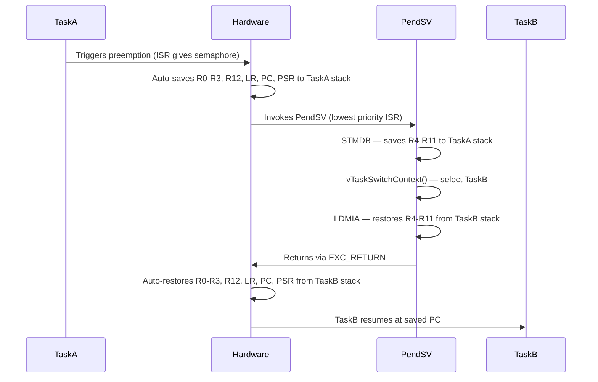

# :material-swap-horizontal: Day 04 — Context Switching

!!! abstract "Day at a Glance"
    **Goal:** Understand the mechanics of context switching, measure its cost, and optimize switch frequency.
    **Prerequisites:** Day 03 — Scheduling & Determinism

<div class="grid cards" markdown>
- :material-lightbulb-on: **Core Concept** — Save one task's CPU state, restore another's — in ~0.1–0.5 µs
- :material-chip: **RTOS Component** — PendSV handler, PSP/MSP, register save/restore
- :material-alert: **Watch Out** — FPU usage can triple context switch time if lazy save is not configured
- :material-check-circle: **By End of Day** — Measure context switch overhead and optimize switch frequency via batching
</div>

## :material-lightbulb-on: Intuition

!!! info "Core Idea"
    A context switch is just a memcpy of CPU registers to/from a task's stack. The ARM Cortex-M hardware saves 8 registers automatically on interrupt entry; the RTOS saves the remaining 8. Total cost: 12–25 CPU cycles on Cortex-M4.

!!! success "Real-World Context"
    A 1 kHz sensor acquisition system does 1000 context switches/second. At 0.2 µs each, that's 0.2 ms/second = **0.02% CPU overhead** — negligible. Context switching is not something to fear; it is something to understand.

## :material-vector-polyline: Context Switch Mechanism



## :material-book-open-variant: Lesson

### What Gets Saved

**Hardware saves automatically (on any interrupt):**
- R0, R1, R2, R3 — argument/scratch registers
- R12 — intra-procedure scratch
- LR (R14) — return address
- PC (R15) — next instruction to execute
- PSR — processor status register (flags, mode)

**RTOS saves in PendSV handler:**
- R4–R11 — callee-saved registers (not auto-stacked)

```c
// ARM Cortex-M context switch (simplified FreeRTOS PendSV)
void PendSV_Handler(void) {
    __asm volatile(
        "MRS R0, PSP           \n"  // Get current task's stack pointer
        "STMDB R0!, {R4-R11}   \n"  // Save R4-R11 onto task stack
        "STR R0, [%0]          \n"  // Save new top of stack in TCB
        : : "r"(&pxCurrentTCB->pxTopOfStack)
    );

    vTaskSwitchContext();           // Update pxCurrentTCB to next task

    __asm volatile(
        "LDR R0, [%0]          \n"  // Load new task's stack pointer
        "LDMIA R0!, {R4-R11}   \n"  // Restore R4-R11 from new task stack
        "MSR PSP, R0           \n"  // Set process stack pointer
        "BX LR                 \n"  // Return (hardware restores R0-R3, LR, PC, PSR)
        : : "r"(&pxCurrentTCB->pxTopOfStack)
    );
}
```

### When Does a Context Switch Occur?

1. **Tick interrupt** — scheduler checks if a higher-priority task became ready
2. **Blocking API call** — `vTaskDelay`, `xSemaphoreTake`, `xQueueReceive` block the caller
3. **Preemption** — ISR wakes a higher-priority task via `portYIELD_FROM_ISR`
4. **Explicit yield** — `taskYIELD()` voluntarily gives up the CPU

### Measuring Context Switch Cost

```c
void measure_context_switch(void) {
    // Enable DWT cycle counter
    CoreDebug->DEMCR |= CoreDebug_DEMCR_TRCENA_Msk;
    DWT->CYCCNT = 0;
    DWT->CTRL |= DWT_CTRL_CYCCNTENA_Msk;

    uint32_t start = DWT->CYCCNT;
    taskYIELD();                    // Force context switch (and back)
    uint32_t end = DWT->CYCCNT;

    uint32_t cycles = end - start;
    float us = (float)cycles / (SystemCoreClock / 1000000.0f);
    printf("Context switch: %lu cycles = %.2f µs\n", cycles, us);
}
```

**Typical costs:**

| Platform | Cycles | Time @ 100 MHz |
|----------|--------|---------------|
| Cortex-M0+ | 40–60 | 0.4–0.6 µs |
| Cortex-M3/M4 | 12–25 | 0.12–0.25 µs |
| Cortex-M7 | 8–15 | 0.08–0.15 µs |
| Cortex-M4F with FPU | 60–100 | 0.6–1.0 µs |

### FPU and Lazy Context Saving

If tasks use floating-point, the FPU adds 34 extra registers (S0–S31 + FPSCR) to save:

```c
// FreeRTOS config for FPU tasks
#define configENABLE_FPU  1

// Lazy FPU save: only save FPU regs if task actually used FPU
// Enabled by default on Cortex-M4F/M7
// Tasks NOT using FPU: same 12-25 cycle switch
// Tasks USING FPU: ~60-100 cycles
```

**Optimization:** Mark tasks that don't use FPU — saves 136 bytes of stack + 70% faster switch.

### Reducing Context Switch Overhead via Batching

```c
// Bad: 1000 context switches/second (one per sample)
void sensor_task(void *p) {
    for(;;) {
        uint16_t v = read_adc();
        xQueueSend(queue, &v, 0);     // May yield to consumer
    }
}

// Good: 10 context switches/second (one per batch)
void sensor_task(void *p) {
    uint16_t batch[100];
    for(;;) {
        for(int i = 0; i < 100; i++)
            batch[i] = read_adc();
        xQueueSend(queue, batch, 0);  // Send whole batch at once
    }
}
```

### Critical Sections and Context Switches

```c
// Disable context switches (ISRs still run)
vTaskSuspendAll();
update_shared_data();    // Multiple operations, no switch possible
xTaskResumeAll();        // Re-enables scheduling

// Disable interrupts (nothing runs — use briefly!)
taskENTER_CRITICAL();    // Interrupt-free zone
global_counter++;
taskEXIT_CRITICAL();     // Keep < 100 µs!
```

## :material-pencil: Exercises

**Exercise 1:** Enable DWT cycle counter and measure your context switch time on Cortex-M4 with and without FPU usage in the task.

**Exercise 2:** Implement a context switch hook (`vApplicationTaskSwitchHook`) that counts switches per second and logs when the rate exceeds 500/second.

**Exercise 3:** Implement the batching optimization: reduce context switches from 1000/s to <20/s in a 1 kHz sensor pipeline.

## :material-check: Solutions

??? success "Show Solutions"
    **Exercise 1 timing:** Cortex-M4 @ 80 MHz: ~15–20 cycles = 0.19–0.25 µs without FPU, ~70–90 cycles with FPU active.

    **Exercise 2 — Switch hook:**
    ```c
    void vApplicationTaskSwitchHook(void) {
        static uint32_t count = 0;
        static TickType_t last_print = 0;
        count++;
        TickType_t now = xTaskGetTickCount();
        if(now - last_print >= pdMS_TO_TICKS(1000)) {
            if(count > 500)
                printf("Warning: %lu switches/sec\n", count);
            count = 0;
            last_print = now;
        }
    }
    ```

    **Exercise 3:** Before batching: 1000 switches/sec. After: 10 switches/sec (100 samples/batch). CPU overhead drops from 0.02% to 0.002%.

## :material-alert: Common Pitfalls

!!! warning "Common Mistakes"
    - **Long critical sections**: Keep `taskENTER_CRITICAL()` blocks under 100 µs — longer durations increase interrupt latency and jitter
    - **Ignoring FPU overhead**: FPU adds 34 registers; if context switch is unexpectedly slow, check if tasks use float/double accidentally
    - **Using `vTaskDelay(0)` to yield**: Works, but `taskYIELD()` is explicit and more readable

!!! danger "Safety Risk"
    `taskENTER_CRITICAL()` disables interrupts globally on Cortex-M. In safety systems, masking interrupts even briefly can delay safety monitors. Use `vTaskSuspendAll()` instead when only the scheduler needs to be paused — ISRs continue to run.

## :material-help-circle: Flashcards

???+ question "What registers does Cortex-M hardware automatically save on interrupt entry?"
    R0, R1, R2, R3, R12, LR (R14), PC (R15), PSR — 8 registers = 32 bytes. This is called "hardware stacking." The RTOS (in PendSV) saves the remaining R4–R11.

???+ question "Why does FreeRTOS use PendSV for context switching?"
    PendSV is set to the lowest interrupt priority. This ensures all pending ISRs complete before the context switch happens — preventing a context switch from interrupting another ISR mid-execution. It enables "tail-chaining" of multiple ISRs before switching.

???+ question "What is lazy FPU context saving?"
    Cortex-M4F/M7 can defer saving FPU registers until a new task actually uses the FPU. If the incoming task never touches FPU, the 34 FPU registers are never saved/restored. This cuts context switch time by ~70% for non-FPU tasks.

???+ question "What is the difference between taskENTER_CRITICAL() and vTaskSuspendAll()?"
    `taskENTER_CRITICAL()` disables all interrupts — no ISRs run, but protected region must be very short (< 100 µs). `vTaskSuspendAll()` prevents context switches but ISRs still run — safer for longer multi-step operations.

## :material-clipboard-check: Self Test

=== "Question 1"
    A task runs at 1 kHz (1000 activations/second). Each context switch takes 0.2 µs. The task body takes 0.3 ms. What percentage of CPU time is overhead from context switching?

=== "Answer 1"
    Context switch overhead per second = 1000 × 0.2 µs = 0.2 ms/second
    Total time = 1 second
    **Overhead = 0.02%** — completely negligible.
    Note: Each activation requires 2 switches (in + out), so 2000 × 0.2 µs = 0.4 ms = **0.04%** — still negligible.

=== "Question 2"
    A task uses `double` arithmetic. How does this affect context switch time, and what can you do to minimize the impact?

=== "Answer 2"
    Using `double` activates the FPU (on Cortex-M4F). FPU context save adds 34 registers (S0-S31 + FPSCR) = 136 bytes. Context switch time increases from ~15 cycles to ~70-90 cycles (~5x slower).

    Mitigation: 1) Use `float` instead of `double` if precision allows. 2) Isolate FPU work to one dedicated task — other tasks are unaffected. 3) Ensure `configENABLE_FPU=1` for lazy save to avoid saving unused FPU state.

## :material-check-circle: Summary

!!! success "Key Takeaways"
    - Context switch = save 8 registers (software) + 8 auto-saved (hardware) = ~15–25 cycles on Cortex-M4
    - Overhead is **negligible** — 1000 switches/second ≈ 0.04% CPU
    - PendSV handles context switching at the lowest priority — after all ISRs complete
    - FPU tasks: 5–7× more expensive — use lazy save (`configENABLE_FPU=1`)
    - Reduce switch frequency by batching small operations
    - **Tomorrow (Day 05):** Semaphores and mutexes — synchronizing tasks and signaling from ISRs
