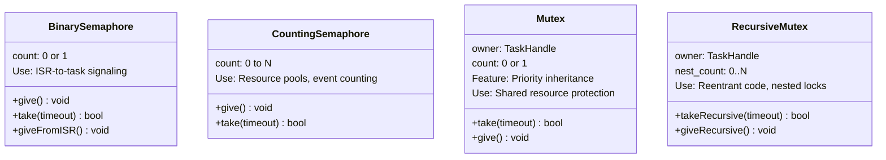

# :material-lock: Day 05 — Semaphores & Mutexes

!!! abstract "Day at a Glance"
    **Goal:** Choose and use the right synchronization primitive for each scenario.
    **Prerequisites:** Day 04 — Context Switching

<div class="grid cards" markdown>
- :material-lightbulb-on: **Core Concept** — Semaphores signal events; mutexes protect shared resources with ownership
- :material-chip: **RTOS Component** — Binary semaphore, counting semaphore, mutex, recursive mutex
- :material-alert: **Watch Out** — Using binary semaphore for mutual exclusion causes priority inversion
- :material-check-circle: **By End of Day** — Implement ISR-to-task signaling and safe shared resource access
</div>

## :material-lightbulb-on: Intuition

!!! info "Core Idea"
    A semaphore is a counter: give increments it, take decrements it. If the count is 0, take blocks. A mutex adds **ownership**: only the task that took it can give it back. This ownership enables **priority inheritance** — the key protection against priority inversion.

!!! success "Real-World Context"
    In an automotive system, a CAN bus driver (ISR) must signal a CAN parser task when a frame arrives. A binary semaphore is perfect: ISR gives it, task takes it. For the shared CAN transmit buffer accessed by multiple tasks, a mutex ensures exclusive access with priority inheritance.

## :material-vector-polyline: Synchronization Primitives



## :material-book-open-variant: Lesson

### Binary Semaphore — ISR-to-Task Signaling

```c
SemaphoreHandle_t xDataReady;

void ISR_Handler(void) {
    BaseType_t xHigherPriorityTaskWoken = pdFALSE;

    read_hardware_register();                    // Fast: read data

    xSemaphoreGiveFromISR(xDataReady,           // Signal task
                          &xHigherPriorityTaskWoken);

    portYIELD_FROM_ISR(xHigherPriorityTaskWoken); // Preempt if needed
}

void vProcessingTask(void *pvParameters) {
    xDataReady = xSemaphoreCreateBinary();
    for(;;) {
        xSemaphoreTake(xDataReady, portMAX_DELAY); // Block until ISR
        process_data();                             // Process outside ISR
    }
}
```

### Counting Semaphore — Resource Pool

```c
#define NUM_BUFFERS 5
SemaphoreHandle_t xBufferPool;

void init(void) {
    xBufferPool = xSemaphoreCreateCounting(NUM_BUFFERS, NUM_BUFFERS);
}

Buffer_t* allocate_buffer(void) {
    if(xSemaphoreTake(xBufferPool, pdMS_TO_TICKS(100)) == pdPASS)
        return get_from_pool();
    return NULL;   // Pool exhausted
}

void free_buffer(Buffer_t *buf) {
    return_to_pool(buf);
    xSemaphoreGive(xBufferPool);
}
```

### Mutex — Shared Resource Protection with Priority Inheritance

```c
SemaphoreHandle_t xSPIMutex;

void init(void) {
    xSPIMutex = xSemaphoreCreateMutex();  // NOT CreateBinary!
}

void spi_read(uint8_t *buf, size_t len) {
    if(xSemaphoreTake(xSPIMutex, pdMS_TO_TICKS(100)) == pdPASS) {
        // Exclusive SPI access
        spi_transfer(buf, len);
        xSemaphoreGive(xSPIMutex);  // Only owner can give
    }
}
```

!!! warning "Binary Semaphore ≠ Mutex"
    A binary semaphore has no ownership — any task can "give" it, which disables priority inheritance. Using a binary semaphore for mutual exclusion means priority inversion is NOT prevented. Always use `xSemaphoreCreateMutex()` for shared resources.

### Priority Inversion and Priority Inheritance

```
Without inheritance (binary semaphore):
  Task C (low)  ─── holds "lock" ─────────────────────────── releases
  Task B (med)  ─────────────────── RUNS (preempts C) ──────────────
  Task A (high) ─────────────────── BLOCKED (waiting for lock) ─────
  Problem: Task B blocks Task A indirectly!

With inheritance (mutex):
  Task C (low)  ─── holds mutex ─ BOOSTED to A's priority ─ releases
  Task A (high) ─────────────────────────────────────────── runs
  Task B (med)  ─────────────────────────────────────────────── runs
  Task C's priority = max(C, A) while it holds mutex
```

### Recursive Mutex

For code that needs to lock the same mutex in nested function calls:

```c
SemaphoreHandle_t xRecMutex;

void outer_function(void) {
    xSemaphoreTakeRecursive(xRecMutex, portMAX_DELAY);
    inner_function();          // Also takes the same mutex
    xSemaphoreGiveRecursive(xRecMutex);
}

void inner_function(void) {
    xSemaphoreTakeRecursive(xRecMutex, portMAX_DELAY);
    do_work();
    xSemaphoreGiveRecursive(xRecMutex);
}
```

### Deadlock Prevention

```c
// DEADLOCK: Task A takes mutex1 then mutex2; Task B takes mutex2 then mutex1
void task_a(void *p) {
    xSemaphoreTake(mutex1, portMAX_DELAY);
    xSemaphoreTake(mutex2, portMAX_DELAY);  // Deadlocks with Task B!
    ...
}

// FIX: Always acquire in the same order
void task_b(void *p) {
    xSemaphoreTake(mutex1, portMAX_DELAY);  // Same order as Task A
    xSemaphoreTake(mutex2, portMAX_DELAY);
    ...
}
```

### Best Practices

| Scenario | Use |
|----------|-----|
| ISR signals task | Binary semaphore |
| N identical resources | Counting semaphore |
| Exclusive access to shared resource | Mutex |
| Reentrant code with locking | Recursive mutex |
| One-shot event notification | Task notification (fastest) |

## :material-pencil: Exercises

**Exercise 1:** UART ISR receives a byte. Use a binary semaphore to signal a processing task. Measure ISR-to-task latency.

**Exercise 2:** 10-buffer pool using a counting semaphore. Verify that the 11th allocation blocks until one is freed.

**Exercise 3:** Shared SPI bus accessed by 3 tasks. Use a mutex. Verify priority inheritance by checking that a low-priority task holding the mutex is boosted to the priority of a waiting high-priority task.

## :material-check: Solutions

??? success "Show Solutions"
    **Exercise 1:**
    ```c
    SemaphoreHandle_t xUARTSem;
    volatile uint8_t g_received_byte;

    void UART_IRQHandler(void) {
        BaseType_t xHPTW = pdFALSE;
        g_received_byte = UART->RDR;
        xSemaphoreGiveFromISR(xUARTSem, &xHPTW);
        portYIELD_FROM_ISR(xHPTW);
    }

    void vUARTTask(void *p) {
        xUARTSem = xSemaphoreCreateBinary();
        for(;;) {
            xSemaphoreTake(xUARTSem, portMAX_DELAY);
            uint8_t byte = g_received_byte;
            process_byte(byte);
        }
    }
    ```
    Measure latency with GPIO toggle in ISR (before give) and task (after take).

## :material-alert: Common Pitfalls

!!! warning "Common Mistakes"
    - **Using binary semaphore for mutual exclusion** — no priority inheritance, priority inversion possible
    - **Forgetting `portYIELD_FROM_ISR`** — task woken from ISR won't run until next tick (up to 1ms delay)
    - **Infinite timeout in production code** — if the giving side fails, the taking task blocks forever; always use a timeout with error handling

!!! danger "Safety Risk"
    Priority inversion without mitigation is a documented failure mode in safety-critical systems — the Mars Pathfinder spacecraft experienced it in 1997. In ISO 26262 / IEC 61508 systems, mutexes with priority inheritance are **mandatory** for shared resource protection.

## :material-help-circle: Flashcards

???+ question "What is the key difference between a binary semaphore and a mutex?"
    A mutex has **ownership**: only the task that acquired it can release it, which enables priority inheritance. A binary semaphore has no ownership — any task (or ISR) can give it. Use binary semaphores for signaling, mutexes for mutual exclusion.

???+ question "How does priority inheritance work?"
    When high-priority Task A blocks on a mutex held by low-priority Task C, Task C temporarily inherits Task A's priority. This prevents medium-priority Task B from preempting Task C — eliminating the priority inversion. When Task C releases the mutex, it returns to its original priority.

???+ question "What is a counting semaphore used for?"
    Two main uses: (1) **Resource pools** — initialized to N, each take reduces count; task blocks when count reaches 0. (2) **Event counting** — counting the number of unprocessed events (e.g., ISR fires 5 times before task runs — count reaches 5).

???+ question "What does portYIELD_FROM_ISR do and why is it needed?"
    After `xSemaphoreGiveFromISR` (or any `FromISR` API), if a higher-priority task was woken, `portYIELD_FROM_ISR(xHigherPriorityTaskWoken)` triggers an immediate context switch. Without it, the higher-priority task won't run until the next tick interrupt — introducing up to 1ms latency.

## :material-clipboard-check: Self Test

=== "Question 1"
    Task A (priority 5) needs a mutex. Task C (priority 1) holds it. Task B (priority 3) becomes ready. Without priority inheritance, what happens? With priority inheritance, what happens?

=== "Answer 1"
    **Without inheritance:** Task C (priority 1) can be preempted by Task B (priority 3). Task A waits while Task B runs — medium-priority task blocks high-priority task. Duration unbounded.

    **With inheritance:** Task C is boosted to priority 5 (same as Task A). Task B (priority 3) cannot preempt Task C. Task C completes its critical section, releases mutex, drops back to priority 1. Task A runs immediately.

=== "Question 2"
    You have a counting semaphore initialized to 3 (3 free buffers). Tasks allocate/free in this order: alloc, alloc, alloc, alloc. What happens at the 4th alloc?

=== "Answer 2"
    Count: 3→2→1→0 after 3 allocs. The 4th `xSemaphoreTake()` finds count=0 and **blocks** (if timeout = portMAX_DELAY) until another task frees a buffer and calls `xSemaphoreGive()`, incrementing the count back to 1 and unblocking the waiting task.

## :material-check-circle: Summary

!!! success "Key Takeaways"
    - **Binary semaphore**: signal events (ISR → task), no ownership, no priority inheritance
    - **Counting semaphore**: N-resource pool or event counter
    - **Mutex**: exclusive resource access WITH priority inheritance — prevents priority inversion
    - Always use **mutex** (not binary semaphore) for shared resource protection
    - Always call `portYIELD_FROM_ISR` after giving from an ISR
    - Acquire multiple mutexes in a **consistent order** to prevent deadlock
    - **Tomorrow (Day 06):** Queues and event groups — passing data between tasks
