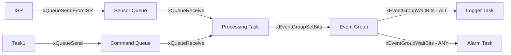

# :material-inbox: Day 06 — Queues & Event Groups

!!! abstract "Day at a Glance"
    **Goal:** Pass data safely between tasks and synchronize on multiple conditions using queues and event groups.
    **Prerequisites:** Day 05 — Semaphores & Mutexes

<div class="grid cards" markdown>
- :material-lightbulb-on: **Core Concept** — Queues are thread-safe FIFOs; event groups let tasks wait for multiple flags
- :material-chip: **RTOS Component** — xQueueCreate, xQueueSend/Receive, xEventGroupWaitBits
- :material-alert: **Watch Out** — Queue full → data loss; size queues for worst-case burst, not average load
- :material-check-circle: **By End of Day** — Build producer-consumer pipelines and multi-condition synchronization
</div>

## :material-lightbulb-on: Intuition

!!! info "Core Idea"
    Queues decouple producers from consumers — the producer sends when data is ready, the consumer processes when ready. No shared globals, no explicit locking. The RTOS handles thread safety internally.

!!! success "Real-World Context"
    In an ECU, four sensor ISRs each push readings into separate queues. A processing task wakes only when all four queues have data (event group). The SD logger reads from a single queue asynchronously. Zero lock contention, zero missed samples.

## :material-vector-polyline: IPC Mechanism Map



## :material-book-open-variant: Lesson

### Message Queues

```c
typedef struct {
    uint32_t sensor_id;
    float value;
    uint32_t timestamp;
} sensor_reading_t;

// Create queue: 10 items, each sizeof(sensor_reading_t)
QueueHandle_t xSensorQ = xQueueCreate(10, sizeof(sensor_reading_t));

// Producer task
void vSensorTask(void *p) {
    sensor_reading_t reading;
    for(;;) {
        reading.value     = read_sensor();
        reading.timestamp = xTaskGetTickCount();
        reading.sensor_id = 1;

        // Block up to 100ms if queue is full
        if(xQueueSend(xSensorQ, &reading, pdMS_TO_TICKS(100)) != pdPASS)
            log_error("Queue full — sample dropped");

        vTaskDelay(pdMS_TO_TICKS(100));
    }
}

// Consumer task
void vProcessTask(void *p) {
    sensor_reading_t reading;
    for(;;) {
        // Block indefinitely until data available
        if(xQueueReceive(xSensorQ, &reading, portMAX_DELAY) == pdPASS)
            process_data(&reading);
    }
}
```

### Queue Operations Reference

```c
xQueueSend(q, &item, timeout);          // Send to back (normal)
xQueueSendToFront(q, &item, timeout);   // Send to front (priority item)
xQueueReceive(q, &item, timeout);       // Receive and remove
xQueuePeek(q, &item, timeout);          // Read without removing
uxQueueMessagesWaiting(q);              // Items in queue (non-blocking)
uxQueueSpacesAvailable(q);              // Free slots remaining

// From ISR
xQueueSendFromISR(q, &item, &xHPTW);
xQueueReceiveFromISR(q, &item, &xHPTW);
```

### Sizing Queues

Queue size = **worst-case burst size**, not average.

```
Sensor fires at 100 Hz, processing takes 20 ms max.
Burst = 100 Hz × 0.020 s = 2 samples burst.
Add 50% margin → queue size = 3–5 items.
```

For safety: `uxQueueSpacesAvailable()` in the producer — alert before it fills.

### Event Groups

Wait for **multiple conditions** before proceeding:

```c
EventGroupHandle_t xEvents = xEventGroupCreate();

#define EV_SENSOR_READY  (1 << 0)
#define EV_COMM_READY    (1 << 1)
#define EV_USER_CMD      (1 << 2)

// Various tasks set their bits when ready
void vSensorTask(void *p) {
    init_sensor();
    xEventGroupSetBits(xEvents, EV_SENSOR_READY);  // Signal ready
    for(;;) { /* normal work */ }
}

// Processing task waits for ALL three events
void vProcessTask(void *p) {
    EventBits_t bits = xEventGroupWaitBits(
        xEvents,
        EV_SENSOR_READY | EV_COMM_READY | EV_USER_CMD,
        pdTRUE,       // Clear bits on exit
        pdTRUE,       // Wait for ALL (pdFALSE = wait for ANY)
        portMAX_DELAY
    );

    if((bits & (EV_SENSOR_READY | EV_COMM_READY | EV_USER_CMD)) ==
               (EV_SENSOR_READY | EV_COMM_READY | EV_USER_CMD))
        process_complete_dataset();
}
```

### Queue Sets — Monitor Multiple Queues

```c
QueueSetHandle_t xSet = xQueueCreateSet(30);  // Total capacity

xQueueAddToSet(xUARTQ, xSet);
xQueueAddToSet(xSPIQ,  xSet);
xQueueAddToSet(xI2CQ,  xSet);

void vMonitorTask(void *p) {
    for(;;) {
        QueueSetMemberHandle_t active =
            xQueueSelectFromSet(xSet, portMAX_DELAY);

        if(active == xUARTQ) {
            uint8_t data;
            xQueueReceive(xUARTQ, &data, 0);
            handle_uart(data);
        } else if(active == xSPIQ) {
            /* ... */
        }
    }
}
```

## :material-pencil: Exercises

**Exercise 1:** ADC → Filter → Logger pipeline using 2 queues. ADC task at 1 kHz, filter processes batches of 10, logger writes to SD.

**Exercise 2:** Event group coordinating system startup: sensor init, comm init, and config load must all complete before the main loop starts.

**Exercise 3:** Queue set monitoring UART, SPI, and I2C input queues in a single gateway task.

## :material-check: Solutions

??? success "Show Solutions"
    **Exercise 1 — Pipeline:**
    ```c
    QueueHandle_t xRawQ  = xQueueCreate(20, sizeof(uint16_t));
    QueueHandle_t xFiltQ = xQueueCreate(5,  sizeof(float));

    void vADCTask(void *p) {         // Priority 5
        TickType_t last = xTaskGetTickCount();
        for(;;) {
            uint16_t v = adc_read();
            xQueueSend(xRawQ, &v, 0);   // Non-blocking (drop if full)
            vTaskDelayUntil(&last, pdMS_TO_TICKS(1));
        }
    }
    void vFilterTask(void *p) {      // Priority 3
        uint16_t buf[10]; int n = 0;
        for(;;) {
            if(xQueueReceive(xRawQ, &buf[n], portMAX_DELAY) == pdPASS) {
                if(++n == 10) {
                    float avg = compute_average(buf, 10);
                    xQueueSend(xFiltQ, &avg, pdMS_TO_TICKS(50));
                    n = 0;
                }
            }
        }
    }
    ```

## :material-alert: Common Pitfalls

!!! warning "Common Mistakes"
    - **Under-sized queues**: Size for worst-case burst, not average — a full queue drops data silently if you use timeout=0
    - **Large structs copied by value**: Queues copy data; passing a 1KB struct 1000/s wastes bandwidth — use a pointer queue instead
    - **Event group timing hazard**: Bits set before `xEventGroupWaitBits` is called — ensure bits are checked after the wait, as they may already be set on entry

!!! danger "Safety Risk"
    Dropping queue items silently (`xQueueSend(..., 0)`) in safety-critical pipelines (e.g., a sensor dropping a safety-critical reading) can cause a hazardous failure. Always use non-zero timeouts and handle the `pdFAIL` return code explicitly.

## :material-help-circle: Flashcards

???+ question "How is a queue thread-safe without explicit locking?"
    FreeRTOS queues use a **critical section** (interrupt disable) internally during the copy-in/copy-out operation. The data copy is atomic from the tasks' perspective. Tasks waiting on the queue are managed by the scheduler — no user-level locking is needed.

???+ question "What is the difference between xQueueSend and xQueueSendToFront?"
    `xQueueSend` adds to the **back** of the FIFO — normal priority. `xQueueSendToFront` adds to the **front**, so the next receive gets this item first. Use `SendToFront` for urgent/priority messages (e.g., an emergency stop command).

???+ question "What does xEventGroupWaitBits return and when?"
    Returns the value of all event group bits **at the time the condition was met**. The `xWaitForAllBits` parameter controls whether it waits for all specified bits (AND) or any one of them (OR). Bits can optionally be cleared on exit (`xClearOnExit = pdTRUE`).

???+ question "When should you use a queue vs. a semaphore?"
    **Queue**: when you need to pass **data** (sensor values, commands, structs). **Semaphore**: when you only need to signal that an **event occurred** with no associated data. Task notifications are the fastest option when signaling a specific known task.

## :material-clipboard-check: Self Test

=== "Question 1"
    A sensor fires at 500 Hz. The processing task takes at most 4 ms per sample. How large should the queue be?

=== "Answer 1"
    During a 4 ms processing burst, sensor fires 500 Hz × 0.004 s = 2 new samples.
    Queue needs to hold 2 samples while processing is busy.
    Add 2× safety margin → **queue size = 4–5 items** minimum.
    For robustness, use 10 items.

=== "Question 2"
    Three tasks must all complete initialization before the main application loop starts. How do you implement this with an event group?

=== "Answer 2"
    ```c
    #define INIT_SENSOR  (1<<0)
    #define INIT_COMM    (1<<1)
    #define INIT_CONFIG  (1<<2)
    #define ALL_INIT     (INIT_SENSOR | INIT_COMM | INIT_CONFIG)

    // Each init task sets its bit when done:
    xEventGroupSetBits(xInitGroup, INIT_SENSOR);

    // Main app task waits for all:
    xEventGroupWaitBits(xInitGroup, ALL_INIT,
                        pdFALSE,    // Don't clear bits
                        pdTRUE,     // Wait for ALL
                        portMAX_DELAY);
    // All initialized — start main loop
    ```

## :material-check-circle: Summary

!!! success "Key Takeaways"
    - Queues provide **thread-safe, copy-based FIFO** data transfer between tasks — no explicit locking needed
    - **Size queues for worst-case burst**, not average throughput
    - Event groups let a task wait for **multiple conditions** (AND/OR) atomically
    - `xQueueSendToFront` provides priority queuing for urgent messages
    - Use queue sets to monitor multiple queues in a single blocking call
    - **Tomorrow (Day 07):** Interrupt handling — ISR constraints, deferred processing, and NVIC priority configuration
