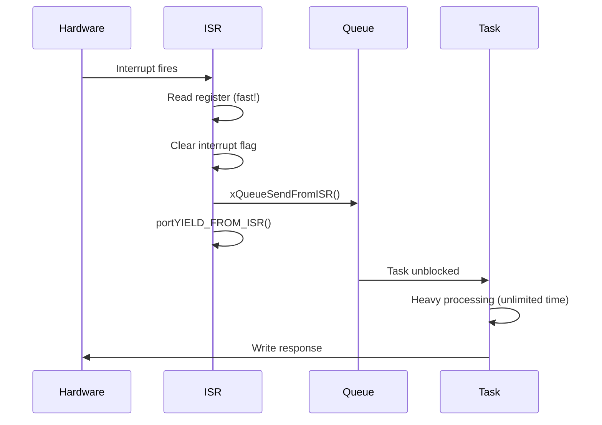

# :material-lightning-bolt: Day 07 — Interrupt Handling with RTOS

!!! abstract "Day at a Glance"
    **Goal:** Integrate hardware interrupts safely with an RTOS using correct priority configuration and deferred processing.
    **Prerequisites:** Day 06 — Queues & Event Groups

<div class="grid cards" markdown>
- :material-lightbulb-on: **Core Concept** — ISRs must be fast; defer all real work to tasks via queues or semaphores
- :material-chip: **RTOS Component** — FromISR APIs, portYIELD_FROM_ISR, NVIC priority, task notifications
- :material-alert: **Watch Out** — RTOS-aware ISRs must have lower NVIC priority than configMAX_SYSCALL_INTERRUPT_PRIORITY
- :material-check-circle: **By End of Day** — Implement ISR-driven data pipelines with correct priority configuration
</div>

## :material-lightbulb-on: Intuition

!!! info "Core Idea"
    An ISR has two jobs: (1) acknowledge the hardware, (2) signal a task. Everything else belongs in the task. The RTOS's `FromISR` APIs are the only safe channel from interrupt context to task context.

!!! success "Real-World Context"
    In an STM32-based motor controller, the ADC conversion complete ISR reads the result register (fast, deterministic) and gives a semaphore. The control loop task wakes, computes the PID output, and writes to the PWM register. ISR duration: 500 ns. Task duration: 50 µs. This is the correct split.

## :material-vector-polyline: ISR-to-Task Deferred Processing



## :material-book-open-variant: Lesson

### ISR Constraints

**Rules for ISR code:**

1. **Must be fast** (< 1–50 µs typical)
2. **Cannot call blocking APIs** (`vTaskDelay`, `xSemaphoreTake`, etc.)
3. **Must use FromISR variants** (`xSemaphoreGiveFromISR`, `xQueueSendFromISR`)
4. **Minimize local variable usage** (ISR uses the interrupted task's stack or a separate IRQ stack)
5. **Must clear the interrupt flag** before returning (hardware-specific)

### ISR-to-Task with Semaphore

```c
SemaphoreHandle_t xDataReady;
volatile uint32_t g_adc_raw;

void ADC_IRQHandler(void) {
    BaseType_t xHPTW = pdFALSE;

    g_adc_raw = ADC1->DR;          // 1. Read hardware (fast)
    ADC1->ISR |= ADC_ISR_EOC;      // 2. Clear interrupt flag

    xSemaphoreGiveFromISR(xDataReady, &xHPTW);  // 3. Signal task
    portYIELD_FROM_ISR(xHPTW);     // 4. Yield if task is higher priority
}

void vADCTask(void *p) {
    xDataReady = xSemaphoreCreateBinary();
    for(;;) {
        xSemaphoreTake(xDataReady, portMAX_DELAY);

        // Safe to read: ISR only writes, task only reads here
        taskENTER_CRITICAL();
        uint32_t raw = g_adc_raw;
        taskEXIT_CRITICAL();

        float voltage = raw * (3.3f / 4096.0f);
        process_adc_voltage(voltage);
    }
}
```

### ISR-to-Task with Queue (Preferred for data)

```c
QueueHandle_t xISRQueue;

void UART_IRQHandler(void) {
    BaseType_t xHPTW = pdFALSE;
    uint8_t byte = USART1->RDR;    // Read clears interrupt
    xQueueSendFromISR(xISRQueue, &byte, &xHPTW);
    portYIELD_FROM_ISR(xHPTW);
}

void vUARTTask(void *p) {
    xISRQueue = xQueueCreate(64, sizeof(uint8_t));
    uint8_t byte;
    for(;;) {
        xQueueReceive(xISRQueue, &byte, portMAX_DELAY);
        process_uart_byte(byte);
    }
}
```

### Task Notifications — Lightest-Weight Signaling

50% less RAM and overhead than semaphores:

```c
TaskHandle_t xProcessTask;

void EXTI0_IRQHandler(void) {
    BaseType_t xHPTW = pdFALSE;
    uint32_t value = GPIO->IDR & 0x01;

    // Notify specific task with a value
    xTaskNotifyFromISR(xProcessTask, value,
                       eSetValueWithOverwrite, &xHPTW);
    portYIELD_FROM_ISR(xHPTW);
}

void vProcessTask(void *p) {
    xProcessTask = xTaskGetCurrentTaskHandle();
    uint32_t notification;
    for(;;) {
        ulTaskNotifyTake(pdTRUE, portMAX_DELAY);  // Simple binary notify
        // OR: xTaskNotifyWait(0, ULONG_MAX, &notification, portMAX_DELAY);
        handle_gpio_event(notification);
    }
}
```

### NVIC Priority Configuration

!!! danger "Critical Configuration"
    RTOS-aware ISRs **must** have NVIC priority **numerically ≥ configMAX_SYSCALL_INTERRUPT_PRIORITY**. Lower number = higher priority in Cortex-M NVIC. ISRs with higher priority (lower number) than the RTOS threshold **cannot** call FromISR APIs — this causes hard faults.

```c
// FreeRTOSConfig.h
#define configMAX_SYSCALL_INTERRUPT_PRIORITY  5  // CMSIS priority

// NVIC Setup
NVIC_SetPriority(HardFault_IRQn,  0);  // Highest — CANNOT use RTOS APIs
NVIC_SetPriority(DMA1_IRQn,       3);  // Higher than RTOS — NO FromISR
NVIC_SetPriority(UART1_IRQn,      5);  // AT threshold — can use FromISR
NVIC_SetPriority(TIM2_IRQn,       6);  // Below threshold — can use FromISR
NVIC_SetPriority(SysTick_IRQn,    15); // RTOS tick — lowest of all

NVIC_EnableIRQ(UART1_IRQn);
NVIC_EnableIRQ(TIM2_IRQn);
```

### Software Timers from ISR

```c
TimerHandle_t xRetryTimer;

void COMM_ERROR_IRQHandler(void) {
    BaseType_t xHPTW = pdFALSE;
    xTimerStartFromISR(xRetryTimer, &xHPTW);
    portYIELD_FROM_ISR(xHPTW);
}
```

## :material-pencil: Exercises

**Exercise 1:** UART RX interrupt with circular buffer. ISR fills buffer; task drains it via task notification when buffer is half-full.

**Exercise 2:** Timer interrupt triggering ADC sampling at precisely 1 kHz. Measure actual sample timing jitter using DWT.

**Exercise 3:** Multi-source interrupt handling: UART, SPI, and I2C each have ISRs that push to separate queues. A single dispatcher task services all three using queue sets.

## :material-check: Solutions

??? success "Show Solutions"
    **Exercise 1 — Circular Buffer with Notification:**
    ```c
    #define BUF_SIZE 128
    volatile uint8_t rx_buf[BUF_SIZE];
    volatile uint16_t rx_head = 0, rx_tail = 0;
    TaskHandle_t xUARTTask;

    void UART_IRQHandler(void) {
        BaseType_t xHPTW = pdFALSE;
        rx_buf[rx_head % BUF_SIZE] = UART->RDR;
        rx_head++;
        if((rx_head - rx_tail) >= BUF_SIZE / 2) {
            // Half-full: notify task
            vTaskNotifyGiveFromISR(xUARTTask, &xHPTW);
            portYIELD_FROM_ISR(xHPTW);
        }
    }

    void vUARTTask(void *p) {
        xUARTTask = xTaskGetCurrentTaskHandle();
        for(;;) {
            ulTaskNotifyTake(pdTRUE, portMAX_DELAY);
            while(rx_head != rx_tail)
                process_byte(rx_buf[rx_tail++ % BUF_SIZE]);
        }
    }
    ```

## :material-alert: Common Pitfalls

!!! warning "Common Mistakes"
    - **Calling non-FromISR APIs in ISR**: e.g., `xSemaphoreGive` instead of `xSemaphoreGiveFromISR` — causes crash or corruption
    - **Wrong NVIC priority**: ISR priority numerically lower (higher HW priority) than `configMAX_SYSCALL_INTERRUPT_PRIORITY` — FromISR APIs will assert/crash
    - **Not calling portYIELD_FROM_ISR**: Woken task waits until next tick (up to 1ms) instead of running immediately

!!! danger "Safety Risk"
    Calling blocking RTOS functions from ISR context causes **undefined behavior**: stack corruption, hard faults, or kernel state corruption. In safety-critical code (ISO 26262), the ISR/task boundary is strictly audited — all ISRs must be reviewed for compliance.

## :material-help-circle: Flashcards

???+ question "What are the three mandatory rules for RTOS-aware ISR code?"
    (1) Use only `FromISR` variants (`xSemaphoreGiveFromISR`, `xQueueSendFromISR`, etc.) — never call blocking APIs. (2) Set NVIC priority ≥ `configMAX_SYSCALL_INTERRUPT_PRIORITY` (numerically). (3) Call `portYIELD_FROM_ISR(xHigherPriorityTaskWoken)` at the end if a task was woken.

???+ question "Why must RTOS-aware ISRs have lower NVIC priority than the RTOS threshold?"
    FreeRTOS uses `BASEPRI` masking to implement critical sections — it masks all interrupts at or below a threshold. If an ISR has higher priority than this threshold, it can fire during a critical section and corrupt internal kernel state.

???+ question "What are task notifications and when should you use them over semaphores?"
    Task notifications are a per-task 32-bit value + notification pending flag built into the TCB. No separate kernel object needed. **~50% faster** and use less RAM than semaphores. Use when you know exactly which task to signal. Cannot be used when multiple tasks wait on the same event.

???+ question "What happens if you forget portYIELD_FROM_ISR after an ISR gives a semaphore?"
    The higher-priority task that was woken becomes Ready but does not run until the next scheduler tick (up to 1 tick period = 1ms at 1kHz). This introduces up to 1ms latency on what should be an immediate preemption.

## :material-clipboard-check: Self Test

=== "Question 1"
    `configMAX_SYSCALL_INTERRUPT_PRIORITY` is set to 5. Which of these ISRs can safely call FromISR APIs? A) NVIC priority 3, B) NVIC priority 5, C) NVIC priority 7.

=== "Answer 1"
    In Cortex-M, lower number = **higher** hardware priority. The RTOS masks interrupts at priority ≥ configMAX_SYSCALL_INTERRUPT_PRIORITY = 5.

    - Priority 3: Higher than threshold — **CANNOT** use FromISR (will corrupt RTOS state)
    - Priority 5: At threshold — **CAN** use FromISR ✓
    - Priority 7: Below threshold — **CAN** use FromISR ✓

=== "Question 2"
    An ISR receives a UDP packet (variable size, up to 1500 bytes) and must process it. What is the correct RTOS pattern?

=== "Answer 2"
    ISR should: (1) DMA the packet into a pre-allocated buffer, (2) send a **pointer** (or index) to the buffer via `xQueueSendFromISR`, (3) `portYIELD_FROM_ISR`.

    The processing task: receives pointer, processes full 1500-byte packet (no time constraint in ISR), returns buffer to pool when done.

    Never process 1500 bytes in an ISR — that could take 100+ µs and block all lower-priority interrupts.

## :material-check-circle: Summary

!!! success "Key Takeaways"
    - ISR rule: **read hardware, clear flag, signal task, yield** — nothing else
    - Always use `FromISR` variants in interrupt context
    - Configure NVIC priority ≥ `configMAX_SYSCALL_INTERRUPT_PRIORITY` for RTOS-aware ISRs
    - Task notifications are the fastest ISR-to-task signaling (50% less overhead than semaphores)
    - Always call `portYIELD_FROM_ISR(xHPTW)` to trigger immediate preemption when needed
    - **Tomorrow (Day 08):** Memory and stack management — heap schemes, pools, and fragmentation prevention
