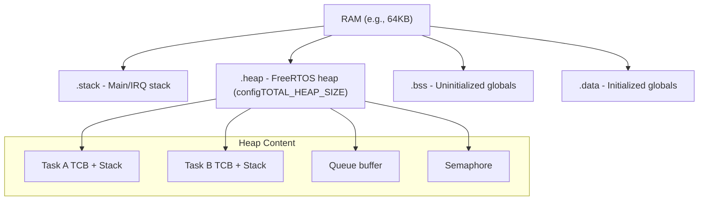

# :material-memory: Day 08 — Memory & Stack Management

!!! abstract "Day at a Glance"
    **Goal:** Size stacks correctly, choose the right heap scheme, and implement zero-fragmentation memory pools.
    **Prerequisites:** Day 07 — Interrupt Handling

<div class="grid cards" markdown>
- :material-lightbulb-on: **Core Concept** — Stack overflow and heap fragmentation are the two silent killers in RTOS systems
- :material-chip: **RTOS Component** — heap_1 through heap_5, stack watermarks, memory pools
- :material-alert: **Watch Out** — heap_2 can fragment; use heap_4 (coalescent) for general use
- :material-check-circle: **By End of Day** — Select the right heap, size all stacks, and implement a fixed-size memory pool
</div>

## :material-lightbulb-on: Intuition

!!! info "Core Idea"
    Embedded systems have no virtual memory or swap. Every byte of stack and heap must be pre-planned. Fragmented heap means `pvPortMalloc` returns NULL at runtime — a failure mode that bare-metal never has. Static allocation eliminates heap risk entirely.

!!! success "Real-World Context"
    In IEC 61508 safety systems, dynamic allocation is often **prohibited** — all memory is statically allocated at system start. FreeRTOS static API (`xTaskCreateStatic`, `xQueueCreateStatic`) enables this.

## :material-vector-polyline: Memory Layout



## :material-book-open-variant: Lesson

### FreeRTOS Heap Schemes

| Scheme | Alloc | Dealloc | Fragmentation | Use Case |
|--------|-------|---------|--------------|---------|
| **heap_1** | ✓ First-fit | ✗ None | None | Static-only systems, safety-critical |
| **heap_2** | ✓ Best-fit | ✓ | Yes (no coalesce) | Fixed-size allocations only |
| **heap_3** | wraps malloc | wraps free | Depends on libc | General-purpose (libc available) |
| **heap_4** | ✓ First-fit | ✓ Coalesces | Minimal | **Recommended general use** |
| **heap_5** | ✓ | ✓ | Minimal | Multiple non-contiguous memory regions |

```c
// FreeRTOSConfig.h
#define configTOTAL_HEAP_SIZE  (40 * 1024)   // 40KB heap

// Monitor heap usage
size_t free = xPortGetFreeHeapSize();
size_t min  = xPortGetMinimumEverFreeHeapSize();  // Heap low-water mark
printf("Heap: %u free, min ever %u\n", free, min);
```

### Stack Management

**Sizing strategy:**

```c
// Step 1: Start with a generous estimate
xTaskCreate(vMyTask, "Task", 512, NULL, 3, &handle);

// Step 2: Run worst-case scenarios (enable all code paths)

// Step 3: Check watermark
UBaseType_t wm = uxTaskGetStackHighWaterMark(handle);
// wm = minimum free WORDS ever seen
// If wm < 32 (128 bytes), increase stack size!

// Step 4: Final size = (512 - wm + 32) words with margin
```

**Stack overflow detection:**

```c
// FreeRTOSConfig.h
#define configCHECK_FOR_STACK_OVERFLOW  2  // Check on every context switch

// Application callback (called when overflow detected)
void vApplicationStackOverflowHook(TaskHandle_t xTask, char *pcName) {
    printf("STACK OVERFLOW: %s\n", pcName);
    // Log to flash, assert, or reset
    configASSERT(0);
}
```

**Stack canary (method 2):** FreeRTOS fills the top of stack with 0xA5A5A5A5 and checks it on every switch — catches overflow before corruption spreads.

### Static Allocation (Safety-Critical Systems)

```c
// No heap needed — all memory at compile time
static StackType_t  xTaskStack[512];
static StaticTask_t xTaskTCB;

TaskHandle_t xHandle = xTaskCreateStatic(
    vMyTask, "Task", 512, NULL, 3,
    xTaskStack, &xTaskTCB
);

// Static queue
static uint8_t xQueueStorage[10 * sizeof(sensor_t)];
static StaticQueue_t xQueueStruct;

QueueHandle_t xQ = xQueueCreateStatic(
    10, sizeof(sensor_t),
    xQueueStorage, &xQueueStruct
);
```

### Memory Pools — Zero Fragmentation

For systems requiring deterministic allocation with no fragmentation:

```c
#define POOL_SIZE     20
#define BLOCK_SIZE    64

typedef struct {
    uint8_t data[BLOCK_SIZE];
    bool in_use;
} pool_block_t;

static pool_block_t pool[POOL_SIZE];
static SemaphoreHandle_t pool_mutex;

void* pool_alloc(void) {
    xSemaphoreTake(pool_mutex, portMAX_DELAY);
    for(int i = 0; i < POOL_SIZE; i++) {
        if(!pool[i].in_use) {
            pool[i].in_use = true;
            xSemaphoreGive(pool_mutex);
            return pool[i].data;
        }
    }
    xSemaphoreGive(pool_mutex);
    return NULL;  // Pool exhausted
}

void pool_free(void *ptr) {
    pool_block_t *block = (pool_block_t*)((uint8_t*)ptr -
                           offsetof(pool_block_t, data));
    xSemaphoreTake(pool_mutex, portMAX_DELAY);
    block->in_use = false;
    xSemaphoreGive(pool_mutex);
}
```

### Heap_5: Multiple Memory Regions

For MCUs with SRAM + CCMRAM (e.g., STM32F4):

```c
// SRAM: 0x20000000, 100KB
// CCMRAM: 0x10000000, 64KB
static HeapRegion_t xHeapRegions[] = {
    { (uint8_t*)0x20000000, 100*1024 },   // SRAM
    { (uint8_t*)0x10000000,  64*1024 },   // CCMRAM
    { NULL, 0 }                           // Terminator
};

vPortDefineHeapRegions(xHeapRegions);
```

## :material-pencil: Exercises

**Exercise 1:** Create 5 tasks with different stack sizes. Run for 60 seconds under load. Report high-water marks and identify which are too tight (< 64 words headroom).

**Exercise 2:** Deliberately fragment the heap using heap_2 (many alloc/free cycles of different sizes). Switch to heap_4. Compare fragmentation.

**Exercise 3:** Implement a fixed-size memory pool with 20 × 128-byte blocks. Use a counting semaphore as the availability counter (faster than linear scan).

## :material-check: Solutions

??? success "Show Solutions"
    **Exercise 3 — Semaphore-based pool (faster alloc):**
    ```c
    #define POOL_N     20
    #define BLOCK_SZ   128

    static uint8_t pool_mem[POOL_N][BLOCK_SZ];
    static bool    pool_used[POOL_N] = {false};
    static SemaphoreHandle_t pool_sem;   // Counting, init to POOL_N
    static SemaphoreHandle_t pool_lock;  // Mutex for pool_used array

    void pool_init(void) {
        pool_sem  = xSemaphoreCreateCounting(POOL_N, POOL_N);
        pool_lock = xSemaphoreCreateMutex();
    }

    void* pool_alloc(TickType_t timeout) {
        if(xSemaphoreTake(pool_sem, timeout) != pdPASS)
            return NULL;  // Pool empty
        xSemaphoreTake(pool_lock, portMAX_DELAY);
        for(int i = 0; i < POOL_N; i++) {
            if(!pool_used[i]) {
                pool_used[i] = true;
                xSemaphoreGive(pool_lock);
                return pool_mem[i];
            }
        }
        xSemaphoreGive(pool_lock);
        return NULL;  // Shouldn't happen
    }

    void pool_free(void *p) {
        int i = ((uint8_t*)p - pool_mem[0]) / BLOCK_SZ;
        xSemaphoreTake(pool_lock, portMAX_DELAY);
        pool_used[i] = false;
        xSemaphoreGive(pool_lock);
        xSemaphoreGive(pool_sem);   // Unblock any waiting alloc
    }
    ```

## :material-alert: Common Pitfalls

!!! warning "Common Mistakes"
    - **Heap_2 with variable sizes**: heap_2 never coalesces — after many alloc/free cycles of different sizes, large allocations fail even though total free space is sufficient
    - **Stack size in bytes vs words**: FreeRTOS uses words; multiply by 4 for bytes on ARM32
    - **Not enabling stack overflow check**: Silent overflow corrupts adjacent memory, crashes appear random and far from the root cause

!!! danger "Safety Risk"
    In DO-178C / IEC 61508 certified systems, any dynamic allocation after startup is typically **prohibited**. All RTOS objects (tasks, queues, semaphores) must use static allocation APIs (`xTaskCreateStatic`, etc.) and pass worst-case stack usage analysis.

## :material-help-circle: Flashcards

???+ question "What is the difference between heap_2 and heap_4?"
    Both support allocation and deallocation. **heap_2** uses best-fit but does **not** coalesce adjacent free blocks — leading to fragmentation over time. **heap_4** uses first-fit **with coalescing** — adjacent free blocks are merged, minimizing fragmentation. Use heap_4 for general embedded use.

???+ question "What does uxTaskGetStackHighWaterMark return and how do you use it?"
    Returns the **minimum number of free WORDS** ever observed on the task's stack since creation. If it returns 10 (40 bytes headroom on ARM32), the stack is dangerously close to overflow. Target ≥ 32 words (128 bytes) headroom. Measure after running worst-case workload.

???+ question "When is a memory pool better than pvPortMalloc/vPortFree?"
    A memory pool provides: (1) **O(1) allocation** (no heap search), (2) **zero fragmentation** (fixed-size blocks), (3) **bounded allocation time** (deterministic). Use pools for frequently allocated/freed objects of the same size (e.g., network packets, sensor readings).

???+ question "How does FreeRTOS heap_5 handle multiple memory regions?"
    `vPortDefineHeapRegions(xHeapRegions[])` is called once at startup with an array of `{base_address, size}` pairs. FreeRTOS links them into a single logical heap. Allocation is first-fit across all regions. Useful for MCUs with SRAM + CCMRAM or external SDRAM.

## :material-clipboard-check: Self Test

=== "Question 1"
    After running a system for 24 hours, `xPortGetMinimumEverFreeHeapSize()` returns 512 bytes on a 40KB heap. Is this concerning?

=== "Answer 1"
    512 bytes of minimum free heap on 40KB = **1.25% headroom** — this is **very concerning**. It means the system came within 512 bytes of running out of heap. Any dynamic allocation spike (e.g., a burst of log messages) would cause `pvPortMalloc` to return NULL.

    Action: Increase `configTOTAL_HEAP_SIZE`, profile allocations with `xPortGetFreeHeapSize()` over time, or switch tasks/queues to static allocation.

=== "Question 2"
    A task calls `printf()` internally. Why does this require a much larger stack than a task that doesn't?

=== "Answer 2"
    `printf()` (and `sprintf()`) maintain large internal buffers on the stack — typically 128–512 bytes for format string processing. It also calls multiple nested functions (format parsing, number conversion). Stack requirement easily exceeds 512 bytes just for the printf call chain.

    Rule of thumb: add 512–1024 bytes to any task that uses printf/sprintf. Use `snprintf` with a stack-allocated buffer and `write()` directly to UART to reduce overhead.

## :material-check-circle: Summary

!!! success "Key Takeaways"
    - Use **heap_4** for general embedded use (first-fit with coalescing, no fragmentation)
    - Use **heap_1** or static allocation for safety-critical / no-dynamic-alloc systems
    - Always validate stack size with `uxTaskGetStackHighWaterMark()` under worst-case load
    - Enable `configCHECK_FOR_STACK_OVERFLOW 2` in all development builds
    - **Memory pools** provide deterministic, zero-fragmentation allocation for fixed-size objects
    - **Tomorrow (Day 09):** Latency, jitter, and timing analysis — measuring and validating real-time behavior
