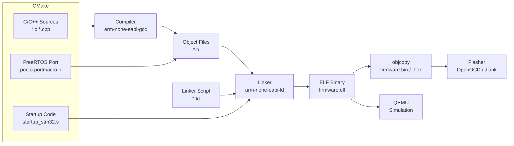
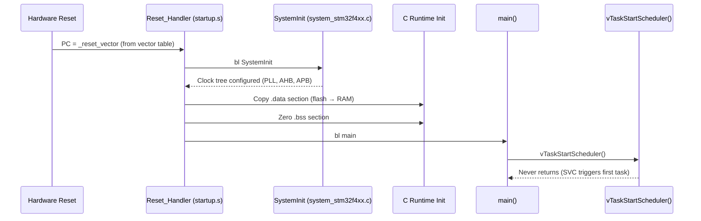

# :material-hammer-wrench: Day 10 — Build Systems & Board Bringup

!!! abstract "Day at a Glance"
    **Goal:** Build a FreeRTOS project from scratch using CMake, understand the startup code flow and linker script sections, and simulate on QEMU before touching real hardware.
    **Prerequisites:** Day 09 — Latency & Timing Analysis
    **Estimated Time:** 90 minutes

<div class="grid cards" markdown>
- :material-lightbulb-on: **Core Concept** — The BSP glues the RTOS port layer to your specific MCU; without it, the scheduler never starts
- :material-chip: **RTOS Component** — FreeRTOS port layer (`portmacro.h`, `port.c`), `configCPU_CLOCK_HZ`, startup code
- :material-alert: **Watch Out** — Wrong `configCPU_CLOCK_HZ` causes the tick rate to be off; a 1000 Hz tick at 80 MHz clock that thinks it's 168 MHz fires every 2.1 ms instead of 1 ms
- :material-check-circle: **By End of Day** — Build a FreeRTOS project with CMake, trace the Reset_Handler to main, and run it under QEMU
</div>

## :material-lightbulb-on: Intuition

!!! info "Core Idea"
    Every RTOS port is a thin hardware-abstraction layer: a context-switch routine in assembly, a tick timer ISR, and a handful of critical-section macros. The BSP sits on top and initializes clocks, memory, and peripherals before handing off to `main()`. Getting this initialization chain right is 80% of board bringup.

!!! success "Real-World Context"
    When Arm introduced the Cortex-M33 (TrustZone), every RTOS vendor had to port their context-switch code to handle the new security state. Companies that understood their port layer adapted in weeks; those treating it as a black box took months. Understanding the port layer is not optional for production embedded work.

## :material-pipe: Build Pipeline



## :material-book-open-variant: Lesson

### FreeRTOS Port Layer Structure

A FreeRTOS port consists of exactly three files:

| File | Purpose |
|---|---|
| `portmacro.h` | Type definitions, `portBASE_TYPE`, critical section macros |
| `port.c` | `vPortStartFirstTask()`, `xPortPendSVHandler()`, `xPortSysTickHandler()` |
| `portasm.s` (optional) | Context save/restore in assembly (Cortex-M uses `port.c` for this) |

For Cortex-M4F the port sets up:
- **PendSV** at lowest priority — performs context switch
- **SysTick** at lowest priority — RTOS tick interrupt
- **SVC** — used to start the first task

### CMakeLists.txt for a FreeRTOS Project

```cmake
cmake_minimum_required(VERSION 3.20)

# Toolchain must be set before project()
set(CMAKE_TOOLCHAIN_FILE "${CMAKE_SOURCE_DIR}/cmake/arm-none-eabi.cmake")

project(freertos_demo C ASM)

set(CMAKE_C_STANDARD 11)

# --- Target MCU flags ---
set(MCU_FLAGS
    -mcpu=cortex-m4
    -mthumb
    -mfpu=fpv4-sp-d16
    -mfloat-abi=hard
)

# --- FreeRTOS sources ---
set(FREERTOS_DIR ${CMAKE_SOURCE_DIR}/third_party/FreeRTOS/Source)

set(FREERTOS_SOURCES
    ${FREERTOS_DIR}/tasks.c
    ${FREERTOS_DIR}/queue.c
    ${FREERTOS_DIR}/list.c
    ${FREERTOS_DIR}/timers.c
    ${FREERTOS_DIR}/event_groups.c
    ${FREERTOS_DIR}/stream_buffer.c
    ${FREERTOS_DIR}/portable/GCC/ARM_CM4F/port.c
    ${FREERTOS_DIR}/portable/MemMang/heap_4.c
)

set(FREERTOS_INCLUDES
    ${FREERTOS_DIR}/include
    ${FREERTOS_DIR}/portable/GCC/ARM_CM4F
    ${CMAKE_SOURCE_DIR}/config   # FreeRTOSConfig.h lives here
)

# --- BSP sources ---
set(BSP_SOURCES
    ${CMAKE_SOURCE_DIR}/bsp/startup_stm32f407.s
    ${CMAKE_SOURCE_DIR}/bsp/system_stm32f4xx.c
    ${CMAKE_SOURCE_DIR}/bsp/bsp_clock.c
    ${CMAKE_SOURCE_DIR}/bsp/bsp_uart.c
)

# --- Application sources ---
set(APP_SOURCES
    ${CMAKE_SOURCE_DIR}/src/main.c
    ${CMAKE_SOURCE_DIR}/src/tasks.c
)

add_executable(firmware.elf
    ${APP_SOURCES}
    ${FREERTOS_SOURCES}
    ${BSP_SOURCES}
)

target_include_directories(firmware.elf PRIVATE
    ${FREERTOS_INCLUDES}
    ${CMAKE_SOURCE_DIR}/bsp/include
    ${CMAKE_SOURCE_DIR}/src
)

target_compile_options(firmware.elf PRIVATE
    ${MCU_FLAGS}
    -Wall -Wextra -Werror
    -ffunction-sections -fdata-sections
    -Os
)

target_link_options(firmware.elf PRIVATE
    ${MCU_FLAGS}
    -T${CMAKE_SOURCE_DIR}/bsp/stm32f407.ld
    -Wl,--gc-sections
    -Wl,-Map=firmware.map
    --specs=nosys.specs
    --specs=nano.specs
)

# --- Post-build: generate .bin for flashing ---
add_custom_command(TARGET firmware.elf POST_BUILD
    COMMAND arm-none-eabi-objcopy -O binary firmware.elf firmware.bin
    COMMAND arm-none-eabi-size firmware.elf
    COMMENT "Generating firmware.bin"
)
```

### CMake Toolchain File (`arm-none-eabi.cmake`)

```cmake
# cmake/arm-none-eabi.cmake
set(CMAKE_SYSTEM_NAME Generic)
set(CMAKE_SYSTEM_PROCESSOR arm)

set(TOOLCHAIN_PREFIX arm-none-eabi-)
set(CMAKE_C_COMPILER   ${TOOLCHAIN_PREFIX}gcc)
set(CMAKE_CXX_COMPILER ${TOOLCHAIN_PREFIX}g++)
set(CMAKE_ASM_COMPILER ${TOOLCHAIN_PREFIX}gcc)
set(CMAKE_OBJCOPY      ${TOOLCHAIN_PREFIX}objcopy)
set(CMAKE_SIZE         ${TOOLCHAIN_PREFIX}size)

# Prevent CMake from testing the compiler with a full link
set(CMAKE_TRY_COMPILE_TARGET_TYPE STATIC_LIBRARY)
```

### Startup Code Flow



### Linker Script Sections

```ld
/* stm32f407.ld — Simplified linker script */
MEMORY {
    FLASH (rx)  : ORIGIN = 0x08000000, LENGTH = 1024K
    SRAM  (rwx) : ORIGIN = 0x20000000, LENGTH = 128K
    CCMRAM (rw) : ORIGIN = 0x10000000, LENGTH = 64K
}

SECTIONS {
    /* Vector table MUST be first in FLASH */
    .isr_vector : {
        KEEP(*(.isr_vector))
    } > FLASH

    /* Code and read-only data */
    .text : {
        *(.text*)
        *(.rodata*)
        _etext = .;          /* End of flash content */
    } > FLASH

    /* Initialized data: stored in FLASH, copied to SRAM at startup */
    .data : {
        _sdata = .;          /* RAM start address */
        *(.data*)
        _edata = .;          /* RAM end address */
    } > SRAM AT > FLASH      /* LMA in FLASH, VMA in SRAM */
    _sidata = LOADADDR(.data); /* Flash load address */

    /* Uninitialized data: zeroed by startup code */
    .bss : {
        _sbss = .;
        *(.bss*)
        *(COMMON)
        _ebss = .;
    } > SRAM

    /* Stack grows downward from top of SRAM */
    _estack = ORIGIN(SRAM) + LENGTH(SRAM);
}
```

### Startup Code (Assembly Excerpt)

```asm
/* startup_stm32f407.s — essential portion */
    .syntax unified
    .cpu cortex-m4
    .thumb

    .section .isr_vector, "a", %progbits
    .word   _estack                 /* Initial stack pointer */
    .word   Reset_Handler           /* Reset vector */
    .word   NMI_Handler
    .word   HardFault_Handler
    /* ... more vectors ... */
    .word   PendSV_Handler          /* FreeRTOS context switch */
    .word   SysTick_Handler         /* FreeRTOS tick */

    .text
    .thumb_func
    .global Reset_Handler
Reset_Handler:
    /* 1. Copy .data from flash to SRAM */
    ldr     r0, =_sdata
    ldr     r1, =_edata
    ldr     r2, =_sidata
copy_loop:
    cmp     r0, r1
    ittt    lt
    ldrlt   r3, [r2], #4
    strlt   r3, [r0], #4
    blt     copy_loop

    /* 2. Zero .bss */
    ldr     r0, =_sbss
    ldr     r1, =_ebss
    mov     r2, #0
zero_loop:
    cmp     r0, r1
    itt     lt
    strlt   r2, [r0], #4
    blt     zero_loop

    /* 3. Call SystemInit then main */
    bl      SystemInit
    bl      main
    b       .              /* Trap if main returns */
```

### Running Under QEMU

QEMU's `mps2-an385` board emulates a Cortex-M3/M4 compatible target.

```bash
# Build for QEMU (no FPU, Cortex-M3 compatible)
cmake -DCMAKE_BUILD_TYPE=Debug \
      -DBOARD=qemu_mps2_an385 \
      -B build && cmake --build build

# Run with QEMU (semihosting for printf output)
qemu-system-arm \
    -machine mps2-an385 \
    -cpu cortex-m3 \
    -kernel build/firmware.elf \
    -nographic \
    -semihosting \
    -semihosting-config enable=on,target=native

# Run with GDB attached (debug session)
qemu-system-arm \
    -machine mps2-an385 \
    -cpu cortex-m3 \
    -kernel build/firmware.elf \
    -nographic \
    -semihosting \
    -S -gdb tcp::1234 &

arm-none-eabi-gdb build/firmware.elf \
    -ex "target remote :1234" \
    -ex "break main" \
    -ex "continue"
```

### Static Analysis with Clang-Tidy and Cppcheck

```cmake
# Add to CMakeLists.txt to enable clang-tidy on every build
find_program(CLANG_TIDY clang-tidy)
if(CLANG_TIDY)
    set_target_properties(firmware.elf PROPERTIES
        C_CLANG_TIDY "${CLANG_TIDY};--checks=cert-*,bugprone-*,clang-analyzer-*"
    )
endif()
```

```bash
# Standalone cppcheck run
cppcheck \
    --enable=all \
    --suppress=missingIncludeSystem \
    --inline-suppr \
    --std=c11 \
    -I config/ -I bsp/include/ -I third_party/FreeRTOS/Source/include/ \
    src/

# Output example:
# [src/tasks.c:42]: (error) Array 'buf[64]' accessed at index 64, which is out of bounds
```

## :material-pencil: Exercises

**Exercise 1 — Create a CMake FreeRTOS Project:**
Starting from an empty directory, set up the full CMake project structure for an STM32F407 + FreeRTOS application. Include: `cmake/arm-none-eabi.cmake`, `bsp/`, `config/FreeRTOSConfig.h`, `src/main.c`, and `CMakeLists.txt`. Verify it compiles to a `.elf` with `arm-none-eabi-size` showing sensible section sizes.

**Exercise 2 — Add a Custom BSP:**
Create `bsp/bsp_led.c` and `bsp/include/bsp_led.h` that initialize GPIOD pins 12–15 (STM32F4 Discovery LEDs) and expose `bsp_led_toggle(uint8_t led)`. Integrate it into CMakeLists.txt. Create a FreeRTOS task that blinks LED 0 at 1 Hz and LED 1 at 2 Hz using `vTaskDelayUntil`.

**Exercise 3 — Run Under QEMU:**
Adapt the project to target `qemu_mps2_an385`. Replace GPIO code with semihosting `printf`. Verify FreeRTOS tasks execute in QEMU by printing task names and tick counts. Add a second task and verify preemption by watching the interleaved output.

**Exercise 4 — Add Static Analysis:**
Introduce three intentional bugs: (a) a buffer overflow in a string copy, (b) a use-after-free of a malloc'd pointer, (c) a missing NULL check on `pvPortMalloc`. Enable cppcheck and clang-tidy in the build. Verify all three bugs are caught. Fix them and confirm the analysis is clean.

## :material-check: Solutions

??? success "Show Solutions"
    **Exercise 1 — Minimal CMake structure:**
    ```
    project/
    ├── cmake/arm-none-eabi.cmake
    ├── config/FreeRTOSConfig.h
    ├── bsp/
    │   ├── startup_stm32f407.s
    │   ├── system_stm32f4xx.c
    │   ├── stm32f407.ld
    │   └── include/
    ├── src/
    │   └── main.c
    ├── third_party/FreeRTOS/   (git submodule)
    └── CMakeLists.txt
    ```
    Build: `cmake -DCMAKE_BUILD_TYPE=Release -B build && cmake --build build -j4`

    **Exercise 2 — BSP LED header:**
    ```c
    /* bsp/include/bsp_led.h */
    #pragma once
    #include <stdint.h>

    void bsp_led_init(void);
    void bsp_led_on(uint8_t led);   /* led = 0..3 */
    void bsp_led_off(uint8_t led);
    void bsp_led_toggle(uint8_t led);
    ```

    **Exercise 3 — QEMU task output:**
    ```c
    void vTask1(void *p) {
        TickType_t xLast = xTaskGetTickCount();
        for (;;) {
            printf("[%lu] Task1 tick\n", (unsigned long)xTaskGetTickCount());
            vTaskDelayUntil(&xLast, pdMS_TO_TICKS(500));
        }
    }
    /* Compile with -DQEMU and link --specs=rdimon.specs for semihosting */
    ```

    **Exercise 4 — Intentional bug examples:**
    ```c
    /* Bug (a): buffer overflow */
    char buf[10];
    strcpy(buf, "This string is too long");  /* cppcheck: buffer overflow */

    /* Bug (b): use-after-free */
    uint8_t *p = pvPortMalloc(32);
    vPortFree(p);
    p[0] = 0xFF;  /* clang-tidy: use after free */

    /* Bug (c): missing NULL check */
    uint8_t *q = pvPortMalloc(1024);
    q[0] = 0;     /* cppcheck: possible null pointer dereference */
    ```

## :material-alert: Common Pitfalls

!!! warning "configCPU_CLOCK_HZ Must Match Reality"
    `configCPU_CLOCK_HZ` is used by the SysTick calculation to produce the correct tick rate. If your PLL is configured for 168 MHz but `configCPU_CLOCK_HZ` says 80 MHz, the tick fires every 2.1 ms instead of 1 ms — all timeouts will be 2.1× longer than expected. Always derive this constant from `SystemCoreClock` after `SystemInit()`.

!!! warning "Linker Script .data Section"
    If `_sidata` (the flash load address of `.data`) is not set correctly, the startup copy loop writes garbage values into SRAM. Any global variable with an initializer will have a wrong value. Symptom: correct behavior in debug (debugger loads RAM directly) but wrong behavior after reset.

!!! danger "Startup Code Must Run Before main()"
    Never write code in `main()` that depends on zero-initialized globals if the startup `.bss` zeroing is broken. On some bare-metal setups with wrong linker scripts, `.bss` is not zeroed and global structs contain random values. Always verify your linker script symbols `_sbss`/`_ebss` match the actual `.bss` section boundaries.

## :material-help-circle: Flashcards

???+ question "What three files constitute a FreeRTOS port?"
    Every FreeRTOS port requires: **(1) `portmacro.h`** — data types and critical section macros (`taskENTER_CRITICAL`, `portDISABLE_INTERRUPTS`); **(2) `port.c`** — context save/restore, `xPortSysTickHandler`, `vPortStartFirstTask`; **(3) `portasm.s`** (optional on Cortex-M, merged into port.c using inline assembly or CMSIS intrinsics).

???+ question "What does the linker AT keyword do in `.data : { } > SRAM AT > FLASH`?"
    It separates the **VMA** (Virtual Memory Address — where the CPU accesses the data at runtime, in SRAM) from the **LMA** (Load Memory Address — where the data is stored in the binary, in FLASH). At startup, `Reset_Handler` copies the initialized data from LMA (FLASH) to VMA (SRAM).

???+ question "Why does QEMU not require a real MCU for FreeRTOS development?"
    QEMU emulates the Cortex-M CPU, memory map, and basic peripherals (UART, timer) at the instruction level. FreeRTOS only needs a SysTick-equivalent timer and PendSV for context switching — both are emulated. You can run and debug FreeRTOS tasks entirely in software before any hardware is available.

???+ question "What does --gc-sections do in the linker and why is it important for embedded?"
    `--gc-sections` (garbage collect sections) removes any code or data section that is never referenced from the entry point. Combined with `-ffunction-sections -fdata-sections` (each function/variable in its own section), this can reduce firmware size by 10–40% by eliminating unused library functions and dead code.

## :material-clipboard-check: Self Test

=== "Question 1"
    After flashing, all global variables that should be 0 contain garbage values, but variables with explicit initializers (e.g., `int x = 5`) are correct. What is the most likely cause?

=== "Answer 1"
    The **`.bss` section zero-fill in the startup code is broken**. The `.bss` section (which holds zero-initialized and uninitialized globals) was not zeroed by `Reset_Handler`. Possible causes: `_sbss`/`_ebss` symbols are wrong in the linker script, the zero-fill loop was accidentally removed from startup code, or a wrong startup file was used.

    Fix: Check the linker script that `_sbss = .` and `_ebss = .` correctly bracket the `.bss` section. Verify the startup loop `while (_sbss < _ebss) *_sbss++ = 0` is present and referenced.

=== "Question 2"
    `arm-none-eabi-size firmware.elf` reports: text=48320, data=1024, bss=8192. How much FLASH and RAM does the firmware require?

=== "Answer 2"
    - **FLASH required:** `.text` + `.data` (data is stored in flash as LMA) = 48320 + 1024 = **49344 bytes (~48.2 KB)**
    - **RAM required at runtime:** `.data` (copied to SRAM) + `.bss` = 1024 + 8192 = **9216 bytes (~9 KB)**
    - Note: the FreeRTOS heap (`configTOTAL_HEAP_SIZE`) and stack (`_estack`) are additional RAM consumers not shown by `size` if they're defined as linker symbols rather than arrays.

## :material-check-circle: Summary

!!! success "Key Takeaways"
    - The **FreeRTOS port layer** is three files: `portmacro.h`, `port.c`, and (optionally) `portasm.s` — Cortex-M ports use SysTick + PendSV
    - **CMake** with a cross-compilation toolchain file is the modern standard for embedded; use `CMAKE_TOOLCHAIN_FILE` and `CMAKE_SYSTEM_NAME=Generic`
    - Startup flow: **Reset_Handler → copy .data → zero .bss → SystemInit → main → vTaskStartScheduler**
    - The **linker script AT keyword** separates load address (FLASH) from runtime address (SRAM) for initialized data
    - **QEMU** enables full FreeRTOS development and debugging before hardware is available
    - **cppcheck** and **clang-tidy** catch buffer overflows, null dereferences, and misra violations before they reach hardware
    - **Tomorrow (Day 11):** FreeRTOS deep dive — heap schemes 1–5, stream buffers, software timers, task notifications, and event groups
