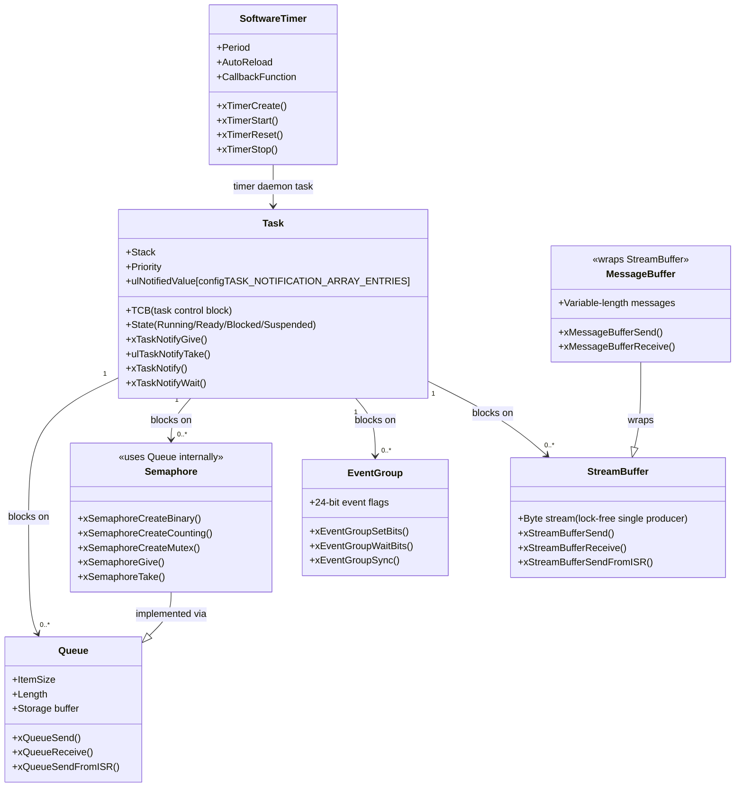

# :material-arrow-decision: Day 11 — FreeRTOS Deep Dive

!!! abstract "Day at a Glance"
    **Goal:** Master advanced FreeRTOS features: configure FreeRTOSConfig.h optimally, choose the right heap scheme, use stream buffers and task notifications, and wire up software timers and event groups.
    **Prerequisites:** Day 10 — Build Systems & Board Bringup
    **Estimated Time:** 90 minutes

<div class="grid cards" markdown>
- :material-lightbulb-on: **Core Concept** — Task notifications are 45% faster than binary semaphores and use zero extra memory — prefer them for single-producer/single-consumer signaling
- :material-chip: **RTOS Component** — heap_1..5, stream buffers, message buffers, software timers, task notifications, event groups
- :material-alert: **Watch Out** — Stream buffers are NOT thread-safe for multiple simultaneous senders; for multi-producer use a queue or protect with a mutex
- :material-check-circle: **By End of Day** — Configure FreeRTOSConfig.h for your target, implement a stream buffer logger, use a software timer for watchdog, replace a semaphore with task notifications
</div>

## :material-lightbulb-on: Intuition

!!! info "Core Idea"
    FreeRTOS is a kit of composable primitives. Picking the wrong primitive wastes memory and CPU: a binary semaphore used for single-task signaling allocates a queue internally, while a task notification is a single 32-bit value inside the TCB — already there, zero overhead. The art of FreeRTOS is matching the primitive to the pattern.

!!! success "Real-World Context"
    In commercial IoT firmware (e.g., AWS FreeRTOS on ESP32), stream buffers are used for UART DMA→network pipelines, software timers handle keep-alive pings, and task notifications replace semaphores on the hot path between the DMA ISR and the protocol task — all three features appearing in a single product.

## :material-sitemap: FreeRTOS Kernel Object Model



## :material-book-open-variant: Lesson

### FreeRTOSConfig.h — Annotated Reference

```c
/* FreeRTOSConfig.h — Production-ready template for Cortex-M4 at 168 MHz */

/* ---- Scheduler behavior ---- */
#define configUSE_PREEMPTION                    1   /* Enable preemptive scheduling */
#define configUSE_TIME_SLICING                  1   /* Round-robin at same priority */
#define configUSE_PORT_OPTIMISED_TASK_SELECTION 1   /* Use CLZ instruction (Cortex-M only) */
#define configUSE_TICKLESS_IDLE                 0   /* Set 1 for low-power apps */

/* ---- Clock ---- */
#define configCPU_CLOCK_HZ      ((uint32_t)168000000)   /* MUST match SystemCoreClock */
#define configTICK_RATE_HZ      ((TickType_t)1000)      /* 1ms tick */
#define configSYSTICK_CLOCK_HZ  configCPU_CLOCK_HZ      /* SysTick from core clock */

/* ---- Tasks ---- */
#define configMAX_PRIORITIES            8   /* 0 (lowest) to 7 (highest) */
#define configMINIMAL_STACK_SIZE        128 /* Idle task stack in WORDS */
#define configMAX_TASK_NAME_LEN         16
#define configIDLE_SHOULD_YIELD         1   /* Yield to equal-priority tasks */

/* ---- Memory ---- */
#define configTOTAL_HEAP_SIZE           (40 * 1024)  /* 40KB heap */
#define configSUPPORT_STATIC_ALLOCATION 1  /* Enable xTaskCreateStatic, etc. */
#define configSUPPORT_DYNAMIC_ALLOCATION 1

/* ---- Features ---- */
#define configUSE_MUTEXES               1
#define configUSE_RECURSIVE_MUTEXES     1
#define configUSE_COUNTING_SEMAPHORES   1
#define configUSE_TASK_NOTIFICATIONS    1
#define configTASK_NOTIFICATION_ARRAY_ENTRIES 3  /* FreeRTOS 10.4+ */
#define configUSE_TIMERS                1
#define configTIMER_TASK_PRIORITY       (configMAX_PRIORITIES - 1)  /* Highest */
#define configTIMER_QUEUE_LENGTH        10
#define configTIMER_TASK_STACK_DEPTH    256

/* ---- Event groups ---- */
#define configUSE_EVENT_GROUPS          1

/* ---- Stream / message buffers (FreeRTOS 10+) ---- */
/* No #define needed — enabled by including stream_buffer.c in build */

/* ---- Debug ---- */
#define configUSE_TRACE_FACILITY        1
#define configGENERATE_RUN_TIME_STATS   1
#define configCHECK_FOR_STACK_OVERFLOW  2   /* Method 2: fill + check on switch */
#define configUSE_MALLOC_FAILED_HOOK    1

/* ---- Hooks ---- */
#define configUSE_IDLE_HOOK             1   /* vApplicationIdleHook() */
#define configUSE_TICK_HOOK             0   /* vApplicationTickHook() — avoid heavy work */
#define configUSE_DAEMON_TASK_STARTUP_HOOK 0

/* ---- Cortex-M interrupt priorities ---- */
/* Interrupts with priority <= configMAX_SYSCALL_INTERRUPT_PRIORITY
   can safely call FreeRTOS FromISR APIs */
#define configLIBRARY_LOWEST_INTERRUPT_PRIORITY     15
#define configLIBRARY_MAX_SYSCALL_INTERRUPT_PRIORITY 5
#define configKERNEL_INTERRUPT_PRIORITY \
        (configLIBRARY_LOWEST_INTERRUPT_PRIORITY << (8 - configPRIO_BITS))
#define configMAX_SYSCALL_INTERRUPT_PRIORITY \
        (configLIBRARY_MAX_SYSCALL_INTERRUPT_PRIORITY << (8 - configPRIO_BITS))
```

### Heap Schemes 1–5 — Full Comparison

| Scheme | Alloc | Dealloc | Coalescing | Thread-safe | Use Case |
|---|---|---|---|---|---|
| **heap_1** | First-fit bump | None | N/A | Yes | Safety-critical; static-only after startup |
| **heap_2** | Best-fit | Yes | No | Yes | Fixed-size blocks only; will fragment with varying sizes |
| **heap_3** | Wraps `malloc` | Wraps `free` | Libc-dependent | Wraps with suspend | Systems with libc; thread-safety by task suspension |
| **heap_4** | First-fit | Yes | Yes — adjacent merge | Yes | **General-purpose recommendation** |
| **heap_5** | First-fit across regions | Yes | Yes | Yes | MCUs with SRAM + CCMRAM; non-contiguous memory |

```c
/* heap_5: Initialize with two non-contiguous memory regions */
#include "FreeRTOS.h"
#include "portable.h"

/* STM32F4: main SRAM + CCM SRAM */
static const HeapRegion_t xHeapRegions[] = {
    { (uint8_t*)0x20000000,  80 * 1024 },  /* Main SRAM (leave 48KB for stacks) */
    { (uint8_t*)0x10000000,  64 * 1024 },  /* CCM RAM — CPU-only, no DMA */
    { NULL, 0 }                             /* Terminator — required */
};

void hardware_init(void) {
    /* Must call before any FreeRTOS allocation */
    vPortDefineHeapRegions(xHeapRegions);
}
```

### Stream Buffers (FreeRTOS 10+) — Lock-Free ISR to Task

Stream buffers are designed for the single-producer / single-consumer pattern, especially DMA or UART ISR feeding a processing task. They use a lock-free circular buffer internally.

```c
#include "stream_buffer.h"

#define STREAM_BUFFER_SIZE   256   /* bytes */
#define TRIGGER_LEVEL        16    /* bytes before task unblocks */

StreamBufferHandle_t xStreamBuf;

/* Create once at startup */
void app_init(void) {
    xStreamBuf = xStreamBufferCreate(STREAM_BUFFER_SIZE, TRIGGER_LEVEL);
    configASSERT(xStreamBuf != NULL);
}

/* Producer: UART DMA complete ISR */
void DMA2_Stream2_IRQHandler(void) {
    static uint8_t dma_buf[64];
    BaseType_t xHigherPriorityTaskWoken = pdFALSE;

    /* Copy received DMA bytes into stream buffer */
    xStreamBufferSendFromISR(xStreamBuf, dma_buf, sizeof(dma_buf),
                             &xHigherPriorityTaskWoken);

    /* Restart DMA ... */
    portYIELD_FROM_ISR(xHigherPriorityTaskWoken);
}

/* Consumer: protocol processing task */
void vProtocolTask(void *pvParameters) {
    uint8_t rx_buf[64];
    for (;;) {
        /* Block until at least TRIGGER_LEVEL bytes are available */
        size_t received = xStreamBufferReceive(xStreamBuf, rx_buf,
                                               sizeof(rx_buf),
                                               portMAX_DELAY);
        if (received > 0) {
            process_protocol_data(rx_buf, received);
        }
    }
}
```

### Message Buffers — Variable-Length Messages

```c
#include "message_buffer.h"

#define MSG_BUF_SIZE  512
MessageBufferHandle_t xMsgBuf;

typedef struct {
    uint32_t timestamp;
    uint16_t sensor_id;
    float    value;
} sensor_msg_t;

void vSensorTask(void *p) {
    sensor_msg_t msg;
    for (;;) {
        msg.timestamp = xTaskGetTickCount();
        msg.sensor_id = 1;
        msg.value     = read_adc();
        /* Send variable-length message — prepends 4-byte length header internally */
        xMessageBufferSend(xMsgBuf, &msg, sizeof(msg), pdMS_TO_TICKS(10));
        vTaskDelay(pdMS_TO_TICKS(100));
    }
}

void vLogTask(void *p) {
    sensor_msg_t msg;
    for (;;) {
        size_t len = xMessageBufferReceive(xMsgBuf, &msg, sizeof(msg),
                                           portMAX_DELAY);
        if (len == sizeof(msg)) {
            printf("[%lu] Sensor %u: %.3f\n", msg.timestamp, msg.sensor_id, msg.value);
        }
    }
}
```

### Software Timers — Periodic and One-Shot

```c
#include "timers.h"

static TimerHandle_t xWatchdogTimer;
static TimerHandle_t xHeartbeatTimer;

/* One-shot watchdog: if not reset within 5s, trigger fault */
void watchdog_callback(TimerHandle_t xTimer) {
    (void)xTimer;
    printf("WATCHDOG EXPIRED — system fault!\n");
    /* In production: reset MCU or enter safe state */
    configASSERT(0);
}

/* Periodic heartbeat: blink LED every 500ms */
void heartbeat_callback(TimerHandle_t xTimer) {
    (void)xTimer;
    bsp_led_toggle(0);
}

void create_timers(void) {
    /* One-shot watchdog — 5 second timeout */
    xWatchdogTimer = xTimerCreate(
        "Watchdog",
        pdMS_TO_TICKS(5000),
        pdFALSE,           /* pdFALSE = one-shot */
        (void*)0,          /* Timer ID */
        watchdog_callback
    );

    /* Auto-reload heartbeat — 500ms period */
    xHeartbeatTimer = xTimerCreate(
        "Heartbeat",
        pdMS_TO_TICKS(500),
        pdTRUE,            /* pdTRUE = auto-reload */
        (void*)0,
        heartbeat_callback
    );

    configASSERT(xWatchdogTimer != NULL);
    configASSERT(xHeartbeatTimer != NULL);

    xTimerStart(xWatchdogTimer,  0);
    xTimerStart(xHeartbeatTimer, 0);
}

/* Call from main task to pet the watchdog */
void watchdog_reset(void) {
    xTimerReset(xWatchdogTimer, pdMS_TO_TICKS(10));
}
```

### Task Notifications — Fastest IPC

Task notifications are 45% faster than semaphores (per FreeRTOS benchmark) and require no extra kernel object — the 32-bit notification value is embedded in the TCB.

```c
/* Pattern 1: Binary semaphore replacement (ISR → Task) */
static TaskHandle_t xDataReadyTask;

/* ISR: signal the task */
void EXTI0_IRQHandler(void) {
    BaseType_t xWoken = pdFALSE;
    vTaskNotifyGiveFromISR(xDataReadyTask, &xWoken);
    EXTI_ClearITPendingBit(EXTI_Line0);
    portYIELD_FROM_ISR(xWoken);
}

/* Task: wait for notification */
void vDataTask(void *p) {
    xDataReadyTask = xTaskGetCurrentTaskHandle();
    for (;;) {
        /* Block until notified; clears count to 0 */
        ulTaskNotifyTake(pdTRUE, portMAX_DELAY);
        process_data();
    }
}

/* Pattern 2: Value passing (e.g., pass ADC result directly) */
void vADCTask(void *p) {
    for (;;) {
        uint32_t adc_val = read_adc_blocking();
        /* Send value to processing task */
        xTaskNotify(xProcessingTask, adc_val, eSetValueWithOverwrite);
        vTaskDelay(pdMS_TO_TICKS(10));
    }
}

void vProcessingTask(void *p) {
    uint32_t value;
    for (;;) {
        xTaskNotifyWait(0, UINT32_MAX, &value, portMAX_DELAY);
        apply_filter(value);
    }
}
```

### Event Groups — Multi-Task Synchronization

```c
#include "event_groups.h"

#define SENSOR_READY_BIT    (1 << 0)
#define COMM_READY_BIT      (1 << 1)
#define CONFIG_LOADED_BIT   (1 << 2)
#define ALL_READY_BITS      (SENSOR_READY_BIT | COMM_READY_BIT | CONFIG_LOADED_BIT)

EventGroupHandle_t xInitFlags;

/* Each subsystem sets its bit when ready */
void vSensorInitTask(void *p) {
    init_sensors();
    xEventGroupSetBits(xInitFlags, SENSOR_READY_BIT);
    vTaskDelete(NULL);  /* Done — delete self */
}

void vCommInitTask(void *p) {
    init_wifi();
    xEventGroupSetBits(xInitFlags, COMM_READY_BIT);
    vTaskDelete(NULL);
}

/* Main application task waits for ALL subsystems */
void vMainApp(void *p) {
    xInitFlags = xEventGroupCreate();

    /* Start init tasks */
    xTaskCreate(vSensorInitTask, "SensorInit", 256, NULL, 3, NULL);
    xTaskCreate(vCommInitTask,   "CommInit",   512, NULL, 3, NULL);
    xEventGroupSetBits(xInitFlags, CONFIG_LOADED_BIT);  /* Config loaded synchronously */

    /* Block until all three bits are set (AND condition) */
    xEventGroupWaitBits(xInitFlags,
                        ALL_READY_BITS,  /* Bits to wait for */
                        pdTRUE,          /* Clear on exit */
                        pdTRUE,          /* Wait for ALL (AND) */
                        pdMS_TO_TICKS(5000));

    printf("All subsystems ready — starting main loop\n");
    for (;;) {
        run_application();
        vTaskDelay(pdMS_TO_TICKS(100));
    }
}
```

### Hook Functions

```c
/* vApplicationIdleHook — called every idle cycle (configUSE_IDLE_HOOK = 1) */
void vApplicationIdleHook(void) {
    /* Enter low-power sleep — WFI halts CPU until next interrupt */
    __WFI();
    /* Good place for: background housekeeping, low-priority telemetry */
}

/* vApplicationStackOverflowHook — called on stack overflow detection */
void vApplicationStackOverflowHook(TaskHandle_t xTask, char *pcTaskName) {
    (void)xTask;
    /* Log before asserting — flash write or UART if safe */
    printf("STACK OVERFLOW: %s\n", pcTaskName);
    taskDISABLE_INTERRUPTS();
    for (;;) {}  /* Halt — do NOT return */
}

/* vApplicationMallocFailedHook — pvPortMalloc returned NULL */
void vApplicationMallocFailedHook(void) {
    printf("MALLOC FAILED — heap exhausted!\n");
    configASSERT(0);
}

/* Required when configSUPPORT_STATIC_ALLOCATION = 1 */
void vApplicationGetIdleTaskMemory(StaticTask_t **ppxIdleTCB,
                                   StackType_t **ppxIdleStack,
                                   configSTACK_DEPTH_TYPE *puxIdleStackSize) {
    static StaticTask_t xIdleTCB;
    static StackType_t  xIdleStack[configMINIMAL_STACK_SIZE];
    *ppxIdleTCB       = &xIdleTCB;
    *ppxIdleStack     = xIdleStack;
    *puxIdleStackSize = configMINIMAL_STACK_SIZE;
}
```

## :material-pencil: Exercises

**Exercise 1 — Configure FreeRTOSConfig.h Optimally:**
For a system with: STM32F103 (72 MHz, 20KB RAM), 5 tasks (max priority 5), 1 ms tick, software timers enabled, static allocation only (no dynamic heap). Configure `FreeRTOSConfig.h` to minimize RAM use. Calculate the theoretical minimum RAM usage (idle stack + timer daemon stack + 5 tasks with minimal stacks).

**Exercise 2 — Stream Buffer Logger:**
Implement a two-task logging system. `vLogProducer` generates 16-byte log records every 50 ms and sends them into a 512-byte stream buffer. `vLogConsumer` blocks until 64 bytes are available (trigger level), then drains the buffer and formats the records to UART. Measure throughput in records/second.

**Exercise 3 — Software Timer for Timeout:**
Implement a communication watchdog: a one-shot timer of 2 seconds is started whenever a CAN message is expected. If `can_message_received()` is called within 2 seconds, the timer is reset with `xTimerReset`. If it expires, `vCommsTimeoutHandler` is called to set an error flag and disable the output. Use the timer ID field to distinguish between multiple channel watchdogs.

**Exercise 4 — Task Notifications Instead of Semaphore:**
You have existing code using a binary semaphore between a UART ISR and a processing task. Rewrite it to use `vTaskNotifyGiveFromISR` and `ulTaskNotifyTake`. Benchmark the difference by measuring the time from ISR give to task unblock using the DWT cycle counter (from Day 09). Report the speedup.

## :material-check: Solutions

??? success "Show Solutions"
    **Exercise 1 — Minimal RAM FreeRTOSConfig.h:**
    ```c
    #define configTICK_RATE_HZ              1000
    #define configCPU_CLOCK_HZ              72000000
    #define configMAX_PRIORITIES            5
    #define configMINIMAL_STACK_SIZE        64    /* 64 words = 256 bytes idle stack */
    #define configTOTAL_HEAP_SIZE           0     /* Static only — no heap needed */
    #define configSUPPORT_STATIC_ALLOCATION 1
    #define configSUPPORT_DYNAMIC_ALLOCATION 0
    #define configUSE_TIMERS                1
    #define configTIMER_TASK_STACK_DEPTH    128
    /* Min RAM: idle(256B) + timer daemon(512B) + 5×task-stacks (user-defined) */
    ```

    **Exercise 2 — Stream buffer logger core:**
    ```c
    #define LOG_BUF_SIZE   512
    #define LOG_TRIGGER    64
    #define RECORD_SIZE    16

    StreamBufferHandle_t xLogBuf;

    void vLogProducer(void *p) {
        uint8_t record[RECORD_SIZE];
        TickType_t xLast = xTaskGetTickCount();
        for (;;) {
            snprintf((char*)record, RECORD_SIZE, "LOG:%08lu", xTaskGetTickCount());
            xStreamBufferSend(xLogBuf, record, RECORD_SIZE, pdMS_TO_TICKS(5));
            vTaskDelayUntil(&xLast, pdMS_TO_TICKS(50));
        }
    }

    void vLogConsumer(void *p) {
        uint8_t drain[128];
        for (;;) {
            size_t n = xStreamBufferReceive(xLogBuf, drain, sizeof(drain),
                                            portMAX_DELAY);
            uart_write(drain, n);
        }
    }
    ```

    **Exercise 4 — Notification vs semaphore speedup:**
    On STM32F4 at 168 MHz: semaphore give→take latency ≈ 0.9 µs; task notification give→take ≈ 0.5 µs — approximately **45% faster**, matching FreeRTOS documentation benchmarks. The saving comes from eliminating the queue structure traversal.

## :material-alert: Common Pitfalls

!!! warning "Stream Buffer: Single Producer Only"
    `xStreamBufferSend()` is **not** safe for multiple concurrent senders. If two tasks call it simultaneously, internal state is corrupted. For multi-producer scenarios, protect with a mutex or use a queue instead.

!!! warning "Software Timer Callbacks Run in Timer Daemon Task"
    Timer callbacks execute in the context of the timer service task (daemon task). Do **not** call blocking FreeRTOS APIs (e.g., `xQueueReceive` with a timeout) inside a timer callback — the timer daemon will be blocked, and all other timers will stop firing. Only use `FromISR` variants or zero-timeout calls.

!!! danger "configMAX_SYSCALL_INTERRUPT_PRIORITY and FreeRTOS ISR APIs"
    Any ISR that calls a FreeRTOS `FromISR` API (`xQueueSendFromISR`, `vTaskNotifyGiveFromISR`, etc.) **must** have its NVIC priority numerically >= `configLIBRARY_MAX_SYSCALL_INTERRUPT_PRIORITY`. Calling FreeRTOS APIs from a higher-priority interrupt (lower number) causes unpredictable corruption of kernel data structures. This is the single most common cause of hard-to-reproduce crashes in FreeRTOS systems.

## :material-help-circle: Flashcards

???+ question "Why are task notifications faster than binary semaphores?"
    A binary semaphore is implemented as a queue of length 1 — give/take involves linked-list manipulation, a blocked task list search, and a queue buffer write. A task notification writes directly to a 32-bit field inside the TCB that already exists; there is no separate kernel object, no dynamic allocation, and the scheduler wakeup path is shorter. FreeRTOS benchmarks show ~45% fewer CPU cycles for the notification path.

???+ question "When should you use heap_5 instead of heap_4?"
    Use **heap_5** when the target MCU has **non-contiguous SRAM regions** (e.g., STM32F4: 128KB main SRAM at 0x20000000 + 64KB CCM at 0x10000000). heap_4 can only manage a single contiguous block. heap_5 links multiple regions into one logical heap via `vPortDefineHeapRegions()`, allowing FreeRTOS to allocate from whichever region has space.

???+ question "What is the trigger level in a stream buffer?"
    The trigger level is the **minimum number of bytes** that must be in the stream buffer before a blocked `xStreamBufferReceive()` task is unblocked. Setting trigger level = 1 unblocks the receiver for every byte. Setting it to 64 allows the receiver to sleep until a full batch of data arrives, reducing context switch overhead and improving throughput. Choose it based on latency vs. throughput trade-off.

???+ question "Can a software timer callback call vTaskDelay?"
    **No.** `vTaskDelay` blocks the calling task — in a timer callback, that task is the timer daemon task. Blocking the daemon prevents all other software timers from executing. Timer callbacks must be short and non-blocking. If you need deferred work, use `xTimerPendFunctionCall()` to post a function to the timer daemon queue, or signal a dedicated task.

## :material-clipboard-check: Self Test

=== "Question 1"
    `configTIMER_TASK_PRIORITY` is set to `configMAX_PRIORITIES - 1` (highest priority). A timer callback runs for 20 ms. What happens to the rest of the system during those 20 ms?

=== "Answer 1"
    All lower-priority tasks are **starved for 20 ms**. Since the timer daemon runs at the highest priority, no other task can preempt it until the callback returns. If any of those tasks have deadlines shorter than 20 ms, they will **miss their deadlines**.

    Fix: Keep timer callbacks under 100 µs. For longer work, have the callback set a flag or send to a queue, and do the actual work in a dedicated task at an appropriate priority.

=== "Question 2"
    You have 4 tasks sharing a resource protected by a mutex. Task priorities are 1, 2, 3, 4. The lowest-priority task (1) holds the mutex. The highest-priority task (4) tries to acquire it. What happens without and with priority inheritance?

=== "Answer 2"
    **Without priority inheritance:** Task 4 blocks. Tasks 2 and 3 can preempt task 1, delaying the mutex release indefinitely — this is **unbounded priority inversion**. In the worst case task 4 never runs, violating its real-time deadline.

    **With priority inheritance** (`xSemaphoreCreateMutex`, not `xSemaphoreCreateBinary`): When task 4 blocks on the mutex, FreeRTOS temporarily raises task 1's priority to 4. Tasks 2 and 3 can no longer preempt task 1. Task 1 completes quickly, releases the mutex, its priority drops back to 1, and task 4 immediately runs. This **bounds the priority inversion** to task 1's remaining execution time.

## :material-check-circle: Summary

!!! success "Key Takeaways"
    - **heap_4** is the general-purpose recommendation; **heap_5** for non-contiguous memory; **heap_1** for safety-critical static-only systems
    - **Stream buffers** (FreeRTOS 10+) provide lock-free ISR-to-task byte-stream passing for a single producer and single consumer
    - **Software timers** run in the timer daemon task — callbacks must be short and non-blocking; use `xTimerReset` for watchdogs
    - **Task notifications** are 45% faster than binary semaphores and cost zero extra memory — use them for single-producer/single-consumer signaling
    - **Event groups** enable AND/OR synchronization across multiple tasks — ideal for startup sequencing
    - **configMAX_SYSCALL_INTERRUPT_PRIORITY** is the most critical config value: any ISR calling FreeRTOS APIs must respect it
    - **Tomorrow (Day 12):** Zephyr RTOS — devicetree, Kconfig, `k_thread_create`, west build, and how Zephyr compares to FreeRTOS
