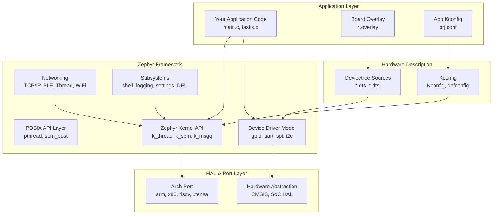

# :material-lightning-bolt: Day 12 — Zephyr RTOS

!!! abstract "Day at a Glance"
    **Goal:** Understand Zephyr's layered architecture, create threads and synchronization primitives, blink an LED via devicetree, and compare the Zephyr API to FreeRTOS.
    **Prerequisites:** Day 11 — FreeRTOS Deep Dive
    **Estimated Time:** 90 minutes

<div class="grid cards" markdown>
- :material-lightbulb-on: **Core Concept** — Zephyr separates hardware description (devicetree) from software behavior (Kconfig) — you never hardcode register addresses in application code
- :material-chip: **RTOS Component** — `k_thread_create`, `k_sem`, `k_mutex`, `k_msgq`, `k_work`, devicetree, Kconfig, west
- :material-alert: **Watch Out** — Zephyr's `k_sleep(K_MSEC(n))` is analogous to FreeRTOS `vTaskDelay` — it does NOT use `vTaskDelayUntil`-style absolute timing; use `k_timer` for jitter-free periodic tasks
- :material-check-circle: **By End of Day** — Build a Zephyr hello-world, implement producer-consumer with `k_msgq`, blink an LED via devicetree overlay, and add a custom Kconfig option
</div>

## :material-lightbulb-on: Intuition

!!! info "Core Idea"
    In FreeRTOS, you write `GPIO_SetBits(GPIOD, GPIO_PIN_12)` — a hardcoded register call tied to one specific MCU. In Zephyr, you write `gpio_pin_set_dt(&led, 1)` where `led` comes from the devicetree overlay. The same application binary compiles for STM32, Nordic nRF52, and NXP i.MX RT — just by changing the board target and overlay. This is the fundamental design difference.

!!! success "Real-World Context"
    Nordic Semiconductor's nRF Connect SDK (used in all nRF52/nRF53/nRF91 products) is built entirely on Zephyr. Any Bluetooth Low Energy + RTOS product targeting the nRF series is effectively a Zephyr project — understanding Zephyr's primitives is mandatory for modern IoT firmware development.

## :material-layers: Zephyr Architecture



## :material-book-open-variant: Lesson

### Thread Creation

```c
#include <zephyr/kernel.h>

#define STACK_SIZE   1024
#define THREAD_PRIO  5     /* Higher number = lower priority in Zephyr */

/* Static stack allocation — recommended */
K_THREAD_STACK_DEFINE(sensor_stack, STACK_SIZE);
K_THREAD_STACK_DEFINE(logger_stack, STACK_SIZE);

struct k_thread sensor_thread_data;
struct k_thread logger_thread_data;

k_tid_t sensor_tid;
k_tid_t logger_tid;

void sensor_entry(void *p1, void *p2, void *p3) {
    ARG_UNUSED(p1); ARG_UNUSED(p2); ARG_UNUSED(p3);
    while (1) {
        printk("Sensor reading: %d\n", read_sensor());
        k_sleep(K_MSEC(100));
    }
}

void logger_entry(void *p1, void *p2, void *p3) {
    ARG_UNUSED(p1); ARG_UNUSED(p2); ARG_UNUSED(p3);
    while (1) {
        printk("Logger tick: %lld ms\n", k_uptime_get());
        k_sleep(K_MSEC(1000));
    }
}

int main(void) {
    sensor_tid = k_thread_create(
        &sensor_thread_data,
        sensor_stack,
        K_THREAD_STACK_SIZEOF(sensor_stack),
        sensor_entry,
        NULL, NULL, NULL,    /* p1, p2, p3 — passed to entry function */
        THREAD_PRIO,         /* Priority */
        0,                   /* Options (K_FP_REGS for FPU, K_USER for user mode) */
        K_NO_WAIT            /* Start immediately */
    );

    logger_tid = k_thread_create(
        &logger_thread_data, logger_stack,
        K_THREAD_STACK_SIZEOF(logger_stack),
        logger_entry, NULL, NULL, NULL,
        THREAD_PRIO + 1,     /* Lower priority than sensor */
        0, K_NO_WAIT
    );

    /* Optional: name threads for Zephyr shell / SystemView */
    k_thread_name_set(sensor_tid, "sensor");
    k_thread_name_set(logger_tid, "logger");

    return 0;
}
```

### Semaphores and Mutexes

```c
#include <zephyr/kernel.h>

/* Binary semaphore (initial count 0, max 1) */
K_SEM_DEFINE(data_ready_sem, 0, 1);

/* Counting semaphore (initial=5 slots, max=5) */
K_SEM_DEFINE(pool_sem, 5, 5);

/* Mutex with priority inheritance */
K_MUTEX_DEFINE(shared_buf_mutex);

/* ISR context — use k_sem_give (safe from ISR in Zephyr) */
void gpio_callback(const struct device *dev, struct gpio_callback *cb, uint32_t pins) {
    k_sem_give(&data_ready_sem);   /* Wake waiting task */
}

void vProcessorThread(void *p1, void *p2, void *p3) {
    while (1) {
        /* Block until ISR signals data ready */
        k_sem_take(&data_ready_sem, K_FOREVER);

        /* Protect shared buffer with mutex */
        k_mutex_lock(&shared_buf_mutex, K_FOREVER);
        process_shared_data();
        k_mutex_unlock(&shared_buf_mutex);
    }
}
```

### Message Queues (`k_msgq`)

```c
#include <zephyr/kernel.h>

typedef struct {
    uint32_t timestamp_ms;
    uint8_t  sensor_id;
    float    value;
} sensor_data_t;

/* Static message queue: 10 items of type sensor_data_t */
K_MSGQ_DEFINE(sensor_queue, sizeof(sensor_data_t), 10, 4);
/*                           ^item size             ^max ^alignment */

/* Producer thread */
void vSensorThread(void *p1, void *p2, void *p3) {
    sensor_data_t data;
    while (1) {
        data.timestamp_ms = k_uptime_get_32();
        data.sensor_id    = 1;
        data.value        = read_adc_normalized();

        /* Send — K_NO_WAIT drops if queue full, K_FOREVER blocks */
        int ret = k_msgq_put(&sensor_queue, &data, K_MSEC(10));
        if (ret == -EAGAIN) {
            printk("Queue full — dropping sample\n");
        }

        k_sleep(K_MSEC(50));
    }
}

/* Consumer thread */
void vDisplayThread(void *p1, void *p2, void *p3) {
    sensor_data_t data;
    while (1) {
        /* Block until a message is available */
        k_msgq_get(&sensor_queue, &data, K_FOREVER);
        printk("[%u ms] Sensor %u: %.3f\n",
               data.timestamp_ms, data.sensor_id, (double)data.value);
    }
}
```

### Work Queues (`k_work`)

Work queues defer processing from ISR context to a thread context — analogous to Linux bottom halves.

```c
#include <zephyr/kernel.h>

/* Deferred work item — runs in system work queue thread */
static struct k_work process_packet_work;

static void process_packet_handler(struct k_work *work) {
    ARG_UNUSED(work);
    /* Safe to call blocking APIs here — we're in thread context */
    uint8_t buf[64];
    int len = uart_fifo_read(uart_dev, buf, sizeof(buf));
    if (len > 0) {
        protocol_parse(buf, len);
    }
}

/* ISR: schedule deferred work instead of processing inline */
void uart_isr_callback(const struct device *dev, void *user_data) {
    ARG_UNUSED(user_data);
    if (uart_irq_rx_ready(dev)) {
        /* Don't process here — schedule work item */
        k_work_submit(&process_packet_work);
    }
}

/* Delayed work: like a software timer that runs work queue item */
static struct k_work_delayable keepalive_work;

static void send_keepalive(struct k_work *work) {
    transmit_keepalive_packet();
    /* Re-schedule for next interval */
    k_work_schedule(&keepalive_work, K_SECONDS(30));
}

int main(void) {
    k_work_init(&process_packet_work, process_packet_handler);
    k_work_init_delayable(&keepalive_work, send_keepalive);
    k_work_schedule(&keepalive_work, K_SECONDS(30));  /* First fire in 30s */
    /* ... */
    return 0;
}
```

### Devicetree Overlays — LED Blink

In Zephyr, hardware resources are described in devicetree. Application code references nodes by alias, not by register address.

```dts
/* boards/my_board.overlay — adds an LED alias */
/ {
    aliases {
        led0 = &user_led;
    };

    leds {
        compatible = "gpio-leds";
        user_led: led_0 {
            gpios = <&gpiod 12 GPIO_ACTIVE_HIGH>;
            label = "User LED";
        };
    };
};
```

```c
/* src/main.c — board-agnostic LED blink */
#include <zephyr/kernel.h>
#include <zephyr/drivers/gpio.h>

/* DT_ALIAS resolves "led0" to the devicetree node */
#define LED0_NODE DT_ALIAS(led0)

static const struct gpio_dt_spec led = GPIO_DT_SPEC_GET(LED0_NODE, gpios);

int main(void) {
    int ret;

    if (!gpio_is_ready_dt(&led)) {
        printk("LED GPIO not ready\n");
        return -ENODEV;
    }

    ret = gpio_pin_configure_dt(&led, GPIO_OUTPUT_ACTIVE);
    if (ret < 0) {
        printk("GPIO configure failed: %d\n", ret);
        return ret;
    }

    while (1) {
        gpio_pin_toggle_dt(&led);
        k_sleep(K_MSEC(500));
    }

    return 0;
}
```

### Kconfig — Feature Configuration

```kconfig
# Kconfig — application configuration options
config MY_SENSOR_ENABLE
    bool "Enable sensor subsystem"
    default y
    help
      Enable the sensor reading and filtering subsystem.
      Disable to reduce code size on memory-constrained targets.

config MY_SENSOR_SAMPLE_RATE_HZ
    int "Sensor sample rate in Hz"
    default 100
    range 1 1000
    depends on MY_SENSOR_ENABLE
    help
      Sample rate for the ADC sensor. Higher rates increase CPU load.

config MY_LOG_LEVEL
    int "Application log level"
    default 3
    range 0 4
    help
      0=none, 1=error, 2=warn, 3=info, 4=debug
```

```ini
# prj.conf — project Kconfig fragment (selects and overrides)
CONFIG_MY_SENSOR_ENABLE=y
CONFIG_MY_SENSOR_SAMPLE_RATE_HZ=200
CONFIG_MY_LOG_LEVEL=3

# Enable Zephyr logging subsystem
CONFIG_LOG=y
CONFIG_LOG_DEFAULT_LEVEL=3

# Enable shell over UART (useful for debugging)
CONFIG_SHELL=y
CONFIG_SHELL_BACKEND_SERIAL=y
```

```c
/* Access Kconfig values in code */
#include <zephyr/kernel.h>

#ifdef CONFIG_MY_SENSOR_ENABLE
void sensor_task_entry(void *p1, void *p2, void *p3) {
    const int rate_ms = 1000 / CONFIG_MY_SENSOR_SAMPLE_RATE_HZ;
    while (1) {
        sample_sensor();
        k_sleep(K_MSEC(rate_ms));
    }
}
#endif
```

### West Build System

```bash
# Initialize workspace (one time)
west init -m https://github.com/zephyrproject-rtos/zephyr --mr v3.6.0 zephyrproject
cd zephyrproject && west update

# Build for a specific board
west build -b nrf52840dk/nrf52840 app/

# Build with a custom overlay
west build -b stm32f4_disco app/ -- -DDTC_OVERLAY_FILE=boards/my_board.overlay

# Build with extra Kconfig fragment
west build -b nucleo_f446re app/ -- -DEXTRA_CONF_FILE=debug.conf

# Flash to hardware
west flash

# Open serial debug console
west espressif monitor   # or minicom / screen

# Run under QEMU (native_sim or qemu_cortex_m3 board)
west build -b qemu_cortex_m3 app/
west build -t run

# Run unit tests with Twister
west twister -T tests/ -p qemu_cortex_m3 --inline-logs
```

### Zephyr vs FreeRTOS API Comparison

| Concept | FreeRTOS API | Zephyr API |
|---|---|---|
| Thread creation | `xTaskCreate()` | `k_thread_create()` |
| Thread sleep (relative) | `vTaskDelay(pdMS_TO_TICKS(n))` | `k_sleep(K_MSEC(n))` |
| Thread sleep (absolute) | `vTaskDelayUntil(&last, n)` | `k_timer` + `k_timer_status_sync()` |
| Binary semaphore give | `xSemaphoreGive(sem)` | `k_sem_give(&sem)` |
| Binary semaphore take | `xSemaphoreTake(sem, timeout)` | `k_sem_take(&sem, K_MSEC(t))` |
| Mutex lock | `xSemaphoreTake(mutex, delay)` | `k_mutex_lock(&mtx, K_FOREVER)` |
| Mutex unlock | `xSemaphoreGive(mutex)` | `k_mutex_unlock(&mtx)` |
| Queue send | `xQueueSend(q, &item, delay)` | `k_msgq_put(&q, &item, K_MSEC(t))` |
| Queue receive | `xQueueReceive(q, &item, delay)` | `k_msgq_get(&q, &item, K_FOREVER)` |
| Software timer | `xTimerCreate(...)` | `k_timer_init(...)` |
| Deferred ISR work | Not built-in (use task+semaphore) | `k_work_submit(&work)` |
| Heap alloc | `pvPortMalloc(n)` | `k_malloc(n)` |
| Heap free | `vPortFree(p)` | `k_free(p)` |
| GPIO (board-specific) | `GPIO_SetBits(...)` (HAL) | `gpio_pin_set_dt(&spec, val)` |
| Config system | `FreeRTOSConfig.h` | `prj.conf` + `Kconfig` |
| Build system | CMake (manual) | `west build -b <board>` |
| Hardware description | None (hardcoded) | Devicetree (`.dts` / `.overlay`) |

## :material-pencil: Exercises

**Exercise 1 — Zephyr Hello World:**
Create a Zephyr application from scratch: `prj.conf`, `CMakeLists.txt`, `src/main.c`. Create two threads: one printing "Thread A" every 500 ms, another printing "Thread B" every 1000 ms. Build for `qemu_cortex_m3` with `west build -b qemu_cortex_m3` and run with `west build -t run`. Confirm interleaved output.

**Exercise 2 — Producer-Consumer with `k_msgq`:**
Implement a temperature monitoring system with two threads. The producer samples a fake temperature (use a counter + some variation) every 200 ms and puts it into a `K_MSGQ_DEFINE` queue. The consumer reads from the queue and computes a rolling average of the last 5 readings. Print the average to the Zephyr logging system using `LOG_INF()`. Handle queue-full gracefully with `K_NO_WAIT` and a dropped-sample counter.

**Exercise 3 — Blink LED via Devicetree:**
Write an overlay file for the `nrf52840dk/nrf52840` board (or your available board) that defines an LED alias `led0`. Write board-agnostic application code using `GPIO_DT_SPEC_GET` and `gpio_pin_toggle_dt`. Verify the same code compiles and runs correctly for both the nRF52840 DK and `qemu_cortex_m3` by only changing the `-b` flag (using `native_sim` for QEMU).

**Exercise 4 — Add a Kconfig Option:**
Add a `Kconfig` file to your application defining `CONFIG_APP_BLINK_RATE_MS` (integer, default 500, range 100–5000). Use it in `main.c` to control the LED blink rate. Add a second option `CONFIG_APP_ENABLE_SHELL` that gates a shell command registration. Set both options in `prj.conf`. Verify that changing `CONFIG_APP_BLINK_RATE_MS=250` in `prj.conf` doubles the blink speed without changing any C code.

## :material-check: Solutions

??? success "Show Solutions"
    **Exercise 1 — Minimal Zephyr project structure:**
    ```cmake
    # CMakeLists.txt
    cmake_minimum_required(VERSION 3.20)
    find_package(Zephyr REQUIRED HINTS $ENV{ZEPHYR_BASE})
    project(hello_zephyr)
    target_sources(app PRIVATE src/main.c)
    ```
    ```ini
    # prj.conf
    CONFIG_PRINTK=y
    ```
    ```c
    /* src/main.c */
    #include <zephyr/kernel.h>

    K_THREAD_STACK_DEFINE(a_stack, 512);
    K_THREAD_STACK_DEFINE(b_stack, 512);
    struct k_thread a_data, b_data;

    void thread_a(void *p1, void *p2, void *p3) {
        while (1) { printk("Thread A\n"); k_sleep(K_MSEC(500)); }
    }
    void thread_b(void *p1, void *p2, void *p3) {
        while (1) { printk("Thread B\n"); k_sleep(K_MSEC(1000)); }
    }
    int main(void) {
        k_thread_create(&a_data, a_stack, 512, thread_a, NULL,NULL,NULL, 5,0,K_NO_WAIT);
        k_thread_create(&b_data, b_stack, 512, thread_b, NULL,NULL,NULL, 5,0,K_NO_WAIT);
        return 0;
    }
    ```

    **Exercise 2 — Rolling average with dropped-sample tracking:**
    ```c
    #include <zephyr/kernel.h>
    #include <zephyr/logging/log.h>
    LOG_MODULE_REGISTER(temp_monitor, LOG_LEVEL_INF);

    typedef struct { int temperature; } temp_msg_t;
    K_MSGQ_DEFINE(temp_q, sizeof(temp_msg_t), 10, 4);
    static uint32_t dropped = 0;

    void producer(void *p1, void *p2, void *p3) {
        int val = 20;
        while (1) {
            temp_msg_t m = { .temperature = val++ % 40 + 10 };
            if (k_msgq_put(&temp_q, &m, K_NO_WAIT) != 0) dropped++;
            k_sleep(K_MSEC(200));
        }
    }
    void consumer(void *p1, void *p2, void *p3) {
        temp_msg_t m; int history[5] = {0}; int idx = 0;
        while (1) {
            k_msgq_get(&temp_q, &m, K_FOREVER);
            history[idx++ % 5] = m.temperature;
            int sum = 0;
            for (int i = 0; i < 5; i++) sum += history[i];
            LOG_INF("Avg=%.1f dropped=%u", (double)sum/5.0, dropped);
        }
    }
    ```

    **Exercise 4 — Kconfig in application:**
    ```kconfig
    # app/Kconfig
    config APP_BLINK_RATE_MS
        int "LED blink rate in milliseconds"
        default 500
        range 100 5000

    config APP_ENABLE_SHELL
        bool "Enable application shell commands"
        default n
        depends on SHELL
    ```
    ```c
    /* main.c */
    gpio_pin_toggle_dt(&led);
    k_sleep(K_MSEC(CONFIG_APP_BLINK_RATE_MS));
    ```

## :material-alert: Common Pitfalls

!!! warning "k_sleep is Relative, Not Absolute"
    `k_sleep(K_MSEC(100))` sleeps for 100 ms relative to the current time — identical to FreeRTOS `vTaskDelay`. If your work takes 10 ms, the actual period is 110 ms. For jitter-free periodic tasks use `k_timer` with `k_timer_status_sync()` or `k_msleep()` in a loop tracking absolute wake time via `k_uptime_get()`.

!!! warning "Devicetree Node Must Exist for Target Board"
    `GPIO_DT_SPEC_GET(DT_ALIAS(led0), gpios)` fails at **compile time** with a cryptic macro error if the `led0` alias is not defined in the board's `.dts` or your overlay. Always check `build/zephyr/zephyr.dts` (the merged final tree) to verify your overlay was applied. Use `west build -- -DDTC_OVERLAY_FILE=...` to specify the overlay.

!!! danger "Zephyr Priority Numbering is Inverted from FreeRTOS"
    In FreeRTOS, higher number = higher priority (priority 7 preempts priority 1). In Zephyr, **lower number = higher priority** (priority 0 is highest, priority 14 is lower). Mixing up the convention when porting code leads to tasks running in the wrong order. The Zephyr cooperative range is negative priorities (-1 to -(CONFIG_NUM_COOP_PRIORITIES)).

## :material-help-circle: Flashcards

???+ question "What is the purpose of a devicetree overlay in Zephyr?"
    A devicetree overlay (`.overlay`) extends or modifies the board's base `.dts` file for your specific application. It lets you add or reconfigure hardware nodes — such as assigning a GPIO pin as an LED, enabling a SPI bus, or changing an I2C address — without modifying the upstream board definition. The same application code then works on multiple boards by switching the overlay.

???+ question "What does `west` do that plain CMake cannot?"
    `west` is Zephyr's meta-tool that: (1) manages multi-repository workspaces (`west update` fetches all modules), (2) abstracts board-specific build configuration (`-b` flag selects all board-specific files), (3) integrates flashing (`west flash` auto-detects the probe), (4) runs the Twister test framework, and (5) manages Zephyr SDK and toolchain setup. Plain CMake handles only compilation; `west` handles the entire embedded development workflow.

???+ question "How does Kconfig differ from FreeRTOSConfig.h?"
    `FreeRTOSConfig.h` is a flat C header — all options are `#define` macros applied at compile time to a single monolithic source tree. Kconfig is a **hierarchical dependency-aware** configuration system: each module declares its options in a `Kconfig` file, dependencies are expressed declaratively (`depends on`), and `prj.conf` is an INI-style fragment that overrides defaults. Kconfig enables/disables entire source files and subsystems; FreeRTOSConfig.h only controls `#ifdef` blocks within already-compiled files.

???+ question "When should you use k_work instead of processing directly in an ISR?"
    Use `k_work` when ISR processing requires: (1) **blocking APIs** (e.g., I2C/SPI transactions, mutex locks, queue operations with timeouts), (2) **significant CPU time** (keeping ISR execution time above 1 µs degrades system latency), or (3) **memory allocation**. The ISR submits the work item (non-blocking), and the system work queue thread executes it at thread priority with full access to all Zephyr APIs. This is Zephyr's equivalent of Linux's tasklets/bottom-halves.

## :material-clipboard-check: Self Test

=== "Question 1"
    A FreeRTOS developer ports their code to Zephyr and sets thread priorities as they did in FreeRTOS: the most important thread gets priority 7, the least important gets priority 1. The system runs in reverse priority order — lower-importance tasks preempt critical ones. What went wrong?

=== "Answer 1"
    **Zephyr priority numbering is inverted.** In Zephyr, priority 0 is the highest; higher numbers indicate lower priority. The developer should have assigned: most important thread = priority 0 (or 1), least important = priority 7. Additionally, Zephyr's range depends on `CONFIG_NUM_PREEMPT_PRIORITIES` (default 15, so valid preemptive range is 0–14). Cooperative threads use negative priorities (-1 to -(CONFIG_NUM_COOP_PRIORITIES)).

=== "Question 2"
    You add an I2C sensor node to your devicetree overlay. `west build` succeeds. At runtime, `device_is_ready(sensor_dev)` returns false. What are three possible causes?

=== "Answer 2"
    Three common causes:

    1. **Driver not enabled in Kconfig**: The I2C sensor's driver requires `CONFIG_SENSOR_NAME=y` in `prj.conf`. Without it, the driver is not compiled and the device is never initialized, so `device_is_ready()` returns false.

    2. **Wrong `compatible` string in overlay**: The `compatible = "vendor,sensor-model"` string in the overlay must exactly match the string in the driver's `DEVICE_DT_INST_DEFINE` or `DT_COMPAT_DEFINE`. A typo means no driver binds to the node.

    3. **I2C bus not enabled**: The sensor node is a child of an I2C controller (e.g., `&i2c0`). If `i2c0` is disabled (`status = "disabled"`) in the board's `.dts` and not overridden to `"okay"` in your overlay, the bus and all children are never initialized.

## :material-check-circle: Summary

!!! success "Key Takeaways"
    - Zephyr's **layered architecture** separates hardware description (devicetree) from feature selection (Kconfig) from application logic — enabling the same code to run on dozens of boards
    - **`k_thread_create`** is Zephyr's equivalent of `xTaskCreate`; note that priority numbering is **inverted** (0 = highest) compared to FreeRTOS
    - **`k_msgq`** is the primary bounded message queue — analogous to FreeRTOS queues but statically defined with `K_MSGQ_DEFINE`
    - **`k_work`** defers ISR bottom-half processing to thread context — equivalent to Linux tasklets; use `k_work_delayable` for timer-like deferred work
    - **Devicetree overlays** let you configure GPIO, I2C, SPI pins without modifying board files or hardcoding register addresses
    - **`west`** is the unified tool for build, flash, and test — always use it instead of calling CMake/ninja directly for Zephyr projects
    - **Tomorrow (Day 13):** ChibiOS — a compact RTOS popular in the automotive and racing drone communities, with built-in HAL and its own unique API style
