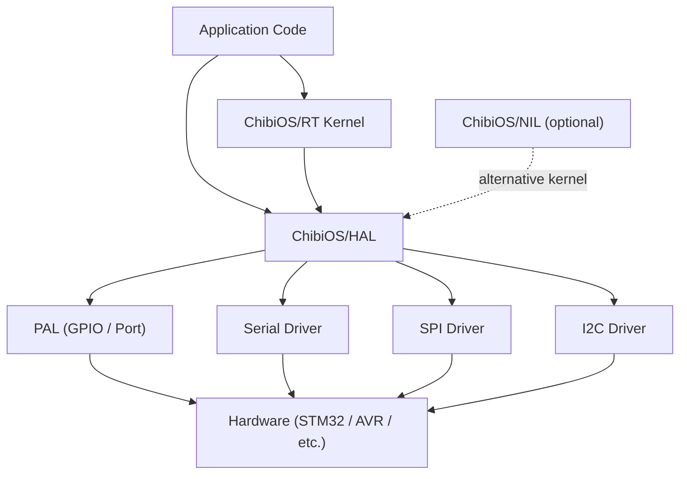

# :material-cog: Day 13 — ChibiOS

!!! abstract "Day at a Glance"
    **Goal:** Master ChibiOS/RT's architecture, static thread model, synchronization primitives, and HAL layer for STM32 and similar microcontrollers.  
    **Prerequisites:** Day 12 (Zephyr RTOS)  
    **Estimated Time:** 90 minutes

<div class="grid cards" markdown>
- :material-lightbulb-on: **Core Concept** — ChibiOS defaults to static allocation, eliminating heap fragmentation at runtime
- :material-chip: **RTOS Component** — `THD_WORKING_AREA` + `chThdCreateStatic` form the static thread creation pair
- :material-alert: **Watch Out** — Forgetting `chSysLock` / `chSysUnlock` around I-class functions called from ISRs causes hard faults
- :material-check-circle: **By End of Day** — Write multi-threaded STM32 firmware using ChibiOS threads, semaphores, and the PAL HAL
</div>

---

## :material-lightbulb-on: Intuition

!!! info "Core Idea"
    ChibiOS was designed with a clean separation of concerns: **ChibiOS/RT** is the kernel, **ChibiOS/HAL** is the hardware abstraction layer, and **ChibiOS/NIL** is an ultra-tiny companion kernel. Unlike FreeRTOS, which pushes heap allocation as the default, ChibiOS treats **static allocation as first-class**. You declare working areas at compile time, the linker places them in fixed RAM addresses, and the kernel never calls `malloc`. The result is a system whose worst-case stack usage is auditable simply by reading the source.

!!! success "Real-World Context"
    ChibiOS powers commercial drone flight controllers, robotic arms, and automotive body control modules. Its sub-microsecond context switch (measured on Cortex-M at 72 MHz) makes it a favourite for motor-control and sensor-fusion loops where every microsecond counts. The BSEC environmental sensor library from Bosch ships ChibiOS example projects, and the popular STM32-based open-source project ChibiStudio gives newcomers a full Eclipse-based IDE out of the box.

---

## :material-sitemap: ChibiOS Architecture



**Layer responsibilities:**

| Layer | Role |
|---|---|
| ChibiOS/RT | Preemptive kernel — threads, scheduler, IPC |
| ChibiOS/NIL | Minimal kernel for deeply resource-constrained MCUs |
| ChibiOS/HAL | Portable hardware driver framework |
| PAL | Port Abstraction Layer — GPIO, lines, groups |
| Platform port | MCU-specific register writes |

---

## :material-book-open-variant: Lesson

### 1. Static Thread Creation

The two-step static thread model is central to ChibiOS:

1. **Declare a working area** — a statically-allocated stack + thread control block.
2. **Create the thread** at runtime using the pre-allocated memory.

```c
#include "ch.h"
#include "hal.h"

/* Step 1: Declare a 512-byte working area for the blink thread */
static THD_WORKING_AREA(waBlink, 512);

/* Step 2: Define the thread function */
static THD_FUNCTION(BlinkThread, arg) {
    (void)arg;
    chRegSetThreadName("blink");

    while (true) {
        palSetLine(LINE_LED1);          /* LED on  */
        chThdSleepMilliseconds(500);
        palClearLine(LINE_LED1);        /* LED off */
        chThdSleepMilliseconds(500);
    }
}

int main(void) {
    halInit();
    chSysInit();

    /* Step 3: Create thread — uses pre-allocated waBlink buffer */
    chThdCreateStatic(waBlink,          /* working area pointer   */
                      sizeof(waBlink),  /* working area size      */
                      NORMALPRIO,       /* priority (0–255)       */
                      BlinkThread,      /* thread function        */
                      NULL);            /* argument               */

    /* Main thread becomes the idle thread */
    chThdSleepMilliseconds(TIME_INFINITE);
}
```

!!! tip "Priority Scale"
    ChibiOS uses `NORMALPRIO` (128) as the midpoint. `NORMALPRIO + n` raises priority; `NORMALPRIO - n` lowers it. The idle thread always runs at priority 1.

---

### 2. Semaphores

ChibiOS counting semaphores are initialized at compile time or at runtime with `chSemObjectInit`.

```c
#include "ch.h"

/* Counting semaphore — initial count 0 (blocked until signalled) */
static semaphore_t dataSem;

static THD_WORKING_AREA(waProducer, 512);
static THD_FUNCTION(ProducerThread, arg) {
    (void)arg;
    while (true) {
        /* Produce data ... */
        chThdSleepMilliseconds(100);
        chSemSignal(&dataSem);          /* V() — increment counter */
    }
}

static THD_WORKING_AREA(waConsumer, 512);
static THD_FUNCTION(ConsumerThread, arg) {
    (void)arg;
    while (true) {
        chSemWait(&dataSem);            /* P() — decrement or block */
        /* Consume data ... */
    }
}

int main(void) {
    halInit();
    chSysInit();

    chSemObjectInit(&dataSem, 0);       /* initialise with count = 0 */

    chThdCreateStatic(waProducer, sizeof(waProducer),
                      NORMALPRIO + 1, ProducerThread, NULL);
    chThdCreateStatic(waConsumer, sizeof(waConsumer),
                      NORMALPRIO,     ConsumerThread, NULL);

    chThdSleepMilliseconds(TIME_INFINITE);
}
```

**Key semaphore API:**

| Function | Description |
|---|---|
| `chSemObjectInit(sp, n)` | Initialize semaphore with count `n` |
| `chSemWait(sp)` | Decrement; block if count == 0 |
| `chSemWaitTimeout(sp, t)` | Wait with timeout (returns `MSG_TIMEOUT`) |
| `chSemSignal(sp)` | Increment; wake highest-priority waiter |
| `chSemSignalI(sp)` | ISR-safe version (requires `chSysLockFromISR`) |
| `chSemReset(sp, n)` | Reset count and wake all waiters |

---

### 3. Mutexes

ChibiOS mutexes implement **priority inheritance** automatically, preventing priority inversion without any extra configuration.

```c
#include "ch.h"

static mutex_t uartMtx;

static THD_WORKING_AREA(waTask1, 512);
static THD_FUNCTION(Task1, arg) {
    (void)arg;
    while (true) {
        chMtxLock(&uartMtx);
        /* Critical section: access shared UART */
        sdWrite(&SD1, (uint8_t *)"Task1\r\n", 7);
        chMtxUnlock(&uartMtx);
        chThdSleepMilliseconds(200);
    }
}

static THD_WORKING_AREA(waTask2, 512);
static THD_FUNCTION(Task2, arg) {
    (void)arg;
    while (true) {
        chMtxLock(&uartMtx);
        sdWrite(&SD1, (uint8_t *)"Task2\r\n", 7);
        chMtxUnlock(&uartMtx);
        chThdSleepMilliseconds(300);
    }
}

int main(void) {
    halInit();
    chSysInit();
    chMtxObjectInit(&uartMtx);

    chThdCreateStatic(waTask1, sizeof(waTask1), NORMALPRIO + 1, Task1, NULL);
    chThdCreateStatic(waTask2, sizeof(waTask2), NORMALPRIO,     Task2, NULL);

    chThdSleepMilliseconds(TIME_INFINITE);
}
```

!!! warning "Never call `chMtxLock` from an ISR"
    Mutexes can block; ISRs must never block. Use `chSemSignalI` / `chEvtBroadcastI` from interrupt context instead.

---

### 4. Mailboxes (Message Passing)

Mailboxes in ChibiOS carry `msg_t` values (pointer-sized integers), making them ideal for passing pointers to shared data buffers.

```c
#include "ch.h"

#define MAILBOX_SIZE  8

static mailbox_t mb;
static msg_t     mbBuffer[MAILBOX_SIZE];

static THD_WORKING_AREA(waSender, 512);
static THD_FUNCTION(SenderThread, arg) {
    (void)arg;
    uint32_t value = 0;
    while (true) {
        /* Post message — blocks if mailbox full */
        chMBPostTimeout(&mb, (msg_t)value++, TIME_MS2I(100));
        chThdSleepMilliseconds(50);
    }
}

static THD_WORKING_AREA(waReceiver, 512);
static THD_FUNCTION(ReceiverThread, arg) {
    (void)arg;
    msg_t msg;
    while (true) {
        /* Fetch message — blocks if mailbox empty */
        if (chMBFetchTimeout(&mb, &msg, TIME_MS2I(200)) == MSG_OK) {
            /* process msg */
        }
    }
}

int main(void) {
    halInit();
    chSysInit();

    chMBObjectInit(&mb, mbBuffer, MAILBOX_SIZE);

    chThdCreateStatic(waSender,   sizeof(waSender),   NORMALPRIO + 1, SenderThread,   NULL);
    chThdCreateStatic(waReceiver, sizeof(waReceiver),  NORMALPRIO,     ReceiverThread, NULL);

    chThdSleepMilliseconds(TIME_INFINITE);
}
```

---

### 5. Event Flags

Event flags (the ChibiOS event system) allow a thread to wait for **multiple conditions** simultaneously, waking only when the requested set of flags is set.

```c
#include "ch.h"

static event_source_t buttonEvent;
static event_source_t timerEvent;

/* Listener thread waits for EITHER event */
static THD_WORKING_AREA(waListener, 512);
static THD_FUNCTION(ListenerThread, arg) {
    (void)arg;
    event_listener_t el1, el2;

    /* Register to listen to both event sources */
    chEvtRegisterMask(&buttonEvent, &el1, EVENT_MASK(0));
    chEvtRegisterMask(&timerEvent,  &el2, EVENT_MASK(1));

    while (true) {
        eventmask_t events = chEvtWaitAny(ALL_EVENTS);

        if (events & EVENT_MASK(0))
            /* handle button */;
        if (events & EVENT_MASK(1))
            /* handle timer */;
    }
}
```

---

### 6. ChibiOS HAL — GPIO via PAL

The Port Abstraction Layer (PAL) provides a uniform GPIO API across all supported MCUs.

```c
#include "hal.h"

/* STM32 example: PA5 = LED, PC13 = User Button */

void gpio_demo(void) {
    /* Configure PA5 as push-pull output, PC13 as input with pull-up */
    palSetPadMode(GPIOA, 5, PAL_MODE_OUTPUT_PUSHPULL);
    palSetPadMode(GPIOC, 13, PAL_MODE_INPUT_PULLUP);

    while (true) {
        if (palReadPad(GPIOC, 13) == PAL_LOW) {
            /* Button pressed (active-low) */
            palSetPad(GPIOA, 5);     /* LED on  */
        } else {
            palClearPad(GPIOA, 5);   /* LED off */
        }
        chThdSleepMilliseconds(10);
    }
}
```

**Commonly used PAL functions:**

| Function | Description |
|---|---|
| `palSetPadMode(port, pad, mode)` | Configure a single pin |
| `palSetPad(port, pad)` | Set pin HIGH |
| `palClearPad(port, pad)` | Set pin LOW |
| `palTogglePad(port, pad)` | Toggle pin |
| `palReadPad(port, pad)` | Read pin state |
| `palSetLine(line)` / `palClearLine(line)` | Board-level line abstraction |

---

### 7. ChibiOS vs FreeRTOS Comparison

| Feature | ChibiOS/RT | FreeRTOS |
|---|---|---|
| Default allocation | **Static** | Dynamic (heap) |
| Priority levels | 0–255 | 0–`configMAX_PRIORITIES-1` |
| Priority inheritance | Built-in mutexes | Requires `configUSE_MUTEXES` |
| Context switch (72 MHz) | ~0.5 µs | ~1–2 µs |
| Mailboxes | Native | Queues (no direct analog) |
| Event flags | Native `event_source_t` | Event Groups |
| HAL bundled | Yes (ChibiOS/HAL) | No (third-party required) |
| License | Apache 2.0 (community) / commercial | MIT |
| Footprint (kernel only) | ~6 KB Flash, ~1 KB RAM | ~5–10 KB Flash |
| Certification | Limited | SafeRTOS (commercial variant) |

---

## :material-pencil: Exercises

**Exercise 1 — Blink Three LEDs at Different Rates**

Create three static threads on an STM32 Nucleo board: one blinks at 100 ms, one at 250 ms, one at 1000 ms. Each thread should have its own `THD_WORKING_AREA`. Measure the actual toggle periods with an oscilloscope or logic analyser and compare them to the requested periods.

**Exercise 2 — Producer/Consumer with Mailbox**

Implement an ADC sampling thread that reads a value every 10 ms and posts it to a mailbox of depth 16. A second thread reads from the mailbox, computes a sliding 8-sample average, and writes the result to a global variable. Add a third "display" thread that reads the global every 100 ms and logs it over UART.

**Exercise 3 — Mutex-Protected SPI Bus**

Three tasks share a single SPI bus. Protect access using a ChibiOS mutex. Measure the worst-case waiting time for the lowest-priority task when the two higher-priority tasks are both requesting the bus simultaneously. Verify that priority inheritance prevents priority inversion.

**Exercise 4 — ChibiOS HAL UART Echo**

Using the ChibiOS serial driver (`SD1`), write a task that reads bytes from a UART using `sdRead` and immediately echoes them back with `sdWrite`. Add a second task that prints a "heartbeat" message every second. Confirm that the heartbeat never corrupts the echo output.

---

## :material-check: Solutions

??? success "Show Solutions"

    **Exercise 1 — Solution**

    ```c
    #include "ch.h"
    #include "hal.h"

    static THD_WORKING_AREA(waLed1, 256);
    static THD_FUNCTION(Led1Thread, arg) {
        (void)arg;
        while (true) { palToggleLine(LINE_LED1); chThdSleepMilliseconds(100); }
    }

    static THD_WORKING_AREA(waLed2, 256);
    static THD_FUNCTION(Led2Thread, arg) {
        (void)arg;
        while (true) { palToggleLine(LINE_LED2); chThdSleepMilliseconds(250); }
    }

    static THD_WORKING_AREA(waLed3, 256);
    static THD_FUNCTION(Led3Thread, arg) {
        (void)arg;
        while (true) { palToggleLine(LINE_LED3); chThdSleepMilliseconds(1000); }
    }

    int main(void) {
        halInit(); chSysInit();
        chThdCreateStatic(waLed1, sizeof(waLed1), NORMALPRIO, Led1Thread, NULL);
        chThdCreateStatic(waLed2, sizeof(waLed2), NORMALPRIO, Led2Thread, NULL);
        chThdCreateStatic(waLed3, sizeof(waLed3), NORMALPRIO, Led3Thread, NULL);
        chThdSleepMilliseconds(TIME_INFINITE);
    }
    ```

    **Exercise 2 — Solution**

    ```c
    #include "ch.h"
    #include "hal.h"

    #define MB_SIZE 16
    static mailbox_t adcMB;
    static msg_t     adcBuf[MB_SIZE];
    volatile uint32_t slidingAvg;

    static THD_WORKING_AREA(waADC, 512);
    static THD_FUNCTION(ADCThread, arg) {
        (void)arg;
        while (true) {
            uint32_t sample = /* read ADC */ 0;
            chMBPostTimeout(&adcMB, (msg_t)sample, TIME_IMMEDIATE);
            chThdSleepMilliseconds(10);
        }
    }

    static THD_WORKING_AREA(waAvg, 512);
    static THD_FUNCTION(AvgThread, arg) {
        (void)arg;
        uint32_t window[8] = {0};
        uint8_t  idx = 0;
        msg_t    val;
        while (true) {
            if (chMBFetchTimeout(&adcMB, &val, TIME_MS2I(50)) == MSG_OK) {
                window[idx++ & 7] = (uint32_t)val;
                uint32_t sum = 0;
                for (int i = 0; i < 8; i++) sum += window[i];
                slidingAvg = sum / 8;
            }
        }
    }

    static THD_WORKING_AREA(waDisp, 512);
    static THD_FUNCTION(DispThread, arg) {
        (void)arg;
        char buf[32];
        while (true) {
            chsnprintf(buf, sizeof(buf), "Avg=%lu\r\n", slidingAvg);
            sdWrite(&SD1, (uint8_t *)buf, strlen(buf));
            chThdSleepMilliseconds(100);
        }
    }

    int main(void) {
        halInit(); chSysInit();
        chMBObjectInit(&adcMB, adcBuf, MB_SIZE);
        chThdCreateStatic(waADC,  sizeof(waADC),  NORMALPRIO + 2, ADCThread,  NULL);
        chThdCreateStatic(waAvg,  sizeof(waAvg),  NORMALPRIO + 1, AvgThread,  NULL);
        chThdCreateStatic(waDisp, sizeof(waDisp), NORMALPRIO,     DispThread, NULL);
        chThdSleepMilliseconds(TIME_INFINITE);
    }
    ```

    **Exercise 3 — Solution sketch**

    Declare `static mutex_t spiMtx;` and call `chMtxObjectInit(&spiMtx)` in `main`. Each SPI task wraps its transaction in `chMtxLock(&spiMtx)` / `chMtxUnlock(&spiMtx)`. Because ChibiOS mutexes implement priority inheritance, the low-priority task holding the mutex will be temporarily elevated to the ceiling priority of the highest-priority waiter, preventing priority inversion.

    **Exercise 4 — Solution sketch**

    ```c
    static THD_WORKING_AREA(waEcho, 512);
    static THD_FUNCTION(EchoThread, arg) {
        (void)arg;
        uint8_t ch;
        while (true) {
            sdRead(&SD1, &ch, 1);
            sdWrite(&SD1, &ch, 1);
        }
    }

    static THD_WORKING_AREA(waHb, 256);
    static THD_FUNCTION(HeartbeatThread, arg) {
        (void)arg;
        while (true) {
            sdWrite(&SD1, (uint8_t *)"[HB]\r\n", 6);
            chThdSleepMilliseconds(1000);
        }
    }
    ```
    Protect both `sdWrite` calls with a mutex to prevent interleaving.

---

## :material-alert: Common Pitfalls

!!! warning "Calling S-class functions from ISR context"
    Functions ending in no suffix (e.g., `chSemSignal`) must be called from thread context with the scheduler running. Inside an ISR, always use the `I`-class variant (`chSemSignalI`) and wrap with `chSysLockFromISR()` / `chSysUnlockFromISR()`.

!!! warning "Under-sizing the working area"
    If a thread overflows its `THD_WORKING_AREA`, it silently corrupts adjacent memory. ChibiOS provides `chThdGetSelfX()->p_stklimit` and the `CH_DBG_FILL_THREADS` debug option to detect stack overflow. Always add 20–30 % margin during development.

!!! danger "Mixing S-class and I-class without proper locking"
    Never call `chSysLock` from a thread that already holds a mutex — the lock/unlock pairing must be symmetric and non-reentrant. Violating this leads to a deadlock that is very hard to trace without a JTAG debugger.

!!! danger "Using `chThdCreateFromHeap` in production"
    Dynamic thread creation (`chThdCreateFromHeap`) uses ChibiOS's heap allocator. In long-running systems this can fragment memory. Prefer `chThdCreateStatic` for all production threads; reserve dynamic creation for temporary worker threads that always terminate.

---

## :material-help-circle: Flashcards

???+ question "What macro declares a static working area for a ChibiOS thread?"
    `THD_WORKING_AREA(name, size)` — it declares a stack buffer aligned and sized correctly for the target architecture, plus the thread control block overhead.

???+ question "What is the function signature for creating a static ChibiOS thread?"
    ```c
    thread_t *chThdCreateStatic(void *wsp, size_t size,
                                tprio_t prio,
                                tfunc_t pf, void *arg);
    ```
    Returns a pointer to the `thread_t` structure embedded in the working area.

???+ question "How do ChibiOS mutexes prevent priority inversion?"
    ChibiOS mutexes use **priority inheritance**: when a high-priority thread blocks on a mutex held by a lower-priority thread, the kernel temporarily raises the holder's priority to that of the highest-priority waiter. When the mutex is released the holder's priority reverts.

???+ question "What is the difference between ChibiOS/RT and ChibiOS/NIL?"
    ChibiOS/RT is the full-featured preemptive kernel with semaphores, mutexes, mailboxes, event flags, and dynamic threads. ChibiOS/NIL is a stripped-down version targeting devices with as little as 1 KB of Flash; it drops dynamic allocation, event sources, and several IPC primitives in exchange for a dramatically smaller footprint.

---

## :material-clipboard-check: Self Test

=== "Question 1"
    What is the minimum code needed to create a static ChibiOS thread that blinks an LED every 500 ms?

=== "Answer 1"
    ```c
    static THD_WORKING_AREA(waLed, 256);
    static THD_FUNCTION(LedThread, arg) {
        (void)arg;
        while (true) {
            palToggleLine(LINE_LED1);
            chThdSleepMilliseconds(500);
        }
    }
    // In main(): after halInit()/chSysInit():
    chThdCreateStatic(waLed, sizeof(waLed), NORMALPRIO, LedThread, NULL);
    ```

=== "Question 2"
    A low-priority thread holds a ChibiOS mutex. A high-priority thread tries to acquire the same mutex. What happens?

=== "Answer 2"
    The high-priority thread blocks. ChibiOS immediately raises the low-priority holder's effective priority to match the high-priority waiter (priority inheritance). When the low-priority thread releases the mutex with `chMtxUnlock`, its priority reverts and the high-priority thread is woken and resumes execution.

---

## :material-check-circle: Summary

!!! success "Key Takeaways"
    - ChibiOS uses **static allocation by default**: `THD_WORKING_AREA` + `chThdCreateStatic` allocate thread stacks at compile time, eliminating heap fragmentation.
    - The **priority scale is 0–255** (higher number = higher priority); `NORMALPRIO` (128) is the conventional midpoint.
    - **Mutexes include priority inheritance** — no configuration required; just call `chMtxLock` / `chMtxUnlock`.
    - The **PAL layer** (`palSetPad`, `palReadPad`, `palSetLine`) provides a portable GPIO API that maps cleanly to STM32, AVR, and other ChibiOS ports.
    - **Mailboxes** pass `msg_t`-sized values (typically pointers) between threads in a type-safe FIFO; use them instead of global variables for inter-thread data exchange.
    - **Event flags** (`chEvtRegisterMask` / `chEvtWaitAny`) let a single thread react to multiple asynchronous sources without polling.
    - The ChibiOS/HAL drivers (Serial, SPI, I2C, ADC, PWM) are event-driven and work seamlessly with RT threads — no busy-waiting required.
    - ChibiOS outperforms FreeRTOS in raw context-switch speed and ships with an integrated HAL, making it ideal for performance-sensitive embedded applications.
