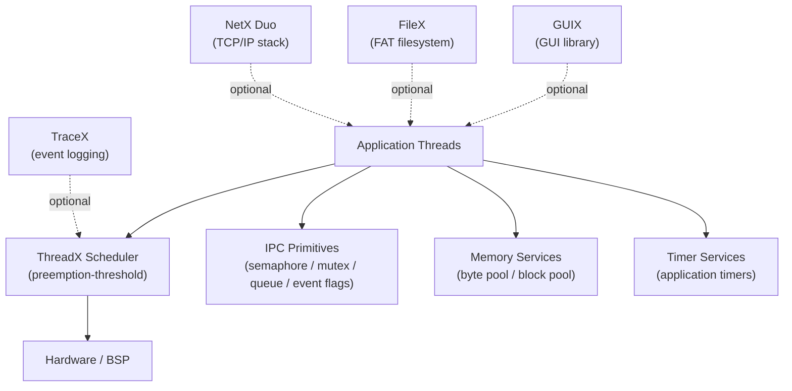
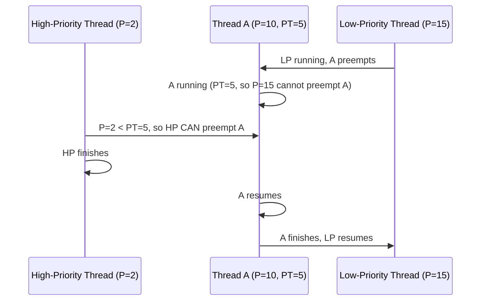

# :material-microsoft-azure: Day 14 — ThreadX (Azure RTOS)

!!! abstract "Day at a Glance"
    **Goal:** Understand ThreadX's architecture, API conventions, preemption-threshold scheduling, and memory-pool model; write multi-threaded firmware targeting safety-critical and Azure IoT scenarios.  
    **Prerequisites:** Day 13 (ChibiOS)  
    **Estimated Time:** 90 minutes

<div class="grid cards" markdown>
- :material-lightbulb-on: **Core Concept** — Preemption-threshold scheduling gives fine-grained control over which threads can preempt which, without full priority inversion risk
- :material-chip: **RTOS Component** — `tx_thread_create` is the single entry point for all thread management; memory comes from byte pools or block pools
- :material-alert: **Watch Out** — ThreadX uses **0 = highest priority** (opposite of ChibiOS/FreeRTOS); getting this backwards causes threads to starve or never run
- :material-check-circle: **By End of Day** — Create ThreadX threads, queues, and event flags; explain preemption thresholds and choose between byte pools and block pools
</div>

---

## :material-lightbulb-on: Intuition

!!! info "Core Idea"
    ThreadX was designed for **determinism above all else**. Every kernel service has a documented worst-case execution time, and the scheduler never performs unbounded operations. The hallmark feature — **preemption-threshold scheduling** — solves a class of problems that neither strict priority nor cooperative scheduling handles well: it lets you say "thread A can only be preempted by threads with priority ≤ N, not by anything in between", collapsing a multi-thread mutual-exclusion problem into a zero-overhead scheduling policy rather than a costly mutex.

!!! success "Real-World Context"
    ThreadX was created by Express Logic in the 1990s, acquired by Microsoft in 2019, and open-sourced in 2020 under the **Azure RTOS** umbrella (now migrating to the **Eclipse ThreadX** brand under the Eclipse Foundation). It is certified to **IEC 61508 SIL 4**, **IEC 62443**, **ISO 26262 ASIL D**, and **DO-178C DAL A** — the highest levels in industrial, automotive, and aerospace safety standards. ThreadX runs on over 12 billion devices and is the default RTOS inside Azure Sphere.

---

## :material-sitemap: ThreadX Architecture



**Ecosystem components:**

| Component | Purpose |
|---|---|
| ThreadX kernel | Preemptive scheduler, IPC, timers |
| TraceX | PC-side real-time event visualiser |
| GUIX | Embedded GUI framework |
| FileX | FAT12/16/32 filesystem |
| NetX Duo | IPv4/IPv6 dual-stack TCP/IP |
| LevelX | NOR/NAND flash wear-levelling |
| USBX | USB host and device stack |

---

## :material-book-open-variant: Lesson

### 1. Application Entry Point

ThreadX takes over `main` via a special entry hook. Application code starts in `tx_application_define`.

```c
#include "tx_api.h"

/* Thread control blocks and stacks */
static TX_THREAD   sensorThread;
static TX_THREAD   logThread;
static ULONG       sensorStack[512];
static ULONG       logStack[512];

/* Forward declarations */
static VOID sensor_entry(ULONG arg);
static VOID log_entry(ULONG arg);

/* ThreadX calls this instead of main() for application setup */
VOID tx_application_define(VOID *first_unused_memory) {
    /* Create sensor thread: priority 5, preemption-threshold 5 */
    tx_thread_create(&sensorThread,      /* control block       */
                     "SensorThread",     /* name (debug)        */
                     sensor_entry,       /* entry function      */
                     0,                  /* entry input         */
                     sensorStack,        /* stack base          */
                     sizeof(sensorStack),/* stack size          */
                     5,                  /* priority (0=highest)*/
                     5,                  /* preemption-threshold*/
                     TX_NO_TIME_SLICE,   /* time-slice ticks    */
                     TX_AUTO_START);     /* start immediately   */

    tx_thread_create(&logThread,
                     "LogThread",
                     log_entry,
                     0,
                     logStack,
                     sizeof(logStack),
                     10,                 /* lower priority      */
                     10,
                     TX_NO_TIME_SLICE,
                     TX_AUTO_START);
}

static VOID sensor_entry(ULONG arg) {
    while (1) {
        /* Read sensor, process data */
        tx_thread_sleep(10);             /* sleep 10 timer ticks */
    }
}

static VOID log_entry(ULONG arg) {
    while (1) {
        /* Log data to storage */
        tx_thread_sleep(100);
    }
}

/* ThreadX replaces main() — just call tx_kernel_enter() */
int main(void) {
    tx_kernel_enter();                   /* never returns       */
    return 0;
}
```

!!! tip "Priority Numbering"
    ThreadX uses **0 for the highest priority**. Priority 31 is lower than priority 5. This is the opposite of ChibiOS and many other RTOSes. Always double-check the direction when porting code.

---

### 2. Semaphores

```c
#include "tx_api.h"

static TX_SEMAPHORE dataSem;

VOID tx_application_define(VOID *mem) {
    tx_semaphore_create(&dataSem, "DataSem", 0); /* initial count = 0 */
    /* ... create threads ... */
}

/* Producer thread */
static VOID producer_entry(ULONG arg) {
    while (1) {
        /* produce data */
        tx_semaphore_put(&dataSem);       /* V() — increment */
        tx_thread_sleep(10);
    }
}

/* Consumer thread */
static VOID consumer_entry(ULONG arg) {
    while (1) {
        /* P() — decrement or block forever */
        tx_semaphore_get(&dataSem, TX_WAIT_FOREVER);
        /* consume data */
    }
}
```

**Semaphore API summary:**

| Function | Description |
|---|---|
| `tx_semaphore_create(sp, name, count)` | Create with initial count |
| `tx_semaphore_get(sp, wait)` | Decrement; block if 0 |
| `tx_semaphore_put(sp)` | Increment; wake highest waiter |
| `tx_semaphore_put_notify(sp, cb)` | Callback on every put |
| `tx_semaphore_delete(sp)` | Delete and wake all waiters |
| `tx_semaphore_info_get(...)` | Runtime inspection |

---

### 3. Mutexes with Priority Inheritance

```c
#include "tx_api.h"

static TX_MUTEX busMutex;

VOID tx_application_define(VOID *mem) {
    /* TX_INHERIT enables priority inheritance */
    tx_mutex_create(&busMutex, "BusMutex", TX_INHERIT);
}

static VOID worker_entry(ULONG arg) {
    while (1) {
        tx_mutex_get(&busMutex, TX_WAIT_FOREVER);
        /* access shared resource */
        tx_mutex_put(&busMutex);
        tx_thread_sleep(20);
    }
}
```

Pass `TX_INHERIT` to `tx_mutex_create` to enable priority inheritance. Pass `TX_NO_INHERIT` to disable it (not recommended for shared peripheral access).

---

### 4. Queues

ThreadX queues carry fixed-size messages. The message size (1–16 32-bit words) is set at creation time.

```c
#include "tx_api.h"

#define Q_CAPACITY  16
#define Q_MSG_SIZE   1   /* 1 ULONG = 4 bytes per message */

static TX_QUEUE dataQueue;
static ULONG    queueStorage[Q_CAPACITY * Q_MSG_SIZE];

VOID tx_application_define(VOID *mem) {
    tx_queue_create(&dataQueue, "DataQ",
                    Q_MSG_SIZE,           /* words per message */
                    queueStorage,
                    sizeof(queueStorage));
}

static VOID producer_entry(ULONG arg) {
    ULONG value = 0;
    while (1) {
        tx_queue_send(&dataQueue, &value, TX_WAIT_FOREVER);
        value++;
        tx_thread_sleep(10);
    }
}

static VOID consumer_entry(ULONG arg) {
    ULONG received;
    while (1) {
        tx_queue_receive(&dataQueue, &received, TX_WAIT_FOREVER);
        /* process received */
    }
}
```

---

### 5. Event Flags

Event flag groups let threads wait for combinations of 32 individual bits.

```c
#include "tx_api.h"

static TX_EVENT_FLAGS_GROUP sysFlags;

#define FLAG_SENSOR_READY  (1 << 0)
#define FLAG_UART_TX_DONE  (1 << 1)
#define FLAG_BUTTON_PRESS  (1 << 2)

VOID tx_application_define(VOID *mem) {
    tx_event_flags_create(&sysFlags, "SysFlags");
}

/* Set a flag from any thread or ISR */
static VOID isr_or_thread_signal(void) {
    tx_event_flags_set(&sysFlags, FLAG_SENSOR_READY, TX_OR);
}

/* Wait for ANY of the flags */
static VOID monitor_entry(ULONG arg) {
    ULONG actual_flags;
    while (1) {
        tx_event_flags_get(&sysFlags,
                           FLAG_SENSOR_READY | FLAG_BUTTON_PRESS,
                           TX_OR_CLEAR,        /* wake on any; auto-clear */
                           &actual_flags,
                           TX_WAIT_FOREVER);

        if (actual_flags & FLAG_SENSOR_READY)
            /* handle sensor */;
        if (actual_flags & FLAG_BUTTON_PRESS)
            /* handle button */;
    }
}
```

---

### 6. Preemption-Threshold Scheduling

Preemption-threshold is the unique ThreadX feature. Every thread has two values:

- **priority** — determines scheduling order when multiple threads are ready.
- **preemption-threshold** — the minimum priority value that is *allowed* to preempt this thread while it is running.

```
Thread A: priority=10, preemption-threshold=5
  → Threads with priority 0..4 CAN preempt A
  → Threads with priority 5..31 CANNOT preempt A (even if higher priority than A's own priority of 10!)
```

This means A behaves cooperatively with threads 5–9 (same priority band) without needing any mutex, yet still yields to truly urgent threads (0–4).

```c
/* Change preemption-threshold at runtime */
UINT old_threshold;
tx_thread_preemption_change(&sensorThread,
                            3,               /* new threshold */
                            &old_threshold);
```



---

### 7. Memory: Byte Pools vs Block Pools

ThreadX provides two heap alternatives, both deterministic.

```c
/* --- Byte Pool (variable-size allocations) --- */
static TX_BYTE_POOL bytePool;
static UCHAR        bytePoolBuffer[4096];

tx_byte_pool_create(&bytePool, "BytePool",
                    bytePoolBuffer, sizeof(bytePoolBuffer));

VOID *ptr;
tx_byte_allocate(&bytePool, &ptr, 256, TX_WAIT_FOREVER);
/* ... use ptr ... */
tx_byte_release(ptr);

/* --- Block Pool (fixed-size allocations — O(1) guaranteed) --- */
static TX_BLOCK_POOL blockPool;
static UCHAR         blockPoolBuffer[32 * 64]; /* 32 blocks × 64 bytes */

tx_block_pool_create(&blockPool, "BlockPool",
                     64,                        /* bytes per block */
                     blockPoolBuffer, sizeof(blockPoolBuffer));

VOID *block;
tx_block_allocate(&blockPool, &block, TX_WAIT_FOREVER);
/* ... use block ... */
tx_block_release(block);
```

**Comparison:**

| Feature | Byte Pool | Block Pool |
|---|---|---|
| Allocation size | Variable | Fixed |
| Allocation time | O(n) worst-case (first-fit) | **O(1) guaranteed** |
| Fragmentation | Possible over time | **Never** |
| Use case | General dynamic allocation | Packet buffers, message objects |
| Memory overhead | Small pool header | Block header per block |
| Recommended for safety-critical? | With care | **Yes — preferred** |

---

### 8. TraceX Visualisation

ThreadX includes a built-in circular trace buffer that records every kernel event (thread switch, semaphore get/put, queue operations, etc.) with timestamps. SEGGER's SystemView-equivalent for ThreadX is **TraceX**, a free Windows PC application.

```c
/* Enable tracing — place this before tx_kernel_enter() */
#define TX_ENABLE_EVENT_TRACE
static UCHAR trace_buffer[64000];

tx_trace_enable(trace_buffer, sizeof(trace_buffer), 30);

/* After the run, dump trace_buffer to a .trx file and open in TraceX */
```

TraceX shows thread execution timelines, synchronisation events, and latency histograms, making it invaluable for debugging timing issues without a logic analyser.

---

## :material-pencil: Exercises

**Exercise 1 — Safety-Critical Motor Controller**

Create two ThreadX threads: `ControlThread` (priority 3) and `MonitorThread` (priority 8). `ControlThread` sets preemption-threshold to 3 (preventing `MonitorThread` from preempting it mid-computation). The monitor thread reads a "fault flag" shared variable. Use `TX_MUTEX` with `TX_INHERIT` to protect the shared variable. Demonstrate that the motor control loop completes atomically with respect to the monitor.

**Exercise 2 — Azure IoT Telemetry Pipeline**

Build a three-thread pipeline: `SensorThread` samples a value every 50 ms and sends it to a `TX_QUEUE`; `ProcessThread` receives samples, batches them into groups of 10, and sends to a second queue; `TransmitThread` receives batches and "transmits" them (print to UART). Use event flags to signal when a transmission completes, and measure queue depths under load.

**Exercise 3 — Block Pool Packet Buffer**

Implement a UDP-style packet pipeline using a `TX_BLOCK_POOL` of 20 blocks × 128 bytes each. A producer thread allocates a block, fills it with a payload, and sends the pointer via a `TX_QUEUE`. A consumer thread receives the pointer, processes the block, and releases it back to the pool. Verify that the block pool never allocates beyond 20 blocks by adding an assertion counter.

**Exercise 4 — TraceX Performance Analysis**

Enable TraceX tracing in a three-thread application. Run for 10 seconds, dump the trace buffer to a file, and open it in TraceX. Identify: (a) the thread with the highest CPU usage; (b) the average and worst-case semaphore wait time; (c) any priority inversion events.

---

## :material-check: Solutions

??? success "Show Solutions"

    **Exercise 1 — Solution sketch**

    ```c
    static TX_THREAD controlThread, monitorThread;
    static TX_MUTEX  faultMutex;
    static volatile UINT faultFlag = 0;

    VOID tx_application_define(VOID *mem) {
        tx_mutex_create(&faultMutex, "FaultMtx", TX_INHERIT);

        /* preemption-threshold = priority = 3 (nothing in band 3..7 can preempt) */
        tx_thread_create(&controlThread, "Control", control_entry, 0,
                         controlStack, sizeof(controlStack), 3, 3,
                         TX_NO_TIME_SLICE, TX_AUTO_START);

        tx_thread_create(&monitorThread, "Monitor", monitor_entry, 0,
                         monitorStack, sizeof(monitorStack), 8, 8,
                         TX_NO_TIME_SLICE, TX_AUTO_START);
    }

    static VOID control_entry(ULONG arg) {
        while (1) {
            tx_mutex_get(&faultMutex, TX_WAIT_FOREVER);
            /* long computation — monitorThread cannot preempt here */
            tx_mutex_put(&faultMutex);
            tx_thread_sleep(5);
        }
    }

    static VOID monitor_entry(ULONG arg) {
        while (1) {
            tx_mutex_get(&faultMutex, TX_WAIT_FOREVER);
            UINT f = faultFlag;
            tx_mutex_put(&faultMutex);
            if (f) { /* handle fault */ }
            tx_thread_sleep(20);
        }
    }
    ```

    **Exercise 2 — Solution sketch**

    Create `TX_QUEUE sampleQ` (capacity 20, 1 word) and `TX_QUEUE batchQ` (capacity 5, 3 words for pointer + count). `SensorThread` calls `tx_queue_send` every 50 ms. `ProcessThread` batches 10 samples into a static array, then sends a pointer via `batchQ`. `TransmitThread` prints the batch and sets a `TX_EVENT_FLAGS_GROUP` flag. Measure queue depth with `tx_queue_info_get`.

    **Exercise 3 — Solution sketch**

    ```c
    #define BLOCK_SIZE 128
    #define POOL_BLOCKS 20
    static TX_BLOCK_POOL pktPool;
    static TX_QUEUE      pktQueue;
    static UCHAR         poolBuf[POOL_BLOCKS * (BLOCK_SIZE + sizeof(VOID*))];
    static ULONG         queueStorage[POOL_BLOCKS];

    VOID tx_application_define(VOID *mem) {
        tx_block_pool_create(&pktPool, "PktPool", BLOCK_SIZE,
                             poolBuf, sizeof(poolBuf));
        tx_queue_create(&pktQueue, "PktQ", 1,
                        queueStorage, sizeof(queueStorage));
    }

    static VOID producer_entry(ULONG arg) {
        VOID *blk;
        while (1) {
            if (tx_block_allocate(&pktPool, &blk, TX_NO_WAIT) == TX_SUCCESS) {
                /* fill blk */
                tx_queue_send(&pktQueue, &blk, TX_WAIT_FOREVER);
            }
            tx_thread_sleep(5);
        }
    }

    static VOID consumer_entry(ULONG arg) {
        VOID *blk;
        while (1) {
            tx_queue_receive(&pktQueue, &blk, TX_WAIT_FOREVER);
            /* process blk */
            tx_block_release(blk);
        }
    }
    ```

    **Exercise 4 — Guidance**

    Add `tx_trace_enable(buf, sizeof(buf), 30)` before `tx_kernel_enter`. After the run, halt the debugger and dump `buf` to a binary file. Open in TraceX (free download from Microsoft). Use the **Thread Execution Profile** view for CPU percentages, the **Semaphore Performance Statistics** for wait times, and the **Priority Inversion** filter to detect inversion events.

---

## :material-alert: Common Pitfalls

!!! warning "Priority 0 is highest — not lowest"
    ThreadX priority 0 is the most urgent. Assigning a background task priority 0 will starve every other thread in the system. Always start non-critical threads at priority 16 or higher, reserving low numbers for ISR-deferred work.

!!! warning "Preemption-threshold must be <= priority"
    Setting preemption-threshold *higher* than the thread's own priority value (remember: lower number = higher priority) is illegal and will be caught only at runtime on debug builds. The threshold must always be ≤ the thread's priority number (i.e., equal or higher urgency level).

!!! danger "`tx_thread_sleep(0)` is not a yield"
    Calling `tx_thread_sleep(0)` suspends for zero ticks but still triggers a reschedule. Use `tx_thread_relinquish()` for an explicit cooperative yield that transfers control to equal-priority threads without suspending.

!!! danger "Deleting objects that threads are waiting on"
    Calling `tx_semaphore_delete` or `tx_queue_delete` while threads are blocked on them wakes all waiters with an error code. Ensure all consumer threads have exited or been suspended before deleting IPC objects, especially during system shutdown.

---

## :material-help-circle: Flashcards

???+ question "What makes ThreadX's preemption-threshold scheduling unique?"
    Each thread has both a **priority** and a **preemption-threshold**. A running thread can only be preempted by threads whose priority number is *less than* (i.e., more urgent than) the threshold — not merely more urgent than the thread's own priority. This eliminates the need for mutexes in many mutual-exclusion scenarios, reducing overhead and avoiding priority inversion in a whole class of cases.

???+ question "What is the difference between a ThreadX byte pool and a block pool?"
    A **byte pool** supports variable-size allocations using a first-fit algorithm; it can fragment over time and has O(n) worst-case allocation time. A **block pool** allocates fixed-size blocks in O(1) guaranteed time with zero fragmentation — ideal for real-time packet buffers and safety-critical code.

???+ question "How does ThreadX application code start execution?"
    The application defines `VOID tx_application_define(VOID *first_unused_memory)`. ThreadX calls this function after kernel initialisation and before starting the scheduler. All threads, semaphores, queues, and other objects are typically created here.

???+ question "Name three safety certifications held by ThreadX."
    IEC 61508 SIL 4 (functional safety), ISO 26262 ASIL D (automotive), and DO-178C DAL A (aerospace). These are the highest levels in their respective standards, making ThreadX one of the most certified RTOSes available.

---

## :material-clipboard-check: Self Test

=== "Question 1"
    Thread A has priority 10 and preemption-threshold 6. Thread B has priority 8. Can thread B preempt thread A while A is running?

=== "Answer 1"
    No. Thread B's priority number (8) is NOT less than the preemption-threshold (6). The rule is: a thread can preempt only if its priority number is **strictly less than** the running thread's preemption-threshold. Since 8 >= 6, thread B cannot preempt thread A. Only threads with priority 0–5 can preempt A.

=== "Question 2"
    You need to allocate 64-byte packet buffers at maximum rate from an ISR-deferred thread. Should you use a byte pool or a block pool? Why?

=== "Answer 2"
    Use a **block pool** configured with 64-byte blocks. Block pool allocation is O(1) and deterministic — essential for real-time packet processing. A byte pool could fragment over time and has variable (O(n)) allocation time, both of which are unacceptable in a high-rate, latency-sensitive path.

---

## :material-check-circle: Summary

!!! success "Key Takeaways"
    - ThreadX uses **0 = highest priority** — always double-check direction when porting from other RTOSes.
    - **`tx_application_define`** replaces `main` for object creation; the scheduler starts after it returns.
    - **Preemption-threshold** is ThreadX's killer feature: it enforces mutual exclusion between threads in a priority band without a mutex, at zero runtime overhead.
    - **Block pools** provide O(1), fragmentation-free allocation — prefer them over byte pools in any real-time or safety-critical path.
    - **TraceX** gives a full timeline of all kernel events, making it as powerful as a logic analyser for software-level debugging.
    - The **Azure RTOS / Eclipse ThreadX ecosystem** (FileX, NetX Duo, GUIX, USBX) provides a complete middleware stack for connected embedded products.
    - ThreadX is certified to the highest levels of IEC 61508, ISO 26262, and DO-178C — the go-to RTOS when safety certification is a contractual requirement.
    - ThreadX is now **open source** (MIT licence) under the Eclipse Foundation, removing the previous commercial licence barrier for evaluation and low-volume use.
