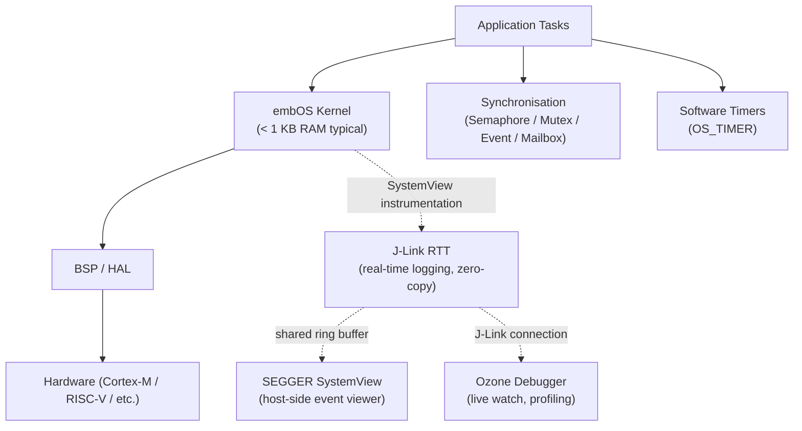
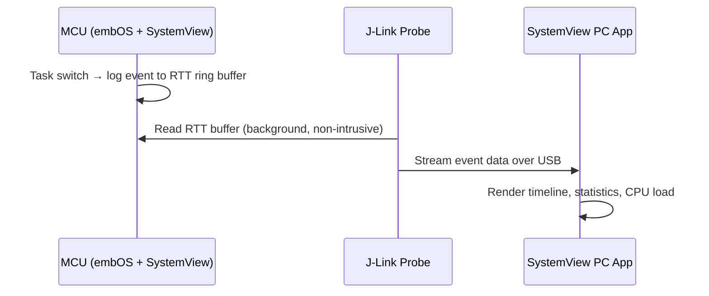

# :material-speedometer: Day 15 — embOS

!!! abstract "Day at a Glance"
    **Goal:** Learn SEGGER embOS's ultra-compact architecture, task model, synchronisation primitives, and world-class debugging integration with SystemView and J-Link RTT.  
    **Prerequisites:** Day 14 (ThreadX)  
    **Estimated Time:** 90 minutes

<div class="grid cards" markdown>
- :material-lightbulb-on: **Core Concept** — embOS achieves sub-1 KB RAM footprint by keeping the kernel object model dead-simple — tasks are C structs, no dynamic allocation needed
- :material-chip: **RTOS Component** — `OS_TASK_CREATE` + a static `OS_TASK` struct is all you need to get a task running; SEGGER's J-Link RTT provides zero-copy logging
- :material-alert: **Watch Out** — embOS task priorities are **1 = lowest** (inverse of ThreadX); forgetting this leads to critical tasks being starved by idle work
- :material-check-circle: **By End of Day** — Write embOS firmware with tasks, semaphores, and mailboxes; connect SEGGER SystemView for live profiling
</div>

---

## :material-lightbulb-on: Intuition

!!! info "Core Idea"
    embOS was engineered by SEGGER to complement their J-Link debug probes and Embedded Studio IDE. The kernel itself is tiny — typical deployments use **less than 1 KB of RAM** for the kernel internals — but it does not sacrifice features to achieve that. The design philosophy is: keep kernel objects as plain C structs stored wherever the application places them (stack, BSS, or heap), and let the host-side tooling (SystemView, Ozone) provide the complexity. The result is a kernel that fits comfortably in 32 KB of Flash microcontrollers while delivering deterministic preemption and first-class safety certifications.

!!! success "Real-World Context"
    SEGGER embOS ships commercially and is widely deployed in medical devices, industrial controllers, and automotive body electronics. Its **IEC 61508 SIL 3**, **ISO 26262 ASIL C**, and **DO-178B DAL C** certifications make it suitable for life-critical applications. SEGGER provides a **free evaluation licence** for learning and prototyping, and the J-Link / Embedded Studio ecosystem is arguably the best-in-class debugging toolchain for ARM Cortex-M. **SEGGER SystemView** — free to download — lets you visualise every task switch, ISR entry/exit, and API call in real time directly from the running MCU via J-Link.

---

## :material-sitemap: embOS Architecture



**Kernel footprint (typical Cortex-M4):**

| Item | Size |
|---|---|
| Kernel code | ~6 KB Flash |
| Kernel RAM (per task) | ~80 bytes |
| Kernel RAM (overhead) | ~200 bytes |
| Total RAM for 4 tasks | **~520 bytes** |

---

## :material-book-open-variant: Lesson

### 1. Task Creation

embOS tasks are C structs of type `OS_TASK`. You allocate them statically and initialise them with `OS_TASK_CREATE` (or the extended `OS_TASK_CreateEx`).

```c
#include "RTOS.h"

/* Task control blocks — statically allocated */
static OS_TASK tcbBlink;
static OS_TASK tcbSensor;

/* Task stacks */
static OS_STACKPTR int stackBlink[128];   /* 128 × 4 = 512 bytes  */
static OS_STACKPTR int stackSensor[256];  /* 256 × 4 = 1024 bytes */

/* Task functions */
static void BlinkTask(void) {
    while (1) {
        BSP_ToggleLED(0);
        OS_TASK_Delay(500);              /* yield for 500 ms     */
    }
}

static void SensorTask(void) {
    while (1) {
        /* Read sensor */
        OS_TASK_Delay(100);
    }
}

int main(void) {
    OS_Init();                           /* initialise embOS     */
    OS_InitHW();                         /* BSP hardware init    */

    /* OS_TASK_CREATE(pTask, sName, Priority, pRoutine, pStack, StackSize) */
    OS_TASK_CREATE(&tcbBlink,  "Blink",  100, BlinkTask,
                   stackBlink,  sizeof(stackBlink));
    OS_TASK_CREATE(&tcbSensor, "Sensor", 150, SensorTask,
                   stackSensor, sizeof(stackSensor));

    OS_Start();                          /* start scheduler — never returns */
}
```

!!! tip "Priority Direction"
    embOS priority **1 = lowest**, and higher numbers mean higher urgency. Priority 255 is reserved for the OS idle task. Use values 10–200 for application tasks to leave room for expansion.

**Extended task creation with argument:**

```c
static void WorkerTask(void *pArg) {
    uint32_t channel = (uint32_t)pArg;
    while (1) {
        /* process channel */
        OS_TASK_Delay(50);
    }
}

/* Create two instances of the same function with different arguments */
OS_TASK_CreateEx(&tcbWorker0, "Worker0", 120, WorkerTask,
                 stackWorker0, sizeof(stackWorker0), 4, (void *)0);
OS_TASK_CreateEx(&tcbWorker1, "Worker1", 120, WorkerTask,
                 stackWorker1, sizeof(stackWorker1), 4, (void *)1);
```

---

### 2. Semaphores

embOS provides counting and binary semaphores through the `OS_SEMAPHORE` type.

```c
#include "RTOS.h"

static OS_SEMAPHORE dataSem;

/* Initialise in main before OS_Start */
OS_SEMAPHORE_Create(&dataSem, 0);        /* initial token count = 0 */

/* Producer task */
static void ProducerTask(void) {
    while (1) {
        /* produce data */
        OS_SEMAPHORE_Give(&dataSem);     /* V() */
        OS_TASK_Delay(100);
    }
}

/* Consumer task */
static void ConsumerTask(void) {
    while (1) {
        OS_SEMAPHORE_Take(&dataSem, 0);  /* P(), 0 = wait forever */
        /* consume data */
    }
}
```

**Semaphore API:**

| Function | Description |
|---|---|
| `OS_SEMAPHORE_Create(sp, count)` | Create with initial count |
| `OS_SEMAPHORE_Take(sp, timeout_ms)` | Decrement; block on 0 |
| `OS_SEMAPHORE_Give(sp)` | Increment; wake waiter |
| `OS_SEMAPHORE_GetValue(sp)` | Read current count |
| `OS_SEMAPHORE_Delete(sp)` | Delete and wake all waiters |

---

### 3. Mutexes

embOS `OS_MUTEX` supports priority inheritance automatically when `OS_MUTEX_LockBlocked` is used.

```c
#include "RTOS.h"

static OS_MUTEX uartMutex;

OS_MUTEX_Create(&uartMutex);

static void TaskA(void) {
    while (1) {
        OS_MUTEX_Lock(&uartMutex);
        /* critical section */
        OS_MUTEX_Unlock(&uartMutex);
        OS_TASK_Delay(100);
    }
}
```

| Function | Description |
|---|---|
| `OS_MUTEX_Create(mp)` | Initialise mutex |
| `OS_MUTEX_Lock(mp)` | Acquire; block if held |
| `OS_MUTEX_LockTimed(mp, ms)` | Acquire with timeout |
| `OS_MUTEX_Unlock(mp)` | Release |
| `OS_MUTEX_GetValue(mp)` | 0 = available, 1 = locked |

---

### 4. Mailboxes

embOS mailboxes carry fixed-size messages between tasks. You supply the backing buffer.

```c
#include "RTOS.h"

typedef struct {
    uint16_t adcValue;
    uint32_t timestamp;
} SensorMsg;

#define MB_DEPTH  8
static OS_MAILBOX      sensorMB;
static SensorMsg       mbBuffer[MB_DEPTH];

OS_MAILBOX_Create(&sensorMB, sizeof(SensorMsg), MB_DEPTH, mbBuffer);

/* Producer */
static void SamplerTask(void) {
    SensorMsg msg;
    while (1) {
        msg.adcValue  = read_adc();
        msg.timestamp = OS_GetTime();
        OS_MAILBOX_Put(&sensorMB, &msg);   /* blocks if full */
        OS_TASK_Delay(10);
    }
}

/* Consumer */
static void ProcessorTask(void) {
    SensorMsg msg;
    while (1) {
        OS_MAILBOX_Get(&sensorMB, &msg);   /* blocks if empty */
        /* process msg */
    }
}
```

---

### 5. Event Objects

`OS_EVENT` flags allow tasks to wait for any combination of 32 bits, similar to FreeRTOS Event Groups.

```c
#include "RTOS.h"

static OS_EVENT sysEvents;

#define EV_SENSOR_RDY  (1u << 0)
#define EV_UART_RXD    (1u << 1)
#define EV_BUTTON      (1u << 2)

OS_EVENT_Create(&sysEvents);

/* Signal from ISR */
void EXTI0_IRQHandler(void) {
    OS_EVENT_Set(&sysEvents, EV_BUTTON);
}

/* Wait for any event */
static void MonitorTask(void) {
    OS_U32 events;
    while (1) {
        /* Wait for any of the three flags; auto-clear on wake */
        events = OS_EVENT_GetMaskTimed(&sysEvents,
                                       EV_SENSOR_RDY | EV_BUTTON,
                                       0);   /* 0 = wait forever */
        if (events & EV_SENSOR_RDY) { /* ... */ }
        if (events & EV_BUTTON)     { /* ... */ }
    }
}
```

---

### 6. Software Timers

`OS_TIMER` callbacks execute in timer-task context (a dedicated internal embOS task), not in ISR context.

```c
#include "RTOS.h"

static OS_TIMER heartbeatTimer;

static void HeartbeatCB(void) {
    BSP_ToggleLED(1);
    /* Restart timer for periodic operation */
    OS_TIMER_Restart(&heartbeatTimer);
}

/* In main, before OS_Start */
OS_TIMER_Create(&heartbeatTimer, HeartbeatCB, 1000); /* 1000 ms period */
OS_TIMER_Start(&heartbeatTimer);
```

---

### 7. SEGGER SystemView Integration

SystemView records every task switch, ISR entry/exit, and embOS API call into a ring buffer in MCU RAM. J-Link reads this buffer non-intrusively over RTT while the MCU runs.

```c
#include "RTOS.h"
#include "SEGGER_SYSVIEW.h"

int main(void) {
    OS_Init();
    OS_InitHW();
    SEGGER_SYSVIEW_Conf();       /* enable SystemView recording */

    OS_TASK_CREATE(/* ... */);
    OS_Start();
}
```



**What SystemView shows:**

| View | Information |
|---|---|
| Timeline | Task execution, ISR activity, idle periods |
| CPU Load | Per-task CPU percentage over time |
| Context Switch | Exact timestamps and reason (preemption / yield / delay) |
| API Calls | Semaphore, mutex, mailbox operations with durations |
| Interrupt Latency | ISR entry to first task-level response |

---

### 8. Safety Certifications

| Standard | Level | Domain |
|---|---|---|
| IEC 61508 | SIL 3 | General functional safety |
| ISO 26262 | ASIL C | Automotive |
| DO-178B | DAL C | Aerospace software |
| EN 50128 | SIL 3 | Railway |
| IEC 62443 | — | Industrial cybersecurity |

SEGGER provides a **Certification Package** including: MISRA-C compliant source, formal requirements traceability matrix, test reports, and a safety manual — everything needed to submit embOS as a pre-qualified component to a certification body.

---

## :material-pencil: Exercises

**Exercise 1 — Three-Task Priority Demonstration**

Create three embOS tasks with priorities 50, 100, and 200. Each task toggles a different LED and prints its name over J-Link RTT using `SEGGER_RTT_printf`. Connect SystemView and capture a 5-second trace. Identify which task runs most frequently and measure its average execution time per activation.

**Exercise 2 — ADC Mailbox Pipeline**

Create a `SamplerTask` that reads an ADC every 5 ms and posts `SensorMsg` structs to an `OS_MAILBOX`. Create a `FilterTask` that drains the mailbox, applies a 16-sample moving average filter, and stores the result in a global. Create a `ReportTask` that logs the filtered value every 500 ms via RTT. Measure mailbox high-water mark using `OS_MAILBOX_GetMessageCnt`.

**Exercise 3 — Mutex Priority Inversion Test**

Create three tasks: Low (priority 30), Medium (priority 60), High (priority 90). Low acquires `OS_MUTEX uartMutex` and holds it for 200 ms. Medium wakes up after 50 ms and spins (busy loop, no sleep). High wakes at 100 ms and tries to acquire the same mutex. Log timestamps via RTT to measure: (a) how long High waits; (b) whether Medium can preempt Low while Low holds the mutex (it should not, due to priority inheritance).

**Exercise 4 — SystemView Profiling**

Enable SEGGER SystemView in an existing embOS project. Run the application for 30 seconds. Capture the trace. Answer: (a) What is the CPU load of the idle task? (b) What is the worst-case ISR latency? (c) Which embOS API call takes the longest? Use only the SystemView PC application — no code instrumentation required beyond `SEGGER_SYSVIEW_Conf()`.

---

## :material-check: Solutions

??? success "Show Solutions"

    **Exercise 1 — Solution**

    ```c
    #include "RTOS.h"
    #include "SEGGER_RTT.h"

    static OS_TASK tcb50, tcb100, tcb200;
    static OS_STACKPTR int stk50[128], stk100[128], stk200[128];

    static void Task50(void) {
        while (1) {
            BSP_ToggleLED(0);
            SEGGER_RTT_printf(0, "Task50\n");
            OS_TASK_Delay(100);
        }
    }
    static void Task100(void) {
        while (1) {
            BSP_ToggleLED(1);
            SEGGER_RTT_printf(0, "Task100\n");
            OS_TASK_Delay(50);
        }
    }
    static void Task200(void) {
        while (1) {
            BSP_ToggleLED(2);
            SEGGER_RTT_printf(0, "Task200\n");
            OS_TASK_Delay(20);
        }
    }

    int main(void) {
        OS_Init(); OS_InitHW();
        SEGGER_SYSVIEW_Conf();
        OS_TASK_CREATE(&tcb50,  "T50",  50,  Task50,  stk50,  sizeof(stk50));
        OS_TASK_CREATE(&tcb100, "T100", 100, Task100, stk100, sizeof(stk100));
        OS_TASK_CREATE(&tcb200, "T200", 200, Task200, stk200, sizeof(stk200));
        OS_Start();
    }
    ```

    **Exercise 2 — Solution sketch**

    ```c
    typedef struct { uint16_t adc; uint32_t ts; } SensorMsg;
    #define MB_DEPTH 32
    static OS_MAILBOX mb;
    static SensorMsg  mbBuf[MB_DEPTH];
    volatile uint32_t filteredVal;

    /* In main: OS_MAILBOX_Create(&mb, sizeof(SensorMsg), MB_DEPTH, mbBuf); */

    static void SamplerTask(void) {
        SensorMsg m;
        while (1) {
            m.adc = read_adc(); m.ts = OS_GetTime();
            OS_MAILBOX_Put(&mb, &m);
            OS_TASK_Delay(5);
        }
    }
    static void FilterTask(void) {
        SensorMsg m; uint32_t win[16]={0}; uint8_t idx=0;
        while (1) {
            OS_MAILBOX_Get(&mb, &m);
            win[idx++ & 15] = m.adc;
            uint32_t s=0; for(int i=0;i<16;i++) s+=win[i];
            filteredVal = s/16;
        }
    }
    static void ReportTask(void) {
        while (1) {
            SEGGER_RTT_printf(0, "Filtered=%u depth=%u\n",
                              (unsigned)filteredVal,
                              OS_MAILBOX_GetMessageCnt(&mb));
            OS_TASK_Delay(500);
        }
    }
    ```

    **Exercise 3 — Analysis notes**

    With priority inheritance enabled (default in embOS), when Low holds the mutex and High blocks on it, embOS **elevates Low's priority to 90** (High's priority). This prevents Medium (priority 60) from preempting Low while it holds the mutex. The RTT log should show: Low finishes in ~200 ms total; High waits exactly that long; Medium effectively cannot run until the mutex is released.

    **Exercise 4 — Guidance**

    In SystemView's **Analysis** window, open **CPU Load** — idle task percentage is shown directly. Open **Interrupts** and sort by **Max Duration** for worst-case ISR latency. Open **OS API Calls** and sort by **Max Time** to find the slowest embOS call. All of this is available without adding any additional instrumentation.

---

## :material-alert: Common Pitfalls

!!! warning "Forgetting `OS_InitHW()` before `OS_Start()`"
    `OS_InitHW()` configures the SysTick timer and interrupt priorities. Calling `OS_Start()` without it leaves the scheduler without a time base, causing tasks to never wake from `OS_TASK_Delay`. Always call `OS_Init()` → `OS_InitHW()` → create tasks → `OS_Start()`.

!!! warning "Stack too small — embOS default is not generous"
    The typical embOS example uses 128–256 word stacks. Any task that calls `printf` or uses deep call chains needs significantly more. Enable `OS_SUPPORT_STACKCHECK` during development; SystemView's task view shows the high-water mark for each task's stack usage.

!!! danger "Calling OS API from an ISR without `OS_INT_Enter` / `OS_INT_Leave`"
    Any embOS function called from an ISR must be bracketed by `OS_INT_Enter()` at the top of the ISR and `OS_INT_Leave()` at the bottom. Omitting these corrupts the kernel's interrupt nesting counter and leads to missed task switches or hard faults.

!!! danger "Using `OS_TASK_Delay(0)` expecting a yield"
    `OS_TASK_Delay(0)` in embOS does nothing — it returns immediately without a context switch. To yield to equal-priority tasks, call `OS_TASK_Yield()` explicitly.

---

## :material-help-circle: Flashcards

???+ question "What is the typical RAM footprint of the embOS kernel for a 4-task application on Cortex-M?"
    Approximately **520 bytes** — around 200 bytes of kernel overhead plus ~80 bytes per task control block. This is one of the smallest kernel RAM footprints of any commercial RTOS, making embOS suitable for microcontrollers with as little as 4 KB of SRAM.

???+ question "How does SEGGER SystemView capture data without halting the MCU?"
    SystemView uses **J-Link RTT** (Real-Time Transfer) — a shared ring buffer in MCU RAM that the kernel writes to asynchronously. The J-Link probe reads this buffer in the background over JTAG/SWD while the MCU runs at full speed. The PC application receives and renders the stream in real time.

???+ question "What embOS function must bracket any OS API call made from an ISR?"
    `OS_INT_Enter()` at the very beginning of the ISR and `OS_INT_Leave()` at the very end. These maintain embOS's interrupt nesting counter so the scheduler knows not to run a context switch while inside an ISR.

???+ question "Name three safety standards for which embOS holds certification."
    IEC 61508 SIL 3 (functional safety), ISO 26262 ASIL C (automotive), and DO-178B DAL C (aerospace). SEGGER supplies a full certification package with MISRA-C source, traceability matrix, and safety manual.

---

## :material-clipboard-check: Self Test

=== "Question 1"
    An embOS task at priority 30 holds a mutex. A task at priority 80 tries to acquire the same mutex. What happens to the priority-30 task's effective priority?

=== "Answer 1"
    embOS raises the priority-30 task's **effective priority to 80** (the priority of the waiting task) via priority inheritance. This prevents any task with priority between 31 and 79 from preempting the mutex holder until it releases the mutex, at which point the holder's priority reverts to 30.

=== "Question 2"
    What is the correct startup sequence for an embOS application?

=== "Answer 2"
    1. `OS_Init()` — initialise kernel data structures  
    2. `OS_InitHW()` — configure SysTick and interrupt priorities  
    3. `OS_TASK_CREATE(...)` — create all application tasks  
    4. `OS_Start()` — start the scheduler (never returns)

---

## :material-check-circle: Summary

!!! success "Key Takeaways"
    - embOS achieves a **sub-1 KB RAM kernel footprint** by using plain C structs for all kernel objects — tasks, semaphores, mutexes, mailboxes, and timers are all statically declared by the application.
    - **Priority numbering is 1 = lowest** in embOS (opposite of ThreadX); higher numbers are more urgent.
    - **`OS_INT_Enter` / `OS_INT_Leave`** must bracket every OS API call from ISR context — omitting these is the single most common embOS mistake.
    - **SEGGER SystemView** provides real-time, non-intrusive task-switch and API-call recording over J-Link RTT with zero MCU overhead in production builds.
    - **J-Link RTT** enables `printf`-style logging at up to several MB/s without UART pins or halting the CPU — strictly superior to semihosting for production debug.
    - **Safety certifications** (IEC 61508 SIL 3, ISO 26262 ASIL C, DO-178B DAL C) and the SEGGER certification package make embOS a drop-in pre-qualified RTOS component for regulated industries.
    - embOS is **commercial but free to evaluate** — the SEGGER website provides a fully functional evaluation library for all supported architectures.
    - The SEGGER toolchain (J-Link + Embedded Studio + SystemView + Ozone) forms a vertically integrated development environment that dramatically shortens debug cycles compared to open-source alternatives.
