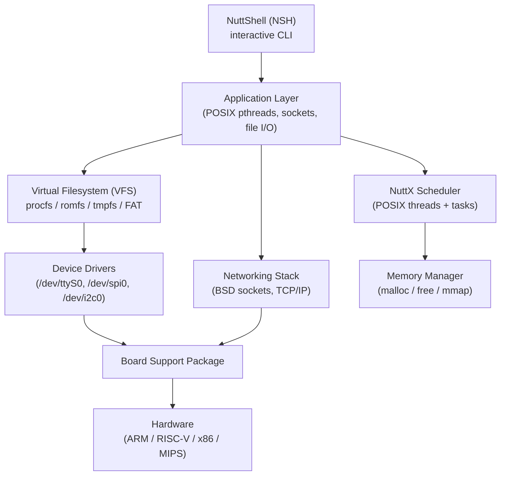
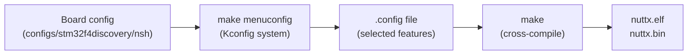

# :material-penguin: Day 16 — NuttX

!!! abstract "Day at a Glance"
    **Goal:** Understand NuttX's POSIX-compliant architecture, use pthreads and socket APIs that mirror Linux development, navigate the Linux-style Kconfig build system, and explore NuttX's remarkable pedigree from drones to spacecraft.  
    **Prerequisites:** Day 15 (embOS)  
    **Estimated Time:** 90 minutes

<div class="grid cards" markdown>
- :material-lightbulb-on: **Core Concept** — NuttX is the only RTOS covered in this course that provides a **complete POSIX.1-2017 API**, meaning code written for Linux often compiles for NuttX with zero changes
- :material-chip: **RTOS Component** — `pthread_create`, `pthread_mutex_lock`, and `socket()` are the primary concurrency and networking primitives — identical to Linux
- :material-alert: **Watch Out** — NuttX's full POSIX stack uses more RAM than bare-metal RTOSes; plan for at least 128 KB SRAM and 512 KB Flash for a networking-capable build
- :material-check-circle: **By End of Day** — Write POSIX-compliant multithreaded NuttX applications, use the NSH shell for on-target debugging, and configure a build with `make menuconfig`
</div>

---

## :material-lightbulb-on: Intuition

!!! info "Core Idea"
    Every other RTOS in this course has a proprietary API — you learn `xTaskCreate` for FreeRTOS, `chThdCreateStatic` for ChibiOS, `tx_thread_create` for ThreadX. NuttX takes a radically different approach: it implements the **POSIX standard** as faithfully as possible on a microcontroller. That means `pthread_create`, `open("/dev/ttyS0", ...)`, `socket(AF_INET, SOCK_STREAM, 0)`, and even `fork()` on capable hardware. The benefit is enormous for teams that already write Linux software — porting an existing daemon or protocol implementation to NuttX is often a matter of adjusting memory limits, not rewriting the code.

!!! success "Real-World Context"
    NuttX was created by Gregory Nutt in 2007 and is now an Apache Software Foundation top-level project. It is the RTOS inside **SpaceX's Dragon spacecraft** crew displays, **PX4 flight controller** (powering thousands of commercial and research drones), **Sony's Spresense IoT board**, and **Motorola's first Android phones**. The SpaceX use case is particularly striking: NuttX runs on an ARM Cortex-M7 handling touchscreen input and telemetry display on a human-rated spacecraft — a real-world argument for both its reliability and its POSIX compatibility.

---

## :material-sitemap: NuttX Architecture



**Supported hardware architectures:**

| Architecture | Examples |
|---|---|
| ARM Cortex-M | STM32, NXP i.MX RT, Raspberry Pi Pico |
| ARM Cortex-A | Raspberry Pi 3/4, NXP i.MX 6 |
| RISC-V | ESP32-C3, ESP32-H2, SiFive FE310 |
| x86 / x86-64 | QEMU simulation, PC/104 |
| Xtensa | ESP32, ESP32-S2, ESP32-S3 |
| MIPS | PIC32 |

---

## :material-book-open-variant: Lesson

### 1. POSIX Threads with pthreads

NuttX implements the full `pthread.h` API. Code that runs on Linux runs on NuttX with the same headers.

```c
#include <pthread.h>
#include <stdio.h>
#include <unistd.h>

#define STACK_SIZE  4096

static pthread_mutex_t printMutex = PTHREAD_MUTEX_INITIALIZER;

static void *sensorThread(void *arg) {
    int channel = (int)(intptr_t)arg;
    while (1) {
        pthread_mutex_lock(&printMutex);
        printf("Sensor[%d]: value=%d\n", channel, read_adc(channel));
        pthread_mutex_unlock(&printMutex);
        usleep(100000);           /* sleep 100 ms */
    }
    return NULL;
}

static void *logThread(void *arg) {
    while (1) {
        pthread_mutex_lock(&printMutex);
        printf("Heartbeat\n");
        pthread_mutex_unlock(&printMutex);
        sleep(1);
    }
    return NULL;
}

int main(int argc, char *argv[]) {
    pthread_t sensor0, sensor1, logger;
    pthread_attr_t attr;

    pthread_attr_init(&attr);
    pthread_attr_setstacksize(&attr, STACK_SIZE);

    /* Create threads — identical to Linux POSIX code */
    pthread_create(&sensor0, &attr, sensorThread, (void *)(intptr_t)0);
    pthread_create(&sensor1, &attr, sensorThread, (void *)(intptr_t)1);
    pthread_create(&logger,  &attr, logThread,    NULL);

    pthread_attr_destroy(&attr);

    /* Join threads (or run forever) */
    pthread_join(sensor0, NULL);
    pthread_join(sensor1, NULL);
    pthread_join(logger,  NULL);

    return 0;
}
```

!!! tip "Same code on Linux and NuttX"
    Compile the above with `gcc -lpthread` on Linux and it runs identically. Compile for NuttX and it runs on a microcontroller. This portability is NuttX's biggest advantage for teams with Linux background.

---

### 2. Mutexes and Condition Variables

```c
#include <pthread.h>

static pthread_mutex_t queueMutex = PTHREAD_MUTEX_INITIALIZER;
static pthread_cond_t  dataReady  = PTHREAD_COND_INITIALIZER;
static int             dataAvail  = 0;
static int             sharedData = 0;

/* Producer */
static void *producer(void *arg) {
    while (1) {
        pthread_mutex_lock(&queueMutex);
        sharedData = produce_value();
        dataAvail  = 1;
        pthread_cond_signal(&dataReady);   /* wake one waiter */
        pthread_mutex_unlock(&queueMutex);
        usleep(50000);
    }
    return NULL;
}

/* Consumer */
static void *consumer(void *arg) {
    while (1) {
        pthread_mutex_lock(&queueMutex);
        while (!dataAvail) {
            /* Atomically release mutex and wait for signal */
            pthread_cond_wait(&dataReady, &queueMutex);
        }
        int val = sharedData;
        dataAvail = 0;
        pthread_mutex_unlock(&queueMutex);
        consume(val);
    }
    return NULL;
}
```

!!! info "Always use `while`, not `if`, for condition variable checks"
    Spurious wakeups are permitted by POSIX. The `while (!dataAvail)` loop re-checks the condition after every wakeup, guarding against spurious returns from `pthread_cond_wait`.

---

### 3. Device Drivers — The `/dev` Interface

NuttX presents all peripherals as POSIX file descriptors, exactly like Linux.

```c
#include <fcntl.h>
#include <unistd.h>
#include <termios.h>

/* Open UART0 as a file */
int uart_init(const char *dev, int baudrate) {
    int fd = open(dev, O_RDWR | O_NOCTTY);
    if (fd < 0) return -1;

    struct termios tios;
    tcgetattr(fd, &tios);
    cfsetspeed(&tios, baudrate);
    tios.c_cflag |= (CLOCAL | CREAD);
    tcsetattr(fd, TCSANOW, &tios);
    return fd;
}

/* Write to UART just like a file */
void uart_send(int fd, const char *msg) {
    write(fd, msg, strlen(msg));
}

/* SPI example */
void spi_transfer(void) {
    int fd = open("/dev/spi0", O_RDWR);
    /* NuttX SPI ioctl matches Linux spidev interface */
    uint8_t tx[] = {0x01, 0x02, 0x03};
    uint8_t rx[3];
    struct spi_iocmd_s cmd = {
        .txbuffer = tx,
        .rxbuffer = rx,
        .len      = 3,
    };
    ioctl(fd, SPIIOC_TRANSFER, &cmd);
    close(fd);
}
```

**Common NuttX device paths:**

| Device | Path |
|---|---|
| UART 0 | `/dev/ttyS0` |
| UART 1 | `/dev/ttyS1` |
| SPI bus 0 | `/dev/spi0` |
| I2C bus 0 | `/dev/i2c0` |
| ADC | `/dev/adc0` |
| GPIO (char device) | `/dev/gpio0` |
| USB CDC/ACM | `/dev/ttyACM0` |
| Filesystem root | `/` |
| Process info | `/proc/` |

---

### 4. TCP/IP Networking — BSD Sockets

NuttX implements the Berkeley socket API fully. A TCP server on NuttX looks identical to one on Linux.

```c
#include <sys/socket.h>
#include <netinet/in.h>
#include <arpa/inet.h>
#include <unistd.h>
#include <stdio.h>
#include <string.h>

#define PORT        8080
#define BUFFER_SIZE 256

int tcp_echo_server(void) {
    int                server_fd, client_fd;
    struct sockaddr_in addr;
    char               buf[BUFFER_SIZE];
    socklen_t          addrlen = sizeof(addr);

    /* Create socket */
    server_fd = socket(AF_INET, SOCK_STREAM, 0);
    if (server_fd < 0) return -1;

    /* Bind to port */
    memset(&addr, 0, sizeof(addr));
    addr.sin_family      = AF_INET;
    addr.sin_addr.s_addr = INADDR_ANY;
    addr.sin_port        = htons(PORT);
    bind(server_fd, (struct sockaddr *)&addr, sizeof(addr));

    /* Listen and accept */
    listen(server_fd, 5);
    printf("TCP echo server listening on port %d\n", PORT);

    while (1) {
        client_fd = accept(server_fd, (struct sockaddr *)&addr, &addrlen);
        if (client_fd < 0) continue;

        ssize_t n;
        while ((n = recv(client_fd, buf, sizeof(buf), 0)) > 0) {
            send(client_fd, buf, n, 0);   /* echo back */
        }
        close(client_fd);
    }

    close(server_fd);
    return 0;
}
```

This code compiles and runs on both NuttX and Linux without modification.

---

### 5. NuttShell (NSH) — On-Target CLI

NSH is NuttX's built-in shell, accessible over UART or USB CDC. It provides a Unix-like environment for on-target debugging.

**NSH command reference:**

| Command | Description |
|---|---|
| `ps` | List running tasks and threads with PID, priority, CPU% |
| `free` | Show heap memory usage (total / used / free) |
| `ls /dev` | List all registered device drivers |
| `cat /proc/version` | Show NuttX version string |
| `cat /proc/meminfo` | Detailed memory map |
| `ifconfig` | Show network interface addresses |
| `ping 192.168.1.1` | ICMP ping (same as Linux) |
| `wget http://...` | HTTP download (if `apps/netutils/wget` enabled) |
| `hexdump /dev/adc0` | Raw read from any device file |
| `df` | Filesystem usage (romfs, tmpfs, FAT volumes) |
| `mount -t vfat /dev/mmcsd0 /mnt/sdcard` | Mount FAT filesystem |
| `nsh>` | Interactive prompt, supports scripting |

---

### 6. Build System — `make menuconfig`

NuttX uses the **Kconfig** system — the same tool as the Linux kernel — to configure hundreds of options.

```bash
# Configure for a specific board (e.g., STM32F4-Discovery + NSH)
./tools/configure.sh stm32f4discovery:nsh

# Open the graphical configuration menu (ncurses)
make menuconfig

# Build
make -j$(nproc)

# Flash (OpenOCD, pyOCD, or J-Link)
make flash
```



Key Kconfig categories:

| Category | What it controls |
|---|---|
| `CONFIG_ARCH_*` | Target architecture and MCU |
| `CONFIG_SCHED_*` | Scheduler type, priorities, SMP |
| `CONFIG_NET_*` | TCP/IP, socket buffer sizes |
| `CONFIG_FS_*` | Filesystem types (ROMFS, TMPFS, FAT) |
| `CONFIG_NSH_*` | NuttShell features and built-in commands |
| `CONFIG_PTHREAD_*` | POSIX thread options, stack sizes |

---

### 7. NuttX vs Linux Comparison

| Feature | NuttX | Linux (embedded) |
|---|---|---|
| POSIX compliance | Near-complete POSIX.1-2017 | Full POSIX |
| Minimum RAM | ~32 KB (no networking) | ~4 MB (uClinux) |
| Minimum Flash | ~64 KB | ~512 KB (stripped) |
| Boot time | < 100 ms | ~500 ms – several seconds |
| Real-time guarantees | Hard real-time | Soft RT (PREEMPT_RT patch) |
| `/dev` filesystem | Yes | Yes |
| BSD sockets | Yes | Yes |
| `fork()` / `exec()` | Partial (flat address space) | Full (MMU required for Linux) |
| Certification | Used in SpaceX, FAA-regulated drones | Not safety-certified |
| Licence | Apache 2.0 | GPL v2 |
| Scheduler | Fixed-priority preemptive | CFS + RT schedulers |

---

## :material-pencil: Exercises

**Exercise 1 — Port a Linux POSIX Application**

Take a simple Linux producer/consumer program that uses `pthread_create`, `pthread_mutex_lock`, and `pthread_cond_wait`. Configure a NuttX build for your target board (or QEMU) with `CONFIG_PTHREAD_ENABLED=y`. Copy the source into `apps/examples/myapp/`. Run `make menuconfig` to enable it. Build and verify the application runs identically on target and on Linux.

**Exercise 2 — TCP Echo Server**

Enable NuttX networking (`CONFIG_NET=y`, `CONFIG_NET_TCP=y`) and NSH networking commands. Implement the `tcp_echo_server` function from the lesson as a NuttX application. Use NSH `ifconfig` to confirm the IP address, then connect from your PC with `nc <ip> 8080` and verify the echo.

**Exercise 3 — Custom Device Driver**

Write a minimal NuttX character device driver that registers as `/dev/mydev0`. The driver should respond to `open`, `close`, `read` (returns a counter value), and `write` (resets the counter). Mount it in the board's BSP initialisation and test from NSH with `cat /dev/mydev0` and `echo x > /dev/mydev0`.

**Exercise 4 — NSH Scripting**

Create an NSH startup script (`/etc/init.d/rc.sysinit` in romfs) that: (a) prints the NuttX version; (b) runs `ifconfig`; (c) starts your TCP echo server application in the background with `&`. Rebuild the romfs image and verify the script runs automatically at boot.

---

## :material-check: Solutions

??? success "Show Solutions"

    **Exercise 1 — Solution**

    The Linux source compiles for NuttX without modification if it uses only `pthread.h`, `stdio.h`, and `unistd.h`. The only NuttX-specific step is registering the entry point:

    ```c
    /* apps/examples/myapp/myapp_main.c */
    #include <nuttx/config.h>
    int myapp_main(int argc, char *argv[]) {
        /* paste your Linux main() body here — unchanged */
        return producer_consumer_demo();
    }
    ```

    Add to `apps/examples/myapp/Kconfig`:
    ```
    config EXAMPLES_MYAPP
        tristate "My POSIX App"
        default n
    ```

    Enable `CONFIG_EXAMPLES_MYAPP=y` in `make menuconfig`, build, and run `myapp` from NSH.

    **Exercise 2 — Solution sketch**

    Enable these Kconfig options:
    ```
    CONFIG_NET=y
    CONFIG_NET_TCP=y
    CONFIG_NET_SOCKOPTS=y
    CONFIG_NET_BUFSIZE=256
    CONFIG_NETDEV_LOOPBACK=y  # for testing without hardware
    ```

    The `tcp_echo_server` function from the lesson registers as an application entry point. Run from NSH:
    ```
    nsh> tcpecho &
    nsh> ifconfig
    ```
    From PC: `nc 192.168.x.x 8080` and type anything — it echoes back.

    **Exercise 3 — Driver skeleton**

    ```c
    #include <nuttx/fs/fs.h>

    static ssize_t mydev_read(FAR struct file *filep,
                              FAR char *buf, size_t len) {
        /* Return counter as ASCII */
        int n = snprintf(buf, len, "%u\n", counter++);
        return n;
    }
    static ssize_t mydev_write(FAR struct file *filep,
                               FAR const char *buf, size_t len) {
        counter = 0;
        return len;
    }
    static const struct file_operations g_mydev_ops = {
        .read  = mydev_read,
        .write = mydev_write,
    };
    /* Call from board_initialize(): */
    register_driver("/dev/mydev0", &g_mydev_ops, 0666, NULL);
    ```

    **Exercise 4 — rc.sysinit example**

    ```sh
    #!/bin/sh
    # /etc/init.d/rc.sysinit
    cat /proc/version
    ifconfig
    tcpecho &
    ```

    Include the script in romfs by adding it to `boards/<arch>/<board>/src/romfs_file.h` and rebuilding with `make`.

---

## :material-alert: Common Pitfalls

!!! warning "Assuming NuttX has an MMU like Linux"
    Most NuttX targets (Cortex-M) have no MMU. `fork()` is not available on flat-address-space builds. Processes share a single address space. A buffer overflow in one thread can corrupt another thread's stack — enable `CONFIG_STACK_COLORATION` for debugging.

!!! warning "Stack sizes are much smaller than Linux defaults"
    Linux pthreads default to 8 MB stacks. NuttX default is `CONFIG_PTHREAD_STACK_DEFAULT` — typically 2–8 KB. Always call `pthread_attr_setstacksize` explicitly or bump the default in Kconfig. Forgetting this is the #1 cause of mysterious crashes in ported Linux code.

!!! danger "Blocking socket calls block the entire scheduler if `CONFIG_NET_TCPBACKLOG` is not set"
    Without proper non-blocking socket configuration, a blocking `recv()` with no timeout can starve other threads at the same priority. Use `SO_RCVTIMEO` or `O_NONBLOCK` + `select()` in any networked NuttX application.

!!! danger "romfs images are read-only at runtime — do not try to write to `/etc`"
    NuttX's romfs is baked into the firmware image. Any `write()` to a romfs path returns `EROFS`. If your application needs writable persistent storage, mount a separate tmpfs (`/tmp`) or FAT partition (`/mnt/sdcard`).

---

## :material-help-circle: Flashcards

???+ question "What makes NuttX unique among the RTOSes covered in this course?"
    NuttX provides the most complete **POSIX API** of any RTOS covered — including pthreads, BSD sockets, a virtual filesystem, and `/dev` device files. Code written for Linux typically compiles and runs on NuttX with zero changes, provided it stays within POSIX and does not require an MMU or `fork()`.

???+ question "What does the NuttShell (NSH) command `ps` show?"
    It lists all running NuttX tasks and pthreads with their PID, thread name, priority, CPU usage percentage, and current state (running, sleeping, waiting). It is the on-target equivalent of the Linux `ps aux` command.

???+ question "How do you configure a NuttX build for a new board?"
    Run `./tools/configure.sh <board>:<config>` to select a pre-defined board/config pair, then run `make menuconfig` to customise features using the Kconfig ncurses interface — the same workflow as configuring the Linux kernel.

???+ question "Why does NuttX appear in SpaceX Dragon spacecraft?"
    NuttX was selected for the Dragon crew display system because it combines hard real-time scheduling, a POSIX-compatible API (enabling rapid software development with Linux-familiar tools), a small and auditable codebase, and demonstrated reliability. The Apache licence also simplified the legal aspects of a safety-critical, proprietary spacecraft application.

---

## :material-clipboard-check: Self Test

=== "Question 1"
    A Linux developer has a working POSIX server application that uses `socket()`, `bind()`, `listen()`, `accept()`, `recv()`, and `send()`. What changes are needed to run it on NuttX?

=== "Answer 1"
    Minimal changes: (1) Wrap the `main()` function as a NuttX application entry point (e.g., `myapp_main`); (2) set `pthread_attr_setstacksize` explicitly since NuttX defaults are much smaller than Linux; (3) enable `CONFIG_NET=y`, `CONFIG_NET_TCP=y`, and the appropriate network driver in `make menuconfig`. The socket API calls themselves are **identical** — no changes required to the networking logic.

=== "Question 2"
    What is the difference between NuttX's `tmpfs` and `romfs`?

=== "Answer 2"
    **romfs** is a read-only filesystem baked into the firmware binary at build time — it holds startup scripts, certificates, and static data files that never change. **tmpfs** is a RAM-backed read/write filesystem that is created fresh on every boot — it holds temporary files, logs, and runtime data. tmpfs data is lost on power cycle; use a FAT partition on SD card or flash for persistent writable storage.

---

## :material-check-circle: Summary

!!! success "Key Takeaways"
    - NuttX is the **most POSIX-compatible RTOS** covered in this course — `pthread_create`, `socket()`, `open("/dev/...")`, and `make menuconfig` all work exactly as on Linux.
    - The **`/dev` filesystem** exposes every peripheral (UART, SPI, I2C, ADC, GPIO) as a standard file, enabling uniform `read`/`write`/`ioctl` access.
    - **BSD socket API** is fully implemented — a TCP server written for Linux runs on NuttX unchanged, making it ideal for teams porting existing network services to embedded hardware.
    - **NuttShell (NSH)** provides an on-target interactive shell with `ps`, `free`, `ifconfig`, `ping`, `ls /dev`, and filesystem commands — dramatically improving on-target debugging without a host debugger.
    - **`make menuconfig`** (Kconfig) provides a familiar, fine-grained build configuration system — the same mental model as the Linux kernel build.
    - NuttX targets run from **ARM Cortex-M** (32 KB SRAM) up to **Cortex-A** and **RISC-V** SoCs with full MMU and SMP support.
    - SpaceX Dragon, PX4 autopilot, and Sony Spresense all use NuttX — a testament to its reliability in demanding real-world deployments.
    - The **critical limitation**: most Cortex-M builds lack an MMU, so `fork()` is unavailable and all threads share one address space — a stack overflow in one thread can corrupt the whole system. Always set explicit stack sizes and enable stack colouration during development.
