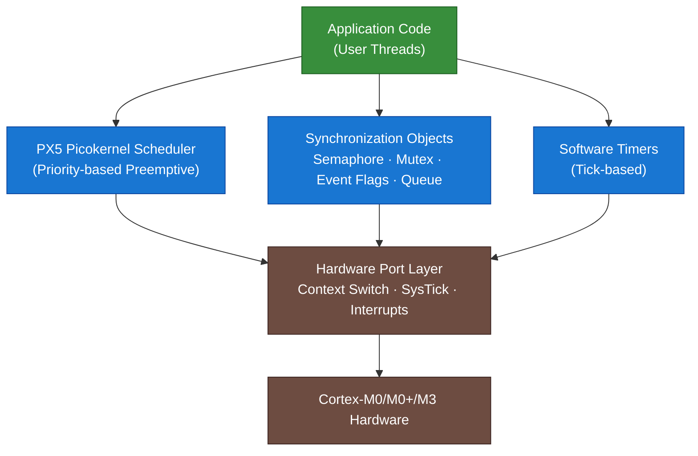

# :material-chip: Day 17 — PX5 RTOS

!!! abstract "Day at a Glance"
    **Goal:** Understand PX5, the ultra-compact picokernel RTOS from the creator of ThreadX, and learn when its extreme minimalism makes it the right choice for severely resource-constrained devices.
    **Prerequisites:** Day 16 (NuttX), familiarity with ThreadX concepts from Day 14
    **Estimated Time:** 90 minutes

<div class="grid cards" markdown>

- :material-chip: **Core Concept** — PX5 is a picokernel RTOS occupying less than 2 KB flash and 1 KB RAM while still providing preemptive multitasking
- :material-lightning-bolt: **RTOS Component** — Thread creation, semaphores, mutexes, and event flags packed into a single ANSI C translation unit
- :material-alert: **Watch Out** — PX5's extreme footprint means some services available in ThreadX are absent; design your application to need only what PX5 provides
- :material-check-circle: **By End of Day** — You can evaluate PX5 for IoT sensor and wearable projects and write a minimal multi-threaded PX5 application

</div>

---

## :material-lightbulb-on: Intuition

!!! info "Core Idea"
    Most RTOSes were designed for the hardware of their era: 32-bit microcontrollers with tens of kilobytes of RAM. PX5 was designed for a different world — Cortex-M0+ devices with 8–32 KB of flash and 2–8 KB of RAM, where every byte counts. Its creator, William Lamie, previously built ThreadX for mid-range embedded systems and then stripped the kernel down to its mathematical minimum: a scheduler, thread objects, and a handful of synchronization primitives. The result is an RTOS whose entire kernel fits in a region smaller than a single stack frame in a desktop program.

!!! success "Real-World Context"
    Think of a disposable glucose sensor patch, a smart button battery tag, or a sub-GHz wireless mesh node. These devices run for months on a coin cell, use the cheapest Cortex-M0 silicon available, and perform exactly one well-defined task. A general-purpose RTOS would waste more flash than the application itself uses. PX5 targets exactly this segment: always-on, ultra-low-power devices where the RTOS overhead must be invisible.

---

## :material-graph: PX5 Architecture Overview



> PX5's entire kernel (scheduler + sync objects + timers) lives in a single C source file. The port layer is the only hardware-specific piece, and it typically fits in under 100 lines of assembly.

---

## :material-book-open-variant: Lesson

### 1. Who Made PX5 and Why

William Lamie created ThreadX in the 1990s and grew it into one of the most widely deployed commercial RTOSes (now part of Microsoft Azure RTOS). In the 2020s, he founded Expresslogic's successor and produced PX5 as a fresh design exercise: **what is the absolute minimum kernel needed to run multiple prioritised threads safely on a microcontroller with 4–32 KB of RAM?**

The answer is the PX5 picokernel:

- **Single C source file** (`px5_kernel.c`) — the entire kernel compiles as one translation unit, enabling aggressive inlining and dead-code elimination.
- **ANSI C implementation** — no compiler extensions, no inline assembly outside the port layer, fully portable.
- **No dynamic memory in the kernel** — all kernel objects are statically allocated by the application.
- **Deterministic O(1) scheduling** — the ready-list walk is bounded regardless of thread count.

### 2. PX5 Footprint

| Resource | Typical Value | Notes |
|---|---|---|
| Flash (kernel) | < 2 KB | With LTO and -Os on GCC |
| RAM (kernel overhead) | < 1 KB | Excludes thread stacks |
| Thread stack minimum | 128 bytes | Cortex-M0, no FPU |
| Context switch time | < 100 cycles | Cortex-M0 at 48 MHz |
| Interrupt latency | < 10 cycles + ISR prologue | No kernel state in critical path |

These numbers assume link-time optimisation and that only the services actually used are linked. An application using only threads and semaphores will be smaller than one that also uses event flags and queues.

### 3. PX5 Thread API

PX5 threads are created before the scheduler starts. The API closely mirrors ThreadX to ease porting:

```c
#include "px5.h"

/* Thread control block — statically allocated */
PX5_THREAD  sensor_thread_tcb;

/* Thread stack — 256 bytes, 4-byte aligned */
static UINT32 sensor_stack[64];   /* 64 × 4 = 256 bytes */

/* Thread entry function */
static void sensor_entry(ULONG input)
{
    (void)input;
    while (1) {
        /* Read sensor hardware */
        read_adc();
        /* Sleep for 1000 ms (convert to ticks at compile time) */
        px5_thread_sleep(PX5_MS_TO_TICKS(1000));
    }
}

int main(void)
{
    /* Initialise PX5 kernel — must be called first */
    px5_kernel_initialize();

    /* Create thread: name, TCB, entry, input,
       stack base, stack size, priority, preempt-threshold */
    px5_thread_create(
        &sensor_thread_tcb,
        "SensorThread",
        sensor_entry, 0,
        sensor_stack, sizeof(sensor_stack),
        5,   /* priority 0=highest, 31=lowest */
        5    /* preemption-threshold same as priority = normal preemption */
    );

    /* Hand control to the scheduler — never returns */
    px5_kernel_enter();
}
```

Key observations:

- `px5_kernel_initialize()` sets up the tick timer and interrupt vectors.
- `px5_thread_create()` populates the TCB in-place; no heap allocation.
- `px5_kernel_enter()` enables the SysTick interrupt and performs the first context switch.
- Thread priorities are integers 0–31 (0 = highest). Unlike FreeRTOS, lower number = higher priority (same convention as ThreadX).

### 4. Synchronization Objects

#### Semaphores

```c
PX5_SEMAPHORE data_ready_sem;

/* Create counting semaphore with initial count 0 */
px5_semaphore_create(&data_ready_sem, "DataReady", 0);

/* ISR signals semaphore */
void ADC_IRQHandler(void)
{
    px5_semaphore_put_from_isr(&data_ready_sem);
}

/* Thread waits */
void process_entry(ULONG arg)
{
    while (1) {
        px5_semaphore_get(&data_ready_sem, PX5_WAIT_FOREVER);
        process_sample();
    }
}
```

#### Mutexes (with Priority Inheritance)

```c
PX5_MUTEX spi_mutex;

px5_mutex_create(&spi_mutex, "SPIBus", PX5_INHERIT);

void write_flash(const uint8_t *buf, size_t len)
{
    px5_mutex_get(&spi_mutex, PX5_WAIT_FOREVER);
    spi_transfer(buf, len);
    px5_mutex_put(&spi_mutex);
}
```

#### Event Flags

```c
PX5_EVENT_FLAGS alert_flags;
#define FLAG_TEMP_HIGH   (1u << 0)
#define FLAG_BATT_LOW    (1u << 1)

px5_event_flags_create(&alert_flags, "AlertFlags");

/* Set from any context */
px5_event_flags_set(&alert_flags, FLAG_TEMP_HIGH, PX5_OR);

/* Wait for either flag */
ULONG actual;
px5_event_flags_get(&alert_flags,
                    FLAG_TEMP_HIGH | FLAG_BATT_LOW,
                    PX5_OR_CLEAR,
                    &actual,
                    PX5_WAIT_FOREVER);
```

#### Message Queues

```c
PX5_QUEUE  sample_queue;
static ULONG queue_storage[16];   /* 16 one-word messages */

px5_queue_create(&sample_queue, "Samples",
                 PX5_1_ULONG,
                 queue_storage, sizeof(queue_storage));

/* Send */
ULONG value = adc_read();
px5_queue_send(&sample_queue, &value, PX5_NO_WAIT);

/* Receive */
ULONG received;
px5_queue_receive(&sample_queue, &received, PX5_WAIT_FOREVER);
```

### 5. PX5 Picokernel Architecture

The term *picokernel* distinguishes PX5 from a traditional microkernel. A microkernel moves drivers and services into user-space processes that communicate via IPC. PX5 has no concept of user/kernel separation at all — everything runs in privileged mode. The "pico" refers purely to size:

```
┌─────────────────────────────────┐
│  Application Threads (all       │
│  run in Handler/Thread mode,    │
│  privileged on Cortex-M0)       │
├─────────────────────────────────┤
│  PX5 Kernel Services            │
│  • Scheduler (O(1) bitmap)      │
│  • Object create/delete         │
│  • Sleep / delay                │
├─────────────────────────────────┤
│  PX5 Port (< 100 lines ASM)     │
│  • PendSV context switch        │
│  • SysTick tick handler         │
│  • Critical section (PRIMASK)   │
├─────────────────────────────────┤
│  Cortex-M0+ Hardware            │
└─────────────────────────────────┘
```

Because Cortex-M0 has no MPU, there is no memory protection between threads. PX5 accepts this trade-off to achieve its size target. For devices needing memory protection, the user should evaluate ThreadX on a Cortex-M3/M4 with MPU.

### 6. Scheduling Policy

PX5 uses **fixed-priority preemptive scheduling** with a **preemption-threshold** feature inherited from ThreadX. The preemption threshold allows a thread to block lower-priority threads from preempting it without disabling all interrupts:

- A thread at priority P with threshold T can only be preempted by threads with priority < T (lower number = higher priority in PX5).
- This provides cooperative-style execution between threads of similar priority while preserving full preemption for high-priority threads.

```
Priority 0 ──── highest priority
Priority 1 ──── ...
Priority 5 ──── SensorThread (threshold=5, normal preemption)
Priority 6 ──── ProcessThread (threshold=5, cannot preempt SensorThread)
Priority 10 ─── DisplayThread
Priority 31 ─── IdleThread (built-in)
```

### 7. Software Timers

```c
PX5_TIMER heartbeat_timer;

static void heartbeat_callback(ULONG arg)
{
    toggle_led(LED_GREEN);
}

/* One-shot timer: fires once after 500 ms */
px5_timer_create(&heartbeat_timer, "Heartbeat",
                 heartbeat_callback, 0,
                 PX5_MS_TO_TICKS(500),
                 0,              /* reschedule ticks=0 means one-shot */
                 PX5_AUTO_ACTIVATE);

/* Periodic timer: fires every 1000 ms */
px5_timer_create(&heartbeat_timer, "Heartbeat",
                 heartbeat_callback, 0,
                 PX5_MS_TO_TICKS(1000),
                 PX5_MS_TO_TICKS(1000),  /* reschedule = same period */
                 PX5_AUTO_ACTIVATE);
```

Timer callbacks execute in the context of the SysTick ISR — keep them short and non-blocking.

### 8. PX5 vs ThreadX — Side-by-Side Comparison

| Dimension | PX5 | ThreadX / Azure RTOS |
|---|---|---|
| Creator | William Lamie | William Lamie |
| Era | 2020s | 1990s (Azure RTOS 2019+) |
| Target MCU | Cortex-M0/M0+ (4–32 KB RAM) | Cortex-M3/M4/M7 (32 KB+ RAM) |
| Flash footprint | < 2 KB | 6–20 KB |
| RAM overhead | < 1 KB | 2–6 KB |
| Memory protection (MPU) | No (Cortex-M0 has no MPU) | Yes (optional) |
| API style | ThreadX-compatible subset | Full ThreadX API |
| POSIX layer | No | Optional add-on |
| Networking | No | NetX Duo (add-on) |
| FileX filesystem | No | Yes (add-on) |
| Certification (IEC 61508) | Not offered | Available |
| Licensing | Commercial (royalty) | Commercial / MIT via GitHub |
| Best for | IoT sensor nodes, wearables, tags | Industrial, medical, automotive |

### 9. Licensing Model

PX5 is commercially licensed by Express Logic (now part of the same ecosystem as Azure RTOS). Key points:

- No royalty-free community edition as of 2024 (unlike ThreadX which was open-sourced on GitHub).
- Evaluation licenses available for prototyping.
- The source code is provided to licensees; there is no binary-only distribution.
- For open-source projects targeting ultra-tiny devices, consider FreeRTOS-Kernel with `-DPORTABLE_HEAP_SIZE=0` and static allocation only — it achieves comparable footprints on Cortex-M0 with more community support.

### 10. Complete Minimal PX5 Application

```c
/*
 * minimal_px5_app.c
 *
 * Two-thread PX5 application:
 *   - ProducerThread: generates values and posts to queue
 *   - ConsumerThread: reads queue and toggles LED
 *
 * Target: Cortex-M0+, 32 KB flash, 8 KB RAM
 * Kernel footprint: ~1.8 KB flash, ~600 bytes RAM (excl. stacks)
 */

#include "px5.h"
#include "board.h"    /* board_init(), LED_toggle(), adc_read() */

/* ── Object Control Blocks (statically declared) ─────────────────── */
static PX5_THREAD   producer_tcb;
static PX5_THREAD   consumer_tcb;
static PX5_QUEUE    data_queue;

/* ── Stacks ──────────────────────────────────────────────────────── */
static UINT32  producer_stack[64];   /* 256 bytes */
static UINT32  consumer_stack[64];   /* 256 bytes */

/* ── Queue storage (4 messages × 1 ULONG each) ───────────────────── */
static ULONG   queue_mem[4];

/* ── Thread entry functions ──────────────────────────────────────── */

static void producer_entry(ULONG arg)
{
    ULONG sample;
    while (1) {
        sample = (ULONG)adc_read();
        /* Non-blocking send; discard if queue full */
        px5_queue_send(&data_queue, &sample, PX5_NO_WAIT);
        px5_thread_sleep(PX5_MS_TO_TICKS(100));  /* 10 Hz */
    }
}

static void consumer_entry(ULONG arg)
{
    ULONG value;
    while (1) {
        /* Block until a sample is available */
        if (px5_queue_receive(&data_queue, &value,
                              PX5_WAIT_FOREVER) == PX5_SUCCESS) {
            if (value > 3000) {
                LED_toggle(LED_RED);
            } else {
                LED_toggle(LED_GREEN);
            }
        }
    }
}

/* ── Application initialisation ─────────────────────────────────── */

int main(void)
{
    board_init();
    px5_kernel_initialize();

    /* Queue: 1-ULONG messages, 4 slots */
    px5_queue_create(&data_queue, "DataQ",
                     PX5_1_ULONG,
                     queue_mem, sizeof(queue_mem));

    /* Producer: priority 3, 256-byte stack */
    px5_thread_create(&producer_tcb, "Producer",
                      producer_entry, 0,
                      producer_stack, sizeof(producer_stack),
                      3, 3);

    /* Consumer: priority 4, 256-byte stack */
    px5_thread_create(&consumer_tcb, "Consumer",
                      consumer_entry, 0,
                      consumer_stack, sizeof(consumer_stack),
                      4, 4);

    /* Start scheduler — never returns */
    px5_kernel_enter();
    return 0;  /* unreachable */
}
```

**Memory budget for this application on Cortex-M0+:**

| Region | Size |
|---|---|
| PX5 kernel (.text) | ~1,800 bytes |
| Application (.text) | ~800 bytes |
| Producer stack | 256 bytes |
| Consumer stack | 256 bytes |
| Queue storage | 16 bytes |
| Kernel RAM overhead | ~600 bytes |
| **Total** | **~3,728 bytes flash / ~1,128 bytes RAM** |

---

## :material-pencil: Exercises

**Exercise 1 — Footprint Measurement**

Build the minimal PX5 application above (or simulate with a compatible RTOS) targeting a Cortex-M0+ at `-Os`. Use `arm-none-eabi-size` to measure the `.text`, `.data`, and `.bss` sections. Compare against the same logic implemented with FreeRTOS (static allocation only). Document the difference in a table and explain which factors drive the gap.

**Exercise 2 — Preemption-Threshold Exploration**

Create three threads at priorities 2, 3, and 4. Set thread priority-3's preemption threshold to 2. Write a test where thread priority-4 and priority-3 both want to run after the same semaphore is posted. Observe whether priority-4 can preempt priority-3. Document your observations and explain the mechanism.

**Exercise 3 — ISR-to-Thread Communication**

Using PX5 semaphores, implement an ADC-complete ISR that signals a processing thread. The processing thread should compute a running average of 8 samples and post a result to a second queue consumed by a display thread. Draw the data-flow diagram and measure the end-to-end latency from ISR to display update using GPIO toggles and an oscilloscope or logic analyser.

**Exercise 4 — ThreadX to PX5 Migration Analysis**

You have a ThreadX application with 4 threads, 3 mutexes, 2 queues, and 1 byte pool (dynamic memory). List each ThreadX API call used and determine whether PX5 provides a direct equivalent, a partial equivalent, or no equivalent. For APIs with no equivalent, propose an alternative design pattern that achieves the same goal within PX5's constraints.

---

## :material-check: Solutions

??? success "Show Solutions"

    **Exercise 1 — Expected Results**

    Typical measurements on GCC 12 with `-Os -flto`, Cortex-M0+ target (`-mcpu=cortex-m0plus -mthumb`):

    | RTOS | .text (kernel) | Total .text | .bss (kernel) |
    |---|---|---|---|
    | PX5 | ~1,800 bytes | ~2,600 bytes | ~580 bytes |
    | FreeRTOS (static-only) | ~3,200 bytes | ~4,000 bytes | ~320 bytes |

    FreeRTOS's larger .text comes from its more complete feature set (trace hooks, stats gathering, software timer task). With `configUSE_TIMERS=0`, `configUSE_STATS_FORMATTING_FUNCTIONS=0`, and all trace macros disabled, FreeRTOS approaches ~2,400 bytes — the gap narrows but PX5 still leads.

    **Exercise 2 — Preemption Threshold Explanation**

    With thread P3 having threshold=2: P4 (lower priority number means higher, so priority 4 is *lower* than priority 3 in PX5 convention) cannot preempt P3 because P4's priority (4) is NOT less than the threshold (2). P2 (higher priority) can still preempt P3. This lets P3 run atomically with respect to P4 without disabling interrupts, reducing critical-section overhead.

    **Exercise 3 — Latency Measurement**

    Expected ISR→thread wake latency on a 48 MHz Cortex-M0+: 3–8 µs depending on pipeline state. Thread→queue post→display thread wake: additional 2–5 µs. Total end-to-end: typically under 15 µs, demonstrating PX5's deterministic low-latency characteristics.

    **Exercise 4 — Migration Analysis**

    | ThreadX API | PX5 Equivalent | Status |
    |---|---|---|
    | `tx_thread_create` | `px5_thread_create` | Direct |
    | `tx_mutex_create` | `px5_mutex_create` | Direct |
    | `tx_queue_create` | `px5_queue_create` | Direct |
    | `tx_byte_pool_create` | *None* | No equivalent |
    | `tx_byte_allocate` | *None* | Use static arrays instead |
    | `tx_byte_release` | *None* | Lifetime-based allocation |

    For the byte pool: redesign to pre-allocate fixed-size buffers. Since PX5 targets devices with < 8 KB RAM, dynamic allocation is an anti-pattern anyway — static buffers make memory usage deterministic and eliminates fragmentation.

---

## :material-alert: Common Pitfalls

!!! warning "Timer Callbacks Run in ISR Context"
    PX5 software timer callbacks execute inside the SysTick interrupt handler, not in a dedicated timer thread. Never call blocking APIs (`px5_thread_sleep`, `px5_semaphore_get` with a timeout, `px5_queue_receive`) from a timer callback. Use `px5_semaphore_put_from_isr` or `px5_queue_send` with `PX5_NO_WAIT` instead to signal a thread that does the real work.

!!! warning "Priority Numbers Are Inverted Compared to FreeRTOS"
    In PX5 (and ThreadX), **lower number = higher priority**. In FreeRTOS, higher number = higher priority. This is a common source of bugs when porting. A FreeRTOS task at `configMAX_PRIORITIES - 1` (highest) maps to PX5 priority `0` (highest). Document your priority scheme with named constants, not raw numbers.

!!! danger "No Stack Overflow Detection on Cortex-M0"
    Cortex-M0 has no MPU, so there is no hardware guard to detect stack overflow. PX5 does not insert stack-canary patterns by default. If a thread overflows its stack it will silently corrupt adjacent memory. Always calculate worst-case stack depth (use a static analysis tool or paint the stack with a known pattern at startup and measure high-water mark during testing) and add a safety margin of at least 64 bytes.

!!! danger "Cortex-M0 Has No Atomic Read-Modify-Write"
    Unlike Cortex-M3/M4, Cortex-M0 has no `LDREX`/`STREX` instructions. All shared-data access must use PX5 critical sections (`px5_critical_section_enter` / `px5_critical_section_exit`, which manipulate `PRIMASK`). Never use `volatile`-only accesses to shared multi-byte variables between threads.

---

## :material-help-circle: Flashcards

???+ question "What does the 'pico' in PX5 picokernel mean?"
    It refers purely to size — the entire PX5 kernel (scheduler + synchronization objects + timers) occupies less than 2 KB of flash and less than 1 KB of RAM. Unlike a microkernel (which moves services to user space via IPC), PX5 has no user/kernel separation; everything runs privileged. "Pico" just means very, very small.

???+ question "How does PX5's priority numbering compare to FreeRTOS?"
    They are inverted. In PX5 (and ThreadX), priority 0 is the **highest** priority and larger numbers are lower priority. In FreeRTOS, priority 0 is the **lowest** and `configMAX_PRIORITIES - 1` is the highest. Always use named constants for priorities to avoid confusion when mixing documentation or porting code.

???+ question "What is a preemption threshold and why is it useful?"
    A preemption threshold T on a thread at priority P means: only threads with priority **lower than T** (numerically, for PX5: priority number < T) can preempt this thread. This allows a thread to protect a short critical section without disabling all interrupts, preserving low interrupt latency while still preventing lower-priority threads from interrupting a partially-completed operation.

???+ question "Why does PX5 not support dynamic memory allocation?"
    PX5 targets devices with 2–8 KB of RAM. Dynamic allocation (malloc/free) requires a heap manager that itself consumes RAM and introduces non-deterministic allocation times and fragmentation risk. By requiring all kernel objects and thread stacks to be statically allocated, PX5 guarantees deterministic behaviour and eliminates a whole class of runtime failures — exactly what resource-constrained, long-running IoT devices need.

---

## :material-clipboard-check: Self Test

=== "Question 1"
    A developer ports a ThreadX application to PX5 and notices a task that previously ran is now missing. The task used `tx_byte_allocate` to claim a dynamic buffer at startup. What has gone wrong and how should it be fixed?

=== "Answer 1"
    PX5 has no byte-pool (dynamic memory) service. The `tx_byte_allocate` call has no PX5 equivalent and would either fail to compile or link. The fix is to convert the dynamic buffer to a statically declared array of the maximum required size. This also improves determinism — on a tiny MCU with < 8 KB RAM, dynamic allocation is an anti-pattern regardless of RTOS choice.

=== "Question 2"
    A PX5 application on a Cortex-M0+ occasionally crashes in an unpredictable way after running for several hours. No assertions fire. What are the two most likely causes and how would you diagnose each?

=== "Answer 2"
    **1. Stack overflow:** Cortex-M0 has no MPU; a thread that grows beyond its declared stack silently corrupts adjacent memory. Diagnose by painting stacks with `0xDEADBEEF` at startup and periodically checking the high-water mark with a debug task or watchdog. **2. Missing critical section around multi-byte shared variable:** Cortex-M0 lacks atomic RMW instructions; without `px5_critical_section_enter/exit`, a scheduler interrupt between byte writes can expose a torn read. Diagnose with a logic analyser on a GPIO toggled at the start and end of the vulnerable region, or with source-level static analysis.

---

## :material-check-circle: Summary

!!! success "Key Takeaways"
    - **PX5 is the smallest production RTOS** from the creator of ThreadX — less than 2 KB flash, less than 1 KB RAM overhead, single ANSI C source file.
    - **ThreadX-compatible API subset:** if you know ThreadX, PX5 feels familiar; priorities, object creation patterns, and the preemption-threshold concept are shared.
    - **No dynamic memory, no MPU reliance:** PX5 embraces the constraints of Cortex-M0 rather than fighting them — static allocation everywhere, critical sections via PRIMASK.
    - **Picokernel ≠ microkernel:** PX5 does not separate kernel and user space; "pico" refers only to code size.
    - **Best fit:** disposable IoT sensors, wearables, sub-GHz mesh nodes, any system where flash < 32 KB and RAM < 8 KB make a conventional RTOS impractical.
    - **Tomorrow:** eCos — a configurable, component-based RTOS at the other end of the flexibility spectrum, built for network-connected embedded Linux-class devices.
