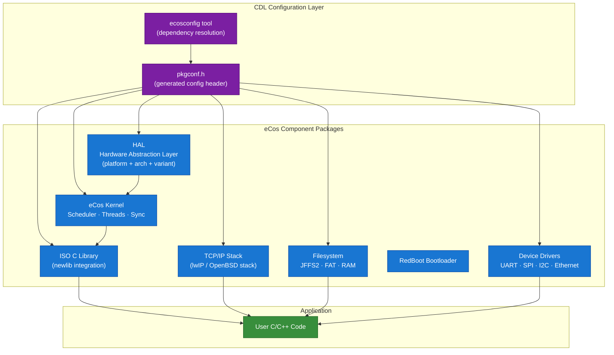
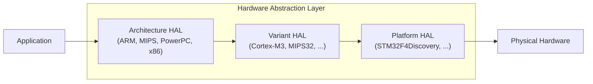

# :material-layers: Day 18 — eCos

!!! abstract "Day at a Glance"
    **Goal:** Understand eCos's unique component-based configuration model, learn its threading and synchronization APIs, and see how the `ecosconfig` tool and configuration hierarchy let you build a custom kernel for exactly your hardware.
    **Prerequisites:** Day 17 (PX5), Days 11–16 for RTOS API context
    **Estimated Time:** 90 minutes

<div class="grid cards" markdown>

- :material-layers: **Core Concept** — eCos is assembled from software components at build time; you choose exactly which kernel features, drivers, and stacks to include
- :material-chip: **RTOS Component** — `cyg_thread_create`, `cyg_semaphore_*`, `cyg_mutex_*`, plus RedBoot bootloader and optional TCP/IP and JFFS2
- :material-alert: **Watch Out** — The `ecosconfig` tool and CDL (Component Definition Language) have a steep learning curve; misconfigured constraints produce subtle link-time errors
- :material-check-circle: **By End of Day** — You can configure, build, and boot a minimal eCos kernel on a supported target, and write multi-threaded eCos applications using its synchronization primitives

</div>

---

## :material-lightbulb-on: Intuition

!!! info "Core Idea"
    Most RTOSes give you a fixed feature set and let you disable things you do not need. eCos inverts this: you start with *nothing* and add components. Each component declares its interface, its dependencies, and its configuration options in CDL (Component Definition Language). The `ecosconfig` tool resolves the dependency graph and generates a `pkgconf.h` that configures the C source before compilation. The result is a kernel that is exactly as large as the union of features you actually need — no dead code, no unused data structures.

!!! success "Real-World Context"
    eCos was originally developed by Cygnus Solutions (later Red Hat) for router and network appliance firmware in the late 1990s. eCos-based firmware ran in millions of cable modems, DSL routers, and VoIP adapters. Its component model was genuinely ahead of its time — the same idea reappeared decades later in Zephyr's Kconfig system and in CMake components. If you understand eCos's architecture, Zephyr's build system will feel very familiar.

---

## :material-graph: eCos Component Architecture



### eCos HAL Hierarchy



The three-level HAL ensures that architecture-generic code (interrupt entry/exit), variant-specific code (NVIC on Cortex-M), and board-specific code (pin mapping, clock init) are cleanly separated and independently replaceable.

---

## :material-book-open-variant: Lesson

### 1. History and Positioning

eCos (embedded Configurable OS) was created at Cygnus Solutions in 1997, open-sourced by Red Hat in 2002 under a modified GPL (the eCos License), and is now maintained by the community at `ecos.sourceware.org`. Key milestones:

- **1997:** First version for Fujitsu FR-V processor
- **1999:** Port to ARM, MIPS, PowerPC, x86 (80 architectures eventually)
- **2002:** Red Hat open-sources eCos under modified GPL
- **2004:** eCos 3.0 with improved component model
- **2009+:** Community maintenance; still active for networking appliances

eCos sits in a different niche than FreeRTOS or ThreadX:

- More capable than FreeRTOS out of the box (integrated TCP/IP, filesystem, bootloader)
- More configurable than VxWorks or ThreadX
- Heavier than PX5 or bare FreeRTOS (minimum usable configuration ~10–20 KB flash)
- Best fit: network-connected appliances with 256 KB+ flash

### 2. The ecosconfig Tool

`ecosconfig` is a command-line tool that manages eCos repository packages:

```bash
# Create a new eCos configuration for ARM Cortex-M3 target
ecosconfig new stm32f103 default

# List all available packages
ecosconfig list

# Add the TCP/IP stack component
ecosconfig add net/tcpip

# Add the JFFS2 filesystem
ecosconfig add fs/jffs2

# Check for unresolved dependencies and conflicts
ecosconfig check

# Generate the build tree (Makefiles + pkgconf.h)
ecosconfig tree

# Build the eCos library
make -C build
```

The generated `pkgconf.h` contains hundreds of `#define` constants that configure every aspect of the kernel at compile time:

```c
/* pkgconf.h (excerpt — auto-generated, do not edit) */
#define CYGNUM_KERNEL_SCHED_PRIORITIES          32
#define CYGNUM_KERNEL_THREADS_STACK_SIZE_DEFAULT 4096
#define CYGPKG_KERNEL_THREADS_DESTRUCTORS_LIST
#define CYGNUM_KERNEL_SEM_COUNT_TYPE            cyg_count32
#undef  CYGPKG_POSIX                           /* POSIX layer not selected */
#define CYGPKG_NET_LWIP                        /* lwIP TCP/IP selected */
```

### 3. eCos Configuration Hierarchy

eCos packages are organised into a tree. Each node is a CDL *component*, *option*, or *interface*:

```
ECOS REPOSITORY
├── hal/                       Hardware Abstraction Layer
│   ├── common/                Architecture-independent HAL
│   ├── arm/                   ARM architecture HAL
│   │   ├── arch/              ARM core (registers, exceptions)
│   │   ├── cortexm/           Cortex-M variant (NVIC, SysTick)
│   │   └── stm32/             STM32 platform (clocks, UART, GPIO)
├── kernel/                    eCos Kernel
│   ├── sched/                 Schedulers (MLQ, bitmap)
│   ├── thread/                Thread management
│   ├── sync/                  Semaphores, mutexes, flags, queues
│   └── timer/                 Counters, alarms, real-time clock
├── language/c/                ISO C library (newlib)
├── net/                       Networking
│   ├── tcpip/                 BSD/lwIP TCP/IP stack
│   └── snmp/                  SNMP agent
├── fs/                        Filesystems
│   ├── jffs2/                 Journalling Flash FS v2
│   ├── fat/                   FAT12/16/32
│   └── ramfs/                 RAM-based filesystem
└── io/                        I/O subsystem and drivers
```

Each package has a `cdl/` directory with `.cdl` files that declare:

```tcl
# Example CDL option (simplified)
cdl_option CYGNUM_KERNEL_SCHED_PRIORITIES {
    display       "Number of thread priorities"
    flavor        data
    default_value 32
    legal_values  2 to 32
    requires      CYGPKG_KERNEL
    description   "Sets the number of distinct thread priorities.
                   Reducing this value reduces the scheduler bitmap size."
}
```

### 4. Thread Creation

eCos thread objects are C++ objects (eCos is written in C++ with C compatibility wrappers). The C API uses `cyg_thread_create`:

```c
#include <cyg/kernel/kapi.h>

/* Thread stack — allocated by application */
#define STACK_SIZE  4096
static unsigned char sensor_stack[STACK_SIZE];

/* Thread handle and object storage */
static cyg_handle_t  sensor_handle;
static cyg_thread    sensor_obj;

/* Thread entry function */
static void sensor_thread(cyg_addrword_t data)
{
    cyg_tick_count_t next_wake = cyg_current_time();

    while (1) {
        /* Periodic execution every 100 ticks (= 100 ms at 1 kHz tick) */
        next_wake += 100;
        cyg_thread_delay(next_wake - cyg_current_time());

        read_and_process_sensor();
    }
}

/* Called from cyg_user_start() — eCos entry point */
void cyg_user_start(void)
{
    cyg_thread_create(
        4,                   /* priority (0=highest, 31=lowest) */
        sensor_thread,       /* entry function */
        (cyg_addrword_t)0,   /* entry data */
        "SensorThread",      /* name (for debug) */
        sensor_stack,        /* stack base */
        STACK_SIZE,          /* stack size */
        &sensor_handle,      /* returned handle */
        &sensor_obj          /* thread object storage */
    );

    cyg_thread_resume(sensor_handle);
}
```

**Important:** eCos does not have a `main()`. The entry point is `cyg_user_start()`. The eCos startup code initialises the HAL, constructs static C++ objects, then calls `cyg_user_start()` before starting the scheduler.

### 5. Semaphores

```c
#include <cyg/kernel/kapi.h>

/* Binary semaphore (initial count = 0) */
static cyg_sem_t data_ready;

void init_sync(void)
{
    cyg_semaphore_init(&data_ready, 0);
}

/* Called from ISR context — eCos ISR safe post */
void adc_isr_handler(void)
{
    cyg_semaphore_post(&data_ready);   /* safe from DSR/ISR context */
}

/* Processing thread */
static void process_thread(cyg_addrword_t data)
{
    while (1) {
        /* Block indefinitely */
        cyg_semaphore_wait(&data_ready);
        process_adc_result();
    }
}

/* Timed wait — returns false if timeout expires */
static void timed_process_thread(cyg_addrword_t data)
{
    while (1) {
        cyg_bool_t got = cyg_semaphore_timed_wait(
            &data_ready,
            cyg_current_time() + 500   /* timeout: 500 ticks */
        );
        if (got) {
            process_adc_result();
        } else {
            handle_sensor_timeout();
        }
    }
}
```

### 6. Mutexes

eCos mutexes support priority inheritance by configuration (`CYGSEM_KERNEL_SYNCH_MUTEX_PRIORITY_INVERSION_PROTOCOL_INHERIT`):

```c
static cyg_mutex_t spi_bus_lock;

void init_mutex(void)
{
    cyg_mutex_init(&spi_bus_lock);
    /* Priority ceiling can also be set per mutex */
}

void write_device(const uint8_t *buf, size_t len)
{
    cyg_mutex_lock(&spi_bus_lock);
    spi_transfer(buf, len);
    cyg_mutex_unlock(&spi_bus_lock);
}
```

### 7. Condition Variables

eCos provides POSIX-style condition variables, which pair with mutexes for producer/consumer patterns:

```c
static cyg_mutex_t     buf_mutex;
static cyg_cond_t      buf_not_empty;
static cyg_cond_t      buf_not_full;
static uint8_t         ring_buf[64];
static int             head = 0, tail = 0, count = 0;

void producer(cyg_addrword_t arg)
{
    while (1) {
        uint8_t sample = adc_read();
        cyg_mutex_lock(&buf_mutex);
        while (count == 64)
            cyg_cond_wait(&buf_not_full);   /* releases mutex while waiting */
        ring_buf[head] = sample;
        head = (head + 1) & 63;
        count++;
        cyg_cond_signal(&buf_not_empty);
        cyg_mutex_unlock(&buf_mutex);
    }
}

void consumer(cyg_addrword_t arg)
{
    while (1) {
        cyg_mutex_lock(&buf_mutex);
        while (count == 0)
            cyg_cond_wait(&buf_not_empty);
        uint8_t val = ring_buf[tail];
        tail = (tail + 1) & 63;
        count--;
        cyg_cond_signal(&buf_not_full);
        cyg_mutex_unlock(&buf_mutex);
        display(val);
    }
}
```

### 8. Message Mailboxes

eCos mailboxes pass single-pointer messages (equivalent to FreeRTOS queues of pointer size):

```c
static cyg_mbox     raw_mbox;
static cyg_handle_t mbox_handle;

/* Initialise */
cyg_mbox_create(&mbox_handle, &raw_mbox);

/* Send (pointer-sized message, non-blocking) */
cyg_bool_t ok = cyg_mbox_tryput(mbox_handle, (void *)my_data_ptr);

/* Blocking receive */
void *msg = cyg_mbox_get(mbox_handle);
```

### 9. Interrupt Handling: ISR/DSR Model

eCos uses a **two-level interrupt model** unique among embedded RTOSes:

```
Hardware Interrupt
      │
      ▼
   ISR (Interrupt Service Routine)
   - Runs with interrupts disabled (or at current priority)
   - Must be fast — clear hardware flag, read data, schedule DSR
   - Returns CYG_ISR_HANDLED or CYG_ISR_CALL_DSR
      │ CYG_ISR_CALL_DSR
      ▼
   DSR (Deferred Service Routine)
   - Runs with interrupts re-enabled, before thread resumption
   - Can post semaphores, signal condition variables
   - Cannot block or call blocking kernel APIs
      │
      ▼
   Thread (woken by semaphore/condition posted in DSR)
```

```c
static cyg_interrupt  uart_intr_obj;
static cyg_handle_t   uart_intr_handle;
static cyg_sem_t      uart_rx_sem;

/* ISR — minimal work */
static cyg_uint32 uart_isr(cyg_vector_t vec, cyg_addrword_t data)
{
    /* Read received byte into ring buffer */
    uart_rx_buf[uart_rx_head++] = UART_DR;
    uart_rx_head &= (RX_BUF_SIZE - 1);
    cyg_interrupt_mask(vec);    /* re-mask until DSR re-arms */
    return CYG_ISR_HANDLED | CYG_ISR_CALL_DSR;
}

/* DSR — can signal threads */
static void uart_dsr(cyg_vector_t vec, cyg_ucount32 count, cyg_addrword_t data)
{
    cyg_semaphore_post(&uart_rx_sem);
    cyg_interrupt_unmask(vec);
}

void init_uart_interrupt(void)
{
    cyg_semaphore_init(&uart_rx_sem, 0);
    cyg_interrupt_create(
        CYGNUM_HAL_INTERRUPT_UART0_RX,
        0,              /* priority */
        0,              /* data */
        uart_isr,
        uart_dsr,
        &uart_intr_handle,
        &uart_intr_obj
    );
    cyg_interrupt_attach(uart_intr_handle);
    cyg_interrupt_unmask(CYGNUM_HAL_INTERRUPT_UART0_RX);
}
```

### 10. RedBoot Bootloader

RedBoot is the eCos-based bootloader. It is itself an eCos application, providing:

- Serial and network (TFTP) firmware download
- Flash programming
- GDB stub for remote debugging over serial or Ethernet
- Basic command-line interface

```
RedBoot> load -r -b 0x20000000 firmware.bin    # load via TFTP
RedBoot> fis write -b 0x20000000 -l 0x40000 -f 0x08010000  # program flash
RedBoot> go 0x08010000                          # jump to application
```

RedBoot's GDB stub means you can do full source-level debugging over a serial port without a hardware JTAG debugger — valuable on low-cost hardware.

### 11. Networking Stack

eCos supports two TCP/IP stacks selectable at configuration time:

| Stack | Package | Notes |
|---|---|---|
| OpenBSD-derived | `net/tcpip` | Full BSD sockets API, IPv4/IPv6 |
| lwIP | `net/lwip` | Lighter weight, suitable for < 64 KB RAM |

```c
#include <network.h>
#include <sys/socket.h>
#include <netinet/in.h>

void network_thread(cyg_addrword_t data)
{
    /* eCos network init — blocks until interface is up */
    init_all_network_interfaces();

    int sock = socket(AF_INET, SOCK_STREAM, 0);
    struct sockaddr_in addr = {
        .sin_family = AF_INET,
        .sin_port   = htons(8080),
        .sin_addr.s_addr = INADDR_ANY
    };
    bind(sock, (struct sockaddr *)&addr, sizeof(addr));
    listen(sock, 5);

    while (1) {
        int client = accept(sock, NULL, NULL);
        /* Handle client connection */
        handle_http_request(client);
        close(client);
    }
}
```

### 12. JFFS2 Filesystem

JFFS2 (Journalling Flash File System version 2) provides a crash-consistent filesystem on raw NOR/NAND flash:

```c
#include <cyg/fileio/fileio.h>

void fs_example(void)
{
    /* Mount JFFS2 on flash partition */
    int ret = mount("/dev/flash0/0", "/", "jffs2");
    if (ret < 0) {
        diag_printf("Mount failed: %d\n", errno);
        return;
    }

    /* Standard POSIX file operations */
    int fd = open("/config.bin", O_WRONLY | O_CREAT | O_TRUNC, 0644);
    write(fd, &config, sizeof(config));
    close(fd);
}
```

### 13. eCos Licensing

eCos uses the **eCos License**, a modified version of the GNU GPL v2 with an explicit exception:

> Any application code that links with eCos is **not** required to be GPL. Only modifications to eCos library code itself must be contributed back under GPL.

This is more permissive than pure GPL (no copyleft infection) but less permissive than MIT or Apache 2.0 (modifications to eCos must be shared). It makes eCos viable for proprietary products while keeping the RTOS itself open.

### 14. eCos vs Other RTOSes Summary

| Dimension | eCos | FreeRTOS | Zephyr | ThreadX |
|---|---|---|---|---|
| Configuration model | CDL component tree | Compile-time #defines | Kconfig | #defines |
| Min flash (kernel only) | ~10 KB | ~4 KB | ~8 KB | ~6 KB |
| TCP/IP | Integrated (optional) | Add-on | Built-in | NetX Duo |
| Filesystem | JFFS2, FAT | FatFS add-on | LittleFS | FileX |
| Bootloader | RedBoot | None | MCUboot | None |
| Licensing | Modified GPL | MIT | Apache 2.0 | Commercial/MIT |
| C++ support | Native (kernel in C++) | Limited | Yes | No |
| Community activity | Low (legacy) | Very high | High | Medium |
| Best for | Network appliances, routers | General embedded | IoT/BLE | Industrial/medical |

---

## :material-pencil: Exercises

**Exercise 1 — Configure a Minimal eCos Kernel**

Using the eCos host tools (or studying the CDL documentation), determine which CDL packages are required for a minimal eCos configuration on an ARM Cortex-M3 target that supports:

- 8 thread priorities
- Counting semaphores
- Mutexes with priority inheritance
- A 1 kHz system tick

List the required packages and key CDL options. Estimate the resulting flash footprint using the figures from the lesson. Write the `cyg_user_start()` stub that creates one thread and calls `cyg_thread_resume()`.

**Exercise 2 — ISR/DSR Design for UART Receive**

Design a complete ISR/DSR pair for receiving bytes from a UART into a 256-byte ring buffer. The ISR should run as fast as possible; the DSR should signal a semaphore if the buffer contains at least 16 bytes (a "burst threshold"). The consumer thread should read and print all available bytes when woken.

Write the data structures, ISR, DSR, and consumer thread. Explain why the DSR cannot call `cyg_semaphore_wait()`.

**Exercise 3 — Add TCP/IP to eCos and Build a Simple HTTP Server**

Starting from Exercise 1's minimal configuration, add the `net/tcpip` package (or `net/lwip`). Write a single-threaded HTTP server that responds to any GET request with a 200 OK containing the current tick count as an HTML page. Use only BSD socket calls (`socket`, `bind`, `listen`, `accept`, `read`, `write`, `close`). What additional CDL options must be set to enable the Ethernet driver?

**Exercise 4 — CDL Dependency Analysis**

The JFFS2 package (`fs/jffs2`) depends on several other components. Without running `ecosconfig`, list at least four packages or options that JFFS2 likely depends on (hint: think about what JFFS2 needs: block devices, MTD layer, memory allocation, POSIX file API). Then explain how the CDL `requires` keyword enforces these dependencies at configuration time rather than at link time.

---

## :material-check: Solutions

??? success "Show Solutions"

    **Exercise 1 — Minimal CDL Package List**

    Required packages and key options:
    ```
    CYGPKG_HAL              # Common HAL
    CYGPKG_HAL_ARM          # ARM architecture HAL
    CYGPKG_HAL_CORTEXM      # Cortex-M variant HAL
    CYGPKG_HAL_ARM_STM32    # Target platform HAL
    CYGPKG_KERNEL           # eCos kernel
    CYGPKG_INFRA            # Infrastructure (diag_printf, assertions)

    Key options:
    CYGNUM_KERNEL_SCHED_PRIORITIES = 8
    CYGSEM_KERNEL_SYNCH_MUTEX_PRIORITY_INVERSION_PROTOCOL_INHERIT = 1
    CYGNUM_HAL_RTC_PERIOD = (SystemCoreClock / 1000)  # 1 kHz tick
    ```

    Minimal `cyg_user_start()`:
    ```c
    void cyg_user_start(void)
    {
        cyg_thread_create(4, my_thread_fn, 0, "Main",
                          main_stack, sizeof(main_stack),
                          &main_handle, &main_obj);
        cyg_thread_resume(main_handle);
    }
    ```

    **Exercise 2 — ISR/DSR UART Design**

    The DSR cannot call `cyg_semaphore_wait()` because DSRs execute in a special deferred context that runs before any thread is scheduled. Calling a blocking API from a DSR would attempt to reschedule the kernel before it is in a schedulable state, causing a kernel assertion failure or deadlock. DSRs may only use *signalling* operations: `cyg_semaphore_post`, `cyg_cond_signal`, `cyg_mbox_tryput`.

    **Exercise 3 — TCP/IP CDL additions**

    Additional packages needed:
    ```
    CYGPKG_NET_TCPIP       # TCP/IP stack
    CYGPKG_NET_ETH_DRIVERS # Generic Ethernet driver framework
    CYGPKG_DEVS_ETH_STM32  # STM32 Ethernet driver (platform-specific)
    CYGPKG_IO              # I/O system
    CYGNUM_NET_DRIVER_SLP_RX_THREAD_PRIORITY = 6   # Receive thread priority
    ```

    **Exercise 4 — JFFS2 Dependencies**

    Likely JFFS2 CDL dependencies:
    1. `CYGPKG_IO_FLASH` — MTD (Memory Technology Device) layer for raw flash access
    2. `CYGPKG_FILEIO` — POSIX file I/O API (`open`, `read`, `write`, `close`)
    3. `CYGPKG_LIBC_STDLIB` — `malloc`/`free` for JFFS2 internal metadata structures
    4. `CYGPKG_KERNEL` — Mutex for mount-point serialisation
    5. `CYGPKG_COMPRESS_ZLIB` — Optional: JFFS2 supports zlib node compression

    CDL `requires` is checked at configuration time by `ecosconfig check`. If a required option is not set, `ecosconfig` reports an error before any Makefile is generated — catching the dependency at configure time rather than as a cryptic undefined-symbol linker error.

---

## :material-alert: Common Pitfalls

!!! warning "cyg_user_start() Is Not main()"
    eCos applications must define `cyg_user_start()` instead of `main()`. If you define `main()`, eCos will call it from the idle thread after all constructor and startup code has run — this can work, but it is not the intended pattern and can lead to confusion about initialisation order. Use `cyg_user_start()` to create all threads, then let the eCos scheduler take over.

!!! warning "DSR Restrictions Are Not Compile-Time Enforced"
    eCos does not prevent you from calling `cyg_semaphore_wait()` inside a DSR at compile time. The error manifests at runtime as an assertion failure or deadlock. Always audit your DSR code: only signalling operations (`post`, `signal`, `tryput`) and non-blocking operations are permitted in DSR context.

!!! danger "CDL Constraints Are Not Checked Until ecosconfig check"
    You can edit `ecos.ecc` (the eCos configuration save file) manually and introduce contradictory settings. The conflict will not produce an error until you run `ecosconfig check`. If you skip this step and run `ecosconfig tree` directly, the generated `pkgconf.h` may contain contradictory `#define`s that produce subtle runtime failures — not build failures. Always run `ecosconfig check` before `ecosconfig tree`.

!!! danger "Stack Sizes Are Not Automatically Calculated"
    eCos does not perform any static stack analysis. The default stack size (`CYGNUM_KERNEL_THREADS_STACK_SIZE_DEFAULT`, typically 4096 bytes) is conservative for small targets but may be insufficient for threads that use deep call chains, formatted I/O (`diag_printf`), or C++ exceptions. Instrument with `cyg_thread_measure_stack_usage()` during development and add a 25% safety margin before production.

---

## :material-help-circle: Flashcards

???+ question "What does CDL stand for and what does it do in eCos?"
    CDL stands for **Component Definition Language**. It is a Tcl-based DSL used to describe every configurable aspect of an eCos package: its `cdl_option` entries define tuneable parameters (with types, legal ranges, and default values), `cdl_interface` entries define abstract capability flags, and `requires` expressions state inter-package dependencies. The `ecosconfig` tool reads all CDL files to build a dependency graph, detect conflicts, and generate `pkgconf.h`.

???+ question "What is the purpose of the eCos ISR/DSR split?"
    The ISR runs with interrupts masked (fast, minimal work: clear hardware flag, save data). The DSR runs after the ISR returns, with interrupts re-enabled, but before threads are rescheduled. This split minimises interrupt latency (ISR is tiny) while still allowing relatively complex deferred work (DSR can signal threads) without the overhead of a dedicated interrupt-handling thread. The DSR cannot block; it can only use signalling primitives.

???+ question "What does the eCos License allow that plain GPL does not?"
    The eCos License includes an explicit **GPL exception** that allows application code (code linked against the eCos library) to remain proprietary. Under plain GPL v2, linking against a GPL library would require the application to also be GPL. The eCos exception removes this copyleft effect for application code, making eCos viable for commercial embedded products. However, any modifications to eCos library source itself must still be contributed back under GPL.

???+ question "How does RedBoot differ from a typical bootloader like U-Boot?"
    RedBoot is itself an eCos application, using the eCos kernel, HAL, and device drivers. This means it benefits from the same hardware abstraction and can be configured with the eCos component model. It also includes a built-in GDB stub, allowing source-level debugging over serial or Ethernet without a hardware JTAG probe. U-Boot, by contrast, is a standalone bootloader with its own device model; it is more widely supported across hardware but does not include a GDB stub by default.

---

## :material-clipboard-check: Self Test

=== "Question 1"
    An eCos application on an STM32F4 crashes immediately after calling `cyg_user_start()`. No threads run. The developer has created two threads and called `cyg_thread_resume()` on both. What is the most likely cause?

=== "Answer 1"
    The most common cause is forgetting to return from `cyg_user_start()`. This function should create threads and return immediately — the eCos startup code calls it, then starts the scheduler. If the developer placed an infinite loop or blocking call inside `cyg_user_start()`, the scheduler never starts and no threads ever run. Fix: ensure `cyg_user_start()` only creates and resumes threads, then returns.

=== "Question 2"
    A developer wants to add persistent configuration storage to an eCos network appliance. They choose JFFS2. After running `ecosconfig add fs/jffs2` and `ecosconfig tree`, the build fails with "undefined reference to `cyg_io_read`". What CDL package is missing and how should it be added?

=== "Answer 2"
    The missing package is `CYGPKG_IO` (the eCos I/O subsystem), which provides `cyg_io_read`, `cyg_io_write`, and the I/O table that JFFS2 uses to access the underlying flash device. Add it with `ecosconfig add io/common` (or the equivalent package path for the target's flash driver, such as `devs/flash/stm32`). Then re-run `ecosconfig check` to verify all dependencies are satisfied before regenerating the build tree.

---

## :material-check-circle: Summary

!!! success "Key Takeaways"
    - **Component-based configuration:** eCos is assembled from CDL-described packages at build time — you include only what you need, from the HAL up through the TCP/IP stack.
    - **Three-level HAL:** architecture → variant → platform separation makes eCos portable across 80+ architectures while keeping board-specific code isolated.
    - **ISR/DSR interrupt model:** a unique two-level scheme that minimises interrupt latency while still allowing deferred signalling to threads; DSRs cannot block.
    - **Integrated ecosystem:** RedBoot bootloader, BSD/lwIP TCP/IP, JFFS2/FAT filesystems, and a GDB stub are all first-class eCos components, configured with the same CDL tool.
    - **Modified GPL license:** application code is exempt from copyleft; only modifications to eCos itself must be shared — viable for commercial products.
    - **Legacy but influential:** eCos is in maintenance mode, but its component architecture directly inspired Zephyr's Kconfig system. Understanding eCos makes modern embedded build systems easier to grasp.
    - **Tomorrow:** Day 19 brings everything together — a comprehensive RTOS comparison and selection guide covering all eight RTOSes from the course.
