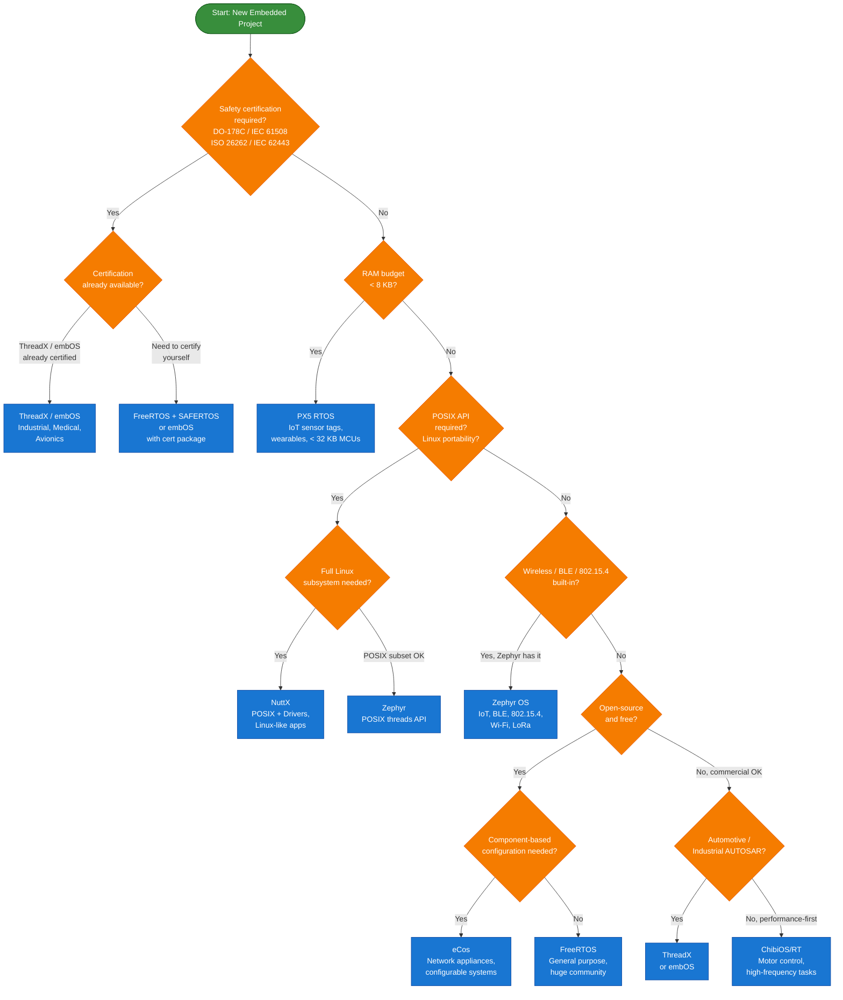
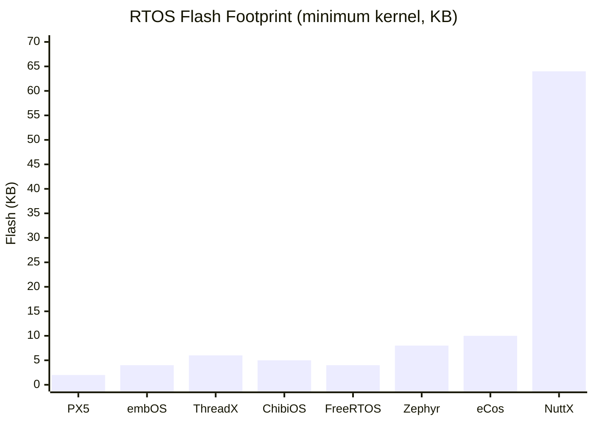

# :material-compare: Day 19 — RTOS Comparison & Selection

!!! abstract "Day at a Glance"
    **Goal:** Build a systematic framework for selecting the right RTOS for any project, using a comprehensive feature comparison across all eight RTOSes covered in this course, a decision flowchart, and worked use-case exercises.
    **Prerequisites:** Days 11–18 (all eight RTOS deep-dives)
    **Estimated Time:** 90 minutes

- :material-compare: **Core Concept** — RTOS selection is an engineering decision with measurable criteria; use a structured decision matrix rather than familiarity alone
- :material-table: **Key Tool** — The comparison table maps eight dimensions (license, footprint, certification, POSIX, community, best-fit) across eight RTOSes
- :material-alert: **Watch Out** — "Best RTOS" is context-dependent; an RTOS optimal for a medical device is wrong for a disposable sensor tag
- :material-check-circle: **By End of Day** — Given a project's requirements, you can justify an RTOS choice with quantitative and qualitative evidence

---

## :material-lightbulb-on: Intuition

!!! info "Core Idea"
    Over the past eight days you have learned eight RTOSes. The natural question is: which one should you use? The answer is never a single name — it is a process. RTOS selection involves at least six orthogonal criteria: flash/RAM footprint, licensing cost, safety certification availability, POSIX compliance, community support, and toolchain ecosystem. Each project weights these differently. A disposable IoT tag weights footprint above all else; a pacemaker weights certification; a hobbyist project weights community and free tooling. This lesson gives you the systematic framework to apply those weights to any real project.

!!! success "Real-World Context"
    Teams that skip systematic RTOS selection and just use "what we know" incur a hidden tax: they spend months fighting footprint constraints, licensing negotiations, or certification gaps that a different RTOS would have handled naturally. Conversely, teams that over-engineer the selection — evaluating ten RTOSes for a simple blinking-LED project — waste time on analysis paralysis. The goal is a *good enough* decision made quickly with clear, documented rationale.

---

## :material-graph: Decision Flowchart — Which RTOS Should I Choose?

---

## :material-book-open-variant: Lesson

### 1. The Eight Criteria

Before consulting any comparison table, define your project's requirements along these eight axes:

| # | Criterion | Questions to Ask |
|---|---|---|
| 1 | **Footprint** | How much flash? How much RAM? Any growth headroom? |
| 2 | **Licensing** | Can you afford a commercial license? Is GPL acceptable? Does the product ship as firmware-only (no source exposure)? |
| 3 | **Safety Certification** | Which standard? DO-178C (avionics), IEC 61508 (industrial), ISO 26262 (automotive), IEC 62443 (cybersecurity)? Is a pre-certified RTOS needed? |
| 4 | **POSIX Compliance** | Do you need `pthread`, `mqueue`, `sem_open`? Are you porting Linux code? |
| 5 | **Community & Ecosystem** | How large is the user base? Are there active forums, GitHub issues, Stack Overflow answers? |
| 6 | **Toolchain & IDE** | Does your MCU vendor's IDE support this RTOS? Is there a first-class debugger plugin? |
| 7 | **Middleware** | TCP/IP? TLS? Filesystem? BLE stack? Motor control libraries? |
| 8 | **Long-Term Support** | Is the RTOS actively maintained? Is the vendor stable? Is there an LTS branch? |

### 2. Comprehensive Comparison Table

| RTOS | License | Min RAM | Min Flash | Safety Cert | POSIX | Community | Best For |
|---|---|---|---|---|---|---|---|
| **FreeRTOS** | MIT | ~4 KB | ~4 KB | SAFERTOS (paid) | Partial (FreeRTOS+POSIX) | Very High | General purpose, learning, prototyping, any MCU |
| **Zephyr** | Apache 2.0 | ~8 KB | ~8 KB | In progress (PSA) | Yes (subset) | High | IoT, BLE, 802.15.4, Wi-Fi, security-focused |
| **ThreadX** | MIT (GitHub) | ~2 KB | ~6 KB | Yes (IEC 61508, DO-178C) | Optional | Medium | Industrial, medical, automotive, avionics |
| **ChibiOS/RT** | GPL/commercial | ~2 KB | ~5 KB | No | No | Medium | Motor control, robotics, high-frequency tasks |
| **embOS** | Commercial | ~1 KB | ~4 KB | Yes (IEC 61508, DO-178C, ISO 26262) | Optional | Low–Medium | Safety-critical, automotive, medical devices |
| **NuttX** | Apache 2.0 | ~32 KB | ~64 KB | No | Full POSIX | Medium | Linux-app portability, rich drivers, SpaceX/ArduPilot |
| **PX5** | Commercial | ~1 KB | ~2 KB | No | No | Low | Ultra-tiny IoT sensors, wearables, Cortex-M0 |
| **eCos** | Modified GPL | ~10 KB | ~10 KB | No | Partial | Low (legacy) | Network appliances, component-configured systems |

**Notes on table values:**
- "Min RAM" = kernel overhead only (excludes application stacks and objects)
- "Min Flash" = kernel .text only with minimal features enabled
- Actual values vary by configuration, compiler, and MCU; treat as order-of-magnitude guides
- "Community" rating reflects active Stack Overflow answers, GitHub issues, and forum posts as of 2024

### 3. Footprint Deep Dive

Footprint is often the first filter because hardware is chosen before the RTOS:

For RAM, the order is similar but NuttX's gap is even more pronounced because its POSIX layer requires larger per-thread state.

### 4. Licensing Decision Tree

Licensing is the second most common filter and often the most surprising:

| Scenario | Recommended RTOS | Reason |
|---|---|---|
| Hobby / open-source project | FreeRTOS (MIT) or Zephyr (Apache 2.0) | No restrictions, share or keep proprietary |
| Commercial product, no source sharing | FreeRTOS (MIT) or Zephyr — no copyleft obligation | MIT/Apache: binary-only distribution permitted |
| Commercial product, GPL tolerable | eCos (modified GPL with app exception), ChibiOS commercial | Modified GPL allows proprietary apps |
| Safety-critical, need certification artifacts | ThreadX (now MIT on GitHub + paid cert package), embOS (paid) | Certification artifacts are commercially sold separately |
| Government / defence | Check export control; ThreadX and embOS have options | Some certifications require traceable commercial support |

!!! warning "MIT Does Not Mean Free for Safety Certification"
    ThreadX is MIT-licensed on GitHub — the source is free. But the **IEC 61508 / DO-178C certification artifacts** (qualification kit, test records, traceability matrix) are sold commercially by Microsoft/Express Logic. "Open source" and "certified" are independent properties.

### 5. Safety Certification Comparison

| RTOS | IEC 61508 (Industrial) | ISO 26262 (Automotive) | DO-178C (Avionics) | IEC 62443 (OT Security) |
|---|---|---|---|---|
| FreeRTOS | Via SAFERTOS (paid) | Via SAFERTOS | Via SAFERTOS | No |
| Zephyr | PSA Certified (partial) | No | No | PSA Certified |
| ThreadX | SIL 4 (paid kit) | ASIL D (paid kit) | DAL A (paid kit) | No |
| embOS | SIL 3 (included) | ASIL D (included) | DAL A (paid) | No |
| ChibiOS | No | No | No | No |
| NuttX | No | No | No | No |
| PX5 | No | No | No | No |
| eCos | No | No | No | No |

**Key insight:** If you need safety certification, your practical choices are ThreadX (Microsoft Azure RTOS ecosystem) or embOS (SEGGER). SAFERTOS is a separately validated variant of FreeRTOS, not FreeRTOS itself.

### 6. POSIX Compliance Comparison

POSIX compliance determines whether code written for Linux can run with minimal changes:

| POSIX Feature | FreeRTOS | Zephyr | ThreadX | NuttX | eCos |
|---|---|---|---|---|---|
| `pthread_create` | Via add-on | Yes | Via add-on | Yes | Partial |
| `sem_open` (named) | No | Yes | No | Yes | No |
| `mq_open` (named queue) | No | Yes | No | Yes | No |
| `pthread_mutex` | Via add-on | Yes | Via add-on | Yes | Yes |
| `select` / `poll` | No | Yes | No | Yes | Via TCP stack |
| `fork` / `exec` | No | No | No | No | No |
| Signal handling | No | Partial | No | Yes | Partial |

NuttX has the most complete POSIX implementation among the eight — it is the correct choice when the goal is to run existing Linux application code on a microcontroller.

### 7. Use Case Matrix

| Use Case | Recommended RTOS | Key Reason |
|---|---|---|
| Disposable glucose sensor (Cortex-M0, 8 KB flash) | **PX5** | < 2 KB kernel; only RTOS viable at this footprint |
| Smart home hub (ESP32, BLE + Wi-Fi) | **Zephyr** | BLE and Wi-Fi stacks integrated; ESP32 BSP available |
| Industrial PLC (safety SIL 2, 10-year support) | **embOS** | Pre-certified with long-term commercial support |
| Drone autopilot (ArduPilot) | **NuttX** | ArduPilot uses NuttX as its RTOS; POSIX-compatible |
| Automotive ECU (AUTOSAR) | **ThreadX** | AUTOSAR OS integration; ASIL D certification kit available |
| Motor controller (STM32G4, 100 kHz PWM loop) | **ChibiOS/RT** | Sub-microsecond interrupt latency; HAL for STM32 |
| IoT gateway (Cortex-M33, LoRaWAN) | **Zephyr** | LoRa stack in-tree; PSA security architecture |
| Network appliance (MIPS, custom TCP/IP) | **eCos** | Component model; RedBoot; integrated networking |
| General MCU product (any common MCU) | **FreeRTOS** | Largest community; vendor BSP support; well-documented |
| Medical infusion pump (IEC 62304, DO-178C) | **ThreadX** | DAL A certification artifacts available |

### 8. Migration Effort Matrix

When switching from one RTOS to another, the effort depends on API distance and toolchain compatibility:

| From \ To | FreeRTOS | Zephyr | ThreadX | ChibiOS | NuttX | embOS |
|---|---|---|---|---|---|---|
| **FreeRTOS** | — | Medium | Low–Medium | Medium | High | Medium |
| **Zephyr** | Medium | — | Medium | High | Medium | High |
| **ThreadX** | Low–Medium | Medium | — | Medium | High | Low |
| **ChibiOS** | Medium | High | Medium | — | High | Medium |
| **NuttX** | High | Medium | High | High | — | High |
| **embOS** | Low | Medium | Low | Medium | High | — |

**Rating key:**
- **Low** — API wrappers exist or APIs are structurally similar; 1–2 weeks for a small application
- **Medium** — Significant API remap needed; 2–6 weeks depending on app complexity
- **High** — Fundamental model differences (e.g., POSIX vs. native RTOS API); may require redesign

**Most common migration paths:**
- **FreeRTOS → ThreadX:** Very common for teams needing certification; APIs are structurally similar (both have tasks/threads, queues, semaphores with similar naming)
- **FreeRTOS → Zephyr:** Common for teams adding BLE/Wi-Fi; Zephyr has FreeRTOS compatibility shim (`CONFIG_FREERTOS_COMPATIBLE` in some BSPs)
- **ThreadX → embOS:** Done when switching MCU vendors (e.g., STM32 → Nordic); APIs differ but concepts are identical

### 9. Total Cost of Ownership

For a commercial product, RTOS cost is not just the license fee:

| Cost Category | FreeRTOS | Zephyr | ThreadX | embOS |
|---|---|---|---|---|
| License fee | $0 | $0 | $0 (source) + certification kit | $5K–$50K/product |
| Certification artifacts | Via SAFERTOS ($$$) | N/A | $10K–$100K | Included |
| Commercial support | Via AWS | Via LF Members | Via Microsoft | Included |
| Engineer training | Low (huge community) | Medium | Medium | Medium |
| MCU vendor BSP | All major vendors | All major vendors | Most vendors | Most vendors |
| Toolchain | Any GCC/LLVM | Any GCC/LLVM | IAR, GCC, LLVM | Any GCC/LLVM/IAR |

For a non-safety-critical consumer product, FreeRTOS or Zephyr almost always wins on TCO. For a safety-critical product, the certification artifact cost dominates — embOS (included artifacts) or ThreadX (separately purchased artifacts) are the financially rational choices.

---

## :material-pencil: Exercises

**Exercise 1 — Medical Wearable Selection**

A startup is building a wearable continuous glucose monitor (CGM). Requirements:

- Nordic nRF52840 SoC (Cortex-M4F, 256 KB RAM, 1 MB flash)
- BLE connectivity to smartphone (BLE stack must be integrated or well-supported)
- IEC 60601-1 (medical electrical safety) compliance; FDA 510(k) submission planned
- Battery life: 14 days on a CR2032 coin cell → aggressive power management required
- Team has 2 embedded engineers, 6-month timeline, moderate budget

Select an RTOS and justify your choice. Address each of the five requirements. Identify the top two risks of your chosen RTOS for this use case.

**Exercise 2 — Industrial Motor Drive Selection**

A motor drive manufacturer is replacing their bare-metal firmware with an RTOS. Requirements:

- STM32H7 (Cortex-M7, 1 MB flash, 512 KB RAM)
- 20 kHz PWM update loop (50 µs deadline, hard real-time)
- Modbus RTU and CANopen communication
- IEC 61800-5-2 functional safety (SIL 2 target)
- Existing codebase uses CMSIS-RTOS v2 API

List the three most important selection criteria for this use case. Evaluate FreeRTOS, ThreadX, embOS, and ChibiOS against those criteria. Recommend one and explain why the others were rejected.

**Exercise 3 — Migration Planning**

An existing FreeRTOS application running on STM32F4 has:

- 6 tasks (1 high-priority ISR handler, 2 medium-priority data processing, 3 low-priority communication)
- 4 queues (3 data queues, 1 logging queue)
- 2 mutexes (SPI bus, UART TX)
- 1 event group (status flags)
- 1 software timer (watchdog kick)

The team needs to migrate to Zephyr to add BLE support (Zephyr has an in-tree BLE stack). Produce a migration map: for each FreeRTOS object, identify the Zephyr equivalent API and note any behavioural differences. Estimate the migration effort in person-days.

**Exercise 4 — Scoring Matrix for a Smart Meter**

A smart electricity meter project has these weighted requirements (weights sum to 100):

| Criterion | Weight |
|---|---|
| Footprint (< 64 KB flash) | 30 |
| Licensing (no royalties) | 25 |
| Long-term support (10+ years) | 20 |
| TCP/IP stack available | 15 |
| Safety cert (IEC 62443) | 10 |

Score FreeRTOS, Zephyr, ThreadX, and eCos from 1–5 on each criterion, calculate the weighted total, and recommend the RTOS with the highest score. Discuss whether the highest-scoring RTOS is always the right choice.

---

## :material-check: Solutions

??? success "Show Solutions"

    **Exercise 1 — Medical Wearable: Recommended: Zephyr**

    | Requirement | Zephyr Answer |
    |---|---|
    | nRF52840 BLE | Zephyr has first-class nRF52840 BSP and Zephyr BLE (Bluetooth LE stack) in-tree; Nordic Semiconductor is a Platinum Zephyr member |
    | Medical compliance | FDA 510(k) requires software risk management (IEC 62304); Zephyr is Apache 2.0 and PSA Certified, providing a defensible security posture. Full IEC 61508 certification is not available — this is a risk (see below) |
    | Power management | Zephyr has a PM subsystem with device power states and CPU power modes; nRF52840 low-power modes are supported |
    | Team/timeline | Zephyr has extensive documentation and Nordic devzone support; reasonable for a 2-engineer team |
    | Budget | Apache 2.0: $0 license |

    **Top 2 risks:** (1) No pre-certified IEC 61508 artifacts — the team must conduct their own software risk analysis; (2) Zephyr's build system (CMake + Kconfig) has a steep learning curve for teams new to it.

    **Exercise 2 — Motor Drive: Recommended: embOS**

    Top 3 criteria: (1) Hard real-time latency for 50 µs PWM deadline, (2) IEC 61800-5-2 / SIL 2 certification artifacts, (3) CMSIS-RTOS v2 API compatibility.

    | RTOS | Latency | SIL 2 | CMSIS-RTOS v2 | Decision |
    |---|---|---|---|---|
    | FreeRTOS | Good | Via SAFERTOS only | Wrapper available | Rejected: SAFERTOS = extra cost, different product |
    | ThreadX | Excellent | Yes (paid kit) | Wrapper available | Viable but kit adds cost |
    | embOS | Excellent | Yes (included) | CMSIS-RTOS v2 wrapper shipped | **Recommended** |
    | ChibiOS | Excellent | No | No native wrapper | Rejected: no SIL 2 |

    **Exercise 3 — FreeRTOS → Zephyr Migration Map**

    | FreeRTOS Object | Zephyr Equivalent | Key Differences |
    |---|---|---|
    | `xTaskCreate` | `k_thread_create` | Zephyr requires pre-allocated stack via `K_THREAD_STACK_DEFINE`; priority 0=lowest (opposite of FreeRTOS) |
    | `xQueueCreate` | `K_MSGQ_DEFINE` | Zephyr message queues are statically defined; message size is compile-time constant |
    | `xSemaphoreCreateMutex` | `K_MUTEX_DEFINE` | Zephyr mutexes always have priority inheritance |
    | `xEventGroupCreate` | `K_EVENT_DEFINE` | Zephyr events use bitmask, similar semantics |
    | `xTimerCreate` | `k_timer_init` | Zephyr timers can be started with `k_timer_start()`; callback runs in system workqueue context |
    | ISR-safe `xQueueSendFromISR` | `k_msgq_put` (ISR-safe) | Same semantics; no `BaseType_t *pxHigherPriorityTaskWoken` parameter needed |

    Estimated migration effort: 10–15 person-days for mapping (2–3 days), implementation (5–7 days), and testing (3–5 days).

    **Exercise 4 — Smart Meter Scoring**

    | Criterion | Weight | FreeRTOS | Zephyr | ThreadX | eCos |
    |---|---|---|---|---|---|
    | Footprint | 30 | 5 (150) | 4 (120) | 5 (150) | 3 (90) |
    | No royalties | 25 | 5 (125) | 5 (125) | 4 (100) | 4 (100) |
    | LTS 10+ years | 20 | 4 (80) | 4 (80) | 4 (80) | 2 (40) |
    | TCP/IP | 15 | 3 (45) | 5 (75) | 4 (60) | 5 (75) |
    | IEC 62443 | 10 | 1 (10) | 3 (30) | 1 (10) | 1 (10) |
    | **Total** | 100 | **410** | **430** | **400** | **315** |

    **Zephyr wins** on this scoring. However, the scoring exercise also highlights that no RTOS scores perfectly on IEC 62443 — the team should investigate PSA Certified (Zephyr) and evaluate whether that is sufficient for their regulatory submission. The highest-scoring RTOS is a good starting point but never the end of the analysis.

---

## :material-alert: Common Pitfalls

!!! warning "Selecting by Familiarity Instead of Requirements"
    The most common mistake is choosing an RTOS because the team already knows it. Familiarity reduces training time but can add months of effort fighting the wrong tool. A one-week evaluation prototype on the correct RTOS is worth more than six months on a familiar but ill-fitting one. Always at least sketch a requirements-vs-criteria matrix before committing.

!!! warning "Confusing 'Open Source' with 'Free to Certify'"
    MIT and Apache 2.0 licenses allow unrestricted use and modification. They do not provide certification artifacts. IEC 61508 certification requires documented test cases, traceability matrices, and qualified tool chains — none of which are included in a source code repository. Budget separately for certification costs, even when the RTOS source is free.

!!! danger "Ignoring Vendor Longevity"
    Small RTOS vendors can be acquired, pivoted, or discontinued. Choosing an RTOS from a vendor with a single product line and no major corporate backer is a business risk for 10-year products. FreeRTOS (AWS), Zephyr (Linux Foundation), and ThreadX (Microsoft) have backing that makes 10-year support plausible. PX5 and eCos carry higher longevity risk for new designs.

!!! danger "Underestimating Migration Cost"
    Teams often estimate migration effort by counting API calls. The real cost is in the conceptual model differences: priority numbering conventions, stack allocation models, ISR-safe API variants, and build system integration. Always build a "spike" (minimal working prototype) on the candidate RTOS with your actual hardware before committing to a migration.

---

## :material-help-circle: Flashcards

???+ question "Which RTOS has the most complete POSIX compliance among the eight covered in this course?"
    **NuttX.** It implements a large subset of POSIX.1-2017 including `pthread`, `mqueue`, named semaphores (`sem_open`), signals, and `select`/`poll`. This makes it the best choice for porting existing Linux application code to a microcontroller. Zephyr has a POSIX subset but omits named semaphores, message queues, and full signal handling.

???+ question "What is SAFERTOS and how does it relate to FreeRTOS?"
    SAFERTOS is a separately developed, independently safety-certified RTOS that is API-compatible with FreeRTOS. It is produced by WITTENSTEIN High Integrity Systems, not Amazon. SAFERTOS has been independently certified to IEC 61508 SIL 3 and DO-178C DAL A. Because its API mirrors FreeRTOS, porting a FreeRTOS application to SAFERTOS requires minimal source changes — but SAFERTOS is a commercial product with its own license, not FreeRTOS itself.

???+ question "What are the three most important selection criteria for an automotive RTOS?"
    (1) **ISO 26262 ASIL D certification** — automotive safety requires traceable, qualified software; (2) **Deterministic worst-case execution time** — automotive ECUs have hard real-time deadlines for brake and steering systems; (3) **AUTOSAR OS compatibility** — most automotive software stacks are built on the AUTOSAR standard; the RTOS must support AUTOSAR OS concepts (tasks, alarms, ISRs, resources). ThreadX and embOS are the primary candidates meeting all three.

???+ question "Why does the migration cost from NuttX to any other RTOS tend to be 'High'?"
    NuttX application code uses the full POSIX API — `pthread_create`, `mq_open`, `sem_open`, UNIX-style device file paths (`/dev/tty0`). No other RTOS in this course provides an equally complete POSIX layer. Migrating means replacing every POSIX call with native RTOS API calls (e.g., `pthread_mutex_lock` → `vSemaphoreTake` in FreeRTOS) — a wholesale API translation across the entire application.

---

## :material-clipboard-check: Self Test

=== "Question 1"
    A team has a FreeRTOS application running on STM32F4 and needs to add BLE. They consider Zephyr, which has a first-class BLE stack. Their manager asks: "Can we just use the FreeRTOS BLE add-on instead of migrating?" What is the correct technical answer, and what trade-off does it represent?

=== "Answer 1"
    Yes — there are BLE libraries (e.g., NimBLE, which can run on FreeRTOS) that avoid a full RTOS migration. The trade-off is integration depth: Zephyr's BLE stack is designed from the ground up to run on Zephyr's scheduler, power management, and device model. NimBLE on FreeRTOS requires more manual integration work (separate task management, custom memory pool configuration) and may not support the latest BLE features as quickly as Zephyr. The right answer depends on timeline and BLE complexity: for simple BLE peripheral roles, FreeRTOS + NimBLE is viable; for complex BLE central/mesh/audio, Zephyr's integrated stack is significantly easier.

=== "Question 2"
    You are selecting an RTOS for a satellite attitude control system. The requirements include: (1) hard real-time response < 1 ms, (2) DO-178C DAL A certification, (3) < 512 KB flash, (4) 10-year mission lifetime with no software updates. Which RTOS do you select, and what is the single biggest technical risk of your choice?

=== "Answer 2"
    **ThreadX** (or embOS) is the correct choice. Both provide DO-178C DAL A certification kits, sub-millisecond interrupt latency, and fit comfortably in 512 KB flash. ThreadX has a heritage in space applications (e.g., Mars Ingenuity helicopter used Azure RTOS). The single biggest technical risk is **vendor longevity and availability of the certification kit for a 10-year mission**: the certification artifacts must be available at the time of the DO-178C audit (typically 2–5 years into development), and the RTOS vendor must provide long-term support for the exact certified version. Any update to the RTOS source — even a security patch — requires re-qualification of affected modules. Plan for a "frozen" RTOS version from contract award through decommission.

---

## :material-check-circle: Summary

!!! success "Key Takeaways"
    - **There is no universally best RTOS** — selection is a multi-criteria engineering decision weighted by the specific project's footprint, licensing, certification, POSIX, community, and longevity requirements.
    - **The flowchart shortcut:** start with safety certification (forces ThreadX/embOS), then footprint (PX5 for < 8 KB RAM), then POSIX (NuttX for full POSIX, Zephyr for subset), then wireless (Zephyr for BLE/Wi-Fi), then default to FreeRTOS for general use.
    - **Open source ≠ free to certify:** MIT/Apache licenses cover source freedom, not certification artifacts. Safety certification is always a separate, costly process.
    - **Migration cost is underestimated:** count on 2–15 person-weeks for a non-trivial migration, dominated by API model differences and testing — not just API name substitution.
    - **TCO matters more than license fee:** community size, training resources, toolchain support, and long-term vendor stability are often more expensive than the license itself.
    - **Tomorrow:** Day 20 is the capstone — you will integrate all 20 days of learning into a complete, production-quality Environmental Monitor application with four tasks, queues, semaphores, event groups, and a software timer.
