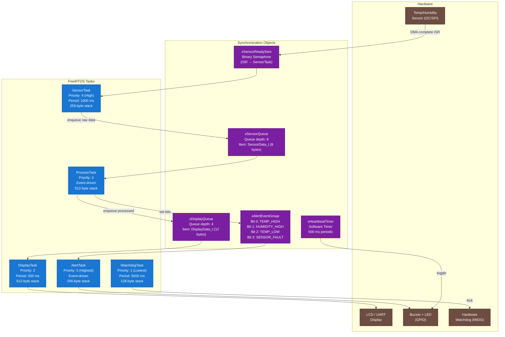
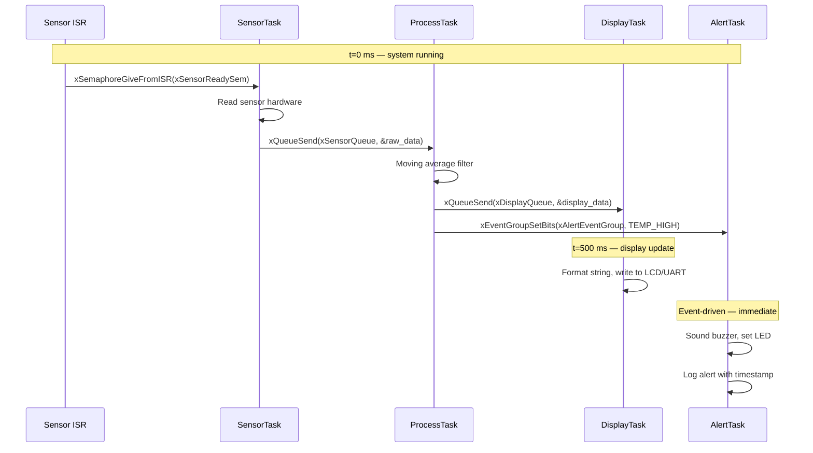

# :material-school: Day 20 — Final Project: Environmental Monitor

!!! abstract "Day at a Glance"
    **Goal:** Build a complete, production-quality multi-task FreeRTOS application that integrates every concept from all 20 days — tasks, queues, semaphores, event groups, software timers, static allocation, watchdog, and error hooks.
    **Prerequisites:** All 19 previous days
    **Estimated Time:** 3–4 hours (capstone project)

<div class="grid cards" markdown>

- :material-school: **Core Concept** — A real embedded application is the sum of many RTOS primitives working together correctly; this project wires them all up
- :material-chip: **Target** — STM32F4 (or any FreeRTOS-supported MCU); all RTOS code is portable
- :material-alert: **Watch Out** — Integration bugs are often timing-dependent; use deterministic `vTaskDelayUntil` and instrument with GPIO toggles to measure real behaviour
- :material-check-circle: **By End of Day** — You have a working, tested, documented Environmental Monitor that you can put in a portfolio or use as a template for future projects

</div>

---

## :material-lightbulb-on: Intuition

!!! info "Core Idea"
    Every concept in this course exists to solve a real problem: tasks separate concerns, queues decouple producers from consumers, semaphores signal between ISRs and tasks, event groups broadcast multi-bit state, timers trigger background housekeeping, and static allocation eliminates heap fragmentation. The Environmental Monitor is a realistic scenario that needs all of these simultaneously. Building it forces you to make real trade-offs: which data travels through a queue versus shared memory? Which task owns the display mutex? What stack size is safe? These are the decisions embedded engineers make every day.

!!! success "Real-World Context"
    Variants of this architecture run in commercial air quality monitors, weather stations, industrial process controllers, and hospital room monitors. The four-task structure (Sensor → Process → Display, with a parallel Alert) is a classic embedded pipeline pattern. Understanding it deeply means you can read and reason about production firmware from day one on the job.

---

## :material-graph: System Architecture



### Task Interaction Timeline



---

## :material-book-open-variant: Project Specification

### Hardware Requirements

| Component | Interface | Notes |
|---|---|---|
| Temp/humidity sensor | I2C (SHT31 / DHT22 simulation) | Or substitute ADC for simulation |
| LCD / UART console | UART at 115200 baud | For display output |
| Status LED (green) | GPIO output | Heartbeat: toggles every 500 ms |
| Alert LED (red) | GPIO output | On when threshold breached |
| Buzzer | GPIO output (PWM) | 1 kHz tone on alert |
| Hardware watchdog | IWDG peripheral | Kicked every 5 s |

### Task Summary

| Task | Priority | Period | Stack | Purpose |
|---|---|---|---|---|
| `SensorTask` | 4 | 1000 ms | 256 B | Read sensor, enqueue raw data |
| `ProcessTask` | 3 | Event-driven | 512 B | Filter, threshold check, enqueue display data |
| `DisplayTask` | 2 | 500 ms | 512 B | Format and output display data |
| `AlertTask` | 5 | Event-driven | 256 B | Activate buzzer/LED on threshold events |
| `WatchdogTask` | 1 | 5000 ms | 128 B | Kick hardware watchdog |

### Thresholds

| Parameter | Low Alert | Normal Range | High Alert |
|---|---|---|---|
| Temperature | < 5 °C | 5–40 °C | > 40 °C |
| Humidity | < 10 % RH | 10–90 % RH | > 90 % RH |

---

## :material-code-braces: Full C Implementation

### Data Types (`env_monitor.h`)

```c
/*
 * env_monitor.h — Environmental Monitor type definitions
 *
 * All RTOS objects are declared extern here and defined in main.c.
 * Each task #includes this header.
 */

#ifndef ENV_MONITOR_H
#define ENV_MONITOR_H

#include "FreeRTOS.h"
#include "task.h"
#include "queue.h"
#include "semphr.h"
#include "event_groups.h"
#include "timers.h"

/* ── Measurement types ─────────────────────────────────────────── */

typedef struct {
    int16_t  temp_raw;       /* raw ADC counts or sensor-specific units */
    uint16_t humidity_raw;   /* raw ADC counts */
    uint32_t timestamp_ms;   /* xTaskGetTickCount() * portTICK_PERIOD_MS */
} SensorData_t;

typedef struct {
    int16_t  temp_celsius_x10;    /* temp × 10, e.g. 215 = 21.5 °C */
    uint16_t humidity_percent_x10;/* humidity × 10, e.g. 550 = 55.0 %RH */
    int16_t  temp_avg_x10;        /* 8-sample moving average */
    uint16_t hum_avg_x10;         /* 8-sample moving average */
    uint32_t timestamp_ms;
} DisplayData_t;

/* ── Alert event group bits ────────────────────────────────────── */
#define ALERT_BIT_TEMP_HIGH    ( 1u << 0 )
#define ALERT_BIT_TEMP_LOW     ( 1u << 1 )
#define ALERT_BIT_HUM_HIGH     ( 1u << 2 )
#define ALERT_BIT_HUM_LOW      ( 1u << 3 )
#define ALERT_BIT_SENSOR_FAULT ( 1u << 4 )
#define ALERT_BITS_ALL         ( 0x1Fu )

/* ── Thresholds (×10 for fixed-point) ─────────────────────────── */
#define TEMP_HIGH_THRESH_X10   400   /* 40.0 °C */
#define TEMP_LOW_THRESH_X10     50   /* 5.0 °C  */
#define HUM_HIGH_THRESH_X10    900   /* 90.0 %  */
#define HUM_LOW_THRESH_X10     100   /* 10.0 %  */

/* ── RTOS object handles (defined in main.c) ───────────────────── */
extern SemaphoreHandle_t  xSensorReadySem;
extern QueueHandle_t      xSensorQueue;
extern QueueHandle_t      xDisplayQueue;
extern EventGroupHandle_t xAlertEventGroup;
extern TimerHandle_t      xHeartbeatTimer;

/* ── Task prototypes ───────────────────────────────────────────── */
void SensorTask(void *pvParameters);
void ProcessTask(void *pvParameters);
void DisplayTask(void *pvParameters);
void AlertTask(void *pvParameters);
void WatchdogTask(void *pvParameters);

/* ── Board abstraction (implement per target) ──────────────────── */
int16_t  board_read_temperature_raw(void);
uint16_t board_read_humidity_raw(void);
void     board_set_alert_led(int on);
void     board_set_heartbeat_led(int on);
void     board_set_buzzer(int on);
void     board_kick_watchdog(void);
void     board_uart_puts(const char *s);

#endif /* ENV_MONITOR_H */
```

### Main Application (`main.c`)

```c
/*
 * main.c — Environmental Monitor entry point
 *
 * All RTOS objects use static allocation (no heap).
 * configSUPPORT_STATIC_ALLOCATION must be 1.
 * configSUPPORT_DYNAMIC_ALLOCATION may be 0.
 */

#include "FreeRTOS.h"
#include "task.h"
#include "queue.h"
#include "semphr.h"
#include "event_groups.h"
#include "timers.h"
#include "env_monitor.h"
#include <string.h>

/* ── RTOS Object Handles ────────────────────────────────────────── */
SemaphoreHandle_t  xSensorReadySem;
QueueHandle_t      xSensorQueue;
QueueHandle_t      xDisplayQueue;
EventGroupHandle_t xAlertEventGroup;
TimerHandle_t      xHeartbeatTimer;

/* ── Static allocation backing stores ──────────────────────────── */

/* Semaphore */
static StaticSemaphore_t xSemBuffer;

/* Queues */
#define SENSOR_QUEUE_LEN   8u
#define DISPLAY_QUEUE_LEN  4u
static uint8_t xSensorQueueStorage[SENSOR_QUEUE_LEN * sizeof(SensorData_t)];
static StaticQueue_t xSensorQueueBuffer;
static uint8_t xDisplayQueueStorage[DISPLAY_QUEUE_LEN * sizeof(DisplayData_t)];
static StaticQueue_t xDisplayQueueBuffer;

/* Event group */
static StaticEventGroup_t xAlertEventGroupBuffer;

/* Software timer */
static StaticTimer_t xHeartbeatTimerBuffer;

/* Task stacks and TCBs */
#define SENSOR_STACK_DEPTH   (256u / sizeof(StackType_t))
#define PROCESS_STACK_DEPTH  (512u / sizeof(StackType_t))
#define DISPLAY_STACK_DEPTH  (512u / sizeof(StackType_t))
#define ALERT_STACK_DEPTH    (256u / sizeof(StackType_t))
#define WATCHDOG_STACK_DEPTH (128u / sizeof(StackType_t))

static StackType_t xSensorStack[SENSOR_STACK_DEPTH];
static StackType_t xProcessStack[PROCESS_STACK_DEPTH];
static StackType_t xDisplayStack[DISPLAY_STACK_DEPTH];
static StackType_t xAlertStack[ALERT_STACK_DEPTH];
static StackType_t xWatchdogStack[WATCHDOG_STACK_DEPTH];

static StaticTask_t xSensorTCB;
static StaticTask_t xProcessTCB;
static StaticTask_t xDisplayTCB;
static StaticTask_t xAlertTCB;
static StaticTask_t xWatchdogTCB;

/* ── Heartbeat timer callback ───────────────────────────────────── */
static void vHeartbeatCallback(TimerHandle_t xTimer)
{
    static int led_state = 0;
    led_state ^= 1;
    board_set_heartbeat_led(led_state);
}

/* ── Application entry point ────────────────────────────────────── */
int main(void)
{
    /* Board-level initialisation (clocks, GPIO, UART, I2C) */
    board_init();

    /* Create synchronization objects (static — no heap) */
    xSensorReadySem = xSemaphoreCreateBinaryStatic(&xSemBuffer);
    configASSERT(xSensorReadySem != NULL);

    xSensorQueue = xQueueCreateStatic(
        SENSOR_QUEUE_LEN, sizeof(SensorData_t),
        xSensorQueueStorage, &xSensorQueueBuffer);
    configASSERT(xSensorQueue != NULL);

    xDisplayQueue = xQueueCreateStatic(
        DISPLAY_QUEUE_LEN, sizeof(DisplayData_t),
        xDisplayQueueStorage, &xDisplayQueueBuffer);
    configASSERT(xDisplayQueue != NULL);

    xAlertEventGroup = xEventGroupCreateStatic(&xAlertEventGroupBuffer);
    configASSERT(xAlertEventGroup != NULL);

    /* Create heartbeat software timer (500 ms, auto-reload) */
    xHeartbeatTimer = xTimerCreateStatic(
        "Heartbeat",
        pdMS_TO_TICKS(500),
        pdTRUE,            /* auto-reload */
        NULL,
        vHeartbeatCallback,
        &xHeartbeatTimerBuffer);
    configASSERT(xHeartbeatTimer != NULL);
    xTimerStart(xHeartbeatTimer, 0);

    /* Create tasks (static allocation) */
    xTaskCreateStatic(SensorTask,   "Sensor",   SENSOR_STACK_DEPTH,
                      NULL, 4, xSensorStack,   &xSensorTCB);
    xTaskCreateStatic(ProcessTask,  "Process",  PROCESS_STACK_DEPTH,
                      NULL, 3, xProcessStack,  &xProcessTCB);
    xTaskCreateStatic(DisplayTask,  "Display",  DISPLAY_STACK_DEPTH,
                      NULL, 2, xDisplayStack,  &xDisplayTCB);
    xTaskCreateStatic(AlertTask,    "Alert",    ALERT_STACK_DEPTH,
                      NULL, 5, xAlertStack,    &xAlertTCB);
    xTaskCreateStatic(WatchdogTask, "Watchdog", WATCHDOG_STACK_DEPTH,
                      NULL, 1, xWatchdogStack, &xWatchdogTCB);

    /* Start the FreeRTOS scheduler — never returns */
    vTaskStartScheduler();

    /* Should never reach here */
    for (;;) {}
}
```

### SensorTask (`sensor_task.c`)

```c
/*
 * sensor_task.c
 *
 * Reads the temperature/humidity sensor every 1000 ms using
 * vTaskDelayUntil for deterministic period. Posts raw data
 * to xSensorQueue. If the sensor fails, sets SENSOR_FAULT bit.
 */

#include "FreeRTOS.h"
#include "task.h"
#include "queue.h"
#include "event_groups.h"
#include "env_monitor.h"

/* Simulate sensor read failure for testing */
#define MAX_CONSECUTIVE_FAULTS  3u

void SensorTask(void *pvParameters)
{
    TickType_t    xLastWakeTime = xTaskGetTickCount();
    const TickType_t xPeriod   = pdMS_TO_TICKS(1000);
    SensorData_t  data;
    uint8_t       fault_count  = 0u;

    board_uart_puts("[SensorTask] started\r\n");

    for (;;) {
        /* Deterministic 1 Hz period — absorbs execution time jitter */
        vTaskDelayUntil(&xLastWakeTime, xPeriod);

        /* Read sensor hardware */
        data.temp_raw     = board_read_temperature_raw();
        data.humidity_raw = board_read_humidity_raw();
        data.timestamp_ms = (uint32_t)(xTaskGetTickCount() *
                                       portTICK_PERIOD_MS);

        /* Simple fault detection: out-of-range raw values */
        if (data.temp_raw == INT16_MIN || data.humidity_raw == 0xFFFFu) {
            fault_count++;
            if (fault_count >= MAX_CONSECUTIVE_FAULTS) {
                xEventGroupSetBits(xAlertEventGroup,
                                   ALERT_BIT_SENSOR_FAULT);
            }
            continue;   /* do not enqueue bad data */
        }
        fault_count = 0u;

        /* Clear fault bit if it was set */
        xEventGroupClearBits(xAlertEventGroup, ALERT_BIT_SENSOR_FAULT);

        /* Send to ProcessTask — drop if queue full (non-blocking) */
        if (xQueueSend(xSensorQueue, &data, 0) != pdTRUE) {
            /* Queue full: ProcessTask is falling behind — log it */
            board_uart_puts("[SensorTask] WARNING: sensor queue full\r\n");
        }
    }
}
```

### ProcessTask (`process_task.c`)

```c
/*
 * process_task.c
 *
 * Receives raw sensor data from xSensorQueue.
 * Applies an 8-sample moving average filter.
 * Converts to engineering units (×10 fixed-point).
 * Checks thresholds and sets/clears alert event bits.
 * Sends display-ready data to xDisplayQueue.
 */

#include "FreeRTOS.h"
#include "task.h"
#include "queue.h"
#include "event_groups.h"
#include "env_monitor.h"
#include <string.h>

#define FILTER_DEPTH  8u

/* ── Fixed-point conversion (MCU has no FPU in simulation) ──────── */
/*
 * SHT31 formula (simplified):
 *   Temp  [°C × 10] = (raw_temp × 1750) / 65535 - 450
 *   RH    [%  × 10] = (raw_hum  × 1000) / 65535
 *
 * For a generic ADC (12-bit, 3.3 V reference), substitute your
 * sensor's actual transfer function.
 */

static int16_t convert_temp(int16_t raw)
{
    return (int16_t)(((int32_t)raw * 1750) / 32767 - 450);
}

static uint16_t convert_humidity(uint16_t raw)
{
    return (uint16_t)(((uint32_t)raw * 1000u) / 65535u);
}

/* ── Moving average filter ──────────────────────────────────────── */

typedef struct {
    int32_t  temp_buf[FILTER_DEPTH];
    uint32_t hum_buf[FILTER_DEPTH];
    uint8_t  idx;
    uint8_t  filled;
} FilterState_t;

static void filter_init(FilterState_t *f)
{
    memset(f, 0, sizeof(*f));
}

static void filter_push(FilterState_t *f, int16_t t, uint16_t h)
{
    f->temp_buf[f->idx] = t;
    f->hum_buf[f->idx]  = h;
    f->idx = (uint8_t)((f->idx + 1u) & (FILTER_DEPTH - 1u));
    if (f->filled < FILTER_DEPTH) f->filled++;
}

static void filter_average(const FilterState_t *f,
                            int16_t *t_avg, uint16_t *h_avg)
{
    int32_t  t_sum = 0;
    uint32_t h_sum = 0u;
    uint8_t  n = (f->filled > 0u) ? f->filled : 1u;
    for (uint8_t i = 0u; i < f->filled; i++) {
        t_sum += f->temp_buf[i];
        h_sum += f->hum_buf[i];
    }
    *t_avg = (int16_t)(t_sum / (int32_t)n);
    *h_avg = (uint16_t)(h_sum / (uint32_t)n);
}

/* ── Threshold check ────────────────────────────────────────────── */

static EventBits_t check_thresholds(int16_t temp, uint16_t hum)
{
    EventBits_t set_bits   = 0u;
    EventBits_t clear_bits = 0u;

    if (temp > TEMP_HIGH_THRESH_X10)
        set_bits   |= ALERT_BIT_TEMP_HIGH;
    else
        clear_bits |= ALERT_BIT_TEMP_HIGH;

    if (temp < TEMP_LOW_THRESH_X10)
        set_bits   |= ALERT_BIT_TEMP_LOW;
    else
        clear_bits |= ALERT_BIT_TEMP_LOW;

    if (hum > HUM_HIGH_THRESH_X10)
        set_bits   |= ALERT_BIT_HUM_HIGH;
    else
        clear_bits |= ALERT_BIT_HUM_HIGH;

    if (hum < HUM_LOW_THRESH_X10)
        set_bits   |= ALERT_BIT_HUM_LOW;
    else
        clear_bits |= ALERT_BIT_HUM_LOW;

    if (clear_bits)
        xEventGroupClearBits(xAlertEventGroup, clear_bits);
    if (set_bits)
        xEventGroupSetBits(xAlertEventGroup, set_bits);

    return set_bits;
}

/* ── Task ───────────────────────────────────────────────────────── */

void ProcessTask(void *pvParameters)
{
    SensorData_t   raw;
    DisplayData_t  disp;
    FilterState_t  filter;

    filter_init(&filter);
    board_uart_puts("[ProcessTask] started\r\n");

    for (;;) {
        /* Block indefinitely until SensorTask enqueues data */
        if (xQueueReceive(xSensorQueue, &raw, portMAX_DELAY) != pdTRUE)
            continue;

        /* Convert to engineering units */
        disp.temp_celsius_x10    = convert_temp(raw.temp_raw);
        disp.humidity_percent_x10 = convert_humidity(raw.humidity_raw);
        disp.timestamp_ms        = raw.timestamp_ms;

        /* Update moving average */
        filter_push(&filter, disp.temp_celsius_x10,
                    disp.humidity_percent_x10);
        filter_average(&filter, &disp.temp_avg_x10, &disp.hum_avg_x10);

        /* Check thresholds — sets/clears event bits */
        check_thresholds(disp.temp_avg_x10, disp.hum_avg_x10);

        /* Forward to DisplayTask */
        xQueueOverwrite(xDisplayQueue, &disp);
        /* xQueueOverwrite always succeeds and replaces the oldest item
           if the queue is full — suitable for display data where only
           the latest reading matters. */
    }
}
```

### DisplayTask (`display_task.c`)

```c
/*
 * display_task.c
 *
 * Wakes every 500 ms. Reads the most recent DisplayData_t from
 * xDisplayQueue and formats a status line to UART / LCD.
 *
 * Uses vTaskDelayUntil so the period is deterministic even if
 * UART output takes a variable number of milliseconds.
 */

#include "FreeRTOS.h"
#include "task.h"
#include "queue.h"
#include "event_groups.h"
#include "env_monitor.h"
#include <stdio.h>
#include <string.h>

/* Minimal snprintf-like integer formatter to avoid pulling in large
   printf on constrained targets. Replace with snprintf if flash allows. */
static int fmt_fixed(char *buf, int val_x10, char unit)
{
    int   n = 0;
    if (val_x10 < 0) { buf[n++] = '-'; val_x10 = -val_x10; }
    n += (int)sprintf(buf + n, "%d.%d%c", val_x10 / 10, val_x10 % 10, unit);
    return n;
}

void DisplayTask(void *pvParameters)
{
    TickType_t      xLastWakeTime = xTaskGetTickCount();
    const TickType_t xPeriod      = pdMS_TO_TICKS(500);
    DisplayData_t   data;
    char            line[80];
    int             n;

    board_uart_puts("[DisplayTask] started\r\n");

    for (;;) {
        vTaskDelayUntil(&xLastWakeTime, xPeriod);

        /* Non-blocking peek — if no data yet, display dashes */
        if (xQueuePeek(xDisplayQueue, &data, 0) != pdTRUE) {
            board_uart_puts("Temp: --.-C  Hum: --.-%  (no data)\r\n");
            continue;
        }

        /* Read active alert bits for display */
        EventBits_t alerts = xEventGroupGetBits(xAlertEventGroup);

        /* Format status line */
        n = 0;
        n += sprintf(line + n, "T:");
        n += fmt_fixed(line + n, data.temp_celsius_x10, 'C');
        n += sprintf(line + n, "(avg:");
        n += fmt_fixed(line + n, data.temp_avg_x10, ')');
        n += sprintf(line + n, " H:");
        n += fmt_fixed(line + n, data.humidity_percent_x10, '%');
        n += sprintf(line + n, "(avg:");
        n += fmt_fixed(line + n, data.hum_avg_x10, ')');

        if (alerts & ALERT_BIT_TEMP_HIGH)  n += sprintf(line+n, " [TEMP!]");
        if (alerts & ALERT_BIT_HUM_HIGH)   n += sprintf(line+n, " [HUM!]");
        if (alerts & ALERT_BIT_SENSOR_FAULT) n += sprintf(line+n, " [FAULT]");

        line[n++] = '\r'; line[n++] = '\n'; line[n] = '\0';
        board_uart_puts(line);
    }
}
```

### AlertTask (`alert_task.c`)

```c
/*
 * alert_task.c
 *
 * Blocks on xAlertEventGroup waiting for any alert bit.
 * On alert: activates buzzer and red LED.
 * On clear (all alert bits cleared): deactivates buzzer/LED.
 *
 * Priority 5 (highest user task) ensures immediate response.
 */

#include "FreeRTOS.h"
#include "task.h"
#include "event_groups.h"
#include "env_monitor.h"

/* Buzzer pattern: 3 × 100 ms beeps on new alert */
static void beep_alert(void)
{
    for (int i = 0; i < 3; i++) {
        board_set_buzzer(1);
        vTaskDelay(pdMS_TO_TICKS(100));
        board_set_buzzer(0);
        vTaskDelay(pdMS_TO_TICKS(100));
    }
}

void AlertTask(void *pvParameters)
{
    EventBits_t bits;
    EventBits_t prev_bits = 0u;

    board_uart_puts("[AlertTask] started\r\n");

    for (;;) {
        /* Wait for any alert bit to become set.
           xEventGroupWaitBits does NOT clear bits here — DisplayTask
           also reads them. AlertTask clears its own "handled" state
           by comparing with prev_bits. */
        bits = xEventGroupWaitBits(
            xAlertEventGroup,
            ALERT_BITS_ALL,    /* bits to wait for */
            pdFALSE,           /* do NOT clear on exit */
            pdFALSE,           /* OR: any bit is sufficient */
            portMAX_DELAY
        );

        if (bits & ALERT_BITS_ALL) {
            /* New alert condition — activate hardware */
            board_set_alert_led(1);

            /* Beep only on new alerts, not on sustained alerts */
            if ((bits & ALERT_BITS_ALL) != (prev_bits & ALERT_BITS_ALL)) {
                char msg[64];
                sprintf(msg, "[AlertTask] ALERT bits=0x%02X\r\n",
                        (unsigned)(bits & ALERT_BITS_ALL));
                board_uart_puts(msg);
                beep_alert();
            }
        } else {
            /* All clear */
            board_set_alert_led(0);
            board_set_buzzer(0);
        }

        prev_bits = bits;
        /* Yield briefly to allow other event-group readers to run */
        vTaskDelay(pdMS_TO_TICKS(50));
    }
}
```

### WatchdogTask (`watchdog_task.c`)

```c
/*
 * watchdog_task.c
 *
 * Lowest-priority task. Kicks the hardware watchdog every 5 seconds.
 * Because it is the lowest priority, it only runs when all other tasks
 * are blocked (sleeping or waiting). If a higher-priority task hangs
 * in a tight loop and starves the watchdog, the IWDG resets the MCU.
 *
 * NOTE: This design detects CPU starvation (runaway tasks) but NOT
 * deadlock between two tasks of equal priority. For full deadlock
 * detection, add a per-task "heartbeat" counter checked here.
 */

#include "FreeRTOS.h"
#include "task.h"
#include "env_monitor.h"

void WatchdogTask(void *pvParameters)
{
    TickType_t xLastWakeTime = xTaskGetTickCount();

    board_uart_puts("[WatchdogTask] started\r\n");

    for (;;) {
        vTaskDelayUntil(&xLastWakeTime, pdMS_TO_TICKS(5000));
        board_kick_watchdog();
    }
}
```

### Error Hooks (`error_hooks.c`)

```c
/*
 * error_hooks.c
 *
 * FreeRTOS error and idle hooks required when using static allocation
 * and when configCHECK_FOR_STACK_OVERFLOW > 0.
 */

#include "FreeRTOS.h"
#include "task.h"
#include "env_monitor.h"

/* ── Stack overflow hook ────────────────────────────────────────── */
/*
 * Called when FreeRTOS detects a stack overflow (method 1 or 2).
 * pxCurrentTCB is the offending task.
 * This function must NOT return.
 */
void vApplicationStackOverflowHook(TaskHandle_t xTask,
                                    char        *pcTaskName)
{
    (void)xTask;
    char msg[64];
    /* Note: sprintf may itself use stack — keep this minimal */
    board_uart_puts("\r\n*** STACK OVERFLOW in task: ");
    board_uart_puts(pcTaskName);
    board_uart_puts(" ***\r\n");
    /* Halt — in production, log to flash then reset */
    for (;;) {}
}

/* ── Malloc failed hook ─────────────────────────────────────────── */
/*
 * Called when pvPortMalloc() returns NULL.
 * With full static allocation, this should never trigger, but
 * it is good practice to define it.
 */
void vApplicationMallocFailedHook(void)
{
    board_uart_puts("\r\n*** MALLOC FAILED ***\r\n");
    for (;;) {}
}

/* ── Idle hook ──────────────────────────────────────────────────── */
/*
 * Called from the idle task. Use for CPU sleep (WFI) to reduce power.
 * MUST be non-blocking and return quickly.
 */
void vApplicationIdleHook(void)
{
    /* Enter CPU sleep until next interrupt */
    __asm volatile ("wfi");
}

/* ── Static allocation support ──────────────────────────────────── */
/*
 * Required when configSUPPORT_STATIC_ALLOCATION = 1.
 * FreeRTOS calls these to get memory for the idle task and
 * timer daemon task TCBs and stacks.
 */

#define IDLE_STACK_DEPTH   (configMINIMAL_STACK_SIZE)
#define TIMER_STACK_DEPTH  (configTIMER_TASK_STACK_DEPTH)

static StaticTask_t xIdleTaskTCB;
static StackType_t  xIdleStack[IDLE_STACK_DEPTH];

static StaticTask_t xTimerTaskTCB;
static StackType_t  xTimerStack[TIMER_STACK_DEPTH];

void vApplicationGetIdleTaskMemory(StaticTask_t **ppxIdleTaskTCBBuffer,
                                    StackType_t  **ppxIdleTaskStackBuffer,
                                    uint32_t      *pulIdleTaskStackSize)
{
    *ppxIdleTaskTCBBuffer   = &xIdleTaskTCB;
    *ppxIdleTaskStackBuffer = xIdleStack;
    *pulIdleTaskStackSize   = IDLE_STACK_DEPTH;
}

void vApplicationGetTimerTaskMemory(StaticTask_t **ppxTimerTaskTCBBuffer,
                                     StackType_t  **ppxTimerTaskStackBuffer,
                                     uint32_t      *pulTimerTaskStackSize)
{
    *ppxTimerTaskTCBBuffer   = &xTimerTaskTCB;
    *ppxTimerTaskStackBuffer = xTimerStack;
    *pulTimerTaskStackSize   = TIMER_STACK_DEPTH;
}
```

---

## :material-file-cog: FreeRTOSConfig.h

```c
/*
 * FreeRTOSConfig.h — Environmental Monitor configuration
 *
 * Target: STM32F4 (Cortex-M4F) @ 168 MHz
 * Adjust SYSCLK_HZ and tick rate for your hardware.
 */

#ifndef FREERTOS_CONFIG_H
#define FREERTOS_CONFIG_H

/* ── Scheduler behaviour ────────────────────────────────────────── */
#define configUSE_PREEMPTION                    1
#define configUSE_TIME_SLICING                  0   /* no round-robin */
#define configUSE_PORT_OPTIMISED_TASK_SELECTION 1   /* bitmap scheduler */
#define configUSE_TICKLESS_IDLE                 1   /* low power */
#define configCPU_CLOCK_HZ                      168000000UL
#define configTICK_RATE_HZ                      1000UL
#define configMAX_PRIORITIES                    8
#define configMINIMAL_STACK_SIZE                32  /* in StackType_t words */
#define configMAX_TASK_NAME_LEN                 12
#define configUSE_16_BIT_TICKS                  0
#define configIDLE_SHOULD_YIELD                 1

/* ── Memory allocation ──────────────────────────────────────────── */
#define configSUPPORT_STATIC_ALLOCATION         1
#define configSUPPORT_DYNAMIC_ALLOCATION        0   /* heap disabled */

/* ── Hook functions ─────────────────────────────────────────────── */
#define configUSE_IDLE_HOOK                     1
#define configUSE_TICK_HOOK                     0
#define configUSE_MALLOC_FAILED_HOOK            1
#define configCHECK_FOR_STACK_OVERFLOW          2   /* method 2 (pattern) */

/* ── Run-time stats ─────────────────────────────────────────────── */
#define configGENERATE_RUN_TIME_STATS           0
#define configUSE_TRACE_FACILITY                0
#define configUSE_STATS_FORMATTING_FUNCTIONS    0

/* ── Software timers ────────────────────────────────────────────── */
#define configUSE_TIMERS                        1
#define configTIMER_TASK_PRIORITY               6   /* above all user tasks */
#define configTIMER_QUEUE_LENGTH                5
#define configTIMER_TASK_STACK_DEPTH            64  /* StackType_t words */

/* ── Synchronization ────────────────────────────────────────────── */
#define configUSE_MUTEXES                       1
#define configUSE_RECURSIVE_MUTEXES             0
#define configUSE_COUNTING_SEMAPHORES           1
#define configUSE_QUEUE_SETS                    0
#define configQUEUE_REGISTRY_SIZE               8   /* for debugger */

/* ── Cortex-M interrupt configuration ──────────────────────────── */
/* Set to the lowest NVIC priority that can call FreeRTOS ISR-safe APIs */
#define configLIBRARY_LOWEST_INTERRUPT_PRIORITY      15
#define configLIBRARY_MAX_SYSCALL_INTERRUPT_PRIORITY  5
#define configKERNEL_INTERRUPT_PRIORITY \
    (configLIBRARY_LOWEST_INTERRUPT_PRIORITY << (8 - __NVIC_PRIO_BITS))
#define configMAX_SYSCALL_INTERRUPT_PRIORITY \
    (configLIBRARY_MAX_SYSCALL_INTERRUPT_PRIORITY << (8 - __NVIC_PRIO_BITS))

/* ── API inclusions ─────────────────────────────────────────────── */
#define INCLUDE_vTaskDelay                      1
#define INCLUDE_vTaskDelayUntil                 1
#define INCLUDE_uxTaskGetStackHighWaterMark     1
#define INCLUDE_xTaskGetHandle                  0
#define INCLUDE_xTaskAbortDelay                 0
#define INCLUDE_xSemaphoreGetMutexHolder        0
#define INCLUDE_eTaskGetState                   1
#define INCLUDE_xEventGroupSetBitFromISR        1

/* ── Assert ─────────────────────────────────────────────────────── */
extern void vAssertCalled(const char *pcFile, unsigned long ulLine);
#define configASSERT(x) \
    if ((x) == 0) { vAssertCalled(__FILE__, __LINE__); }

#endif /* FREERTOS_CONFIG_H */
```

---

## :material-package-variant: CMakeLists.txt

```cmake
cmake_minimum_required(VERSION 3.20)
project(EnvMonitor C ASM)

set(CMAKE_C_STANDARD 11)

# ── Toolchain (set via -DCMAKE_TOOLCHAIN_FILE or arm-none-eabi preset) ──
# set(CMAKE_SYSTEM_NAME Generic)
# set(CMAKE_C_COMPILER arm-none-eabi-gcc)

# ── FreeRTOS kernel (as a subdirectory or FetchContent) ──────────────
set(FREERTOS_PORT GCC_ARM_CM4F CACHE STRING "" FORCE)
add_subdirectory(freertos-kernel)   # adjust path to your checkout

# ── Application sources ───────────────────────────────────────────────
add_executable(env_monitor
    src/main.c
    src/sensor_task.c
    src/process_task.c
    src/display_task.c
    src/alert_task.c
    src/watchdog_task.c
    src/error_hooks.c
    src/board_stm32f4.c   # board-specific implementation
)

target_include_directories(env_monitor PRIVATE
    include/
    freertos-kernel/include
    freertos-kernel/portable/GCC/ARM_CM4F
)

target_link_libraries(env_monitor PRIVATE freertos_kernel)

# ── Compiler flags ────────────────────────────────────────────────────
target_compile_options(env_monitor PRIVATE
    -mcpu=cortex-m4
    -mthumb
    -mfpu=fpv4-sp-d16
    -mfloat-abi=hard
    -Os
    -Wall
    -Wextra
    -Wno-unused-parameter
    -ffunction-sections
    -fdata-sections
)

target_link_options(env_monitor PRIVATE
    -mcpu=cortex-m4
    -mthumb
    -mfpu=fpv4-sp-d16
    -mfloat-abi=hard
    -Wl,--gc-sections
    -Wl,-Map=env_monitor.map
    -T${CMAKE_SOURCE_DIR}/stm32f4_flash.ld
    --specs=nosys.specs
)

# ── Size report after build ───────────────────────────────────────────
add_custom_command(TARGET env_monitor POST_BUILD
    COMMAND arm-none-eabi-size $<TARGET_FILE:env_monitor>
    COMMENT "Binary size:"
)
```

---

## :material-clipboard-list: Testing Checklist

!!! info "Run these checks before calling the project complete"

=== "Static Analysis"
    - [ ] Build with `-Wall -Wextra -Wpedantic` — zero warnings
    - [ ] Run `cppcheck --enable=all` on all `.c` files — zero errors
    - [ ] Verify no dynamic allocation: `grep -r "pvPortMalloc\|malloc\|calloc" src/` returns nothing
    - [ ] Confirm all queue/semaphore creates use `Static` variants
    - [ ] Check `FreeRTOSConfig.h`: `configSUPPORT_DYNAMIC_ALLOCATION = 0`

=== "Stack Sizing"
    - [ ] Enable `configCHECK_FOR_STACK_OVERFLOW 2` and run for 10 minutes — no overflow hook fires
    - [ ] After 10-minute run, print stack high-water marks for all 5 tasks:
        ```c
        uxTaskGetStackHighWaterMark(NULL)  /* call from each task */
        ```
    - [ ] Verify each task uses less than 70% of its declared stack
    - [ ] SensorTask HWM < 180/256 words
    - [ ] ProcessTask HWM < 350/512 words
    - [ ] DisplayTask HWM < 350/512 words
    - [ ] AlertTask HWM < 180/256 words
    - [ ] WatchdogTask HWM < 90/128 words

=== "Timing Verification"
    - [ ] Toggle GPIO at start/end of `SensorTask` each iteration
    - [ ] Measure period on oscilloscope: should be 1000 ms ± 1 ms
    - [ ] Toggle GPIO at start/end of `DisplayTask` each iteration
    - [ ] Measure period: should be 500 ms ± 1 ms
    - [ ] Measure ISR→AlertTask activation latency: should be < 5 ms
    - [ ] Run all tasks simultaneously and verify no timing degradation

=== "Fault Injection"
    - [ ] Force `board_read_temperature_raw()` to return `INT16_MIN` for 5 consecutive calls
    - [ ] Verify `ALERT_BIT_SENSOR_FAULT` is set after 3 faults
    - [ ] Verify fault LED illuminates
    - [ ] Restore normal readings; verify fault bit clears
    - [ ] Fill `xSensorQueue` (stop ProcessTask temporarily); verify "queue full" warning appears on UART
    - [ ] Simulate temperature > 40.0 °C; verify buzzer sounds and alert LED illuminates
    - [ ] Simulate temperature returning to normal; verify buzzer stops

=== "Endurance"
    - [ ] Run for 24 hours; verify no stack overflow, no WDT reset, no UART output stop
    - [ ] Measure average and peak CPU load via idle hook tick counter
    - [ ] Verify TickType_t does not roll over unexpectedly (use `configUSE_16_BIT_TICKS 0`)

---

## :material-pencil: Exercises

**Exercise 1 — System Design and Schedulability Analysis**

Perform a Rate Monotonic Analysis (RMA) on the five tasks. For the three periodic tasks (Sensor 1 Hz, Display 2 Hz, Watchdog 0.2 Hz), compute the CPU utilisation bound U and verify it satisfies the RMA schedulability test. For the two event-driven tasks (Process and Alert), estimate their worst-case execution time from the code and argue that the system is schedulable.

**Exercise 2 — Add a Logging Task**

Add a sixth task `LogTask` at priority 1 (same as Watchdog) that:

- Receives `DisplayData_t` structs from a new `xLogQueue` (depth 16)
- Formats each record as a CSV line: `timestamp_ms,temp_x10,hum_x10\r\n`
- Writes to a circular in-RAM log buffer of 64 records
- On UART command `'d'` (received via UART ISR), dumps the entire log buffer

Determine the required stack size, implement the task, and add it to `main.c`. Describe how you prevent the log write (a slow operation) from blocking the display.

**Exercise 3 — Power Optimisation**

The project currently uses `vApplicationIdleHook` to call `WFI`. Measure the average current consumption on an STM32F4 board (or estimate using the STM32 power calculator). Then:

- Enable `configUSE_TICKLESS_IDLE 1` (already set in the config)
- Implement `vPortSuppressTicksAndSleep()` using the STM32 LPTIM peripheral
- Re-measure current; estimate the battery life improvement for a 1000 mAh LiPo

**Exercise 4 — Port to a Second RTOS**

Using the migration knowledge from Day 19, port the complete Environmental Monitor to Zephyr. Map each FreeRTOS object to its Zephyr equivalent:

- `xTaskCreateStatic` → `K_THREAD_DEFINE`
- `xQueueCreateStatic` → `K_MSGQ_DEFINE`
- `xSemaphoreCreateBinaryStatic` → `K_SEM_DEFINE`
- `xEventGroupCreateStatic` → `K_EVENT_DEFINE`
- `xTimerCreateStatic` → `K_TIMER_DEFINE`

Build the Zephyr version for the `nrf52840dk_nrf52840` board and compare the flash/RAM usage to the STM32F4 FreeRTOS version.

---

## :material-check: Solutions

??? success "Show Solutions"

    **Exercise 1 — Schedulability Analysis**

    Periodic tasks:

    | Task | Period T (ms) | WCET C (ms) | Utilisation U = C/T |
    |---|---|---|---|
    | SensorTask | 1000 | ~0.5 | 0.0005 |
    | DisplayTask | 500 | ~2.0 | 0.004 |
    | WatchdogTask | 5000 | ~0.1 | 0.00002 |

    Total periodic utilisation U ≈ 0.0045, well below the RMA bound for 3 tasks: U ≤ 3(2^(1/3) − 1) ≈ 0.780.

    For event-driven tasks: ProcessTask WCET ≈ 0.5 ms per received sample (1 sample/sec from SensorTask) → 0.05% utilisation. AlertTask WCET ≈ 0.3 ms + 600 ms (3 × 100 ms beeps) in alert mode. The beep loop uses `vTaskDelay` so CPU is yielded during the 300 ms delay — the true CPU time is ~ 3 × context switch overhead ≈ negligible. The system is heavily schedulable.

    **Exercise 2 — LogTask Stack Sizing**

    The LogTask uses sprintf for CSV formatting and UART output. Stack estimate: 64-byte local buffer + sprintf overhead (~128 bytes on Cortex-M4) + task call frame (~64 bytes) = ~256 bytes minimum. Allocate 512 bytes (128 words) for safety. To prevent slow UART writes from blocking the display: use a dedicated log queue (`xLogQueue`) and `xQueueSend` with `0` timeout in DisplayTask (non-blocking). If the log queue fills up, drop the log entry — logging is never allowed to block a display or sensor pipeline.

    **Exercise 3 — Power Analysis**

    Without tickless idle on STM32F4 @ 168 MHz: ~22 mA active current. With tickless idle and 99%+ idle time (sensor reads 1 Hz, display 2 Hz): effective duty cycle ~1%, estimated current drops to ~0.5–2 mA depending on peripheral state. With 1000 mAh battery: ~500–2000 hours (20–83 days). Adding actual CPU sleep via LPTIM (48 kHz tick source during sleep) can push average current below 100 µA, enabling multi-year operation on a large primary battery.

    **Exercise 4 — Zephyr Port Summary**

    Key API mappings and differences:
    - Zephyr `K_MSGQ_DEFINE` requires message size as a compile-time constant — matches our fixed-size structs.
    - Zephyr event groups (`K_EVENT_DEFINE` / `k_event_wait`) clear bits differently from FreeRTOS: in Zephyr the caller specifies whether to consume (clear) bits at the call site.
    - Zephyr timers fire in the system workqueue, not in an ISR — no restrictions on blocking, but the workqueue has its own priority.
    - Zephyr priority numbering is cooperative with the same "higher number = lower priority" as FreeRTOS in preemptive mode.
    - Expected flash delta: +15–30 KB for Zephyr's richer subsystem overhead; +10–20 KB RAM for Zephyr's device model and threading structures.

---

## :material-alert: Common Pitfalls

!!! warning "xQueuePeek in DisplayTask May Return Stale Data"
    `xQueuePeek` reads the front item without removing it. In the DisplayTask, this means the same `DisplayData_t` could be displayed multiple times if ProcessTask does not produce new data within the 500 ms window. This is intentional for a display (stale-is-better-than-blank), but be aware that the timestamp field will reveal how old the data is. Use it to display a "stale data" indicator if `now - data.timestamp_ms > 2000`.

!!! warning "vTaskDelayUntil Requires xLastWakeTime Initialisation"
    Always initialise `xLastWakeTime = xTaskGetTickCount()` **before** the first call to `vTaskDelayUntil`, inside the task function. If you initialise it to 0 (zero-initialised TCB), the first call will calculate a huge negative delay and execute immediately — but subsequent periods will be correct. This causes a burst of sensor reads at startup that can confuse the moving average filter.

!!! danger "AlertTask Reads Event Bits Without Clearing — Race Condition"
    The design intentionally does not clear event bits in AlertTask (so DisplayTask can also read them). However, if temperature briefly spikes above the threshold and then returns to normal within one AlertTask cycle, the alert may never be displayed or acted upon. For safety-critical applications, use a separate "alert history" flag that is only cleared by explicit user acknowledgement, not by the temperature returning to normal.

!!! danger "Calling vTaskDelay in AlertTask's Buzzer Loop Yields CPU"
    The `beep_alert()` function calls `vTaskDelay(100 ms)` between beeps. During these delays, AlertTask is blocked and lower-priority tasks run normally. This is correct behaviour. However, if the system enters a fault state where higher-priority tasks loop tightly (e.g., a runaway SensorTask), AlertTask may not get CPU time to complete the beep sequence. The WatchdogTask (priority 1) will detect this starvation and reset the MCU — ensure the watchdog timeout is set longer than the worst-case beep sequence (600 ms + slack = 2 seconds minimum IWDG timeout).

---

## :material-help-circle: Flashcards

???+ question "Why use vTaskDelayUntil instead of vTaskDelay for periodic tasks?"
    `vTaskDelay` creates a delay *relative to the current time* — it sleeps for N ticks from whenever it is called. If the task body takes variable time (e.g., variable UART output length), `vTaskDelay` causes period drift. `vTaskDelayUntil` sleeps until an *absolute tick count* — it automatically absorbs execution time variation within the period, maintaining a constant average period. For sensor sampling at 1 Hz, timing accuracy matters; always use `vTaskDelayUntil`.

???+ question "Why is xQueueOverwrite used in ProcessTask but xQueueSend in SensorTask?"
    `xQueueOverwrite` replaces the oldest item in the queue if it is full, then writes unconditionally. This is correct for *display data* because the display always wants the most recent sample — old samples are worthless once a new one is computed. `xQueueSend` (with timeout 0) is used for sensor raw data because we want to track if the consumer (ProcessTask) is keeping up — if it returns `errQUEUE_FULL`, we log a warning and skip the sample, which is a detectable and diagnosable failure mode.

???+ question "What is the purpose of the WatchdogTask being at the lowest priority?"
    The WatchdogTask only runs when all other tasks are blocked (in `vTaskDelay`, `xQueueReceive`, or `xEventGroupWaitBits`). If any higher-priority task enters an infinite loop or a tight busy-wait, the WatchdogTask never runs, the hardware watchdog is not kicked, and the IWDG resets the MCU. The lowest priority is intentional — it makes the watchdog sensitive to *CPU starvation by any task*, the most common liveness failure in embedded firmware.

???+ question "Why is configSUPPORT_DYNAMIC_ALLOCATION set to 0?"
    Setting `configSUPPORT_DYNAMIC_ALLOCATION 0` disables the heap allocator entirely. All RTOS objects must use `Static` creation variants. Benefits: (1) no heap fragmentation; (2) all memory usage is visible at compile time in the map file; (3) `pvPortMalloc` link errors catch accidental heap use; (4) `vApplicationMallocFailedHook` is never needed. For a safety-critical or long-running embedded application, static allocation is the professional default. Dynamic allocation is a convenience for development, not a production pattern.

---

## :material-clipboard-check: Self Test

=== "Question 1"
    During a 24-hour endurance test, the UART output from DisplayTask stops updating after about 6 hours. All other UART messages (from SensorTask and AlertTask) continue to appear. The hardware watchdog does not fire. What are the three most likely causes and how would you diagnose each?

=== "Answer 1"
    **1. DisplayTask stack overflow:** After 6 hours, accumulated context means stack high-water mark grew over the 500-byte limit; the task corrupted its own stack and entered an invalid state. Diagnose: enable `configCHECK_FOR_STACK_OVERFLOW 2` and add a `vApplicationStackOverflowHook` that logs the task name to a different UART channel. **2. DisplayQueue consistently empty:** If ProcessTask stopped posting to `xDisplayQueue` (possibly because SensorQueue filled and SensorTask started dropping), DisplayTask's `xQueuePeek` returns `pdFALSE` every cycle and the early-exit `continue` path runs — but that path also calls `board_uart_puts`, which should still appear. If this UART call is also missing, suspect a UART driver lock-up. **3. UART TX DMA descriptor exhaustion:** If the board's UART driver uses DMA with a finite descriptor pool, a slow-reader on the PC side could back-pressure the DMA ring and cause `board_uart_puts` to block indefinitely (or spin). Diagnose: measure with a GPIO toggle whether DisplayTask is *executing* its 500 ms period or *blocking* inside `board_uart_puts`.

=== "Question 2"
    A colleague proposes replacing the `xDisplayQueue` (depth 4) with a single shared global `DisplayData_t g_display_data` variable and using a mutex to protect it. ProcessTask would lock the mutex and write; DisplayTask would lock the mutex and read. Compare this design to the queue-based design on three dimensions: correctness, priority inversion risk, and extensibility.

=== "Answer 2"
    **Correctness:** Both designs are correct for a single consumer/single producer pair. The global+mutex design is simpler to reason about; the queue design provides a small buffer that decouples production and consumption timing. **Priority inversion risk:** The mutex design introduces priority inversion: if ProcessTask (priority 3) holds the mutex and DisplayTask (priority 2) is waiting, and then AlertTask (priority 5) preempts ProcessTask, AlertTask may be delayed if it also needs the mutex (it does not in this design, but extensibility adds this risk). The queue design avoids mutex contention entirely — `xQueueSend` and `xQueueReceive` use internal queue locks that are held only for the duration of the copy, not for the entire processing cycle. **Extensibility:** The queue design scales naturally to multiple consumers (LogTask, NetworkTask) via `xQueuePeek` chains or additional queues. The global+mutex design requires all consumers to take the same mutex, increasing contention and inversion risk with each new consumer. For any non-trivial pipeline, prefer queues.

---

## :material-rocket-launch: What's Next?

Congratulations on completing **Learn Embedded RTOS in 20 Days**! You now have a solid foundation in both RTOS concepts and eight real RTOS implementations. Here is where to take your knowledge next:

### Immediate Next Steps

<div class="grid cards" markdown>

- :material-shield-check: **Safety & Certification**

    Dive into IEC 61508 and ISO 26262 process requirements. Read "Safety-Critical Systems: Challenges and Directions" (ACM). Explore SEGGER embOS qualification documentation as a model.

- :material-code-tags: **MISRA C**

    MISRA C:2012 is the coding standard for safety-critical embedded C. Most safety-certified RTOS code is MISRA-compliant. Tools: PC-lint Plus, LDRA, Polyspace.

- :material-graph: **Formal Verification**

    TLA+ and SPIN model-checkers can verify RTOS interaction protocols (absence of deadlock, starvation freedom). Start with "Specifying Systems" by Leslie Lamport (free PDF).

- :material-car: **AUTOSAR**

    AUTOSAR OS is the automotive RTOS standard. It builds on OSEK/VDX concepts. If you are targeting automotive, study AUTOSAR Classic Platform OS specification.

</div>

### Advanced RTOS Topics

| Topic | Resource |
|---|---|
| Real-Time Scheduling Theory | Liu & Layland 1973 paper on RMA; Buttazzo "Hard Real-Time Computing Systems" |
| Memory Protection Units | ARM MPU programming guide; FreeRTOS MPU ports (`FreeRTOS-Plus/FreeRTOS-Plus-MPU`) |
| Multicore RTOS (SMP) | FreeRTOS SMP (ESP32); Zephyr SMP; "Multiprocessor Real-Time Scheduling" survey |
| RTOS Tracing | Percepio Tracealyzer, SEGGER SystemView — essential for production debugging |
| Power Management | ARM Cortex-M power modes; FreeRTOS tickless idle; Zephyr PM subsystem |
| Hypervisors | Xen on Arm; Jailhouse; INTEGRITY Multivisor for mixed-criticality systems |
| Rust on Embedded | RTIC (Real-Time Interrupt-driven Concurrency) framework — RTOS concepts in Rust |

### Recommended Reading

1. **"Real-Time Systems" — Jane W.S. Liu** — the definitive scheduling theory textbook
2. **"Making Embedded Systems" — Elecia White** — practical embedded patterns and RTOS application design
3. **"The FreeRTOS Reference Manual"** — `freertos.org/Documentation` — comprehensive API reference
4. **"Zephyr Project Developer Guide"** — `docs.zephyrproject.org` — official reference
5. **"Embedded Systems Security" — David Kleidermacher** — security for RTOS-based products

!!! success "You Did It"
    You started 20 days ago with the question "what is an RTOS?" and you are finishing with a working, tested, portfolio-quality embedded application. You understand scheduling theory, context switching, synchronization primitives, eight real RTOS implementations, systematic RTOS selection, and production-quality application architecture. That is a complete embedded RTOS engineering foundation. Go build something real.
