# :material-chip: Learn Embedded RTOS in 20 Days

!!! tip "From bare-metal to multi-RTOS mastery in 20 structured days."

A comprehensive, hands-on guide to Real-Time Operating Systems for embedded engineers. Covers RTOS fundamentals, synchronization primitives, memory management, interrupt handling, timing analysis, and seven major RTOS implementations — all with C code examples, exercises, and cognitive-optimized learning features.

## :material-map: Navigate the Course

-   :material-calendar-today: **[Daily Lessons](days/day01.md)**

    ---

    20 structured days from RTOS fundamentals to advanced implementations.

    **Day 01–10:** Core concepts — Tasks, Scheduling, Semaphores, Queues, Interrupts, Memory

    **Day 11–18:** RTOS deep dives — FreeRTOS, Zephyr, ThreadX, ChibiOS, embOS, NuttX, PX5, eCos

    **Day 19–20:** Comparison, selection guide, final project

-   :material-book-open-variant: **[RTOS Concepts](overview/rtos-basics.md)**

    ---

    Deep reference on the core concepts that underpin every RTOS.

    Scheduling · Synchronization · Memory · Interrupts · Timing

-   :material-puzzle: **[Patterns](patterns/periodic-scheduler.md)**

    ---

    Reusable RTOS design patterns for real-world embedded systems.

    Periodic Scheduler · Producer-Consumer · State Machine Tasks · Watchdog

-   :material-table: **[RTOS Comparison](comparison/rtos-comparison-table.md)**

    ---

    Side-by-side comparison of 8 major RTOS options.

    Features · Footprint · Licensing · Certification · Use Cases

-   :material-lightning-bolt: **[Cheatsheets](cheatsheets/freertos.md)**

    ---

    Quick-reference API cheatsheets for every RTOS covered.

    FreeRTOS · Zephyr · ThreadX · ChibiOS · embOS · NuttX · PX5 · eCos

## :material-calendar-range: 20-Day Learning Path

```mermaid
gantt
    title Learn Embedded RTOS in 20 Days
    dateFormat  D
    axisFormat Day %d

    section Foundations
    Intro to RTOS           :1, 1d
    Tasks & Threads         :2, 1d
    Scheduling              :3, 1d
    Context Switching       :4, 1d

    section Synchronization
    Semaphores & Mutexes    :5, 1d
    Queues & Event Groups   :6, 1d

    section Hardware
    Interrupt Handling      :7, 1d
    Memory Management       :8, 1d

    section Advanced
    Timing Analysis         :9, 1d
    Build Systems           :10, 1d

    section RTOS Implementations
    FreeRTOS                :11, 1d
    Zephyr                  :12, 1d
    ChibiOS                 :13, 1d
    ThreadX                 :14, 1d
    embOS                   :15, 1d
    NuttX                   :16, 1d
    PX5                     :17, 1d
    eCos                    :18, 1d

    section Capstone
    Comparison & Selection  :19, 1d
    Final Project           :20, 1d
```

## :material-table: Quick Reference — All 20 Days

| Day | Topic | Key Concepts |
|-----|-------|-------------|
| [01](days/day01.md) | Intro to RTOS | Determinism, preemption, tasks, scheduler |
| [02](days/day02.md) | Tasks & Threads | Task creation, priorities, states, stack |
| [03](days/day03.md) | Scheduling & Determinism | Priority scheduling, round-robin, EDF |
| [04](days/day04.md) | Context Switching | Register save/restore, latency, overhead |
| [05](days/day05.md) | Semaphores & Mutexes | Binary/counting semaphores, mutex, priority inheritance |
| [06](days/day06.md) | Queues & Event Groups | Message queues, event flags, mailboxes |
| [07](days/day07.md) | Interrupt Handling | ISR design, deferred processing, NVIC |
| [08](days/day08.md) | Memory & Stack Management | Heap strategies, stack sizing, memory pools |
| [09](days/day09.md) | Latency & Timing Analysis | Jitter, WCET, response time analysis |
| [10](days/day10.md) | Build Systems & Board Bringup | CMake, port layers, BSP, startup code |
| [11](days/day11.md) | FreeRTOS | FreeRTOS API, tasks, queues, hooks |
| [12](days/day12.md) | Zephyr RTOS | Zephyr kernel, devicetree, Kconfig |
| [13](days/day13.md) | ChibiOS | ChibiOS/RT, HAL, thread API |
| [14](days/day14.md) | ThreadX | Azure RTOS, GUIX, FileX integration |
| [15](days/day15.md) | embOS | SEGGER embOS, compact footprint |
| [16](days/day16.md) | NuttX | POSIX interface, filesystem, networking |
| [17](days/day17.md) | PX5 RTOS | Ultra-compact, deterministic execution |
| [18](days/day18.md) | eCos | Configurable components, HAL |
| [19](days/day19.md) | RTOS Comparison & Selection | Feature matrix, decision framework |
| [20](days/day20.md) | Final Project | Complete multi-task embedded application |
