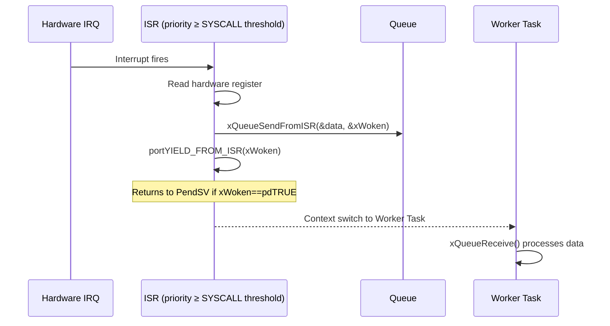

# :material-lightning-bolt: Interrupts

<div class="grid cards" markdown>
- :material-lightbulb-on: **Keep ISRs Short** — do minimal work in the ISR; defer processing to a task via semaphore, notification, or queue
- :material-chip: **ISR-Safe API** — FreeRTOS provides `FromISR` variants of all blocking APIs; never call the non-ISR version from an interrupt
- :material-alert: **Priority Config** — ISRs that call FreeRTOS API must have numeric priority ≥ `configMAX_SYSCALL_INTERRUPT_PRIORITY` (Cortex-M: lower number = higher hardware priority)
- :material-check-circle: **Use When** — use `portYIELD_FROM_ISR()` at end of ISR to immediately hand off CPU to the newly-unblocked task
</div>

---

## :material-lightbulb-on: ISR Design Principles

An Interrupt Service Routine competes with the RTOS kernel for CPU time. Poorly designed ISRs cause:

- Missed interrupts (re-entry before the previous ISR finishes)
- Increased task scheduling jitter
- Priority inversion at the interrupt level
- Deadlock if the ISR calls a blocking RTOS API

### The Golden Rule

> **An ISR should read/clear the hardware flag, capture essential data, signal a task, and return. All processing goes in the task.**

```c
/* BAD — heavy work in ISR */
void USART1_IRQHandler(void) {
    uint8_t byte = USART1->RDR;
    parse_full_protocol_frame(byte);    /* never do this */
    update_display();                   /* never do this */
}

/* GOOD — minimal ISR, deferred work */
void USART1_IRQHandler(void) {
    uint8_t byte = (uint8_t)USART1->RDR;
    BaseType_t xWoken = pdFALSE;
    xQueueSendFromISR(xUartRxQueue, &byte, &xWoken);
    portYIELD_FROM_ISR(xWoken);
}
```

---

## :material-swap-horizontal: Deferred Interrupt Processing Patterns

Three patterns for handing work from an ISR to a task:

### Pattern 1: Task Notification (fastest, 1:1)

```c
TaskHandle_t xWorkerHandle;

void DMA1_Stream0_IRQHandler(void) {
    BaseType_t xWoken = pdFALSE;
    /* DMA transfer complete — notify worker */
    vTaskNotifyGiveFromISR(xWorkerHandle, &xWoken);
    portYIELD_FROM_ISR(xWoken);
}

void vDMAWorker(void *pv) {
    for (;;) {
        ulTaskNotifyTake(pdTRUE, portMAX_DELAY);
        process_dma_buffer();
    }
}
```

### Pattern 2: Binary Semaphore (multi-sender capable)

```c
SemaphoreHandle_t xAdcSem;

void ADC1_2_IRQHandler(void) {
    BaseType_t xWoken = pdFALSE;
    xSemaphoreGiveFromISR(xAdcSem, &xWoken);
    portYIELD_FROM_ISR(xWoken);
}

void vAdcTask(void *pv) {
    for (;;) {
        xSemaphoreTake(xAdcSem, portMAX_DELAY);
        read_adc_result();
    }
}
```

### Pattern 3: Queue (ISR sends data with signal)

```c
QueueHandle_t xUartQueue;

void USART1_IRQHandler(void) {
    UartFrame_t frame;
    frame.byte  = (uint8_t)USART1->RDR;
    frame.ts    = DWT->CYCCNT;
    BaseType_t xWoken = pdFALSE;
    xQueueSendFromISR(xUartQueue, &frame, &xWoken);
    portYIELD_FROM_ISR(xWoken);
}
```

---

## :material-table: ISR-Safe vs Non-ISR-Safe API

| Operation | Task API (blocking) | ISR-Safe API |
|-----------|--------------------|-----------------------------|
| Give semaphore | `xSemaphoreGive()` | `xSemaphoreGiveFromISR()` |
| Take semaphore | `xSemaphoreTake()` | **Not available** (never block in ISR) |
| Send to queue | `xQueueSend()` | `xQueueSendFromISR()` |
| Receive from queue | `xQueueReceive()` | `xQueueReceiveFromISR()` |
| Notify task | `xTaskNotifyGive()` | `vTaskNotifyGiveFromISR()` |
| Set event bits | `xEventGroupSetBits()` | `xEventGroupSetBitsFromISR()` |
| Get tick count | `xTaskGetTickCount()` | `xTaskGetTickCountFromISR()` |
| Request yield | `taskYIELD()` | `portYIELD_FROM_ISR(xWoken)` |

!!! danger "Never call blocking API from ISR"
    Calling `xSemaphoreTake()`, `xQueueReceive()`, or `vTaskDelay()` from an ISR will corrupt the kernel state or lock up the system. Always use the `FromISR` variants.

---

## :material-cpu-64-bit: NVIC Priority Configuration on ARM Cortex-M

ARM Cortex-M uses **numeric priority values** where a **lower number = higher hardware priority**. FreeRTOS adds the concept of a **syscall priority** threshold.

### NVIC Priority Table (example: 4-bit priorities on Cortex-M4)

| Priority Register Value | Logical Level | May call FreeRTOS API? |
|------------------------|---------------|----------------------|
| 0 (0x00) | Highest | **No** — above SYSCALL threshold |
| 1–4 | High | **No** — above threshold |
| 5 (`configMAX_SYSCALL_INTERRUPT_PRIORITY`) | Syscall threshold | **Yes — first allowed level** |
| 6–15 | Lower | **Yes** |
| PendSV (15) | Lowest hardware | Kernel use only |

### `configMAX_SYSCALL_INTERRUPT_PRIORITY`

```c
/* FreeRTOSConfig.h — STM32 with 4-bit priority field (16 levels) */
#define configMAX_SYSCALL_INTERRUPT_PRIORITY    ( 5 << (8 - 4) )  /* = 0x50 */

/* ARM Cortex-M stores priority in the top N bits of an 8-bit register.
   On a device with 4 priority bits: value 5 becomes 0x50 in the register. */
```

Any ISR with a **hardware priority numerically lower than `configMAX_SYSCALL_INTERRUPT_PRIORITY`** (i.e., higher priority) **must NOT** call any FreeRTOS API. It runs entirely outside RTOS control.



---

## :material-nesting: Interrupt Nesting

Cortex-M supports nested interrupts automatically via the NVIC. A higher-priority ISR preempts a lower-priority ISR just as tasks preempt each other.

```
Example nesting sequence:
 1. Normal code running
 2. IRQ_A (priority 8) fires → ISR_A begins
 3. IRQ_B (priority 3) fires → ISR_B preempts ISR_A
 4. ISR_B completes → returns to ISR_A
 5. ISR_A completes → returns to normal code (or PendSV)
```

For reliable nesting:
- All IRQs that call FreeRTOS API must have priority ≥ `configMAX_SYSCALL_INTERRUPT_PRIORITY`
- Time-critical IRQs (e.g., motor PWM) may have higher priority (lower value) but must **not** call FreeRTOS API

---

## :material-lock-clock: Critical Sections in ISRs

### Disabling Individual Interrupts

If you only need to guard against a specific interrupt (not all interrupts), disable only that interrupt source rather than the entire NVIC:

```c
/* Disable USART1 interrupt while accessing shared buffer */
NVIC_DisableIRQ(USART1_IRQn);
    shared_buffer_write(data);
NVIC_EnableIRQ(USART1_IRQn);
```

### FreeRTOS ISR Critical Section

```c
void some_ISR(void) {
    UBaseType_t uxSavedInterruptStatus = taskENTER_CRITICAL_FROM_ISR();
    /* Access shared data */
    shared_counter++;
    taskEXIT_CRITICAL_FROM_ISR(uxSavedInterruptStatus);
}
```

`taskENTER_CRITICAL_FROM_ISR()` raises the interrupt mask to the SYSCALL threshold, blocking other FreeRTOS-aware interrupts while allowing higher-priority (non-FreeRTOS) interrupts to still fire.

---

## :material-help-circle: Flashcards

???+ question "Why must ISRs that call FreeRTOS API have a priority ≥ configMAX_SYSCALL_INTERRUPT_PRIORITY?"
    FreeRTOS uses the `configMAX_SYSCALL_INTERRUPT_PRIORITY` level as a threshold: the kernel temporarily masks all interrupts at this level and below to protect internal data structures. ISRs with higher hardware priority (lower numeric value) run outside this mask—if they called FreeRTOS API they could corrupt kernel state that the API is mid-modifying. Therefore any ISR that calls FreeRTOS API must be at or below this threshold so the kernel can safely mask it.

???+ question "What is portYIELD_FROM_ISR() and when must you use it?"
    `portYIELD_FROM_ISR(xHigherPriorityTaskWoken)` requests a context switch at the end of the ISR if `xHigherPriorityTaskWoken` was set to `pdTRUE` by the `FromISR` API call. Without it, the ISR returns to whatever task was interrupted, even if a higher-priority task is now ready. It is mandatory after any `FromISR` call that unblocks a task to ensure the newly-ready high-priority task runs immediately.

???+ question "What three deferred-processing patterns exist for ISR-to-task handoff?"
    1. **Task notification** (`vTaskNotifyGiveFromISR`) — fastest, zero extra RAM, 1:1 only
    2. **Binary semaphore** (`xSemaphoreGiveFromISR`) — simple signal, multiple senders possible
    3. **Queue** (`xQueueSendFromISR`) — sends data *with* the signal, buffering multiple events

???+ question "An ISR has hardware priority 2 and configMAX_SYSCALL_INTERRUPT_PRIORITY is 5. Can this ISR call xQueueSendFromISR()?"
    **No.** Hardware priority 2 is *higher* than 5 (lower numeric value = higher priority on Cortex-M). This ISR runs above the SYSCALL threshold, meaning the FreeRTOS kernel cannot mask it. Calling `xQueueSendFromISR()` from this ISR would risk corrupting the kernel's internal queue state. This ISR may only read/write hardware registers and set a volatile flag polled by a lower-priority ISR or task.

---

## :material-clipboard-check: Self Test

=== "Question 1"
    Your UART ISR fires at 115200 baud, receiving one byte per interrupt. You need to parse complete frames (up to 64 bytes) and forward them to a processing task. Describe the recommended architecture.

=== "Answer 1"
    1. **ISR** reads one byte from the UART data register, sends it to a **queue** (`xQueueSendFromISR`), and calls `portYIELD_FROM_ISR`.
    2. A high-priority **UART Rx task** blocks on `xQueueReceive`; it accumulates bytes and assembles complete frames into a second **frame queue**.
    3. A lower-priority **protocol task** blocks on the frame queue and performs full parsing.
    This defers all parsing work to tasks while the ISR stays minimal (~5 instructions).

=== "Question 2"
    You set `configMAX_SYSCALL_INTERRUPT_PRIORITY` to `0x50` on an STM32F4 (4 priority bits). Which NVIC priority values are allowed to call FreeRTOS API, and which are not?

=== "Answer 2"
    The STM32F4 stores priorities in the top 4 bits of an 8-bit register. `0x50` corresponds to logical priority **5**. IRQs at logical priority 5–15 (register values 0x50–0xF0) are **allowed** to call FreeRTOS `FromISR` API. IRQs at logical priority 0–4 (register values 0x00–0x40) are **forbidden** from calling any FreeRTOS API — they must run without touching the RTOS kernel.

---

## :material-check-circle: Summary

!!! success "Key Takeaways"
    - Keep ISRs minimal: read hardware, capture data, signal a task, return. Defer all processing to tasks.
    - Use `xQueueSendFromISR`, `xSemaphoreGiveFromISR`, or `vTaskNotifyGiveFromISR` — never the blocking task variants from an ISR.
    - Always call `portYIELD_FROM_ISR(xHigherPriorityTaskWoken)` at the end of ISRs that unblock tasks.
    - On ARM Cortex-M, set all FreeRTOS-aware IRQ priorities to a **numeric value ≥ `configMAX_SYSCALL_INTERRUPT_PRIORITY`** (i.e., equal or lower hardware priority).
    - Time-critical ISRs that exceed the SYSCALL threshold must **not** call any FreeRTOS API — they communicate via raw volatile flags only.
    - `taskENTER_CRITICAL_FROM_ISR()` provides a re-entrant critical section usable from within an ISR.
