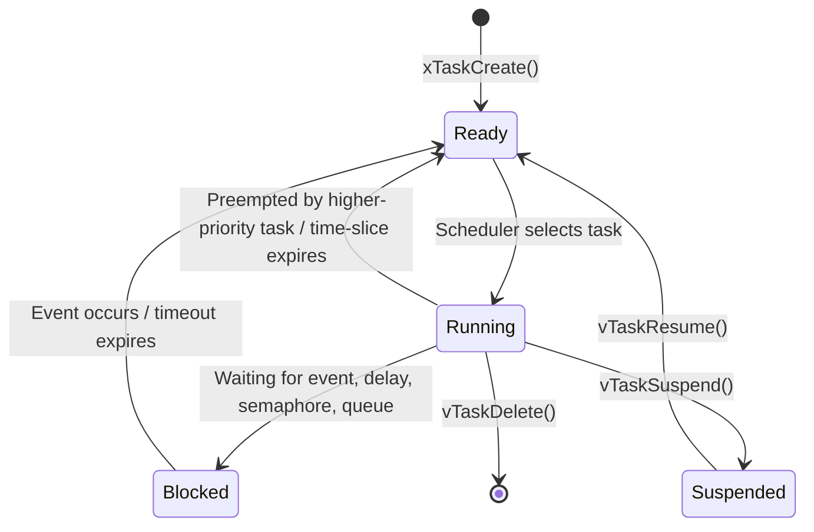

# :material-chip: RTOS Basics

<div class="grid cards" markdown>
- :material-lightbulb-on: **Determinism** — an RTOS guarantees task response within a bounded, predictable time window
- :material-chip: **Preemption** — the kernel can interrupt a running task to give CPU to a higher-priority task
- :material-alert: **Pitfall** — using a GPOS (Linux) for hard real-time violates timing guarantees under load
- :material-check-circle: **Use When** — your system has concurrent activities with different deadlines or priorities
</div>

---

## :material-lightbulb-on: What Is an RTOS?

A **Real-Time Operating System (RTOS)** is a lightweight OS whose primary design goal is *temporal correctness*: not just producing the right answer, but producing it at the right time. An RTOS provides:

- A **scheduler** that decides which task runs on the CPU
- **Synchronization primitives** (semaphores, mutexes, queues)
- **Timer services** for periodic and one-shot events
- Optional: memory management, networking stack, file system

### Determinism Defined

> **Determinism** means the worst-case response time of every task is known, finite, and met under all operating conditions.

A system is **deterministic** if, given the same inputs and initial state, it always produces the same output within the same bounded time. The RTOS kernel itself must complete its own operations (context switch, semaphore give/take) in bounded, measurable time—no unbounded loops, no priority inversions, no garbage collection pauses.

---

## :material-timer-outline: Hard, Soft, and Firm Real-Time

| Class | Miss Consequence | Example |
|-------|-----------------|---------|
| **Hard** | System failure / safety hazard | Airbag deployment (< 15 ms), pacemaker pulse |
| **Firm** | Result becomes useless (discarded) | Video frame decode—late frame is dropped |
| **Soft** | Degraded quality, but system continues | VoIP jitter—occasional late packet tolerable |

Most deeply embedded systems (motor control, sensor fusion) are **hard** real-time. Consumer products (audio streaming) are often **soft** real-time.

---

## :material-state-machine: Task States

Every RTOS task moves through a well-defined set of states. FreeRTOS uses five; the core four are universal:



| State | Description |
|-------|-------------|
| **Ready** | Task is eligible to run; waiting for CPU |
| **Running** | Task is currently executing on the CPU |
| **Blocked** | Task is waiting for a resource or time delay |
| **Suspended** | Task is explicitly paused; not considered for scheduling |
| **Deleted** | Task resources are being reclaimed |

---

## :material-compare: RTOS vs Bare-Metal vs GPOS

| Feature | Bare-Metal (Superloop) | RTOS | GPOS (Linux) |
|---------|----------------------|------|--------------|
| Scheduling | Manual / polling | Preemptive priority | Preemptive + CFS (fair share) |
| Context switch overhead | N/A | ~1–10 µs | ~5–50 µs (+ TLB flush) |
| Worst-case latency | Deterministic (simple) | Deterministic (bounded) | Non-deterministic |
| Memory footprint | ~1–10 KB | ~10–100 KB | ~4–64 MB |
| IPC primitives | Manual flags/buffers | Semaphore, queue, mutex | Pipe, socket, signal, futex |
| MMU required | No | No (MPU optional) | Yes (virtual memory) |
| Boot time | < 1 ms | 1–50 ms | 1–30 s |
| Typical use | Single-concern devices | Multi-task embedded systems | Rich-OS applications |

**Bare-metal superloop** is excellent for simple, single-concern firmware where every cycle counts and there is no concurrency. Once you have multiple activities with different deadlines, an RTOS pays its overhead back in determinism and code clarity.

---

## :material-clock-outline: The Tick Interrupt and System Clock

The RTOS derives time from a periodic hardware timer interrupt called the **tick**:

- Typical tick rate: **100 Hz – 1000 Hz** (1 ms – 10 ms period)
- Each tick the scheduler can preempt the running task
- `configTICK_RATE_HZ` in FreeRTOS controls this
- `pdMS_TO_TICKS(ms)` converts milliseconds to tick counts

```c
/* FreeRTOS example: delay 250 ms */
vTaskDelay(pdMS_TO_TICKS(250));
```

!!! warning "Tick Resolution Limit"
    A 1 kHz tick gives 1 ms resolution. For sub-millisecond timing use hardware timers or the DWT cycle counter directly—do not rely on the RTOS tick.

---

## :material-package-variant: RTOS Kernel Components Overview

```
┌─────────────────────────────────────────────────────┐
│                   Application Tasks                 │
├──────────────┬──────────────┬───────────────────────┤
│   Scheduler  │  IPC/Sync    │   Timer Services      │
│  (priority + │  Semaphore   │   Software timers     │
│  round-robin)│  Mutex/Queue │   vTaskDelayUntil     │
├──────────────┴──────────────┴───────────────────────┤
│          Memory Manager  │  Hook/Trace Callbacks    │
├──────────────────────────┴──────────────────────────┤
│              Hardware Abstraction (port layer)       │
│         (context switch, tick timer, critical sec)  │
└─────────────────────────────────────────────────────┘
```

### Typical RTOS Kernel Sizes

| RTOS | ROM (minimal config) | RAM (minimal) | License |
|------|---------------------|--------------|---------|
| FreeRTOS | ~5 KB | ~4 KB | MIT |
| Zephyr | ~32 KB | ~8 KB | Apache 2.0 |
| ThreadX (Azure) | ~6 KB | ~2 KB | MIT |
| embOS (Segger) | ~4 KB | ~1.5 KB | Commercial |
| RIOT-OS | ~10 KB | ~1.5 KB | LGPL |

---

## :material-help-circle: Flashcards

???+ question "What is the difference between hard and soft real-time?"
    **Hard real-time**: missing a deadline causes a system failure or safety hazard—the late result is worse than no result (e.g., airbag timing).

    **Soft real-time**: missing a deadline degrades quality but the system continues functioning (e.g., late audio packet causes a glitch, not a crash).

???+ question "What four states does an RTOS task cycle through?"
    **Ready** → **Running** → **Blocked** → **Ready** is the normal cycle.
    
    A task enters **Blocked** when it waits for a semaphore, queue, or delay. It returns to **Ready** when the event occurs or the timeout expires. **Suspended** is a fifth, manually-controlled state.

???+ question "Why does a GPOS like Linux fail hard real-time requirements?"
    Linux uses a **Completely Fair Scheduler (CFS)** designed for throughput and fairness, not bounded latency. Kernel preemption gaps, interrupt threading, memory reclaim, and page faults introduce unbounded jitter. Even `PREEMPT_RT` patches only reduce worst-case latency to hundreds of microseconds—insufficient for hard real-time control loops.

???+ question "What is the RTOS tick and why does its rate matter?"
    The tick is a periodic hardware-timer interrupt that drives the RTOS time base. A higher tick rate (e.g., 1000 Hz) gives finer delay resolution but increases CPU overhead from ISR entry/exit. A lower rate (e.g., 100 Hz) reduces overhead but limits minimum delay resolution to 10 ms.

---

## :material-clipboard-check: Self Test

=== "Question 1"
    A task calls `xSemaphoreTake()` on a semaphore that is not yet available. What state does the task enter, and what state does it return to when the semaphore is given?

=== "Answer 1"
    The task transitions from **Running** to **Blocked**. When another task or ISR calls `xSemaphoreGive()`, the blocked task is moved back to **Ready** (and will run when the scheduler selects it).

=== "Question 2"
    Your product is a battery-powered sensor that reads a sensor every 100 ms and transmits via BLE. Is this hard, firm, or soft real-time? Justify your answer.

=== "Answer 2"
    This is typically **soft real-time**. A missed 100 ms sample causes a slightly stale reading or a dropped BLE packet—quality degrades gracefully but no safety hazard occurs. If the sensor is part of a safety-critical feedback loop (e.g., closed-loop insulin pump), it becomes **hard real-time**.

=== "Question 3"
    Name three services a minimal RTOS kernel must provide beyond task scheduling.

=== "Answer 3"
    1. **Inter-task synchronization** (semaphore or mutex) to protect shared resources
    2. **Inter-task communication** (queue or mailbox) to pass data between tasks
    3. **Timer services** (`vTaskDelay` / `vTaskDelayUntil`) for time-based task activation

---

## :material-check-circle: Summary

!!! success "Key Takeaways"
    - An RTOS provides **deterministic, bounded-latency** execution through a priority-based preemptive scheduler.
    - Tasks cycle through **Ready → Running → Blocked → Ready**; the scheduler always runs the highest-priority ready task.
    - **Hard real-time** systems cannot miss deadlines; **soft real-time** systems degrade gracefully; **firm real-time** discards late results.
    - The **tick interrupt** is the RTOS time base—tick rate trades off delay resolution against CPU overhead.
    - An RTOS occupies 4–100 KB of ROM/RAM, making it viable on microcontrollers where a GPOS would be far too heavy.
    - Choose RTOS over bare-metal when you have **concurrent tasks with different deadlines**; choose bare-metal for ultra-simple, single-concern firmware.
