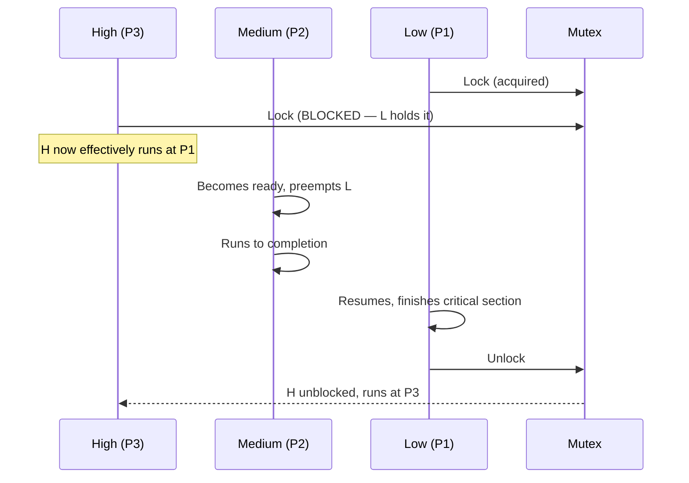

# :material-calendar-clock: Scheduling

<div class="grid cards" markdown>
- :material-lightbulb-on: **Preemption** — the kernel interrupts a lower-priority task the instant a higher-priority task becomes ready
- :material-chip: **RMS** — Rate Monotonic Scheduling assigns fixed priorities by period: shorter period = higher priority
- :material-alert: **Priority Inversion** — a high-priority task can be indefinitely blocked by a low-priority task holding a shared mutex
- :material-check-circle: **Use When** — use EDF for maximum utilisation; use RMS for simpler, analysable fixed-priority systems
</div>

---

## :material-lightbulb-on: Priority-Based Preemptive Scheduling

FreeRTOS (and most embedded RTOSes) uses **fixed-priority preemptive scheduling** with optional **round-robin** time-slicing among tasks at the same priority level.

**Rules:**

1. The scheduler always runs the **highest-priority ready task**.
2. A task remains running until it **blocks**, **delays**, **yields**, or is **preempted** by a higher-priority task becoming ready.
3. If two tasks share the same priority, each gets one tick-slice before the other runs (round-robin).

```c
/* FreeRTOS task priorities — higher number = higher priority */
#define PRIORITY_SENSOR   3
#define PRIORITY_CONTROL  4   /* preempts SENSOR */
#define PRIORITY_COMMS    2
#define PRIORITY_IDLE     0   /* tskIDLE_PRIORITY */
```

!!! tip "Priority Assignment Guideline"
    Assign priority proportional to urgency (deadline tightness), not processing load. A task with a 1 ms deadline must outrank a task with a 100 ms deadline regardless of how much CPU each uses.

---

## :material-calendar-clock: Round-Robin Among Equal Priorities

When `configUSE_TIME_SLICING` is enabled (default), tasks at the same priority share the CPU in round-robin fashion, each running for one tick period.

```mermaid
gantt
    title Round-Robin: Task A and Task B at same priority (tick = 1 ms)
    dateFormat x
    axisFormat %Lms
    section CPU
    Task A  : 0, 1
    Task B  : 1, 2
    Task A  : 2, 3
    Task B  : 3, 4
    Task A  : 4, 5
```



Round-robin is fair but not real-time—it does not respect deadlines. Use it only for background tasks where deadlines don't apply (e.g., logging, LED blink).

---

## :material-chart-line: Rate Monotonic Scheduling (RMS)

**RMS** is the classic fixed-priority assignment policy for periodic tasks, proven optimal among all fixed-priority algorithms by Liu & Layland (1973).

**Rule:** Assign the **highest priority to the task with the shortest period**.

| Task | Period T | WCET C | Utilisation C/T | RMS Priority |
|------|---------|--------|-----------------|--------------|
| τ₁ | 5 ms | 1 ms | 0.20 | Highest (3) |
| τ₂ | 10 ms | 3 ms | 0.30 | Medium (2) |
| τ₃ | 20 ms | 4 ms | 0.20 | Lowest (1) |
| **Total** | | | **0.70** | |

### Schedulability Bound (Liu & Layland)

The **utilisation bound** for n periodic tasks under RMS is:

$$U = \sum_{i=1}^{n} \frac{C_i}{T_i} \leq n \cdot \left(2^{1/n} - 1\right)$$

| n tasks | Bound U_bound |
|---------|-------------|
| 1 | 1.000 (100%) |
| 2 | 0.828 (82.8%) |
| 3 | 0.780 (78.0%) |
| 5 | 0.743 (74.3%) |
| 10 | 0.718 (71.8%) |
| ∞ | ln 2 ≈ 0.693 (69.3%) |

If total utilisation U ≤ bound, the task set is **guaranteed schedulable** under RMS. If U exceeds the bound but is ≤ 1.0, the set *may* still be schedulable—use Response Time Analysis (RTA) to confirm.

---

## :material-clock-fast: Earliest Deadline First (EDF)

**EDF** is a dynamic-priority algorithm: at each scheduling decision the task with the **nearest absolute deadline** runs. It is optimal for preemptive uniprocessor scheduling—it can schedule any task set with U ≤ 1.0.

```
Task τ₁: period=5, deadline=5   → absolute deadline at t=5, 10, 15…
Task τ₂: period=7, deadline=7   → absolute deadline at t=7, 14, 21…
At t=0:  τ₁ runs (deadline 5 < 7)
At t=1:  if τ₁ is done, τ₂ runs (deadline 7); else τ₁ continues
```

| Feature | RMS | EDF |
|---------|-----|-----|
| Priority type | Fixed | Dynamic (changes each period) |
| Max utilisation | ~69.3% (ln 2) | 100% |
| Implementation complexity | Simple | Moderate (runtime priority update) |
| Overload behaviour | Predictable (lowest priority misses) | Can cascade failures |
| RTOS support | Universal | Less common (Zephyr supports it) |

---

## :material-chart-gantt: Preemption Example (Mermaid Gantt)

```mermaid
gantt
    title Preemptive Scheduling: High-priority task preempts low-priority
    dateFormat x
    axisFormat %Lms
    section CPU
    Low-priority task (τ₃)  :active, t3a, 0, 3
    High-priority task (τ₁) :crit,   t1,  3, 7
    Low-priority task (τ₃)  :active, t3b, 7, 12
    Med-priority task (τ₂)  :        t2,  12, 16
    Low-priority task (τ₃)  :active, t3c, 16, 20
```



At t=3, τ₁ becomes ready (e.g., sensor data arrives via ISR). The scheduler immediately preempts τ₃ and runs τ₁. When τ₁ finishes at t=7, τ₃ resumes from where it was interrupted.

---

## :material-alert: Priority Inversion

**Priority inversion** occurs when a high-priority task is blocked waiting for a resource held by a low-priority task, and a medium-priority task preempts the low-priority task—leaving the high-priority task indefinitely delayed.



The Mars Pathfinder (1997) experienced system resets caused by priority inversion between a high-priority data bus task, medium-priority tasks, and a low-priority meteorological task.

### Priority Inheritance Protocol (PIP)

When a high-priority task H is blocked on a mutex held by low-priority task L, the kernel **temporarily raises L's priority to H's level** until L releases the mutex.

```c
/* FreeRTOS mutex automatically uses priority inheritance */
SemaphoreHandle_t xMutex = xSemaphoreCreateMutex();
/* Do NOT use xSemaphoreCreateBinary() for mutual exclusion —
   it does not provide priority inheritance */
```

### Immediate Ceiling Priority Protocol (ICPP)

ICPP (also called Priority Ceiling Protocol) assigns each mutex a **ceiling priority** equal to the highest priority of any task that may lock it. When a task locks the mutex, it **immediately** inherits the ceiling priority—blocking all tasks that could request the same mutex.

**Advantages of ICPP over PIP:**
- No deadlock possible
- Bounded blocking time: a task is blocked by at most *one* lower-priority critical section
- Simpler analysis

| Protocol | Deadlock-free? | Max blocks per task | Runtime overhead |
|----------|---------------|--------------------|--------------------|
| None | No | Unbounded | None |
| PIP | Yes | 1 per shared resource | Medium |
| ICPP | Yes | 1 (ever) | Low (priority set on lock) |

---

## :material-help-circle: Flashcards

???+ question "What is the Liu & Layland schedulability bound for 3 tasks under RMS?"
    $$U_{bound}(3) = 3 \times (2^{1/3} - 1) \approx 0.780$$
    
    If the sum of C_i/T_i for all three tasks is ≤ 0.780 (78%), the task set is guaranteed to meet all deadlines under Rate Monotonic priority assignment.

???+ question "What is priority inversion and which famous spacecraft suffered from it?"
    Priority inversion occurs when a high-priority task is blocked indefinitely because a low-priority task holds a shared resource while a medium-priority task preempts it, preventing the resource from being released.
    
    **Mars Pathfinder (1997)** experienced repeated system resets due to priority inversion between its data bus task, compute task, and meteorological task. The fix (enabling priority inheritance) was uploaded remotely.

???+ question "What is the key difference between RMS and EDF?"
    **RMS** assigns *fixed* priorities offline based on period (shorter period = higher priority). **EDF** assigns *dynamic* priorities at runtime based on the nearest absolute deadline. EDF achieves 100% CPU utilisation; RMS is limited to ~69.3% with a guaranteed schedulability test.

???+ question "In FreeRTOS, what type of semaphore provides priority inheritance, and why does it matter?"
    `xSemaphoreCreateMutex()` creates a mutex with built-in **priority inheritance**. A binary semaphore (`xSemaphoreCreateBinary`) has no priority inheritance—using it for mutual exclusion can cause priority inversion. Always use a mutex to protect shared data between tasks.

---

## :material-clipboard-check: Self Test

=== "Question 1"
    Three periodic tasks: τ₁(C=1, T=4), τ₂(C=2, T=6), τ₃(C=2, T=8). Calculate total utilisation and determine if the set is schedulable under RMS using the Liu & Layland bound.

=== "Answer 1"
    U = 1/4 + 2/6 + 2/8 = 0.25 + 0.333 + 0.25 = **0.833**

    Liu & Layland bound for n=3: U_bound = 3×(2^(1/3)−1) ≈ **0.780**

    0.833 > 0.780, so the bound is **exceeded**—we cannot guarantee schedulability from this test alone. Response Time Analysis (RTA) is needed to determine if the set actually meets deadlines.

=== "Question 2"
    A FreeRTOS application has Task A (priority 3) and Task B (priority 1) sharing a mutex. Task A is blocked on the mutex; Task B holds it. Task C (priority 2) is currently running. What protocol resolves this, and what priority does Task B run at while the mutex fix is active?

=== "Answer 2"
    **Priority Inheritance Protocol** resolves this. While Task A is blocked waiting for the mutex, the kernel raises Task B's priority to **3** (Task A's priority). This causes Task C (priority 2) to be preempted, Task B runs at priority 3, releases the mutex, reverts to priority 1, and Task A proceeds.

---

## :material-check-circle: Summary

!!! success "Key Takeaways"
    - **Preemptive priority scheduling**: the highest-priority ready task always runs; lower-priority tasks are interrupted immediately.
    - **RMS** is the standard fixed-priority policy—assign priority by inverse period; guaranteed schedulable if U ≤ n×(2^(1/n)−1).
    - **EDF** is dynamically optimal, achieving 100% utilisation, but less predictable under overload.
    - **Priority inversion** can cause high-priority tasks to stall indefinitely; solved by **Priority Inheritance** or **ICPP**.
    - Always use `xSemaphoreCreateMutex()` (not binary semaphore) for mutual exclusion in FreeRTOS to get priority inheritance.
    - When U exceeds the Liu & Layland bound, apply Response Time Analysis before concluding the task set is unschedulable.
