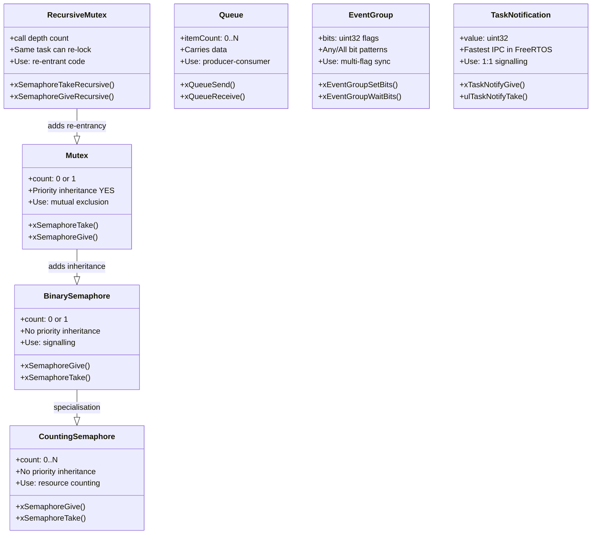

# :material-sync: Synchronization

<div class="grid cards" markdown>
- :material-lightbulb-on: **Race Condition** — two tasks reading/modifying shared data without coordination yields unpredictable results
- :material-chip: **Mutex** — provides mutual exclusion *with* priority inheritance; prefer over binary semaphore for data protection
- :material-alert: **Deadlock** — two tasks each holding a mutex the other needs will block forever; always acquire locks in a consistent order
- :material-check-circle: **Use When** — use task notifications for simple one-to-one unblocking; use queues when data must travel with the signal
</div>

---

## :material-alert: Race Conditions and Critical Sections

A **race condition** occurs when the result of a computation depends on the relative timing of two or more unsynchronized operations on shared state.

```c
/* UNSAFE — read-modify-write is NOT atomic on most MCUs */
volatile uint32_t g_counter = 0;

void TaskA(void *pv) {
    for (;;) { g_counter++; }   /* could be interrupted mid-increment */
}
void TaskB(void *pv) {
    for (;;) { g_counter++; }   /* same variable — race condition */
}
```

A **critical section** is a region of code that accesses shared resources and must execute atomically (without interruption):

```c
/* FreeRTOS critical section — disables interrupts */
taskENTER_CRITICAL();
    g_counter++;            /* now atomic */
taskEXIT_CRITICAL();
```

!!! warning "Critical sections should be as short as possible"
    `taskENTER_CRITICAL()` disables all interrupts up to `configMAX_SYSCALL_INTERRUPT_PRIORITY`. Long critical sections increase interrupt latency and can cause missed deadlines.

---

## :material-sync: Synchronization Primitives



---

## :material-lock: Binary and Counting Semaphores

### Binary Semaphore

A **binary semaphore** has two states: *given* (1) and *taken* (0). It is primarily used for **signalling** between a producer (ISR or task) and a consumer task.

```c
SemaphoreHandle_t xSem;

void vISR_Handler(void) {
    BaseType_t xHigherPriorityTaskWoken = pdFALSE;
    xSemaphoreGiveFromISR(xSem, &xHigherPriorityTaskWoken);
    portYIELD_FROM_ISR(xHigherPriorityTaskWoken);
}

void vWorkerTask(void *pv) {
    for (;;) {
        /* Block until ISR signals */
        xSemaphoreTake(xSem, portMAX_DELAY);
        process_event();
    }
}
```

### Counting Semaphore

A **counting semaphore** holds a count between 0 and a maximum. Use it to track available instances of a resource or to count events produced faster than they are consumed.

```c
/* Pool of 5 DMA buffers */
SemaphoreHandle_t xDmaPool = xSemaphoreCreateCounting(5, 5);

void acquire_dma_buffer(void) {
    xSemaphoreTake(xDmaPool, portMAX_DELAY); /* blocks if all 5 used */
}
void release_dma_buffer(void) {
    xSemaphoreGive(xDmaPool);
}
```

---

## :material-lock-outline: Mutex vs Binary Semaphore

| Property | Binary Semaphore | Mutex |
|----------|-----------------|-------|
| Primary use | Signalling / event | Mutual exclusion |
| Priority inheritance | **No** | **Yes** (FreeRTOS) |
| Can be given by different task | Yes | No (ownership) |
| Created by | `xSemaphoreCreateBinary()` | `xSemaphoreCreateMutex()` |
| ISR-safe give | `xSemaphoreGiveFromISR()` | Not recommended from ISR |

**Rule of thumb:** If you are protecting a shared resource, use a **mutex**. If you are signalling an event (one task wakes another), use a **binary semaphore** or **task notification**.

### Recursive Mutex

A recursive mutex allows the **same task** to lock it multiple times without deadlocking. The lock count increments on each take and decrements on each give; the mutex is released when the count returns to zero.

```c
SemaphoreHandle_t xRecMutex = xSemaphoreCreateRecursiveMutex();

void reentrant_function(int depth) {
    xSemaphoreTakeRecursive(xRecMutex, portMAX_DELAY);
    if (depth > 0) reentrant_function(depth - 1);   /* safe re-entry */
    xSemaphoreGiveRecursive(xRecMutex);
}
```

---

## :material-flag: Event Groups

An **event group** holds a set of binary flags (bits) in a single word. Tasks can wait for **any** combination of bits, or **all** of a set of bits, in a single blocking call.

```c
EventGroupHandle_t xEvents;
#define EVT_SENSOR_READY  (1 << 0)
#define EVT_COMMS_UP      (1 << 1)
#define EVT_CONFIG_DONE   (1 << 2)

/* In sensor task */
xEventGroupSetBits(xEvents, EVT_SENSOR_READY);

/* In main control task — wait for ALL three */
EventBits_t bits = xEventGroupWaitBits(
    xEvents,
    EVT_SENSOR_READY | EVT_COMMS_UP | EVT_CONFIG_DONE,
    pdTRUE,          /* clear on exit */
    pdTRUE,          /* wait for ALL bits */
    portMAX_DELAY);
```

---

## :material-bell: Task Notifications — the Fast Path

**Task notifications** are the fastest synchronization mechanism in FreeRTOS—they operate directly on a task's internal notification value (32-bit) and avoid the overhead of creating a separate semaphore object.

```c
/* Notifier (e.g., ISR) */
void vISR(void) {
    BaseType_t xWoken = pdFALSE;
    vTaskNotifyGiveFromISR(xWorkerTaskHandle, &xWoken);
    portYIELD_FROM_ISR(xWoken);
}

/* Worker task */
void vWorkerTask(void *pv) {
    for (;;) {
        ulTaskNotifyTake(pdTRUE, portMAX_DELAY);  /* wait for notify */
        process_data();
    }
}
```

| Method | RAM overhead | Speed | Multi-sender? |
|--------|-------------|-------|---------------|
| Binary semaphore | ~80 bytes (queue) | Moderate | Yes |
| Task notification | 0 (in TCB) | **Fastest** | No (1:1 only) |
| Queue | ~100+ bytes | Moderate | Yes |

---

## :material-arrow-left-right: ISR-to-Task Synchronization Pattern

The recommended pattern for deferring interrupt work to a task:

```c
/* 1. Create a binary semaphore at startup */
SemaphoreHandle_t xIrqSem;
xIrqSem = xSemaphoreCreateBinary();

/* 2. ISR — signal the semaphore and yield if needed */
void EXTI0_IRQHandler(void) {
    BaseType_t xHigherPriorityTaskWoken = pdFALSE;
    /* Clear hardware interrupt flag */
    EXTI->PR1 = EXTI_PR1_PIF0;
    /* Signal worker task */
    xSemaphoreGiveFromISR(xIrqSem, &xHigherPriorityTaskWoken);
    portYIELD_FROM_ISR(xHigherPriorityTaskWoken);
}

/* 3. Worker task — blocks until ISR fires */
void vIRQWorkerTask(void *pv) {
    for (;;) {
        if (xSemaphoreTake(xIrqSem, pdMS_TO_TICKS(100)) == pdTRUE) {
            handle_interrupt_event();
        } else {
            handle_timeout();
        }
    }
}
```

---

## :material-arrow-right-circle: Producer-Consumer with Queue

```c
#define QUEUE_LENGTH   10
#define ITEM_SIZE      sizeof(SensorData_t)

QueueHandle_t xSensorQueue;

/* Producer task (or ISR) */
void vSensorTask(void *pv) {
    SensorData_t data;
    for (;;) {
        read_sensor(&data);
        /* Send with 10 ms timeout — non-blocking option */
        if (xQueueSend(xSensorQueue, &data, pdMS_TO_TICKS(10)) != pdTRUE) {
            log_overflow();   /* consumer too slow */
        }
        vTaskDelay(pdMS_TO_TICKS(50));
    }
}

/* Consumer task */
void vProcessingTask(void *pv) {
    SensorData_t data;
    for (;;) {
        xQueueReceive(xSensorQueue, &data, portMAX_DELAY);
        process(&data);
    }
}
```

---

## :material-help-circle: Flashcards

???+ question "What is the difference between a mutex and a binary semaphore in FreeRTOS?"
    A **mutex** (`xSemaphoreCreateMutex`) has **priority inheritance** and enforces ownership—only the task that took it can give it back. A **binary semaphore** has no priority inheritance and can be given by any task or ISR. Use mutexes to protect shared data; use binary semaphores (or task notifications) for event signalling.

???+ question "What is a deadlock and how do you prevent it?"
    A **deadlock** occurs when two tasks each hold a resource the other needs, and both block waiting forever. Prevention strategies:
    1. Always acquire multiple mutexes in the **same order** across all tasks.
    2. Use **ICPP** (Immediate Ceiling Priority Protocol) to limit blocking.
    3. Use `xSemaphoreTake` with a finite timeout and handle the failure.

???+ question "When should you use a task notification instead of a semaphore?"
    Task notifications are ideal for **one-to-one** signalling where only a single notifier sends to a specific task. They consume no extra RAM (the notification value lives in the TCB), have lower latency, and are ISR-safe. Use a semaphore when multiple senders or multiple receivers are involved.

???+ question "What is an event group and how does it differ from a semaphore?"
    An **event group** holds multiple boolean flags (bits) in a single 32-bit word. A task can wait for **any** subset of bits to be set, or for **all** of a set of bits simultaneously. A semaphore only represents a single signal. Use event groups when a task must wait for several independent conditions to all be true before proceeding.

---

## :material-clipboard-check: Self Test

=== "Question 1"
    An ISR fires 5 times before the worker task gets to run. How many times will `ulTaskNotifyTake(pdTRUE, ...)` return when the task finally runs? How does this compare to a binary semaphore?

=== "Answer 1"
    With `xTaskNotifyGive`, the internal notification count increments each call, so the value reaches **5**. `ulTaskNotifyTake(pdTRUE, ...)` returns **once** with value 5 (pdTRUE clears the count). With a **binary semaphore**, only 1 give is remembered regardless of how many times the ISR fires—three of the five events would be lost. Use a **counting semaphore** or **queue** if every event must be processed.

=== "Question 2"
    Task A takes MutexX then MutexY. Task B takes MutexY then MutexX. Under what condition can deadlock occur and what is the fix?

=== "Answer 2"
    Deadlock occurs if Task A holds MutexX and blocks waiting for MutexY, while Task B holds MutexY and blocks waiting for MutexX—circular wait. **Fix:** enforce a global lock acquisition order. Both tasks must acquire in the same order (e.g., always X before Y). This eliminates the circular-wait condition.

---

## :material-check-circle: Summary

!!! success "Key Takeaways"
    - A **race condition** occurs when shared state is modified without coordination; protect shared data with a **mutex** (not a binary semaphore) to get priority inheritance.
    - **Binary semaphores** and **task notifications** signal events; **counting semaphores** track resource pools; **queues** carry data with the signal.
    - **Task notifications** are the fastest 1:1 synchronization mechanism in FreeRTOS—zero extra RAM, ISR-safe.
    - **Event groups** allow a task to wait for any/all combination of multiple boolean flags in a single call.
    - Prevent **deadlock** by always acquiring multiple locks in a consistent global order across all tasks.
    - Keep **critical sections** (disabled interrupts) as short as possible to avoid increasing interrupt latency.
