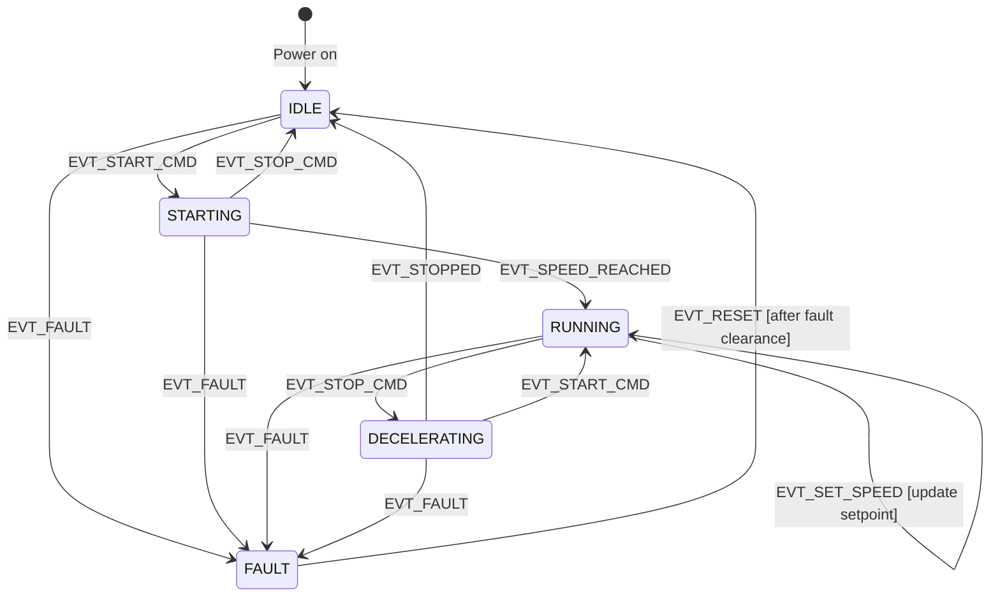

# :material-state-machine: State Machine Tasks

<div class="grid cards" markdown>
- :material-lightbulb-on: **Event-Driven** — RTOS tasks naturally implement state machines: block on a queue for events, transition state, repeat
- :material-chip: **Function Pointers** — represent each state as a function pointer; the dispatcher calls the current state handler with the incoming event
- :material-alert: **Missed Events** — events posted while the state machine is processing a previous event are buffered in the queue; never drop them silently
- :material-check-circle: **Use When** — use hierarchical state machines (HSMs) when many states share common behaviour to avoid duplicating transitions
</div>

---

## :material-lightbulb-on: State Machines in RTOS Tasks

An RTOS task maps naturally to an event-driven state machine:

```
Task loop:
  1. Block on event queue (portMAX_DELAY)
  2. Receive event
  3. Call current state handler with event
  4. Handler returns new state (or same state if no transition)
  5. Go to 1
```

This structure gives you:
- **Decoupled event sources** — any task or ISR posts events without knowing the FSM's current state
- **Clear state logic** — all behaviour for a given state lives in one function
- **Testability** — states can be tested by injecting events directly

---

## :material-compare: Mealy vs Moore Machines

| Type | Output depends on | Transition action |
|------|-----------------|-------------------|
| **Moore** | State only | Entry/exit actions on state change |
| **Mealy** | State + input event | Action associated with the transition |

Most embedded FSMs are **Mealy**: the action is "do X when event E occurs in state S".

---

## :material-draw: UML State Diagram — Motor Controller



---

## :material-code-tags: C Implementation — Switch-Case Style

```c
#include "FreeRTOS.h"
#include "task.h"
#include "queue.h"

/* ---- Events --------------------------------------------------- */
typedef enum {
    EVT_NONE = 0,
    EVT_START_CMD,
    EVT_STOP_CMD,
    EVT_SET_SPEED,
    EVT_SPEED_REACHED,
    EVT_STOPPED,
    EVT_FAULT,
    EVT_RESET,
} MotorEvent_t;

typedef struct {
    MotorEvent_t type;
    int32_t      data;   /* e.g., RPM for EVT_SET_SPEED */
} MotorMsg_t;

/* ---- States --------------------------------------------------- */
typedef enum {
    STATE_IDLE        = 0,
    STATE_STARTING    = 1,
    STATE_RUNNING     = 2,
    STATE_DECELERATING = 3,
    STATE_FAULT       = 4,
} MotorState_t;

/* ---- State machine context ------------------------------------ */
typedef struct {
    MotorState_t state;
    int32_t      setpoint_rpm;
    uint32_t     fault_code;
} MotorFSM_t;

static MotorFSM_t fsm = { .state = STATE_IDLE };

/* ---- FSM task ------------------------------------------------- */
static QueueHandle_t xMotorEventQueue;

static void fsm_enter_state(MotorFSM_t *f, MotorState_t new_state) {
    /* Entry actions */
    switch (new_state) {
        case STATE_IDLE:         motor_disable();          break;
        case STATE_STARTING:     motor_start_ramp();       break;
        case STATE_RUNNING:      /* speed hold active */   break;
        case STATE_DECELERATING: motor_decelerate();       break;
        case STATE_FAULT:        motor_disable_immediate(); break;
    }
    f->state = new_state;
}

static void fsm_process(MotorFSM_t *f, const MotorMsg_t *msg) {
    switch (f->state) {
        /* ── IDLE ─────────────────────────────── */
        case STATE_IDLE:
            if (msg->type == EVT_START_CMD)
                fsm_enter_state(f, STATE_STARTING);
            else if (msg->type == EVT_FAULT) {
                f->fault_code = (uint32_t)msg->data;
                fsm_enter_state(f, STATE_FAULT);
            }
            break;

        /* ── STARTING ─────────────────────────── */
        case STATE_STARTING:
            if (msg->type == EVT_SPEED_REACHED)
                fsm_enter_state(f, STATE_RUNNING);
            else if (msg->type == EVT_STOP_CMD)
                fsm_enter_state(f, STATE_IDLE);
            else if (msg->type == EVT_FAULT) {
                f->fault_code = (uint32_t)msg->data;
                fsm_enter_state(f, STATE_FAULT);
            }
            break;

        /* ── RUNNING ──────────────────────────── */
        case STATE_RUNNING:
            if (msg->type == EVT_SET_SPEED) {
                f->setpoint_rpm = msg->data;
                motor_set_rpm(f->setpoint_rpm);   /* Mealy action */
            } else if (msg->type == EVT_STOP_CMD)
                fsm_enter_state(f, STATE_DECELERATING);
            else if (msg->type == EVT_FAULT) {
                f->fault_code = (uint32_t)msg->data;
                fsm_enter_state(f, STATE_FAULT);
            }
            break;

        /* ── DECELERATING ────────────────────── */
        case STATE_DECELERATING:
            if (msg->type == EVT_STOPPED)
                fsm_enter_state(f, STATE_IDLE);
            else if (msg->type == EVT_START_CMD)
                fsm_enter_state(f, STATE_RUNNING);
            else if (msg->type == EVT_FAULT) {
                f->fault_code = (uint32_t)msg->data;
                fsm_enter_state(f, STATE_FAULT);
            }
            break;

        /* ── FAULT ────────────────────────────── */
        case STATE_FAULT:
            if (msg->type == EVT_RESET && fault_is_cleared())
                fsm_enter_state(f, STATE_IDLE);
            break;
    }
}

static void vMotorFSMTask(void *pv) {
    MotorMsg_t msg;
    for (;;) {
        xQueueReceive(xMotorEventQueue, &msg, portMAX_DELAY);
        fsm_process(&fsm, &msg);
    }
}
```

---

## :material-function: C Implementation — Function Pointer Style

```c
/* State handler type */
typedef MotorState_t (*StateHandler_t)(MotorFSM_t *, const MotorMsg_t *);

/* Forward declarations */
static MotorState_t state_idle       (MotorFSM_t *f, const MotorMsg_t *m);
static MotorState_t state_starting   (MotorFSM_t *f, const MotorMsg_t *m);
static MotorState_t state_running    (MotorFSM_t *f, const MotorMsg_t *m);
static MotorState_t state_decelerating(MotorFSM_t *f, const MotorMsg_t *m);
static MotorState_t state_fault      (MotorFSM_t *f, const MotorMsg_t *m);

/* Dispatch table — indexed by MotorState_t */
static const StateHandler_t state_table[] = {
    [STATE_IDLE]         = state_idle,
    [STATE_STARTING]     = state_starting,
    [STATE_RUNNING]      = state_running,
    [STATE_DECELERATING] = state_decelerating,
    [STATE_FAULT]        = state_fault,
};

static void vMotorFSMTask_FP(void *pv) {
    MotorMsg_t msg;
    MotorState_t state = STATE_IDLE;

    for (;;) {
        xQueueReceive(xMotorEventQueue, &msg, portMAX_DELAY);
        /* Call current state handler; it returns the next state */
        state = state_table[state](&fsm, &msg);
    }
}

static MotorState_t state_idle(MotorFSM_t *f, const MotorMsg_t *m) {
    if (m->type == EVT_START_CMD) {
        motor_start_ramp();
        return STATE_STARTING;
    }
    return STATE_IDLE;
}

static MotorState_t state_running(MotorFSM_t *f, const MotorMsg_t *m) {
    if (m->type == EVT_SET_SPEED) {
        f->setpoint_rpm = m->data;
        motor_set_rpm(f->setpoint_rpm);
        return STATE_RUNNING;
    }
    if (m->type == EVT_STOP_CMD) {
        motor_decelerate();
        return STATE_DECELERATING;
    }
    return STATE_RUNNING;
}
/* ... other state handlers similarly ... */
```

---

## :material-arrow-decision: Event Queue Integration

Multiple sources post events to the FSM queue:

```c
/* Public API — any task calls these */
void motor_cmd_start(void) {
    MotorMsg_t m = { .type = EVT_START_CMD };
    xQueueSend(xMotorEventQueue, &m, pdMS_TO_TICKS(10));
}

void motor_cmd_set_speed(int32_t rpm) {
    MotorMsg_t m = { .type = EVT_SET_SPEED, .data = rpm };
    xQueueSend(xMotorEventQueue, &m, pdMS_TO_TICKS(10));
}

/* From speed sensor ISR */
void speed_reached_isr_hook(void) {
    MotorMsg_t m = { .type = EVT_SPEED_REACHED };
    BaseType_t xWoken = pdFALSE;
    xQueueSendFromISR(xMotorEventQueue, &m, &xWoken);
    portYIELD_FROM_ISR(xWoken);
}
```

---

## :material-help-circle: Flashcards

???+ question "What is the advantage of an event-driven state machine over a polling FSM?"
    A **polling FSM** (superloop) wastes CPU checking conditions that haven't changed and couples all states to one tight loop. An **event-driven FSM** in an RTOS task blocks on a queue, consuming zero CPU when idle. Each event is delivered exactly once and in the order it was posted. The FSM wakes only when there is work to do, and the RTOS delivers events with bounded latency.

???+ question "What is the difference between Moore and Mealy state machines?"
    In a **Moore machine**, outputs depend only on the *current state*—output actions are triggered on state entry. In a **Mealy machine**, outputs depend on both the *current state* and the *current input*—output actions are associated with transitions. Most embedded FSMs are Mealy: "when button pressed in IDLE state, start motor" is a Mealy transition action.

???+ question "When should you use function-pointer dispatch versus switch-case for a state machine?"
    Use **switch-case** for small FSMs (≤8 states) where all states are known at compile time and central visibility aids debugging. Use **function-pointer dispatch table** for larger FSMs or when states need to be added/swapped at runtime (plugin architecture). The table approach scales better—adding a state only requires a new function and a table entry, not touching the dispatch loop.

???+ question "What is a hierarchical state machine (HSM) and why is it useful?"
    An HSM organises states in a tree: a child state *inherits* transitions from its parent. If an event is not handled in the child, the framework checks the parent. This eliminates duplicated transition code when many states share common behaviour (e.g., any state can transition to FAULT on EVT_FAULT without repeating that transition in every state handler). The Miro Samek QP framework implements HSMs efficiently in C.

---

## :material-clipboard-check: Self Test

=== "Question 1"
    The motor FSM is in STATE_RUNNING. Three events arrive in quick succession: EVT_SET_SPEED(1500), EVT_FAULT(code=5), EVT_SET_SPEED(2000). The queue holds all three. Trace through the state machine and explain what happens to each event.

=== "Answer 1"
    1. **EVT_SET_SPEED(1500)**: handled in STATE_RUNNING → calls `motor_set_rpm(1500)`, stays in STATE_RUNNING.
    2. **EVT_FAULT(5)**: handled in STATE_RUNNING → records fault_code=5, calls `fsm_enter_state(STATE_FAULT)`, motor disabled immediately. State = STATE_FAULT.
    3. **EVT_SET_SPEED(2000)**: received in STATE_FAULT → no transition defined for EVT_SET_SPEED in FAULT state → **event is ignored** (default case). State remains STATE_FAULT.
    
    The FSM correctly discards the late speed command because fault state refuses all but EVT_RESET.

=== "Question 2"
    You have 10 states that all need to handle EVT_FAULT identically. In a flat switch-case FSM, you duplicate the FAULT handling in all 10 cases. What pattern eliminates this duplication?

=== "Answer 2"
    Use a **hierarchical state machine**: create a parent state (e.g., `STATE_OPERATIONAL`) that handles EVT_FAULT. All 10 states are children of STATE_OPERATIONAL. When an event is unhandled in a child, the framework propagates it to the parent. The EVT_FAULT transition is defined once in the parent and applies to all children automatically. The Miro Samek QP framework or a manual parent-pointer approach implements this in C.

---

## :material-check-circle: Summary

!!! success "Key Takeaways"
    - An RTOS task is the ideal host for an event-driven state machine: block on queue, receive event, call current-state handler, repeat.
    - Use `fsm_enter_state()` with explicit entry actions to keep state transitions clean and auditable.
    - **Switch-case** dispatch is simple and readable; **function-pointer dispatch tables** scale better for large FSMs.
    - Post events from any context (task, ISR, timer) using the public API; the FSM task serialises processing via its queue.
    - Define **default / unhandled event behaviour** explicitly in every state to prevent silent bugs.
    - **Hierarchical state machines** eliminate transition duplication when many states share common events (like EVT_FAULT).
    - Queue length must be sufficient to buffer the maximum burst of events between FSM activations.
